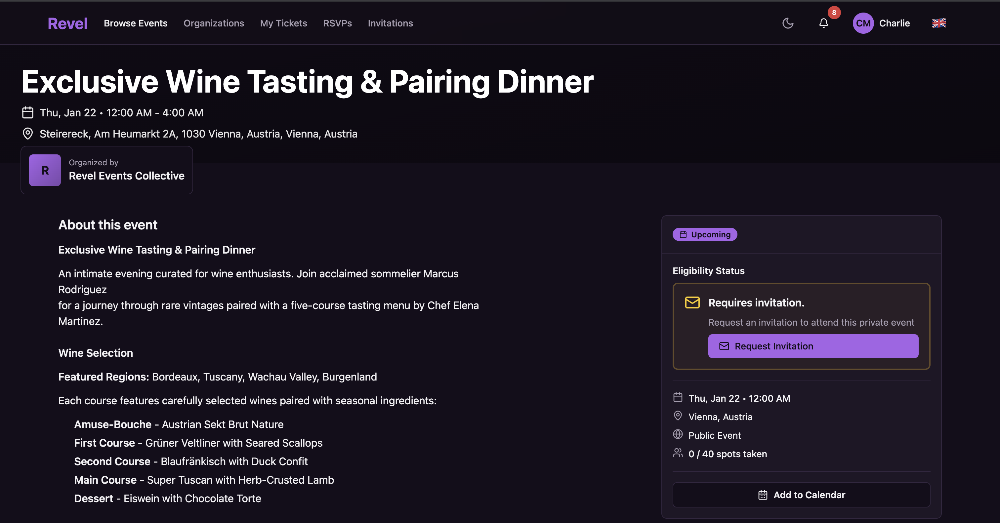
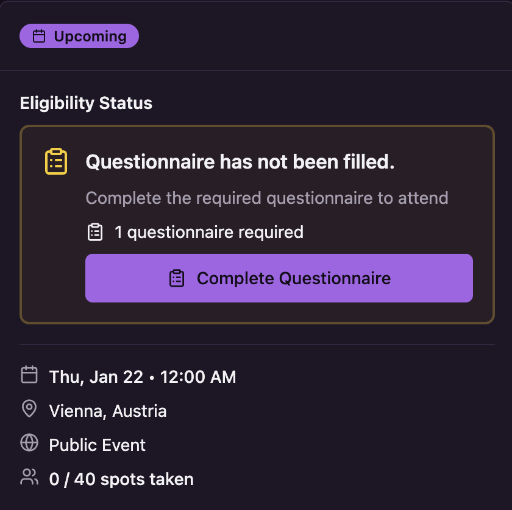
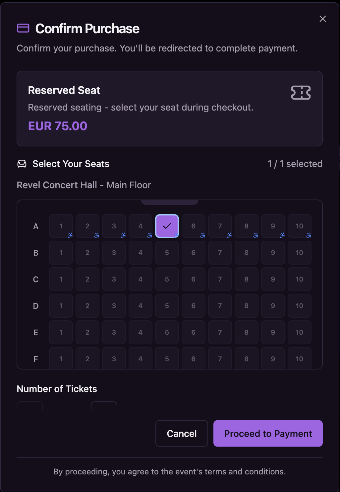
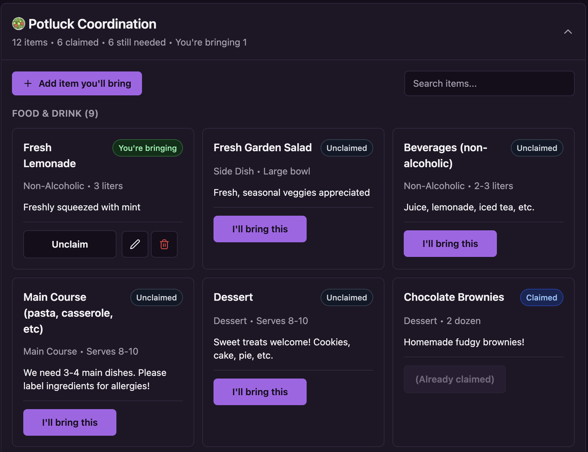
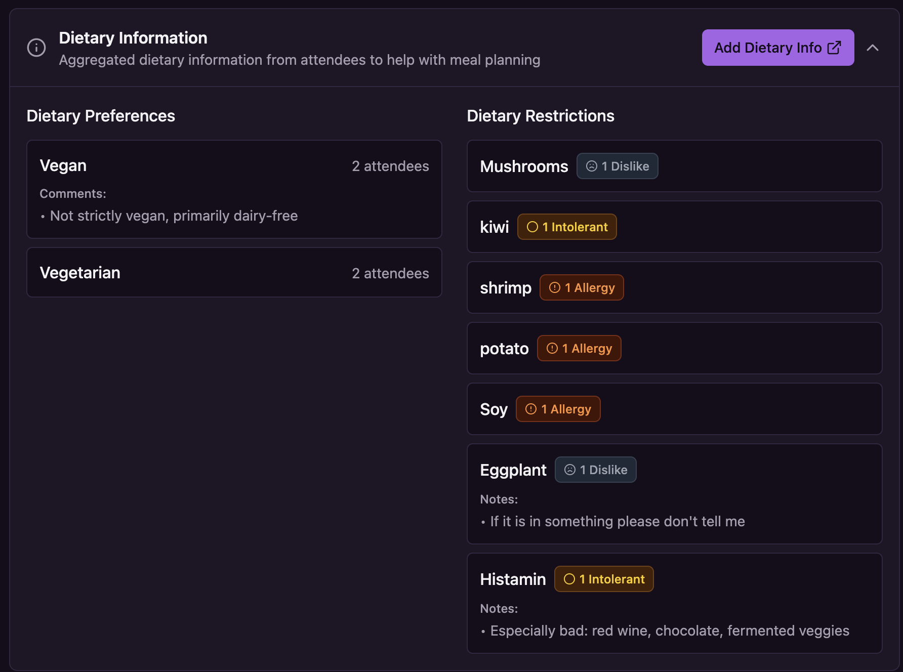

# Revel Backend

**An open-source, community-focused event management platform.**

<!-- Status -->
[](https://github.com/letsrevel/revel)
[](./LICENSE)


<!-- Tooling / meta -->


<!-- CI -->
[](https://github.com/letsrevel/revel-backend/actions/workflows/test.yaml)
[](https://github.com/letsrevel/revel-backend/actions/workflows/tests.yaml)

---

## 🔗 Related Repositories

This repository contains the **backend API and business logic** for Revel. The complete platform consists of:

- **[revel-backend](https://github.com/letsrevel/revel-backend)** (this repository) - Django REST API, business logic, database models
- **[revel-frontend](https://github.com/letsrevel/revel-frontend)** - SvelteKit web application, user interface
- **[infra](https://github.com/letsrevel/infra)** - Docker Compose setup, reverse proxy, observability stack, deployment configurations

---

Revel is an event management and ticketing platform designed with community at its heart. Initially created to serve the specific needs of queer, LGBTQ+, and sex-positive communities, it is built to be event-agnostic, scalable, and a powerful tool for any group that values privacy, control, and transparency.

Unlike monolithic, corporate platforms that treat events as transactions, Revel treats them as part of a larger community ecosystem.

---

### ✨ Live Demo

You can try out an early version of Revel yourself at https://demo.letsrevel.io

The api lives at https://demo-api.letsrevel.io/api/docs

**NOTE:** Emails are dry, and the data is reset every day at 00:00 CET.

More info on what's available [here](./src/events/management/commands/README.md).

---

## 🤔 Why Revel? The Philosophy

Revel is being built to address the shortcomings of existing event platforms, especially for communities that prioritize safety, autonomy, and trust.

*   **For Communities, Not Corporations:** Mainstream platforms often have restrictive content policies or a lack of privacy features, creating challenges for adult, queer, or activist-oriented events. Revel is explicitly designed to support these communities.
*   **Open, Transparent & Self-Hostable:** Avoid vendor lock-in. You can host Revel on your own infrastructure for free, giving you complete control over your data and eliminating platform commissions. Its open-source nature means you can trust the code you run.
*   **Fair & Simple Pricing:** For those who choose our future hosted version, the model is simple: **no charge for free events or events where you handle payments yourself**; a **1.5% + 0.25€ commission** on paid tickets sold and bought through Revel. This significantly undercuts the high fees of major platforms and helps us keep the platform online, free and open source.

## 🚀 Key Features

Revel combines the ticketing power of platforms like Eventbrite with the community-building tools of Meetup, all under a privacy-minded, open-source framework.

#### Community & Membership
*   **Organizations:** Create and manage your community's central hub. Customize its visibility (Public, Members-Only).
*   **Roles & Permissions:** Assign roles like Owner, Staff, and Member, with a granular permission system to control who can create events, manage members, and more.
*   **Membership System:** Manage a roster of members, enabling members-only events and fostering a sense of belonging.

#### Trust, Safety & Privacy
*   **Advanced Attendee Screening:** Gate event eligibility with custom questionnaires. Automatically review submissions or use a manual/hybrid approach to ensure attendees align with your community's values.
*   **Full Data Ownership:** When self-hosting, you control your data. No third-party trackers, no selling of event data. Keep your community's information safe.
*   **Tailored Invitations:** Send direct invitations that can waive specific requirements (like questionnaires, membership or purchase) for trusted guests.

#### Core Event & Ticketing Features
*   **Event & Series Management:** Easily create single events or recurring event series under your organization.
*   **Ticketing & RSVPs:** Support for both paid/free ticketed events (powered by Stripe) and simpler RSVP-based gatherings.
*   **Batch Ticket Purchases:** Buy multiple tickets in a single transaction with individual guest names for each ticket holder.
*   **Venue & Seat Management:** Define venues with sectors and individual seats. Support for general admission, random seat assignment, or user-selected seating.
*   **QR Code Check-In:** Manage event entry smoothly with QR code tickets and a staff-facing check-in flow.
*   **Apple Wallet Integration:** Tickets can be added to Apple Wallet for easy access at events (optional, requires Apple Developer certificate).
*   **Potluck Coordination:** A unique, built-in system for attendees to coordinate bringing items, dietary restrictions and preferences, moving logistics off messy spreadsheets.

---

## 📸 Screenshots

<p align="center">
  
  <br/>
  <em>Event detail page with eligibility status, invitation requests, and rich event information</em>
</p>

<table>
  <tr>
    <td align="center" width="50%">
      
      <br/>
      <em>Questionnaire-based screening</em>
    </td>
    <td align="center" width="50%">
      
      <br/>
      <em>Interactive seat selection</em>
    </td>
  </tr>
  <tr>
    <td align="center">
      
      <br/>
      <em>Potluck coordination</em>
    </td>
    <td align="center">
      
      <br/>
      <em>Dietary preferences & restrictions</em>
    </td>
  </tr>
</table>

---

## 💻 Tech Stack

Revel is built with a modern and robust backend, designed for performance and scalability.

*   **🐍 Backend:** Python 3.13+ with **[Django 5.2 LTS](https://docs.djangoproject.com/en/5.2/)**
*   **🚀 API:** **[Django Ninja](https://django-ninja.dev/)** and **[Django Ninja Extra](https://eadwincode.github.io/django-ninja-extra/)** for a fast, modern, and auto-documenting REST API.
*   **🐘 Database:** **PostgreSQL** with **PostGIS** for powerful geo-features.
*   **⚙️ Async Tasks:** **Celery** with **Redis** for background jobs (emails, evaluations).
*   **🐳 Deployment:** Fully containerized with **Docker** for easy setup and deployment.

### Why Django 5.2 LTS?

We intentionally stay on Django 5.2 LTS rather than upgrading to Django 6.x. Our policy:

- **LTS stability** - Django 5.2 is a Long-Term Support release with security updates until April 2028
- **Upgrade when it matters** - We'll upgrade for compelling features, performance improvements, or security CVEs
- **No bleeding edge for its own sake** - Django 6.0 is only ~3 months old; we prefer battle-tested releases

---

## 🏁 Quick Start (Development)

Get a local development environment running in minutes. You'll need `make`, `Docker`, and Python 3.12+.

1.  **Clone the repository:**
    ```bash
    git clone https://github.com/letsrevel/revel-backend.git
    cd revel-backend
    ```
    
2.  **Make sure you have the necessary geo data:**
    *   You must download [IP2LOCATION-LITE-DB5.BIN](https://lite.ip2location.com/database/db5-ip-country-region-city-latitude-longitude?lang=en_US) and place it in `src/geo/data/`
    *   You must download the [worldcities.csv](https://simplemaps.com/data/world-cities) and place it in `src/geo/data/` (or for dev purposes just copy `worldcities.mini.csv` into `worldcities.csv`)


3.  **Run the setup command:**
    This command fully automates the setup process.
    ```bash
    make setup
    ```

4.  **You're ready!**
    *   The API is running at `http://localhost:8000`
    *   Interactive API docs (Swagger UI) are at `http://localhost:8000/api/docs`
    *   A default superuser is created (`admin@letsrevel.io` / `password`).
    *   **Mailpit** (email testing) is at `http://localhost:8025`

---

## 🐳 Docker Compose Files

The project uses multiple Docker Compose files for different purposes:

| File | Purpose | Usage |
|------|---------|-------|
| `compose.yaml` | **Local development** - includes Mailpit for email testing | `docker compose up -d` |
| `docker-compose-ci.yml` | **CI/CD pipeline** - minimal services for testing | `docker compose -f docker-compose-ci.yml up -d` |
| `docker-compose-base.yml` | **Shared services** - extended by other compose files | Not used directly |
| `docker-compose-observability.yml` | **Observability stack** - Grafana, Prometheus, Loki, etc. | Optional for local dev |

For local development, simply run:
```bash
docker compose up -d
```

This starts PostgreSQL, Redis, ClamAV, and **Mailpit**. All emails sent by the application are captured by Mailpit and viewable at [http://localhost:8025](http://localhost:8025).

---

## 📊 Observability

Revel includes a comprehensive observability stack built on the LGTM (Loki, Grafana, Tempo, Mimir) framework plus Pyroscope for continuous profiling.

### Available Services

Once you run `make setup` or start the Docker services, the following observability tools are available:

| Service | Purpose | URL | Credentials |
|---------|---------|-----|-------------|
| **Mailpit** | Email testing - catches all outgoing emails | [http://localhost:8025](http://localhost:8025) | - |
| **Grafana** | Unified dashboard for logs, traces, metrics, and profiles | [http://localhost:3000](http://localhost:3000) | admin / admin |
| **Prometheus** | Metrics collection and querying | [http://localhost:9090](http://localhost:9090) | - |
| **Pyroscope** | Continuous profiling with flamegraphs 🔥 | [http://localhost:4040](http://localhost:4040) | - |
| **Loki** | Log aggregation | [http://localhost:3100](http://localhost:3100) | - |
| **Tempo** | Distributed tracing | [http://localhost:3200](http://localhost:3200) | - |
| **Django Metrics** | Application metrics endpoint | [http://localhost:8000/metrics](http://localhost:8000/metrics) | - |

### Features

- **Structured Logging**: All logs in JSON format with automatic context (request_id, user_id, task_id, etc.)
- **Distributed Tracing**: Automatic tracing of HTTP requests, database queries, Redis operations, and Celery tasks
- **Metrics**: Django, PostgreSQL, Redis, and Celery metrics automatically collected
- **Flamegraphs**: Continuous profiling for CPU and memory performance analysis
- **PII Scrubbing**: Automatic redaction of sensitive data (passwords, card numbers, emails, etc.)
- **Trace-to-Log Correlation**: Jump from traces to related logs and vice versa in Grafana
- **Grafana Alerting**: Production-ready alerts for errors, payments, auth failures, and more (no DB overhead)

### Quick Start

1. **View logs in Grafana**: Go to `http://localhost:3000` → Explore → Select "Loki" datasource
   ```logql
   {service="revel"} | json | level="error"
   ```

2. **View traces in Grafana**: Explore → Select "Tempo" datasource → Search by service or endpoint

3. **View metrics in Prometheus**: Go to `http://localhost:9090` → Graph
   ```promql
   rate(django_http_requests_total[5m])
   ```

4. **View flamegraphs in Pyroscope**: Go to `http://localhost:4040` → Select `revel.development`

5. **Set up alerts**: Configure Grafana alert rules for production monitoring
   - See [GRAFANA_ALERTING.md](GRAFANA_ALERTING.md) for 10+ ready-to-use alert examples
   - Supports Email, Slack, Discord, PagerDuty notifications

### Configuration

Observability can be configured via environment variables in `.env`:

```bash
ENABLE_OBSERVABILITY=True          # Enable/disable all observability features
TRACING_SAMPLE_RATE=1.0            # 100% sampling (use 0.1 for 10% in production)
PYROSCOPE_SERVER_ADDRESS=http://localhost:4040
OTEL_EXPORTER_OTLP_ENDPOINT=http://localhost:4318
```

### Verifying Observability Setup

After starting the Django application with `make run`, verify the setup:

1. **Check startup logs**: Look for initialization messages:
   ```
   OpenTelemetry tracing initialized: service=revel, sample_rate=1.0, endpoint=http://localhost:4318
   Pyroscope profiling initialized: app=revel.development, server=http://localhost:4040
   ```

2. **Check metrics endpoint**: Visit [http://localhost:8000/metrics](http://localhost:8000/metrics) - should show Prometheus metrics

3. **Generate some traffic**: Make API requests to create traces and logs
   ```bash
   # Visit the API docs to generate requests
   curl http://localhost:8000/api/docs
   # Or make a few test API calls
   curl http://localhost:8000/api/health  # if you have a health endpoint
   ```

4. **Check Grafana**: Go to [http://localhost:3000](http://localhost:3000) → Explore → Select datasource
   - **Loki** for logs: `{service="revel"} | json`
   - **Tempo** for traces: Search by service name "revel"
   - **Prometheus** for metrics: `rate(django_http_requests_total[5m])`

5. **Check Pyroscope**: Visit [http://localhost:4040](http://localhost:4040) → Select `revel.development`
   - Note: Pyroscope may take 10-15 seconds to start showing data
   - Make sure you're generating CPU activity (API requests, database queries, etc.)

For detailed documentation, see:
- [OBSERVABILITY_SPEC.md](OBSERVABILITY_SPEC.md) - Full specification and implementation plan
- [OBSERVABILITY_IMPLEMENTATION.md](OBSERVABILITY_IMPLEMENTATION.md) - What's implemented and how to use it
- [GRAFANA_ALERTING.md](GRAFANA_ALERTING.md) - Production-ready alert rules and notification setup
- [ASYNC_LOGGING.md](ASYNC_LOGGING.md) - Async logging architecture (50-100x faster)

---

## 🛠️ Development Commands

The project uses a `Makefile` to streamline common development tasks.

| Command              | Description                                                      |
| -------------------- | ---------------------------------------------------------------- |
| `make setup`         | Runs the complete one-time setup for the dev environment.        |
| `make run`           | Starts the Django development server.                            |
| `make check`         | Runs all checks: formatting, linting, and type checking.         |
| `make test`          | Runs the full `pytest` test suite and generates a coverage report. |
| `make run-celery`      | Starts the Celery worker for processing background tasks.        |
| `make run-celery-beat` | Starts the Celery beat scheduler for periodic tasks.             |
| `make migrations`    | Creates new database migrations based on model changes.          |
| `make migrate`       | Applies pending database migrations.                             |
| `make shell`         | Opens the Django shell.                                          |
| `make restart`       | Restarts the Docker environment and recreates the database.      |
| `make nuke-db`       | **Deletes** the database and all migration files. Use with caution. |

---

## 🔐 Protected File Access

Revel implements HMAC-signed URLs for protected file access, allowing certain media files to require authorization while being served efficiently by Caddy.

### Architecture

```
Client → Caddy → forward_auth → Django /api/media/validate/*
                                     ↓
                        Validates HMAC signature + expiry
                                     ↓
                        Returns 200 (serve file) or 401
```

### Why HMAC over MinIO/S3?

We evaluated MinIO but chose HMAC signing for these reasons:

- **FOSS-friendly**: MinIO moved to AGPL v3 and now distributes community edition as source-only (no pre-compiled binaries)
- **No additional services**: Caddy already handles file serving
- **Simple is better**: For our use case (<100MB files, no streaming), HMAC signing is sufficient
- **No vendor lock-in**: Pure Django + Caddy, no external dependencies

### How It Works

1. **Any file in `protected/`** requires signed URL access
2. **Caddy configuration** routes `/media/protected/*` through `forward_auth`
3. **Django validates** the signature and expiry, returns 200 or 401
4. **Caddy serves** the file if validation passes

### Usage in Models

Use `ProtectedFileField` or `ProtectedImageField` for files requiring signed access:

```python
from common.fields import ProtectedFileField, ProtectedImageField

class MyModel(models.Model):
    # Stored in protected/attachments/ - requires signed URL
    attachment = ProtectedFileField(upload_to="attachments")

    # Stored in protected/profile-pics/ - requires signed URL
    profile_pic = ProtectedImageField(upload_to="profile-pics")
```

### Usage in Schemas

Use `get_file_url()` with a static resolver to generate signed URLs in your schemas:

```python
from ninja import ModelSchema
from common.signing import get_file_url

class MyResourceSchema(ModelSchema):
    file_url: str | None = None

    @staticmethod
    def resolve_file_url(obj: MyModel) -> str | None:
        """Return signed URL for protected files, direct URL for public files."""
        return get_file_url(obj.file)

    class Meta:
        model = MyModel
        fields = ["id", "name"]
```

The `get_file_url()` function automatically:
- Returns a signed URL (with `exp` and `sig` params) for protected paths
- Returns a direct URL for public paths
- Returns `None` if the file field is empty

### Security

- Signatures use Django's `SECRET_KEY` with domain separation
- URLs expire after 1 hour by default (configurable)
- Timing-safe comparison prevents timing attacks
- Rate limiting on validation endpoint prevents brute-force attacks

### Caddy Configuration

See [docs/PROTECTED_FILES_CADDY.md](docs/PROTECTED_FILES_CADDY.md) for the required Caddy configuration.

---

## 📂 Project Structure

The codebase is organized into a `src` directory with a clear separation of concerns, following modern Django best practices.

*   `src/revel/`: The core Django project settings.
*   `src/accounts/`: User authentication, registration, and profile management.
*   `src/events/`: The core logic for organizations, events, tickets, and memberships.
*   `src/questionnaires/`: The questionnaire building, submission, and evaluation system. [📖 Read more](src/questionnaires/README.md)
*   `src/notifications/`: Multi-channel notification system (in-app, email, Telegram) with user preferences, digest support, and event-driven delivery.
*   `src/wallet/`: Apple Wallet pass generation for event tickets (.pkpass files).
*   `src/geo/`: Geolocation features (cities, IP lookups).
*   `src/telegram/`: Integration with the Telegram Bot API (note: this is a broken early prototype).
*   `src/api/`: Main API configuration, exception handlers, and global endpoints.

Each app contains a `controllers/` directory for API endpoints and a `service/` directory for business logic.

---

## 🤝 Contributing

We welcome contributions! Please read our **[CONTRIBUTING.md](CONTRIBUTING.md)** to learn how you can get involved, from reporting bugs to submitting code.

### Internationalization

Revel aims to support multiple languages (currently English, German, and Italian). See **[i18n.md](i18n.md)** for details on how the translation system works and how to add new languages.

This is currently heavily WIP.

---

## 📜 License

This project is licensed under the MIT license. See [LICENSE](LICENSE).

## Acknowledgements
- Revel uses the IP2Location LITE database for <a href="https://lite.ip2location.com">IP geolocation</a>.
- Revel uses the [World Cities Database](https://simplemaps.com/data/world-cities) from SimpleMaps, available under [CC BY 4.0](https://creativecommons.org/licenses/by/4.0/).
