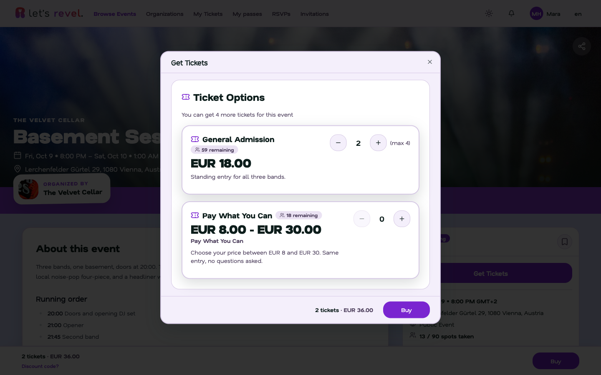
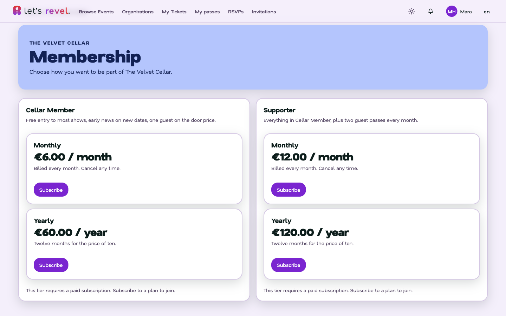
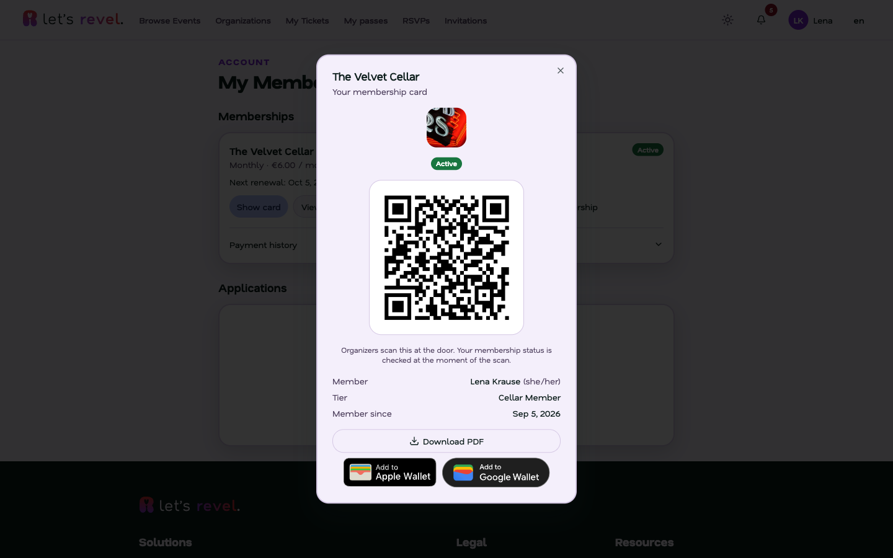
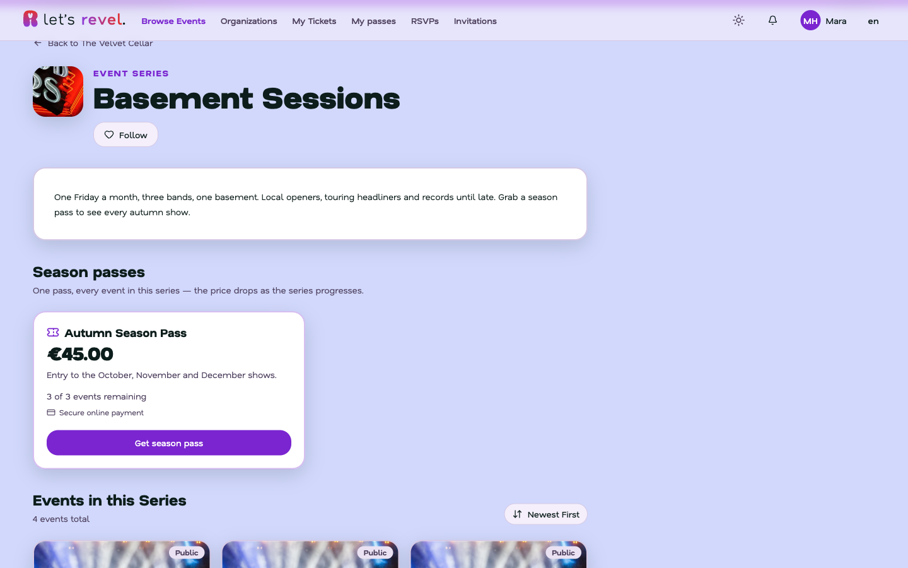
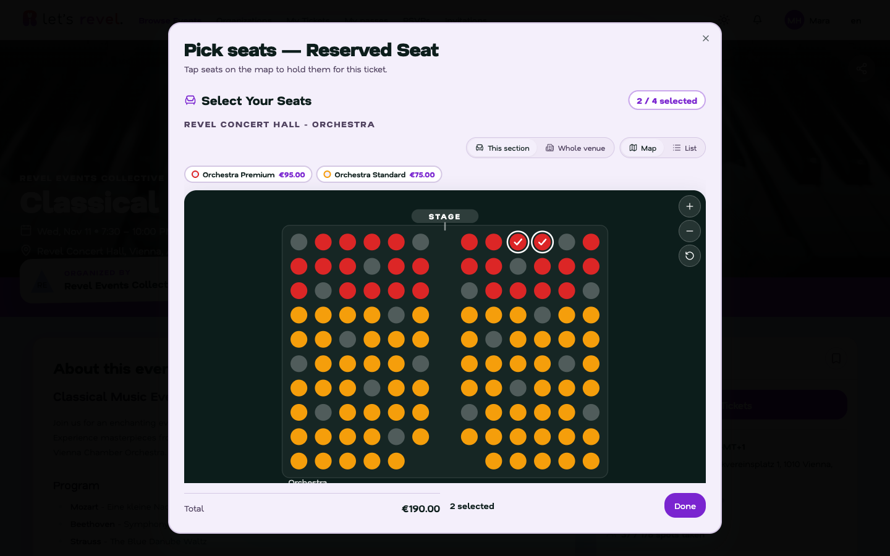
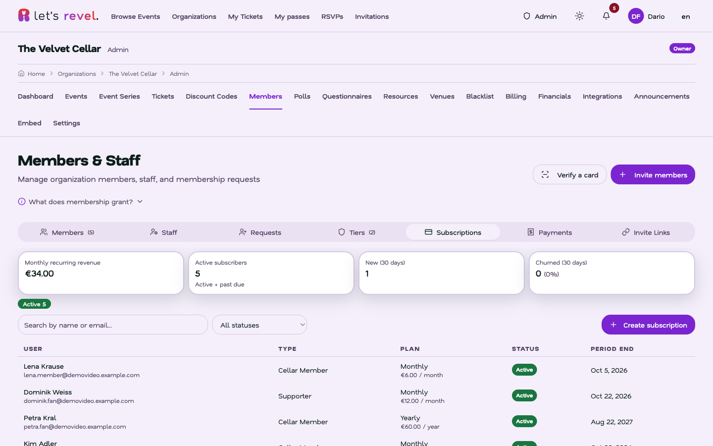
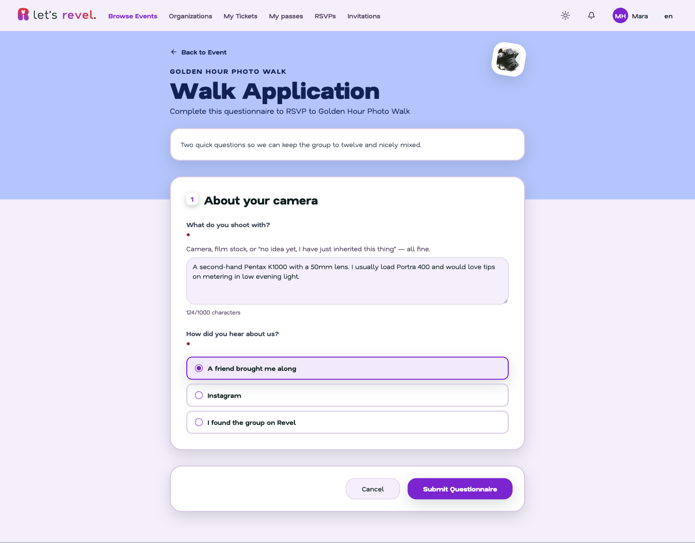
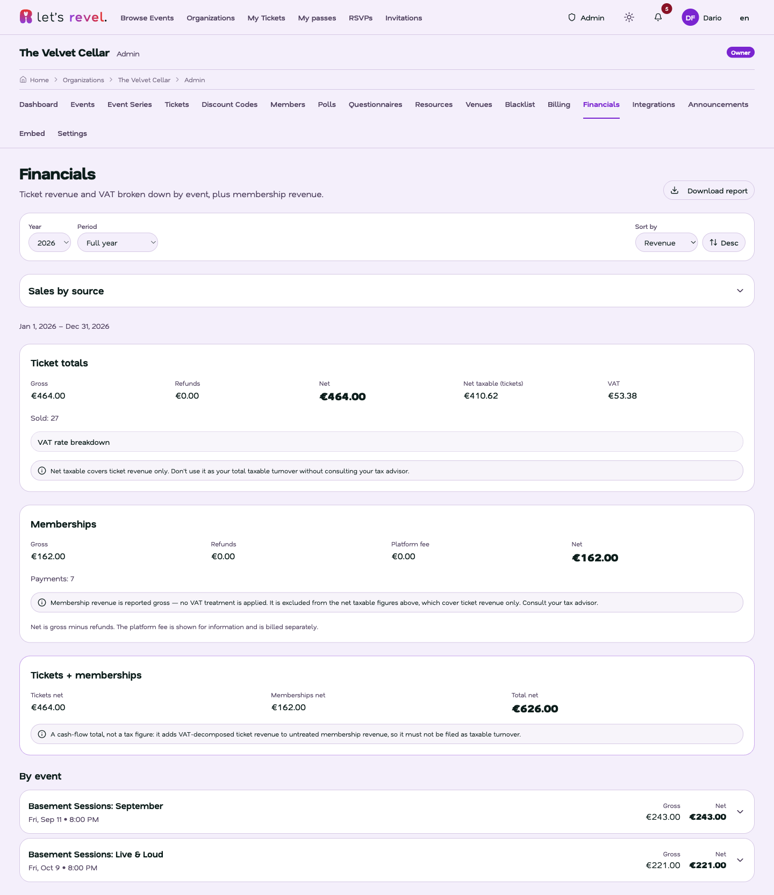

# Revel

**Revel is an open-source event management, ticketing and membership platform for communities, clubs, independent venues and independent artists.**

[](https://github.com/letsrevel/revel-backend/releases)
[](./LICENSE)
[](https://docs.letsrevel.io)
[](https://discord.gg/Rnwbzuvxvn)
[](https://github.com/letsrevel/revel-backend/actions/workflows/test.yaml)
[](https://codecov.io/gh/letsrevel/revel-backend)

<p align="center">
  
</p>

For gyms, yoga studios, choirs, comedy clubs, supper clubs and theaters, Revel runs recurring memberships, series passes, seat maps and the box office. Musicians, DJs and bands selling their own shows get ticketing with no promoter in between, and they keep the attendee list. Revel was first built for queer collectives, kink clubs and activist groups, which is why attendee vetting, private guest lists and invitation-only events are part of the core.

This repository is the API and the main project page. The web app lives in [revel-frontend](https://github.com/letsrevel/revel-frontend) and the deployment in [infra](https://github.com/letsrevel/infra).

## Try it

**Demo:** [demo.letsrevel.io](https://demo.letsrevel.io). Pick a test account on the login page (password `password123`). Data resets every night at midnight CET. No real email is sent; outgoing mail shows up at [mailpit.letsrevel.io](https://mailpit.letsrevel.io). The demo API is browsable at [demo-api.letsrevel.io/api/docs](https://demo-api.letsrevel.io/api/docs).

**Hosted:** [letsrevel.io](https://letsrevel.io).

**Self-host** on a Linux x86-64 server, as root or as a user in the `docker` group, with DNS A records for two hostnames (one for the web app and one for the API, which defaults to `api.<your domain>`; add a third for Grafana if you enable observability) and ports 80 and 443 open:

```bash
git clone https://github.com/letsrevel/infra && cd infra && ./setup.sh
```

The wizard offers to install Docker if it is missing, asks for your domains, email settings and which optional services to run, writes `.env` with generated secrets, pulls the prebuilt images and starts the stack. The slim tier needs 2 vCPU and 4 GB RAM, about €20/month (Hetzner CPX22, September 2026). The full tier, with observability and malware scanning, needs 8 vCPU and 32 GB RAM. Full guide: [docs.letsrevel.io/self-hosting](https://docs.letsrevel.io/self-hosting/).

## Fees and data

**On letsrevel.io**, free events, RSVPs and offline payments cost nothing. Online card payments cost the organizer 3% + €0.50 per order in total for standard EEA cards: Stripe's processing fee (1.5% + €0.25) plus Revel's platform fee (1.5% + €0.25, plus VAT where Revel has to charge it). Cards issued outside the EEA carry higher Stripe fees. Buyers pay the ticket price and nothing more. Membership subscriptions pay Revel 1.5% with no fixed part, plus Stripe's fees.

**Self-hosted**, you pay nothing to Revel. The code is MIT-licensed.

Ticket money goes straight to the organizer's own Stripe account (Stripe Connect, direct charges), so Revel never holds it. The web app loads no third-party analytics or tracking scripts.

For comparison, from each vendor's published pricing (September 2026): Eventbrite's US page lists 3.7% + $1.79 per ticket plus 2.9% payment processing per order. DICE's UK self-serve terms list 8.5% + VAT (minimum £1) plus a 2.5% transaction fee. Ticket Tailor charges €0.70 per ticket + VAT, plus payment processing. DICE's terms make it a data controller of the attendee data alongside the organizer; Eventbrite's privacy policy says it may act as controller or processor.

### Selling your own shows

The attendee export gives you every buyer's name and email. Tiers can be pay-what-you-can, and presales can go to members or to holders of an invitation link before general sale. A run of dates can be one event series. Merch and add-ons are not supported yet.

### Compared with pretix and Hi.Events

Both are open source and self-hostable. Checked against each project's default branch, docs and pricing page on 2026-09-22:

| | Revel | pretix | Hi.Events |
|---|---|---|---|
| License | MIT | AGPL-3.0 with additional terms; "built using pretix" footer required | AGPL-3.0 with additional terms; "Powered by Hi.Events" footer required unless you buy a license |
| Recurring membership billing | Monthly or yearly plans through Stripe; offline and lifetime plans recorded by staff | Fixed-duration memberships; no recurring billing in core | None in the codebase |
| Screening before a ticket is issued | Questionnaires with automatic, manual or hybrid review | Manual approval per product | No approval step |
| Buyer-side EU VAT | VIES check of buyer VAT IDs, reverse charge where it applies, optional automatic attendee invoices | VIES check, reverse charge, automatic invoices | Invoices and manual tax rates; VIES and reverse charge apply only to Hi.Events' own fee |
| Seat maps in the free edition | Yes | Paid proprietary plugin | No |
| Apple Wallet | Built in | Official open-source plugin | No |
| Google Wallet | Built in | No (announced as in progress) | No |
| Hosted fee | 3% + €0.50 per order for standard EEA cards, Stripe included, plus VAT on Revel's share where it applies; paid by the organizer | 2.5% of the net ticket price (max €15 per ticket), plus payment provider fees | 1.25% + $0.60 per ticket, added to the buyer's price by default, plus Stripe fees |

Where they are ahead: Hi.Events lets the organizer choose whether its fee is added to the buyer's price or absorbed, while Revel always charges the organizer. pretix has a plugin marketplace, a point-of-sale app and reseller support (the last two are proprietary plugins).

## Features

Everything below is on `main` and has a UI in the web app.

### Ticketing

- Multi-tier cart checkout through Stripe, with a guest checkout that needs no account.
- Tier types: fixed price, pay-what-you-can (with minimum and maximum), free, pay at the door and offline (cash or bank transfer, confirmed by staff).
- Tiers restricted to members, to specific membership tiers or to invitation-link holders. Sales windows, quantity caps, per-user limits and a pause switch.
- Discount codes: percentage or fixed, scoped to events, series or tiers, with usage limits and validity windows.
- QR tickets as PDF, Apple Wallet and Google Wallet passes. Staff check in by scanning the QR code.
- Waitlists with time-limited offers when spots free up, first come or in random order.
- Refunds: full or partial by the organizer, self-service cancellation under a per-tier refund policy and optional automatic refunds of online payments when an event is canceled.
- RSVP-only events, event series and recurring events.
- An embeddable event widget (it links through to Revel) and oEmbed. UTM tags from tagged links are stored on each ticket and broken down per event.

### Memberships

- Paid plans billed monthly or yearly through Stripe. Staff can also record plans paid in cash or by bank transfer, and plans can be free. Offline and free plans can be lifetime.
- Subscriptions can be paused, resumed, canceled and moved to another plan. Members get a Stripe billing portal and automatic renewal reminders.
- Membership tiers, each with its own application questionnaire.
- Members-only events and tiers. A weekly class for ten people is a members-only event with a plain RSVP.
- Series passes: one purchase covers every event in a series (a class pack, a course, a season), with an optional discount for each event already past.
- Membership cards in Apple Wallet, Google Wallet or as a PDF. A door scan verifies membership without checking anyone in.

### Screening and safety

- Questionnaires gate who can get a ticket or join: multiple choice, free text, file upload, conditional questions and scoring. Free-text answers can be scored by an LLM you configure.
- Invitations that waive specific requirements (questionnaire, membership, purchase), shareable invitation links and requests to be invited.
- An organization blacklist by user, email, name or Telegram handle, with fuzzy matching.
- Private guest lists: hide the attendee count, the capacity or the list itself.
- Visibility per organization and per event, down to members-only or private.
- Two-factor login (TOTP), personal data export, account deletion and ClamAV scanning of uploads.

### EU VAT and invoicing

- VIES validation of organization and buyer VAT IDs, with a monthly re-check.
- Place-of-supply rules for tickets: physical events use the organizer's VAT rate; online events apply reverse charge for EU businesses in another country with a valid VAT ID.
- Attendee invoices issued on the organizer's behalf, automatically or as drafts for review, with credit notes. Off by default.
- VAT-inclusive prices with per-tier rates; net and VAT are stored on every payment.
- Revenue and VAT reports per event and per organization, as XLSX and PDF, optionally emailed monthly or quarterly.
- Monthly platform-fee invoices with sequential numbering, reverse-charged for EU businesses in another country.

### Venues and seating

- A seat map designer: venues, sectors, individual seats, price categories and accessible seats.
- Buyers pick seats on an interactive map, or get the best available adjacent seats. Seats are held while the buyer checks out.
- A box office view for selling and reseating from the admin, with per-event seat overrides.

### Notifications

- In-app, email and Telegram, with per-type and per-channel preferences and digests.
- Announcements to attendees, all members, specific membership tiers or staff, sent now or scheduled relative to the event.
- Event reminders. Ticket emails carry a calendar file. Followers of an organization or series hear about new public events.
- A Telegram bot for RSVPs, invitations and waitlist offers. Organizers can approve requests from the chat.

### Integrations

- Stripe Connect (Standard accounts) for tickets, series passes and subscriptions.
- Apple Wallet and Google Wallet, each with your own issuer credentials.
- Eventbrite: publish Revel events there, sync sold counts and pause remote sales (needs Eventbrite app credentials).
- Sign in with any OpenID Connect provider: Google, Keycloak, Authentik and others.
- RSS feed and sitemaps for public events.

### Exports

- Attendee lists as XLSX: name, email, pronouns, tier, ticket status, check-in, seat, payment and UTM tags.
- Questionnaire submissions as XLSX.
- Revenue and VAT reports (XLSX and PDF).
- A personal data export for every user.

### Languages

The web app and the API are translated into English, German, Italian, French, Spanish and Portuguese. Invoice and report PDFs are English only.

### Also included

Potluck coordination with dietary restrictions, polls and event discovery with distance sorting and a calendar view. A referral program shares platform fees with referrers.

## Screenshots

<table>
  <tr>
    <td align="center" width="50%">
      
      <br/>
      <em>Fixed-price and pay-what-you-can tiers in one cart</em>
    </td>
    <td align="center" width="50%">
      
      <br/>
      <em>Monthly and yearly membership plans</em>
    </td>
  </tr>
  <tr>
    <td align="center">
      
      <br/>
      <em>A membership card with Apple Wallet and Google Wallet buttons</em>
    </td>
    <td align="center">
      
      <br/>
      <em>A season pass for an event series</em>
    </td>
  </tr>
  <tr>
    <td align="center">
      
      <br/>
      <em>Seat selection on a venue map</em>
    </td>
    <td align="center">
      
      <br/>
      <em>Subscriptions and recurring revenue in the organization admin</em>
    </td>
  </tr>
  <tr>
    <td align="center">
      
      <br/>
      <em>An application questionnaire for a rope workshop</em>
    </td>
    <td align="center">
      
      <br/>
      <em>Ticket revenue and VAT per event, plus membership revenue</em>
    </td>
  </tr>
</table>

## Self-hosting

The [infra](https://github.com/letsrevel/infra) repo holds the Docker Compose stack and the `setup.sh` wizard shown above. You do not need to clone this repo or the frontend; the images come from `ghcr.io/letsrevel` and are built for `linux/amd64` only. The infra README lists what each tier runs and every Compose profile and feature flag.

Stripe, SMTP, Telegram, LLM screening, OpenID Connect login, Eventbrite and the wallet passes are all optional. Without SMTP the instance runs, but nobody receives verification or ticket emails. DNS, tiers, upgrades and troubleshooting: [docs.letsrevel.io/self-hosting](https://docs.letsrevel.io/self-hosting/).

## Local development

Prerequisites: `make`, Docker with Compose v2, [uv](https://docs.astral.sh/uv/getting-started/installation/) (it installs Python 3.14 if you do not have it) plus native libraries for GeoDjango (GDAL, GEOS), PDF rendering (Pango), translations (gettext) and MIME detection (libmagic):

```bash
brew install gdal pango gettext libmagic                                                                  # macOS
sudo apt install build-essential gdal-bin libgdal-dev libpango-1.0-0 libpangoft2-1.0-0 gettext libmagic1  # Debian/Ubuntu
```

```bash
git clone https://github.com/letsrevel/revel-backend.git
cd revel-backend
make setup   # first time only
make run     # every time after
```

`make setup` installs dependencies, copies `.env.example` to `.env` (overwriting any existing one), recreates the Docker services with `docker compose down -v`, migrates, seeds demo data and starts the server. Use `make run` after that. The dev database runs on tmpfs and is empty after a container restart; `make bootstrap` reseeds it. The services use ports 5432, 6379, 3310, 1025 and 8025, so stop any local PostgreSQL or Redis first.

Once running:

- API: http://localhost:8000, interactive docs at http://localhost:8000/api/docs
- Superuser: `admin@letsrevel.io` / `password`
- Mailpit (captured email): http://localhost:8025
- Code: `src/`, one Django app per domain (`events`, `accounts`, `questionnaires`, `notifications`, `wallet`, `telegram` and others)
- The web app: see [revel-frontend](https://github.com/letsrevel/revel-frontend)

The stack is Django 5.2 LTS, Django Ninja, PostgreSQL with PostGIS, Celery and Redis. Everything else (commands, project structure, Docker Compose files, observability, architecture, ADRs) is at [docs.letsrevel.io](https://docs.letsrevel.io). On macOS, if startup fails with `Could not find the GDAL library`, see [troubleshooting](docs/getting-started/troubleshooting.md#macos-could-not-find-the-gdal-library-homebrew-native-libs).

## Contributing

Read [CONTRIBUTING.md](CONTRIBUTING.md). Revel is built with AI assistance under a human-review workflow; if you contribute with AI, follow [AI_USAGE.md](AI_USAGE.md).

## Security

Report vulnerabilities privately through [GitHub security advisories](https://github.com/letsrevel/revel-backend/security/advisories/new), not in a public issue. CI runs bandit, `pip-audit`, license checks, `mypy --strict` and a 90% branch-coverage gate. Details in [SECURITY.md](SECURITY.md).

## License

MIT. See [LICENSE](LICENSE).

Revel uses the IP2Location LITE database for [IP geolocation](https://lite.ip2location.com) and the [World Cities Database](https://simplemaps.com/data/world-cities) from SimpleMaps under [CC BY 4.0](https://creativecommons.org/licenses/by/4.0/).

## Related repositories

- [revel-frontend](https://github.com/letsrevel/revel-frontend): the SvelteKit web app
- [infra](https://github.com/letsrevel/infra): Docker Compose deployment and the `setup.sh` wizard
- [.github](https://github.com/letsrevel/.github): the organization profile
