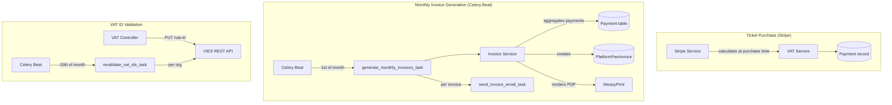
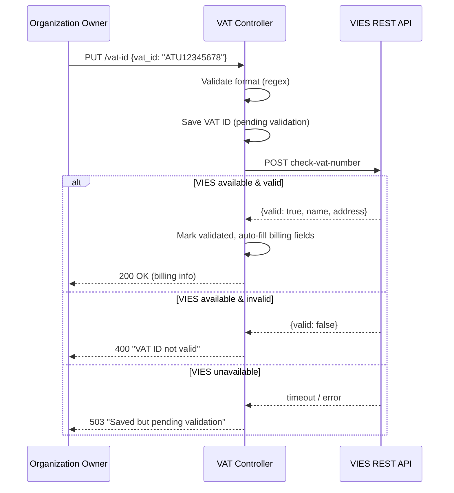
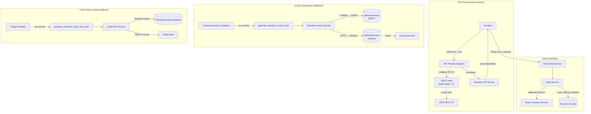
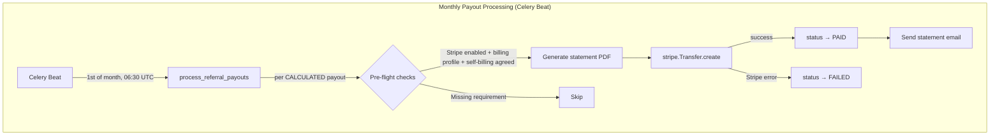

# Billing & VAT

Revel handles VAT calculations in-house for both ticket sales and platform fees, generates monthly platform fee invoices with PDF rendering, and validates EU VAT IDs against the European Commission's [VIES](https://ec.europa.eu/taxation_customs/vies/) system.

## Architecture Overview



!!! info "Stripe webhooks: two endpoints, one URL"
    A Stripe webhook endpoint listens to **either** the platform's own account events
    **or** connected-account events — never both. Revel therefore provisions **two**
    endpoints (via `python manage.py provision_stripe_webhooks`), both pointing at
    `/api/stripe/webhook`: one for "Your account" (platform) deliveries and one for
    "Connected accounts" deliveries. Each has its own signing secret; the webhook
    handler tries every entry of `STRIPE_WEBHOOK_SECRETS` until one verifies.
    This is what allows the platform host's own Stripe account (`STRIPE_ACCOUNT`) to be
    bound to an organization (superuser admin action on Organization): that org's
    checkout events arrive via the platform endpoint, while Connect orgs' events arrive
    via the Connect endpoint. Application fees are not collected for the host org
    (Stripe does not permit application fees on own-account charges).
    See the [webhook endpoints runbook](../runbooks/stripe-webhook-endpoints.md) for the
    steady-state reference.

## VAT Calculation

VAT is calculated at **purchase time** and persisted on each `Payment` record. This snapshot approach means invoices always reflect the VAT rules that were in effect when each payment was made, even if the organization's VAT status changes later.

### Service: `events.service.vat_service`

Three core functions handle all VAT math:

| Function | Purpose |
|---|---|
| `calculate_vat_inclusive(gross, rate)` | Extract net + VAT from a VAT-inclusive price |
| `calculate_platform_fee_vat(net_platform_fee, org, platform_country, platform_rate)` | Determine VAT treatment of the platform fee (VAT-exclusive: adds VAT on top) |
| `get_effective_vat_rate(tier_rate, org_rate)` | Resolve tier-level override vs. org default |

### Ticket Sale VAT

Ticket prices are **VAT-inclusive**. The VAT breakdown is extracted using:

$$\text{net} = \frac{\text{gross}}{1 + \text{rate} / 100}$$

The effective VAT rate comes from the ticket tier (if overridden) or falls back to the organization's default `vat_rate`.

### Platform Fee VAT

Platform fees follow EU B2B rules. The logic in `calculate_platform_fee_vat()`:

| Scenario | VAT Treatment | `reverse_charge` |
|---|---|---|
| Org in **same country** as platform | Add domestic VAT on top of fee | `false` |
| Org in **different EU country** with validated VAT ID | Reverse charge — fee is net, no VAT | `true` |
| Org in **EU without** valid VAT ID | Add platform's domestic VAT on top of fee | `false` |
| Org **outside EU** | No VAT (export of services) | `false` |

### Payment Record Fields

Each `Payment` stores the full VAT snapshot:

```
net_amount, vat_amount, vat_rate              # ticket sale VAT
platform_fee_net, platform_fee_vat,           # platform fee VAT
platform_fee_vat_rate, platform_fee_reverse_charge
```

### Penny-Perfect Distribution

For batch purchases (multiple tickets in one Stripe session), `distribute_amount_across_items()` splits the total platform fee across tickets without rounding drift — extra pennies go to the first item(s), and the sum is guaranteed to match the total exactly.

[Series pass](series-passes.md) checkouts use the same helper three ways: one Stripe session at the pass price is split into per-event `Payment` shares, platform-fee shares, and platform-fee-VAT shares — each Payment's VAT computed from its own ticket's tier rate.

## VIES Integration

### Service: `events.service.vies_service`

Validates EU VAT IDs against the European Commission's VIES REST API.



**Key behaviors:**

- `validate_and_update_organization()` auto-fills `vat_country_code` from the VAT ID prefix, and `billing_name` and `billing_address` from the VIES response (if currently empty)
- On VIES unavailability, the VAT ID is saved as **pending** and will be validated on the next monthly revalidation cycle
- VIES addresses containing only `"---"` are ignored

### Periodic Revalidation

A Celery Beat task (`revalidate_vat_ids_task`) runs on the **15th of each month**, dispatching one `revalidate_single_vat_id_task` per organization. Each sub-task retries independently with exponential backoff (60s to 1h, max 5 retries).

## Invoice Generation

### Service: `events.service.invoice_service`

Monthly platform fee invoices are generated automatically on the **1st of each month** via Celery Beat.

### Generation Pipeline

1. **Aggregate** all succeeded payments for the period, grouped by (organization, currency)
2. **Idempotency check** — skip if an invoice already exists for (org, period_start, currency)
3. **Generate invoice number** inside `transaction.atomic()` with `SELECT FOR UPDATE`
4. **Create invoice** with snapshots of org and platform business details
5. **Render PDF** via WeasyPrint (outside the transaction to avoid long locks)
6. **Dispatch email** as a separate Celery task per invoice

### Invoice Numbering

Format: `RVL-{YEAR}-{SEQUENCE:06d}` (e.g., `RVL-2026-000001`)

Credit notes: `RVL-CN-{YEAR}-{SEQUENCE:06d}`

Sequences are year-scoped and independent between invoices and credit notes.

**Race condition protection — 3 layers:**

| Layer | Mechanism | What it prevents |
|---|---|---|
| Query-level | `SELECT FOR UPDATE` on the last record for the year | Concurrent workers picking the same sequence number |
| Transaction-level | `transaction.atomic()` wrapping idempotency check + number generation + creation | Partial writes; burned numbers on duplicates |
| Database-level | `unique=True` on `invoice_number` + `UniqueConstraint(org, period_start, currency)` | Any duplicate that slips through logic errors |

!!! note "First-of-year edge case"
    When no invoices exist yet for a year, there is no row to lock. Two concurrent calls could both try to create `000001`. The `unique=True` constraint catches this, and the `IntegrityError` handler gracefully skips the duplicate.

### Invoice Model: Snapshot Design

`PlatformFeeInvoice` snapshots all org and platform details at generation time:

```
org_name, org_vat_id, org_vat_country, org_address     # org snapshot
platform_business_name, platform_business_address,      # platform snapshot
platform_vat_id
```

This ensures invoices remain accurate even if the organization is deleted or updates its billing details after the invoice is generated. The `organization` FK uses `SET_NULL` — the invoice survives org deletion.

### PDF Rendering

Invoices are rendered as PDFs using WeasyPrint from the template `templates/invoices/platform_fee_invoice.html`. The PDF is stored as a `ProtectedFileField`, served via HMAC-signed URLs (see [Protected Files](protected-files.md)).

### Email Delivery

Each invoice email is dispatched as a separate Celery task (`send_invoice_email_task`) with auto-retry (exponential backoff, max 5 retries). Recipients are the org owner + billing email (or contact email fallback). A BCC goes to the platform's `platform_invoice_bcc_email` if configured. The email subject and body include the invoice currency for clarity in multi-currency organizations.

## Organization Billing Fields

The `Organization` model stores:

| Field | Type | Description |
|---|---|---|
| `vat_id` | CharField | EU VAT ID with country prefix (e.g., `IT12345678901`) |
| `vat_country_code` | CharField(2) | ISO country code, synced from VAT ID prefix |
| `vat_rate` | DecimalField | Default VAT rate for the org's ticket sales |
| `vat_id_validated` | BooleanField | Whether VIES validation succeeded |
| `vat_id_validated_at` | DateTimeField | Timestamp of last validation attempt |
| `vies_request_identifier` | CharField | VIES response identifier for audit trail |
| `billing_name` | CharField | Legal entity name for invoices (auto-filled from VIES if empty; falls back to org name) |
| `billing_address` | TextField | Billing address (auto-filled from VIES if empty) |
| `billing_email` | EmailField | Billing contact (falls back to contact_email for invoices) |
| `revenue_report_cadence` | CharField | Scheduled revenue-report cadence (`NONE`/`QUARTERLY`/`MONTHLY`, default `NONE`). **Owner-only to write** (as of 1.65.0); requires `billing_email` when not `NONE` |
| `last_revenue_report_sent_period` | CharField | Internal scheduling bookkeeping — the last period emailed (e.g. `2026-Q1` or `2026-03`); prevents double-sends |

!!! note "Online tier prerequisite"
    Creating an online (Stripe) ticket tier requires `billing_name`, `vat_country_code`, and `billing_address` to be set on the organization (when platform fees are configured). This ensures invoices can be generated correctly from the first sale.

### Ticket Tier VAT Override

Each `TicketTier` has an optional `vat_rate` field. If set, it overrides the organization default for that tier. This supports scenarios like reduced VAT rates for specific ticket categories.

## Platform Billing Settings

`SiteSettings` (django-solo singleton) stores platform-level billing configuration:

| Field | Description |
|---|---|
| `platform_business_name` | Legal business name on invoices |
| `platform_business_address` | Registered business address |
| `platform_vat_id` | Platform's VAT ID |
| `platform_vat_country` | Platform's VAT country code |
| `platform_vat_rate` | Platform's domestic VAT rate |
| `platform_invoice_bcc_email` | BCC address for all outgoing invoices |

## Revenue & VAT Reporting

Organizers get a financial-reporting suite for their own tax filing, all driven by **one
tax-precise aggregation engine** (`events.service.revenue_aggregation`) so every view
reconciles: the downloadable report rolls it up across events, the org `/revenue` endpoint
groups it by event, and the per-event endpoint filters it to a single event.

### Aggregation Engine

`build_revenue_report_data()` (and its live-endpoint projections) performs a single per-row
pass over both revenue sources and folds them into buckets keyed by **currency** and then by
**VAT rate**:

| Source | Selected rows |
|---|---|
| Online (Stripe) | `Payment` records on `ONLINE` tiers with status `SUCCEEDED` or `REFUNDED` |
| Offline / at-the-door | Paid `Ticket` records on `OFFLINE` / `AT_THE_DOOR` tiers, plus cancelled tickets carrying an `offline_refund_amount` |

Key behaviors:

- **Per currency, per VAT rate** — each currency section carries one `RateBucket` per VAT
  rate; reverse-charge and 0%-rate rows collapse into a single `0% / reverse-charge` bucket.
- **Refunds attributed to the period they occurred** — a sale and its refund are counted in
  whichever report period each one falls into (by local date), not lumped onto the sale date.
  Rate-bucket money is net-of-refunds; refunds are also surfaced separately
  (`refunds_total` / `refunded_count`).
- **Net taxable turnover** — per currency, the sum of net (sale minus refund) across rate
  buckets.
- **VAT snapshot first** — online payments use the persisted `net_amount`/`vat_amount`/`vat_rate`
  snapshot when present, falling back to `calculate_vat_inclusive()` at the org rate; offline
  tickets are always extracted at the org rate.
- **Org timezone** — sale/refund dates are converted to the org's city timezone before the
  period window is applied.

!!! info "One engine, three views"
    The report ZIP, the org `/revenue` dashboard endpoint, and the per-event `/revenue`
    endpoint all call into the same aggregator. The only differences are scope (org-wide vs.
    one event) and shape (the live endpoints skip the per-transaction detail rows).

### Report Bundle (ZIP)

`POST /organization-admin/{slug}/revenue-report` produces a **multi-file ZIP** built by
`events.service.revenue_report_service`:

- **`*.xlsx`** — two sheets: **Summary** (per currency: one row per VAT rate, a Refunds row, a
  bold Net-taxable-turnover total) and **Transactions** (one row per sale/refund line).
- **`*.pdf`** — rendered via WeasyPrint: per-VAT-rate table, refunds, and net taxable turnover.

Generation is asynchronous (a `FileExport` row + Celery task — see
[Exports](exports.md#revenue-vat-export) for the artifact mechanics). The result is **cached**:
a matching READY export (same org, event, date range, and a content hash over the in-scope
rows) is reused unless `?refresh=true` is passed.

### Scheduled Delivery

Orgs can opt into emailed reports via `Organization.revenue_report_cadence`
(`NONE` / `QUARTERLY` / `MONTHLY`, default `NONE`). A monthly Beat sweep
(`deliver_scheduled_revenue_reports`) computes the **just-closed period in the org's own
timezone**, generates the ZIP, and emails it to the org's `billing_email` (plus the owner if
different). Empty periods are skipped (no email, marker not advanced), and a
`last_revenue_report_sent_period` marker prevents double-sends. QUARTERLY orgs only actually
send in Jan/Apr/Jul/Oct; other months no-op.

### Per-Event Schema Change

!!! warning "Breaking change (1.64.0)"
    The per-event revenue endpoint now returns `EventFinancialsSchema`, which differs from the
    previous shape:

    - `refunded` → **`refunds`**.
    - **`paid_ticket_count` removed** — derive it as `sold_count - refunded_count`.
    - `sold_count` semantics changed: it now also counts sales that were later
      refunded/cancelled (the gross count ever sold), not just currently-paid tickets.
    - VAT detail **added**: `net_taxable`, `vat`, and `rate_buckets` (per-VAT-rate breakdown).

    A coordinated frontend update is required.

## API Endpoints

Billing-info, VAT-ID, invoice, and credit-note endpoints require organization **owner**
permissions. The **revenue & VAT** endpoints instead require the `manage_organization`
permission (owner or staff with that grant) — see [Revenue Endpoints](#revenue-endpoints).

### Billing Info

| Method | Path | Description |
|---|---|---|
| `GET` | `/organization-admin/{slug}/billing-info` | Get billing info and VAT settings |
| `PATCH` | `/organization-admin/{slug}/billing-info` | Update billing fields (country, rate, address, email) |

### VAT ID Management

| Method | Path | Description |
|---|---|---|
| `PUT` | `/organization-admin/{slug}/vat-id` | Set/update VAT ID (triggers VIES validation) |
| `DELETE` | `/organization-admin/{slug}/vat-id` | Clear VAT ID and all validation data |

!!! info "Country code sync"
    Setting a VAT ID automatically syncs `vat_country_code` from the ID prefix. Updating `vat_country_code` via PATCH is rejected if it conflicts with an existing VAT ID prefix.

### Invoices & Credit Notes

| Method | Path | Description |
|---|---|---|
| `GET` | `/organization-admin/{slug}/invoices` | List invoices (paginated, newest first) |
| `GET` | `/organization-admin/{slug}/invoices/{id}` | Get invoice detail |
| `GET` | `/organization-admin/{slug}/invoices/{id}/download` | Get signed PDF download URL |
| `GET` | `/organization-admin/{slug}/credit-notes` | List credit notes (paginated) |

### Revenue Endpoints

These require `manage_organization` (not owner), and return the data described under
[Revenue & VAT Reporting](#revenue-vat-reporting).

| Method | Path | Description |
|---|---|---|
| `POST` | `/organization-admin/{slug}/revenue-report` | Create (or reuse a cached) report ZIP for a period; `?refresh=true` forces regeneration. Returns a `FileExport` (poll for the signed URL) |
| `GET` | `/organization-admin/{slug}/revenue-reports/{export_id}` | Poll a report; the response carries a signed download URL once `status=READY` |
| `GET` | `/organization-admin/{slug}/revenue` | Live org financials by event: `year` + optional `month`/`quarter`, `currency` switching (`available_currencies`), `sort=revenue\|event_start`, `order=asc\|desc` |

!!! note "Per-event financials"
    A per-event view lives on the event-admin controller:
    `GET /event-admin/{event_id}/revenue` (permission `manage_tickets`) returns
    `EventFinancialsSchema` — the same engine scoped to one event, all-time by default with an
    optional `year`/`month`/`quarter` filter.

## Attendee Invoicing

Revel generates invoices for attendees (buyers) **on behalf of organizers** (sellers) for online ticket purchases. The organizer is the legal seller; Revel acts as an intermediary. VAT treatment is determined at checkout time based on the buyer's billing info.

### Architecture Overview



### Invoicing Modes

Organizations opt in to attendee invoicing by setting `Organization.invoicing_mode`:

| Mode | Invoice created as | Editable | Auto-emailed | Use case |
|------|-------------------|----------|--------------|----------|
| `NONE` | — (no invoice generated) | — | — | Default |
| `HYBRID` | `DRAFT` | All fields except seller info | No — manual issue by org admin | Org needs review/control |
| `AUTO` | `ISSUED` | Immutable | Yes | Hands-off automation |

**Prerequisites** (same as enabling Stripe ticket sales):

- EU-based (`vat_country_code` in EU member states)
- VIES-validated VAT ID
- `billing_name` and `billing_address` set

Setting to `NONE` is always allowed.

### Buyer-Specific VAT at Checkout

Unlike platform fee VAT (which is B2B between Revel and the org), attendee VAT follows EU rules for event ticket sales where the **buyer's billing info** affects the price:

| Scenario | VAT Treatment | Buyer Pays |
|----------|--------------|------------|
| Domestic B2C/B2B (same country) | Org's VAT rate | Full gross price |
| EU cross-border B2B (valid VAT ID, different country) | **Reverse charge** (0%) | Net only |
| EU cross-border B2C (no valid VAT ID) | Org's VAT rate | Full gross price |
| Non-EU buyer | No VAT (export) | Net only |

This means the Stripe checkout amount varies per buyer. The platform fee is calculated on the **amount actually charged** (reduced for reverse charge/export).

### Service: `events.service.attendee_vat_service`

| Function | Purpose |
|----------|---------|
| `determine_attendee_vat(gross_price, seller_vat_rate, seller_country, buyer_country, buyer_vat_id_valid)` | Pure calculation: returns effective price, net, VAT, rate, reverse_charge |
| `get_effective_vat_rate(tier, org)` | Tier override vs. org default |
| `calculate_vat_preview(event, billing_info, items, discount_code, price_per_ticket)` | Full preview with VIES validation, discount/PWYC support |

### VIES Caching

`validate_vat_id_cached()` wraps VIES validation with a Redis cache (30-minute TTL). The preview endpoint validates and caches; the checkout path reuses the cached result. VIES errors are **not** cached — the error propagates so the frontend can handle the fallback (charge full VAT when VIES is unavailable).

### Invoice Generation

Triggered by the `checkout.session.completed` webhook via `transaction.on_commit`. The service:

1. Finds `Payment` records by `stripe_session_id` with `status=SUCCEEDED`
2. Checks `buyer_billing_snapshot` is present and org has `invoicing_mode != NONE`
3. **Idempotency**: checks inside `transaction.atomic()` for existing invoice
4. Generates sequential invoice number: `{ORG_SLUG}-{YEAR}-{SEQ:06d}` (e.g., `TECHCONF-2026-000001`)
5. Creates `AttendeeInvoice` with seller/buyer snapshots and line items from Payment data
6. Renders PDF via WeasyPrint (outside the transaction)
7. For AUTO mode: sends email immediately

### Invoice Numbering

Per-org sequential numbering with the same 3-layer race protection as platform invoices:

| Document | Format |
|----------|--------|
| Invoice | `{ORG_SLUG}-{YEAR}-{SEQ:06d}` |
| Credit Note | `{ORG_SLUG}-CN-{YEAR}-{SEQ:06d}` |

### HYBRID Mode: Draft Lifecycle

```text
DRAFT → [org edits] → DRAFT → [org issues] → ISSUED → [refund] → CANCELLED
                       ↓
                  [org deletes]
```

- **Edit**: All fields except seller (org) info are editable. The org is liable for invoice content. Stale PDF is deleted on edit and regenerated on-demand at download time.
- **Issue**: Sets `status=ISSUED`, `issued_at=now()`, regenerates final PDF, sends email.
- **Delete**: Removes draft and its PDF file.

!!! warning "Attendee invoices vs. platform fee invoices"
    Attendee invoice content is independent of platform fee calculations. If an org edits a draft invoice, it does not affect Revel's platform fee invoices, which are always based on actual `Payment` records.

### Credit Notes

Generated on the `charge.refunded` webhook. For each refund:

- If the invoice is `DRAFT` → delete the draft (nothing was issued)
- If the invoice is `ISSUED` → create a credit note with the refunded amounts
- If total credited across all credit notes ≥ invoice total → mark invoice as `CANCELLED`

Idempotency is enforced by checking for existing credit notes with the exact same set of refunded payment IDs.

### Email Delivery

Emails are sent from the org's branded address:

| Header | Value |
|--------|-------|
| From | `{org_billing_name} <{org_slug}@letsrevel.io>` |
| Reply-To | Org's `billing_email` (falls back to `contact_email`) |
| BCC | Org's `billing_email` or `contact_email` (org gets a copy) |
| Attachment | Invoice/credit note PDF |

### API Endpoints

#### Buyer-facing (authenticated user)

| Method | Path | Description |
|--------|------|-------------|
| `POST` | `/events/{event_id}/tickets/vat-preview` | Preview VAT breakdown (supports discounts/PWYC) |
| `GET` | `/dashboard/invoices` | List user's issued invoices |
| `GET` | `/dashboard/invoices/{id}/download` | Signed PDF download URL |

#### Org admin (owner only)

| Method | Path | Description |
|--------|------|-------------|
| `PATCH` | `/organization-admin/{slug}/invoicing` | Set invoicing mode (NONE/HYBRID/AUTO) |
| `GET` | `/organization-admin/{slug}/attendee-invoices` | List all attendee invoices |
| `GET` | `/organization-admin/{slug}/attendee-invoices/{id}` | Invoice detail |
| `GET` | `/organization-admin/{slug}/attendee-invoices/{id}/download` | Signed PDF URL (generates on-demand) |
| `PATCH` | `/organization-admin/{slug}/attendee-invoices/{id}` | Edit draft invoice |
| `POST` | `/organization-admin/{slug}/attendee-invoices/{id}/issue` | Issue draft + send email |
| `DELETE` | `/organization-admin/{slug}/attendee-invoices/{id}` | Delete draft |
| `GET` | `/organization-admin/{slug}/attendee-credit-notes` | List attendee credit notes |

## Referral Payout Statements

When referral payouts are disbursed, Revel generates a document for each payout. The document type depends on whether the referrer is a B2B entity (has a validated VAT ID) or a B2C individual.

### B2B vs B2C Decision

| Referrer profile | Document type | VAT treatment |
|---|---|---|
| Validated VAT ID (`vat_id_validated = True`) | **Self-billing invoice (Gutschrift)** | Full VAT math (reverse charge for EU cross-border) |
| No VAT ID or unvalidated | **Payout statement** | No VAT line — referrer is not VAT-registered |

### Self-Billing Invoice (Gutschrift)

Per Austrian UStG §11, the platform issues a **Gutschrift** on behalf of the referrer. This is a full VAT invoice where the VAT treatment follows the same rules as platform fee invoices:

| Scenario | VAT Treatment | `reverse_charge` |
|---|---|---|
| Referrer in **same country** as platform (AT) | Charge Austrian VAT (20%) | `false` |
| Referrer in **different EU country** with valid VAT ID | Reverse charge | `true` |
| Referrer **outside EU** | No VAT (export of services) | `false` |

Requirements:
- Referrer must have agreed to self-billing (`self_billing_agreed = True` on `UserBillingProfile`)
- The document is labeled "GUTSCHRIFT" (not "Rechnung")

### Payout Statement

For B2C referrers (individuals without a VAT ID), the platform issues a **payout statement** — a non-VAT document that records the payment for bookkeeping purposes. No VAT is charged or shown.

### Numbering

Format: `RVL-RP-{YEAR}-{SEQUENCE:06d}` (e.g., `RVL-RP-2026-000001`)

Uses the same race-condition-safe sequential numbering as platform fee invoices.

### Model

`ReferralPayoutStatement` (accounts app) stores:
- `document_type`: `self_billing_invoice` or `payout_statement`
- Snapshots of referrer and platform business details
- Fee breakdown with VAT
- PDF file (ProtectedFileField)

### Processing Pipeline



## Email Settings

Billing emails (platform fee invoices and referral payout statements) use dedicated sender configuration:

| Setting | Description | Default |
|---|---|---|
| `DEFAULT_BILLING_EMAIL` | "From" address for all billing/invoice emails | `DEFAULT_FROM_EMAIL` |
| `DEFAULT_REPLY_TO_EMAIL` | "Reply-To" header on billing emails | `DEFAULT_FROM_EMAIL` |

Both are configured via environment variables and fall back to `DEFAULT_FROM_EMAIL` when not set.

## Celery Beat Schedule

| Task | Schedule | Purpose |
|---|---|---|
| `events.generate_monthly_invoices` | 1st of month, 06:00 UTC | Generate invoices + dispatch emails |
| `events.calculate_referral_payouts` | 1st of month, 06:00 UTC | Calculate referral payout amounts |
| `accounts.process_referral_payouts` | 1st of month, 06:30 UTC | Stripe transfers + statement PDFs + emails |
| `events.revalidate_vat_ids` | 15th of month, 03:00 UTC | Re-validate all org VAT IDs via VIES |
| `events.send_scheduled_revenue_reports` | 5th of month, 06:00 UTC | Email the just-closed period's report ZIP to `billing_email` + owner for opted-in orgs (period computed in org timezone; skips empty periods) |

Tasks are registered via data migrations.

!!! note "On-demand vs. scheduled"
    `events.generate_revenue_report` is **not** a Beat job — it is the worker task that builds a
    single report ZIP, dispatched on demand by the `POST .../revenue-report` endpoint (via
    `transaction.on_commit`) and reused by the scheduled sweep above. Only
    `events.send_scheduled_revenue_reports` runs on a schedule. The sweep fires on the 5th
    (not the 1st) to leave a short settle window for late refunds before the snapshot is taken.
