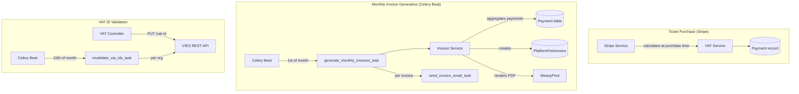
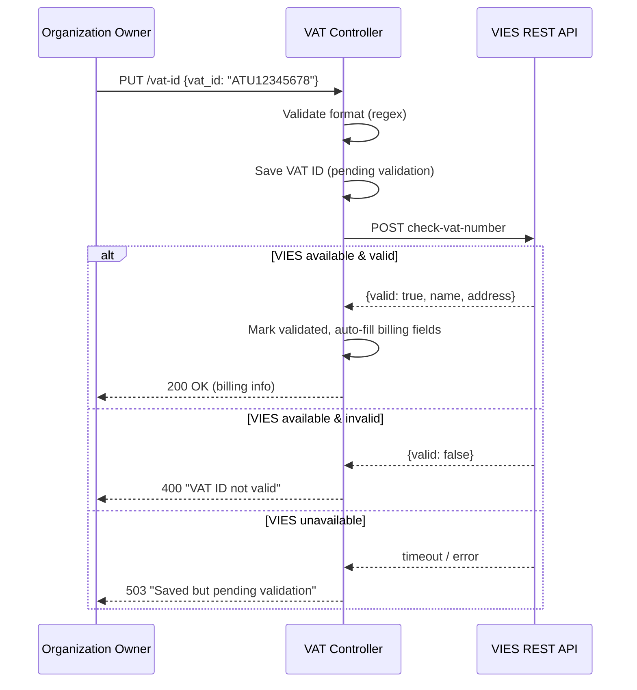
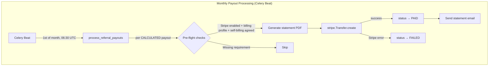

# Billing & VAT

Revel handles VAT calculations in-house for both ticket sales and platform fees, generates monthly platform fee invoices with PDF rendering, and validates EU VAT IDs against the European Commission's [VIES](https://ec.europa.eu/taxation_customs/vies/) system.

## Architecture Overview



!!! danger "Stripe webhook: own events vs. connected accounts"
    A Stripe webhook endpoint can listen to **either** events on the platform's own account **or** events on connected accounts — not both simultaneously. This means the platform host's Stripe account (`STRIPE_ACCOUNT`) **must not** also be used as a connected organization account. If the host also runs an organization that sells tickets, that organization must connect a **separate** Stripe account. Otherwise, checkout webhooks (e.g., `checkout.session.completed`) will not be delivered correctly. This is a Stripe-level limitation configured in the Stripe Dashboard under **Developers > Webhooks**.

## VAT Calculation

VAT is calculated at **purchase time** and persisted on each `Payment` record. This snapshot approach means invoices always reflect the VAT rules that were in effect when each payment was made, even if the organization's VAT status changes later.

### Service: `events.service.vat_service`

Three core functions handle all VAT math:

| Function | Purpose |
|---|---|
| `calculate_vat_inclusive(gross, rate)` | Extract net + VAT from a VAT-inclusive price |
| `calculate_platform_fee_vat(net_platform_fee, org, platform_country, platform_rate)` | Determine VAT treatment of the platform fee (VAT-exclusive: adds VAT on top) |
| `get_effective_vat_rate(tier_rate, org_rate)` | Resolve tier-level override vs. org default |

### Ticket Sale VAT

Ticket prices are **VAT-inclusive**. The VAT breakdown is extracted using:

$$\text{net} = \frac{\text{gross}}{1 + \text{rate} / 100}$$

The effective VAT rate comes from the ticket tier (if overridden) or falls back to the organization's default `vat_rate`.

### Platform Fee VAT

Platform fees follow EU B2B rules. The logic in `calculate_platform_fee_vat()`:

| Scenario | VAT Treatment | `reverse_charge` |
|---|---|---|
| Org in **same country** as platform | Add domestic VAT on top of fee | `false` |
| Org in **different EU country** with validated VAT ID | Reverse charge — fee is net, no VAT | `true` |
| Org in **EU without** valid VAT ID | Add platform's domestic VAT on top of fee | `false` |
| Org **outside EU** | No VAT (export of services) | `false` |

### Payment Record Fields

Each `Payment` stores the full VAT snapshot:

```
net_amount, vat_amount, vat_rate              # ticket sale VAT
platform_fee_net, platform_fee_vat,           # platform fee VAT
platform_fee_vat_rate, platform_fee_reverse_charge
```

### Penny-Perfect Distribution

For batch purchases (multiple tickets in one Stripe session), `distribute_amount_across_items()` splits the total platform fee across tickets without rounding drift — extra pennies go to the first item(s), and the sum is guaranteed to match the total exactly.

## VIES Integration

### Service: `events.service.vies_service`

Validates EU VAT IDs against the European Commission's VIES REST API.



**Key behaviors:**

- `validate_and_update_organization()` auto-fills `vat_country_code` from the VAT ID prefix, and `billing_name` and `billing_address` from the VIES response (if currently empty)
- On VIES unavailability, the VAT ID is saved as **pending** and will be validated on the next monthly revalidation cycle
- VIES addresses containing only `"---"` are ignored

### Periodic Revalidation

A Celery Beat task (`revalidate_vat_ids_task`) runs on the **15th of each month**, dispatching one `revalidate_single_vat_id_task` per organization. Each sub-task retries independently with exponential backoff (60s to 1h, max 5 retries).

## Invoice Generation

### Service: `events.service.invoice_service`

Monthly platform fee invoices are generated automatically on the **1st of each month** via Celery Beat.

### Generation Pipeline

1. **Aggregate** all succeeded payments for the period, grouped by (organization, currency)
2. **Idempotency check** — skip if an invoice already exists for (org, period_start, currency)
3. **Generate invoice number** inside `transaction.atomic()` with `SELECT FOR UPDATE`
4. **Create invoice** with snapshots of org and platform business details
5. **Render PDF** via WeasyPrint (outside the transaction to avoid long locks)
6. **Dispatch email** as a separate Celery task per invoice

### Invoice Numbering

Format: `RVL-{YEAR}-{SEQUENCE:06d}` (e.g., `RVL-2026-000001`)

Credit notes: `RVL-CN-{YEAR}-{SEQUENCE:06d}`

Sequences are year-scoped and independent between invoices and credit notes.

**Race condition protection — 3 layers:**

| Layer | Mechanism | What it prevents |
|---|---|---|
| Query-level | `SELECT FOR UPDATE` on the last record for the year | Concurrent workers picking the same sequence number |
| Transaction-level | `transaction.atomic()` wrapping idempotency check + number generation + creation | Partial writes; burned numbers on duplicates |
| Database-level | `unique=True` on `invoice_number` + `UniqueConstraint(org, period_start, currency)` | Any duplicate that slips through logic errors |

!!! note "First-of-year edge case"
    When no invoices exist yet for a year, there is no row to lock. Two concurrent calls could both try to create `000001`. The `unique=True` constraint catches this, and the `IntegrityError` handler gracefully skips the duplicate.

### Invoice Model: Snapshot Design

`PlatformFeeInvoice` snapshots all org and platform details at generation time:

```
org_name, org_vat_id, org_vat_country, org_address     # org snapshot
platform_business_name, platform_business_address,      # platform snapshot
platform_vat_id
```

This ensures invoices remain accurate even if the organization is deleted or updates its billing details after the invoice is generated. The `organization` FK uses `SET_NULL` — the invoice survives org deletion.

### PDF Rendering

Invoices are rendered as PDFs using WeasyPrint from the template `templates/invoices/platform_fee_invoice.html`. The PDF is stored as a `ProtectedFileField`, served via HMAC-signed URLs (see [Protected Files](protected-files.md)).

### Email Delivery

Each invoice email is dispatched as a separate Celery task (`send_invoice_email_task`) with auto-retry (exponential backoff, max 5 retries). Recipients are the org owner + billing email (or contact email fallback). A BCC goes to the platform's `platform_invoice_bcc_email` if configured. The email subject and body include the invoice currency for clarity in multi-currency organizations.

## Organization Billing Fields

The `Organization` model stores:

| Field | Type | Description |
|---|---|---|
| `vat_id` | CharField | EU VAT ID with country prefix (e.g., `IT12345678901`) |
| `vat_country_code` | CharField(2) | ISO country code, synced from VAT ID prefix |
| `vat_rate` | DecimalField | Default VAT rate for the org's ticket sales |
| `vat_id_validated` | BooleanField | Whether VIES validation succeeded |
| `vat_id_validated_at` | DateTimeField | Timestamp of last validation attempt |
| `vies_request_identifier` | CharField | VIES response identifier for audit trail |
| `billing_name` | CharField | Legal entity name for invoices (auto-filled from VIES if empty; falls back to org name) |
| `billing_address` | TextField | Billing address (auto-filled from VIES if empty) |
| `billing_email` | EmailField | Billing contact (falls back to contact_email for invoices) |

!!! note "Online tier prerequisite"
    Creating an online (Stripe) ticket tier requires `billing_name`, `vat_country_code`, and `billing_address` to be set on the organization (when platform fees are configured). This ensures invoices can be generated correctly from the first sale.

### Ticket Tier VAT Override

Each `TicketTier` has an optional `vat_rate` field. If set, it overrides the organization default for that tier. This supports scenarios like reduced VAT rates for specific ticket categories.

## Platform Billing Settings

`SiteSettings` (django-solo singleton) stores platform-level billing configuration:

| Field | Description |
|---|---|
| `platform_business_name` | Legal business name on invoices |
| `platform_business_address` | Registered business address |
| `platform_vat_id` | Platform's VAT ID |
| `platform_vat_country` | Platform's VAT country code |
| `platform_vat_rate` | Platform's domestic VAT rate |
| `platform_invoice_bcc_email` | BCC address for all outgoing invoices |

## API Endpoints

All endpoints require organization **owner** permissions.

### Billing Info

| Method | Path | Description |
|---|---|---|
| `GET` | `/organization-admin/{slug}/billing-info` | Get billing info and VAT settings |
| `PATCH` | `/organization-admin/{slug}/billing-info` | Update billing fields (country, rate, address, email) |

### VAT ID Management

| Method | Path | Description |
|---|---|---|
| `PUT` | `/organization-admin/{slug}/vat-id` | Set/update VAT ID (triggers VIES validation) |
| `DELETE` | `/organization-admin/{slug}/vat-id` | Clear VAT ID and all validation data |

!!! info "Country code sync"
    Setting a VAT ID automatically syncs `vat_country_code` from the ID prefix. Updating `vat_country_code` via PATCH is rejected if it conflicts with an existing VAT ID prefix.

### Invoices & Credit Notes

| Method | Path | Description |
|---|---|---|
| `GET` | `/organization-admin/{slug}/invoices` | List invoices (paginated, newest first) |
| `GET` | `/organization-admin/{slug}/invoices/{id}` | Get invoice detail |
| `GET` | `/organization-admin/{slug}/invoices/{id}/download` | Get signed PDF download URL |
| `GET` | `/organization-admin/{slug}/credit-notes` | List credit notes (paginated) |

## Referral Payout Statements

When referral payouts are disbursed, Revel generates a document for each payout. The document type depends on whether the referrer is a B2B entity (has a validated VAT ID) or a B2C individual.

### B2B vs B2C Decision

| Referrer profile | Document type | VAT treatment |
|---|---|---|
| Validated VAT ID (`vat_id_validated = True`) | **Self-billing invoice (Gutschrift)** | Full VAT math (reverse charge for EU cross-border) |
| No VAT ID or unvalidated | **Payout statement** | No VAT line — referrer is not VAT-registered |

### Self-Billing Invoice (Gutschrift)

Per Austrian UStG §11, the platform issues a **Gutschrift** on behalf of the referrer. This is a full VAT invoice where the VAT treatment follows the same rules as platform fee invoices:

| Scenario | VAT Treatment | `reverse_charge` |
|---|---|---|
| Referrer in **same country** as platform (AT) | Charge Austrian VAT (20%) | `false` |
| Referrer in **different EU country** with valid VAT ID | Reverse charge | `true` |
| Referrer **outside EU** | No VAT (export of services) | `false` |

Requirements:
- Referrer must have agreed to self-billing (`self_billing_agreed = True` on `UserBillingProfile`)
- The document is labeled "GUTSCHRIFT" (not "Rechnung")

### Payout Statement

For B2C referrers (individuals without a VAT ID), the platform issues a **payout statement** — a non-VAT document that records the payment for bookkeeping purposes. No VAT is charged or shown.

### Numbering

Format: `RVL-RP-{YEAR}-{SEQUENCE:06d}` (e.g., `RVL-RP-2026-000001`)

Uses the same race-condition-safe sequential numbering as platform fee invoices.

### Model

`ReferralPayoutStatement` (accounts app) stores:
- `document_type`: `self_billing_invoice` or `payout_statement`
- Snapshots of referrer and platform business details
- Fee breakdown with VAT
- PDF file (ProtectedFileField)

### Processing Pipeline



## Email Settings

Billing emails (platform fee invoices and referral payout statements) use dedicated sender configuration:

| Setting | Description | Default |
|---|---|---|
| `DEFAULT_BILLING_EMAIL` | "From" address for all billing/invoice emails | `DEFAULT_FROM_EMAIL` |
| `DEFAULT_REPLY_TO_EMAIL` | "Reply-To" header on billing emails | `DEFAULT_FROM_EMAIL` |

Both are configured via environment variables and fall back to `DEFAULT_FROM_EMAIL` when not set.

## Celery Beat Schedule

| Task | Schedule | Purpose |
|---|---|---|
| `events.generate_monthly_invoices` | 1st of month, 06:00 UTC | Generate invoices + dispatch emails |
| `events.calculate_referral_payouts` | 1st of month, 06:00 UTC | Calculate referral payout amounts |
| `accounts.process_referral_payouts` | 1st of month, 06:30 UTC | Stripe transfers + statement PDFs + emails |
| `events.revalidate_vat_ids` | 15th of month, 03:00 UTC | Re-validate all org VAT IDs via VIES |

Tasks are registered via data migrations.
