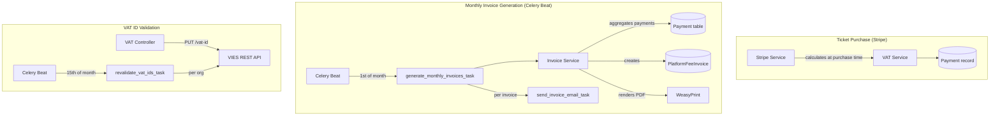
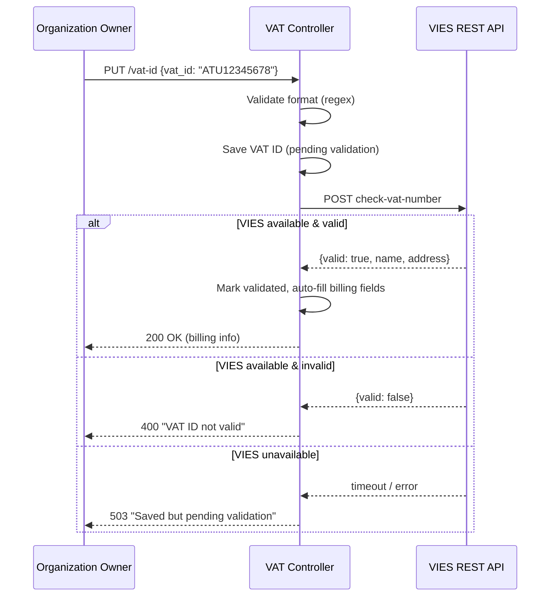
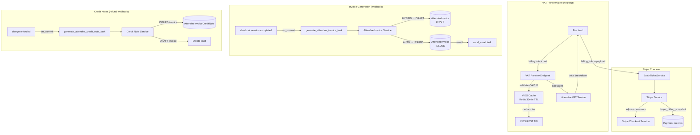
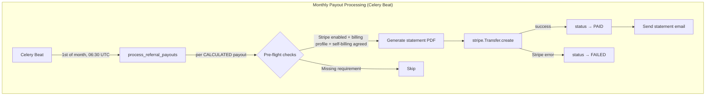

# Billing & VAT

Revel handles VAT calculations in-house for both ticket sales and platform fees, generates monthly platform fee invoices with PDF rendering, and validates EU VAT IDs against the European Commission's [VIES](https://ec.europa.eu/taxation_customs/vies/) system.

## Architecture Overview


```mermaid
flowchart TD
    subgraph Checkout["Ticket Purchase (Stripe)"]
        Stripe[Stripe Service] -->|"calculates at purchase time"| VATCalc[VAT Service]
        VATCalc --> Payment[(Payment record)]
    end

    subgraph Monthly["Monthly Invoice Generation (Celery Beat)"]
        Beat[Celery Beat] -->|"1st of month"| GenTask[generate_monthly_invoices_task]
        GenTask --> InvSvc[Invoice Service]
        InvSvc -->|"aggregates payments"| DB[(Payment table)]
        InvSvc -->|"creates"| Invoice[(PlatformFeeInvoice)]
        InvSvc -->|"renders PDF"| WP[WeasyPrint]
        GenTask -->|"per invoice"| EmailTask[send_invoice_email_task]
    end

    subgraph Validation["VAT ID Validation"]
        Controller[VAT Controller] -->|"PUT /vat-id"| VIES[VIES REST API]
        Beat2[Celery Beat] -->|"15th of month"| RevalTask[revalidate_vat_ids_task]
        RevalTask -->|"per org"| VIES
    end
```

!!! info "Stripe webhooks: two endpoints, one URL"
    A Stripe webhook endpoint listens to **either** the platform's own account events
    **or** connected-account events — never both. Revel therefore provisions **two**
    endpoints (via `python manage.py provision_stripe_webhooks`), both pointing at
    `/api/stripe/webhook`: one for "Your account" (platform) deliveries and one for
    "Connected accounts" deliveries. Each has its own signing secret; the webhook
    handler tries every entry of `STRIPE_WEBHOOK_SECRETS` until one verifies.
    This is what allows the platform host's own Stripe account (`STRIPE_ACCOUNT`) to be
    bound to an organization (superuser admin action on Organization): that org's
    checkout events arrive via the platform endpoint, while Connect orgs' events arrive
    via the Connect endpoint. Application fees are not collected for the host org
    (Stripe does not permit application fees on own-account charges).
    See the [webhook endpoints runbook](../runbooks/stripe-webhook-endpoints.md) for the
    steady-state reference.

## VAT Calculation

VAT is calculated at **purchase time** and persisted on each `Payment` record. This snapshot approach means invoices always reflect the VAT rules that were in effect when each payment was made, even if the organization's VAT status changes later.

### Service: `events.service.vat_service`

Three core functions handle all VAT math:

| Function | Purpose |
|---|---|
| `calculate_vat_inclusive(gross, rate)` | Extract net + VAT from a VAT-inclusive price |
| `calculate_platform_fee_vat(net_platform_fee, org, platform_country, platform_rate)` | Determine VAT treatment of the platform fee (VAT-exclusive: adds VAT on top) |
| `get_effective_vat_rate(tier_rate, org_rate)` | Resolve tier-level override vs. org default |

### Ticket Sale VAT

Ticket prices are **VAT-inclusive**. The VAT breakdown is extracted using:

$$\text{net} = \frac{\text{gross}}{1 + \text{rate} / 100}$$

The effective VAT rate comes from the ticket tier (if overridden) or falls back to the organization's default `vat_rate`.

### Platform Fee VAT

Platform fees follow EU B2B rules. The logic in `calculate_platform_fee_vat()`:

| Scenario | VAT Treatment | `reverse_charge` |
|---|---|---|
| Org in **same country** as platform | Add domestic VAT on top of fee | `false` |
| Org in **different EU country** with validated VAT ID | Reverse charge — fee is net, no VAT | `true` |
| Org in **EU without** valid VAT ID | Add platform's domestic VAT on top of fee | `false` |
| Org **outside EU** | No VAT (export of services) | `false` |

### Payment Record Fields

Each `Payment` stores the full VAT snapshot:

```
net_amount, vat_amount, vat_rate              # ticket sale VAT
platform_fee_net, platform_fee_vat,           # platform fee VAT
platform_fee_vat_rate, platform_fee_reverse_charge
```

### Penny-Perfect Distribution

For batch purchases (multiple tickets in one Stripe session), `distribute_amount_across_items()` splits the total platform fee across tickets without rounding drift — extra pennies go to the first item(s), and the sum is guaranteed to match the total exactly.

[Series pass](series-passes.md) checkouts use the same helper three ways: one Stripe session at the pass price is split into per-event `Payment` shares, platform-fee shares, and platform-fee-VAT shares — each Payment's VAT computed from its own ticket's tier rate.

### Subscription Platform Fees

Membership subscriptions ([memberships & subscriptions](membership-subscriptions.md)) charge the platform fee via Stripe's `application_fee_percent` on the Subscription — **percent-only**: Stripe has no fixed-fee mechanism for subscriptions, so `Organization.platform_fee_fixed` intentionally does not apply ([ADR-0013](../adr/0013-stripe-connect-direct-charges-subscriptions.md)).

- **Collection**: the percent sent to Stripe is the org's `platform_fee_percent` grossed up with platform VAT when applicable (`percent × (1 + rate/100)`, capped at 100) — the same fee-plus-VAT-on-top economics as tickets. Reverse-charge and non-EU orgs get the bare percent. The grossed percent is written into the Stripe Subscription at Checkout and **resynced when the org's VAT status changes**: the `events.service.vies_service` wrappers (VIES revalidation — including the monthly `events.revalidate_vat_ids` sweep — VAT ID set/clear, billing-country change) compare the effective percent before/after and, when it moved, queue `events.resync_org_subscription_fees`, which pushes the current percent onto every non-terminal ONLINE subscription. VAT treatment at time of supply governs, so the live-state decomposition is authoritative and the frozen percent is what gets corrected. Two caveats: **schedule-managed subscriptions** (pending downgrades) are skipped — Stripe rejects a plain `Subscription.modify` while a schedule is attached, and releasing the schedule would drop the pending plan change — and admin-side changes to `platform_fee_percent` itself do not auto-resync. Both are covered by the `resync_subscription_fees` management command (`--dry-run`, `--org-slug`, per-account `--sleep` rate limiting; partial failures are counted, logged as `subscription_fee_resync_failed`, and exit non-zero).
- **Ledger**: each `invoice.paid`/`invoice.payment_failed` records the invoice's *actual* `application_fee_amount` onto the `MembershipPayment` row, decomposed into the same `platform_fee`, `platform_fee_net`, `platform_fee_vat`, `platform_fee_vat_rate`, `platform_fee_reverse_charge` fields ticket `Payment` rows carry (`b2b_fee_vat_from_gross()` — VAT-inclusive decomposition).
- **Invoicing**: monthly `PlatformFeeInvoice` generation aggregates fee-bearing `MembershipPayment` rows alongside ticket `Payment` rows per (org, currency); `total_subscription_payments` / `total_subscription_revenue` carry the subscription side of the stats.
- **Scheduled downgrades keep the fee** (verified 2026-07-29 against the live test-mode API at pinned version `2026-03-25.dahlia`, issue #821): `SubscriptionSchedule.create(from_subscription=...)` copies the subscription's `application_fee_percent` into the schedule's `default_settings`; the phases rewrite in `_downgrade_online_subscription` leaves `default_settings` untouched, so its fee-less hand-built phases inherit the fee, and the subscription retains its own `application_fee_percent` for after the `release`. Renewals under and after a scheduled downgrade therefore still collect the platform fee. Canary: `events/tests/test_service/test_stripe_schedule_fee_integration.py` (run with `pytest -m integration`) re-verifies this end-to-end — rerun it when bumping `STRIPE_API_VERSION`.
- Like ticket fees, subscription platform fees are **not refunded** when a payment is refunded.

## VIES Integration

### Service: `events.service.vies_service`

Validates EU VAT IDs against the European Commission's VIES REST API.


```mermaid
sequenceDiagram
    participant Org as Organization Owner
    participant API as VAT Controller
    participant VIES as VIES REST API

    Org->>API: PUT /vat-id {vat_id: "ATU12345678"}
    API->>API: Validate format (regex)
    API->>API: Save VAT ID (pending validation)
    API->>VIES: POST check-vat-number
    alt VIES available & valid
        VIES-->>API: {valid: true, name, address}
        API->>API: Mark validated, auto-fill billing fields
        API-->>Org: 200 OK (billing info)
    else VIES available & invalid
        VIES-->>API: {valid: false}
        API-->>Org: 400 "VAT ID not valid"
    else VIES unavailable
        VIES-->>API: timeout / error
        API-->>Org: 503 "Saved but pending validation"
    end
```

**Key behaviors:**

- `validate_and_update_organization()` auto-fills `vat_country_code` from the VAT ID prefix, and `billing_name` and `billing_address` from the VIES response (if currently empty)
- On VIES unavailability, the VAT ID is saved as **pending** and will be validated on the next monthly revalidation cycle
- VIES addresses containing only `"---"` are ignored

### Periodic Revalidation

A Celery Beat task (`revalidate_vat_ids_task`) runs on the **15th of each month**, dispatching one `revalidate_single_vat_id_task` per organization. Each sub-task retries independently with exponential backoff (60s to 1h, max 5 retries).

## Invoice Generation

### Service: `events.service.invoice_service`

Monthly platform fee invoices are generated automatically on the **1st of each month** via Celery Beat.

### Generation Pipeline

1. **Aggregate** all succeeded payments for the period — ticket `Payment` and fee-bearing `MembershipPayment` rows — grouped by (organization, currency)
2. **Idempotency check** — skip if an invoice already exists for (org, period_start, currency)
3. **Generate invoice number** inside `transaction.atomic()` with `SELECT FOR UPDATE`
4. **Create invoice** with snapshots of org and platform business details
5. **Render PDF** via WeasyPrint (outside the transaction to avoid long locks)
6. **Dispatch email** as a separate Celery task per invoice

### Invoice Numbering

Format: `RVL-{YEAR}-{SEQUENCE:06d}` (e.g., `RVL-2026-000001`)

Credit notes: `RVL-CN-{YEAR}-{SEQUENCE:06d}`

Sequences are year-scoped and independent between invoices and credit notes.

**Race condition protection — 3 layers:**

| Layer | Mechanism | What it prevents |
|---|---|---|
| Query-level | `SELECT FOR UPDATE` on the last record for the year | Concurrent workers picking the same sequence number |
| Transaction-level | `transaction.atomic()` wrapping idempotency check + number generation + creation | Partial writes; burned numbers on duplicates |
| Database-level | `unique=True` on `invoice_number` + `UniqueConstraint(org, period_start, currency)` | Any duplicate that slips through logic errors |

!!! note "First-of-year edge case"
    When no invoices exist yet for a year, there is no row to lock. Two concurrent calls could both try to create `000001`. The `unique=True` constraint catches this, and the `IntegrityError` handler gracefully skips the duplicate.

### Invoice Model: Snapshot Design

`PlatformFeeInvoice` snapshots all org and platform details at generation time:

```
org_name, org_vat_id, org_vat_country, org_address     # org snapshot
platform_business_name, platform_business_address,      # platform snapshot
platform_vat_id
```

This ensures invoices remain accurate even if the organization is deleted or updates its billing details after the invoice is generated. The `organization` FK uses `SET_NULL` — the invoice survives org deletion.

### PDF Rendering

Invoices are rendered as PDFs using WeasyPrint from the template `templates/invoices/platform_fee_invoice.html`. The PDF is stored as a `ProtectedFileField`, served via HMAC-signed URLs (see [Protected Files](protected-files.md)).

### Email Delivery

Each invoice email is dispatched as a separate Celery task (`send_invoice_email_task`) with auto-retry (exponential backoff, max 5 retries). Recipients are the org owner + billing email (or contact email fallback). A BCC goes to the platform's `platform_invoice_bcc_email` if configured. The email subject and body include the invoice currency for clarity in multi-currency organizations.

## Organization Billing Fields

The `Organization` model stores:

| Field | Type | Description |
|---|---|---|
| `vat_id` | CharField | EU VAT ID with country prefix (e.g., `IT12345678901`) |
| `vat_country_code` | CharField(2) | ISO country code, synced from VAT ID prefix |
| `vat_rate` | DecimalField | Default VAT rate for the org's ticket sales |
| `vat_id_validated` | BooleanField | Whether VIES validation succeeded |
| `vat_id_validated_at` | DateTimeField | Timestamp of last validation attempt |
| `vies_request_identifier` | CharField | VIES response identifier for audit trail |
| `billing_name` | CharField | Legal entity name for invoices (auto-filled from VIES if empty; falls back to org name) |
| `billing_address` | TextField | Billing address (auto-filled from VIES if empty) |
| `billing_email` | EmailField | Billing contact (falls back to contact_email for invoices) |
| `revenue_report_cadence` | CharField | Scheduled revenue-report cadence (`NONE`/`QUARTERLY`/`MONTHLY`, default `NONE`). **Owner-only to write** (as of 1.65.0); requires `billing_email` when not `NONE` |
| `last_revenue_report_sent_period` | CharField | Internal scheduling bookkeeping — the last period emailed (e.g. `2026-Q1` or `2026-03`); prevents double-sends |

!!! note "Online tier & plan prerequisite"
    Creating an online (Stripe) ticket tier — or an ONLINE subscription plan — requires `billing_name`, `vat_country_code`, and `billing_address` to be set on the organization (when platform fees are configured). This ensures invoices can be generated correctly from the first sale. Shared check: `ticket_service.check_online_payment_prerequisites()`.

### Ticket Tier VAT Override

Each `TicketTier` has an optional `vat_rate` field. If set, it overrides the organization default for that tier. This supports scenarios like reduced VAT rates for specific ticket categories.

## Platform Billing Settings

`SiteSettings` (django-solo singleton) stores platform-level billing configuration:

| Field | Description |
|---|---|
| `platform_business_name` | Legal business name on invoices |
| `platform_business_address` | Registered business address |
| `platform_vat_id` | Platform's VAT ID |
| `platform_vat_country` | Platform's VAT country code |
| `platform_vat_rate` | Platform's domestic VAT rate |
| `platform_invoice_bcc_email` | BCC address for all outgoing invoices |

## Revenue & VAT Reporting

Organizers get a financial-reporting suite for their own tax filing, all driven by **one
tax-precise aggregation engine** (`events.service.revenue_aggregation`) so every view
reconciles: the downloadable report rolls it up across events, the org `/revenue` endpoint
groups it by event, and the per-event endpoint filters it to a single event.

### Aggregation Engine

`build_revenue_report_data()` (and its live-endpoint projections) performs a single per-row
pass over both revenue sources and folds them into buckets keyed by **currency** and then by
**VAT rate**:

| Source | Selected rows |
|---|---|
| Online (Stripe) | `Payment` records on `ONLINE` tiers with status `SUCCEEDED` or `REFUNDED` |
| Offline / at-the-door | Paid `Ticket` records on `OFFLINE` / `AT_THE_DOOR` tiers, plus cancelled tickets carrying an `offline_refund_amount` |

Key behaviors:

- **Per currency, per VAT rate** — each currency section carries one `RateBucket` per VAT
  rate; reverse-charge and 0%-rate rows collapse into a single `0% / reverse-charge` bucket.
- **Refunds attributed to the period they occurred** — a sale and its refund are counted in
  whichever report period each one falls into (by local date), not lumped onto the sale date.
  Rate-bucket money is net-of-refunds; refunds are also surfaced separately
  (`refunds_total` / `refunded_count`).
- **Net taxable turnover** — per currency, the sum of net (sale minus refund) across rate
  buckets.
- **VAT snapshot first** — online payments use the persisted `net_amount`/`vat_amount`/`vat_rate`
  snapshot when present, falling back to `calculate_vat_inclusive()` at the org rate; offline
  tickets are always extracted at the org rate.
- **Org timezone** — sale/refund dates are converted to the org's city timezone before the
  period window is applied.

!!! info "One engine, three views"
    The report ZIP, the org `/revenue` dashboard endpoint, and the per-event `/revenue`
    endpoint all call into the same aggregator. The only differences are scope (org-wide vs.
    one event) and shape (the live endpoints skip the per-transaction detail rows).

### Report Bundle (ZIP)

`POST /organization-admin/{slug}/revenue-report` produces a **multi-file ZIP** built by
`events.service.revenue_report_service`:

- **`*.xlsx`** — two sheets: **Summary** (per currency: one row per VAT rate, a Refunds row, a
  bold Net-taxable-turnover total) and **Transactions** (one row per sale/refund line).
- **`*.pdf`** — rendered via WeasyPrint: per-VAT-rate table, refunds, and net taxable turnover.

Generation is asynchronous (a `FileExport` row + Celery task — see
[Exports](exports.md#revenue-vat-export) for the artifact mechanics). The result is **cached**:
a matching READY export (same org, event, date range, and a content hash over the in-scope
rows) is reused unless `?refresh=true` is passed.

### Scheduled Delivery

Orgs can opt into emailed reports via `Organization.revenue_report_cadence`
(`NONE` / `QUARTERLY` / `MONTHLY`, default `NONE`). A monthly Beat sweep
(`deliver_scheduled_revenue_reports`) computes the **just-closed period in the org's own
timezone**, generates the ZIP, and emails it to the org's `billing_email` (plus the owner if
different). Empty periods are skipped (no email, marker not advanced), and a
`last_revenue_report_sent_period` marker prevents double-sends. QUARTERLY orgs only actually
send in Jan/Apr/Jul/Oct; other months no-op.

### Per-Event Schema Change

!!! warning "Breaking change (1.64.0)"
    The per-event revenue endpoint now returns `EventFinancialsSchema`, which differs from the
    previous shape:

    - `refunded` → **`refunds`**.
    - **`paid_ticket_count` removed** — derive it as `sold_count - refunded_count`.
    - `sold_count` semantics changed: it now also counts sales that were later
      refunded/cancelled (the gross count ever sold), not just currently-paid tickets.
    - VAT detail **added**: `net_taxable`, `vat`, and `rate_buckets` (per-VAT-rate breakdown).

    A coordinated frontend update is required.

## API Endpoints

Billing-info, VAT-ID, invoice, and credit-note endpoints require organization **owner**
permissions. The **revenue & VAT** endpoints instead require the `manage_organization`
permission (owner or staff with that grant) — see [Revenue Endpoints](#revenue-endpoints).

### Billing Info

| Method | Path | Description |
|---|---|---|
| `GET` | `/organization-admin/{slug}/billing-info` | Get billing info and VAT settings |
| `PATCH` | `/organization-admin/{slug}/billing-info` | Update billing fields (country, rate, address, email) |

### VAT ID Management

| Method | Path | Description |
|---|---|---|
| `PUT` | `/organization-admin/{slug}/vat-id` | Set/update VAT ID (triggers VIES validation) |
| `DELETE` | `/organization-admin/{slug}/vat-id` | Clear VAT ID and all validation data |

!!! info "Country code sync"
    Setting a VAT ID automatically syncs `vat_country_code` from the ID prefix. Updating `vat_country_code` via PATCH is rejected if it conflicts with an existing VAT ID prefix.

### Invoices & Credit Notes

| Method | Path | Description |
|---|---|---|
| `GET` | `/organization-admin/{slug}/invoices` | List invoices (paginated, newest first) |
| `GET` | `/organization-admin/{slug}/invoices/{id}` | Get invoice detail |
| `GET` | `/organization-admin/{slug}/invoices/{id}/download` | Get signed PDF download URL |
| `GET` | `/organization-admin/{slug}/credit-notes` | List credit notes (paginated) |

### Revenue Endpoints

These require `manage_organization` (not owner), and return the data described under
[Revenue & VAT Reporting](#revenue-vat-reporting).

| Method | Path | Description |
|---|---|---|
| `POST` | `/organization-admin/{slug}/revenue-report` | Create (or reuse a cached) report ZIP for a period; `?refresh=true` forces regeneration. Returns a `FileExport` (poll for the signed URL) |
| `GET` | `/organization-admin/{slug}/revenue-reports/{export_id}` | Poll a report; the response carries a signed download URL once `status=READY` |
| `GET` | `/organization-admin/{slug}/revenue` | Live org financials by event: `year` + optional `month`/`quarter`, `currency` switching (`available_currencies`), `sort=revenue\|event_start`, `order=asc\|desc` |

!!! note "Per-event financials"
    A per-event view lives on the event-admin controller:
    `GET /event-admin/{event_id}/revenue` (permission `manage_tickets`) returns
    `EventFinancialsSchema` — the same engine scoped to one event, all-time by default with an
    optional `year`/`month`/`quarter` filter.

## Attendee Invoicing

Revel generates invoices for attendees (buyers) **on behalf of organizers** (sellers) for online ticket purchases. The organizer is the legal seller; Revel acts as an intermediary. The VAT breakdown is snapshotted at checkout time; for physical events the buyer's billing info feeds the invoice (name, address, verified VAT ID) but never changes the price (#868). Virtual events are the exception — see [Per-event place of supply](#per-event-place-of-supply-869) (#869): cross-border EU B2B and non-EU buyers pay net.

### Architecture Overview


```mermaid
flowchart TD
    subgraph Preview["VAT Preview (pre-checkout)"]
        FE[Frontend] -->|"billing info + cart"| VPEndpoint[VAT Preview Endpoint]
        VPEndpoint -->|"validates VAT ID"| VIESCache[VIES Cache<br>Redis 30min TTL]
        VIESCache -->|"cache miss"| VIES2[VIES REST API]
        VPEndpoint -->|"calculates"| VATSvc[Attendee VAT Service]
        VATSvc -->|"price breakdown"| FE
    end

    subgraph Checkout["Stripe Checkout"]
        FE -->|"billing_info in payload"| BatchSvc[BatchTicketService]
        BatchSvc --> StripeSvc[Stripe Service]
        StripeSvc -->|"adjusted amounts"| Stripe[Stripe Checkout Session]
        StripeSvc -->|"buyer_billing_snapshot"| PaymentRec[(Payment records)]
    end

    subgraph InvoiceGen["Invoice Generation (webhook)"]
        Webhook[checkout.session.completed] -->|"on_commit"| CeleryTask[generate_attendee_invoice_task]
        CeleryTask --> InvSvc[Attendee Invoice Service]
        InvSvc -->|"HYBRID → DRAFT"| DraftInv[(AttendeeInvoice<br>DRAFT)]
        InvSvc -->|"AUTO → ISSUED"| IssuedInv[(AttendeeInvoice<br>ISSUED)]
        IssuedInv -->|"email"| EmailTask[send_email task]
    end

    subgraph Refund["Credit Notes (refund webhook)"]
        RefundWH[charge.refunded] -->|"on_commit"| CNCelery[generate_attendee_credit_note_task]
        CNCelery --> CNSvc[Credit Note Service]
        CNSvc -->|"ISSUED invoice"| CN[(AttendeeInvoiceCreditNote)]
        CNSvc -->|"DRAFT invoice"| Delete[Delete draft]
    end
```

### Invoicing Modes

Organizations opt in to attendee invoicing by setting `Organization.invoicing_mode`:

| Mode | Invoice created as | Editable | Auto-emailed | Use case |
|------|-------------------|----------|--------------|----------|
| `NONE` | — (no invoice generated) | — | — | Default |
| `HYBRID` | `DRAFT` | All fields except seller info | No — manual issue by org admin | Org needs review/control |
| `AUTO` | `ISSUED` | Immutable | Yes | Hands-off automation |

**Prerequisites** (same as enabling Stripe ticket sales):

- EU-based (`vat_country_code` in EU member states)
- VIES-validated VAT ID
- `billing_name` and `billing_address` set

Setting to `NONE` is always allowed.

### Attendee VAT at Checkout: Admission Is a Domestic Supply

Admission to events is taxed **where the event takes place** — Art. 53 (B2B) and Art. 54(1) (B2C) of the VAT Directive, with "admission" (including season tickets → series passes) defined by Art. 32 IR 282/2011. Reverse charge (Art. 44/196) never applies to admission, and there is no zero-rated "export of services" for it (#868). Therefore **every buyer pays the full gross price at the seller's rate**, regardless of country or VAT ID status:

| Scenario | VAT Treatment | Buyer Pays |
|----------|--------------|------------|
| Any buyer (domestic, EU cross-border B2B/B2C, non-EU) | Org's VAT rate (tier override wins) | Full gross price |

VIES validation still runs at preview/checkout, but only so a **verified buyer VAT ID can be printed on B2B invoices** — for physical events it never affects the price. The pre-#868 reverse-charge/export branches under-collected VAT; `python manage.py report_mischarged_attendee_vat` lists the historically affected invoices for review with a tax adviser. Historical invoices re-render exactly as issued (snapshot design).

#### Per-event place of supply (#869)

Place of supply is a per-event fact, not "the org's home country":

- **`Event.is_virtual`** (default `False`) distinguishes physical admission from virtual attendance.
- **Event VAT country** — explicit `Event.vat_country_code` override, else derived `venue.city.iso2` → `event.city.iso2` → `org.vat_country_code` (`Event.effective_vat_country`). For physical events it drives the **invoice's seller VAT country**; when it differs from the org's VAT country, `EventDetailSchema.vat_country_mismatch` is `True` so the FE can warn the organizer ("local VAT registration or OSS may be needed — ask your adviser"). Virtual events are supplied from the org's establishment (invoice country = org country).
- **Virtual events** (Directive (EU) 2022/542): cross-border EU B2B with a validated VAT ID → **reverse charge** (Art. 44/196, buyer pays net); non-EU buyer → no EU VAT (pays net); EU B2C legally owes the buyer-country rate via OSS — charged at the organizer's rate as an **interim treatment**, flagged via `virtual_b2c_disclaimer` on the VAT preview and a tax notice on the invoice.
- **Series passes** always charge org-rate VAT on gross (admission incl. season tickets, Art. 32 IR 282/2011) — unchanged by `is_virtual`.

Online tickets never copy `Payment.amount` into `Ticket.price_paid` — it stays `NULL` **permanently**, and the 1:1 `Payment` row is authoritative (decision on issue #758; originally motivated by buyer-dependent net charging, kept for its own merits). Every money-bearing reader of an online ticket consults its `Payment` row (the revenue report aggregates payments directly; the Apple Wallet pass checks `ticket.payment` before any fallback) — see `should_stamp_price_paid` in `events/service/seating/pricing.py`.

### Service: `events.service.attendee_vat_service`

| Function | Purpose |
|----------|---------|
| `determine_attendee_vat(gross_price, seller_vat_rate, seller_country, buyer_country, buyer_vat_id_valid, is_virtual)` | Pure calculation: returns effective price, net, VAT, rate, reverse_charge. Physical admission: always gross, never reverse-charged (#868). Virtual: reverse charge for cross-border EU B2B, no EU VAT for non-EU buyers (#869) |
| `get_effective_vat_rate(tier, org)` | Tier override vs. org default |
| `calculate_vat_preview(event, billing_info, items, discount_code, price_per_ticket)` | Full preview with VIES validation, discount/PWYC support |

### VIES Caching

`validate_vat_id_cached()` wraps VIES validation with a Redis cache (30-minute TTL). The preview endpoint validates and caches; the checkout path reuses the cached result. VIES errors are **not** cached — the error propagates so the frontend can handle the fallback (charge full VAT when VIES is unavailable).

### Invoice Generation

Triggered by the `checkout.session.completed` webhook via `transaction.on_commit`. The service:

1. Finds `Payment` records by `stripe_session_id` with `status=SUCCEEDED`
2. Checks `buyer_billing_snapshot` is present and org has `invoicing_mode != NONE`
3. **Idempotency**: checks inside `transaction.atomic()` for existing invoice
4. Generates sequential invoice number: `{ORG_SLUG}-{YEAR}-{SEQ:06d}` (e.g., `TECHCONF-2026-000001`)
5. Creates `AttendeeInvoice` with seller/buyer snapshots and line items from Payment data
6. Renders PDF via WeasyPrint (outside the transaction)
7. For AUTO mode: sends email immediately

### Invoice Numbering

Per-org sequential numbering with the same 3-layer race protection as platform invoices:

| Document | Format |
|----------|--------|
| Invoice | `{ORG_SLUG}-{YEAR}-{SEQ:06d}` |
| Credit Note | `{ORG_SLUG}-CN-{YEAR}-{SEQ:06d}` |

### HYBRID Mode: Draft Lifecycle

```text
DRAFT → [org edits] → DRAFT → [org issues] → ISSUED → [refund] → CANCELLED
                       ↓
                  [org deletes]
```

- **Edit**: All fields except seller (org) info are editable. The org is liable for invoice content. Stale PDF is deleted on edit and regenerated on-demand at download time.
- **Issue**: Sets `status=ISSUED`, `issued_at=now()`, regenerates final PDF, sends email.
- **Delete**: Removes draft and its PDF file.

!!! warning "Attendee invoices vs. platform fee invoices"
    Attendee invoice content is independent of platform fee calculations. If an org edits a draft invoice, it does not affect Revel's platform fee invoices, which are always based on actual `Payment` records.

### Credit Notes

Generated on the `charge.refunded` webhook, keyed on the specific [`Refund`](#refunds) row(s) that
webhook call just applied — not the whole `Payment` — so two separate partial refunds on the same
payment each produce their own credit note:

- If the invoice is `DRAFT` → delete the draft (nothing was issued)
- If the invoice is `ISSUED` → create a credit note for `sum(refund.amount)`, with VAT pro-rated per
  row from the original payment's VAT ratio (`refund.amount × payment.vat_amount / payment.amount`,
  rounded half-up to the cent)
- If total credited across all credit notes ≥ invoice total → mark invoice as `CANCELLED`

Idempotency is enforced by checking for an existing credit note covering the exact same set of
refund ids (falling back to the legacy payment-id set for credit notes generated before this
refund-row-keyed path existed).

!!! note "±1 cent per split"
    Each `Refund` row's VAT portion is rounded independently, so N partial refunds on the same
    payment can sum to a cent or two off what a single full refund would have produced. This is an
    accepted rounding characteristic, not a bug — see `_refund_vat_portion()`.

### Email Delivery

Emails are sent from the org's branded address:

| Header | Value |
|--------|-------|
| From | `{org_billing_name} <{org_slug}@letsrevel.io>` |
| Reply-To | Org's `billing_email` (falls back to `contact_email`) |
| BCC | Org's `billing_email` or `contact_email` (org gets a copy) |
| Attachment | Invoice/credit note PDF |

### API Endpoints

#### Buyer-facing (authenticated user)

| Method | Path | Description |
|--------|------|-------------|
| `POST` | `/events/{event_id}/tickets/vat-preview` | Preview VAT breakdown (supports discounts/PWYC) |
| `GET` | `/dashboard/invoices` | List user's issued invoices |
| `GET` | `/dashboard/invoices/{id}/download` | Signed PDF download URL |

#### Org admin (owner only)

| Method | Path | Description |
|--------|------|-------------|
| `PATCH` | `/organization-admin/{slug}/invoicing` | Set invoicing mode (NONE/HYBRID/AUTO) |
| `GET` | `/organization-admin/{slug}/attendee-invoices` | List all attendee invoices |
| `GET` | `/organization-admin/{slug}/attendee-invoices/{id}` | Invoice detail |
| `GET` | `/organization-admin/{slug}/attendee-invoices/{id}/download` | Signed PDF URL (generates on-demand) |
| `PATCH` | `/organization-admin/{slug}/attendee-invoices/{id}` | Edit draft invoice |
| `POST` | `/organization-admin/{slug}/attendee-invoices/{id}/issue` | Issue draft + send email |
| `DELETE` | `/organization-admin/{slug}/attendee-invoices/{id}` | Delete draft |
| `GET` | `/organization-admin/{slug}/attendee-credit-notes` | List attendee credit notes |

## Refunds

Refunding a ticket payment and cancelling the ticket are orthogonal operations: refunding never
cancels, and cancelling never implies a refund unless explicitly requested. See the
[organizer refund journeys](../guides/user-journey.md#organizer-refunds-event-cancellation) for the
endpoint-level flow.

### `Refund` Model

`events.models.Refund` — one row per refund **attempt**, not per payment. A partial refund followed
by a second partial refund on the same `Payment` produces two rows, never an updated one.

| Field | Description |
|---|---|
| `payment` | The `Payment` being refunded (FK, `CASCADE` — mirrors `Payment`→`Ticket`→`User`) |
| `amount` / `currency` | Amount of this specific attempt |
| `status` | `pending` → `succeeded` / `failed` |
| `source` | `organizer_api`, `user_cancellation`, `event_cancellation`, or `stripe_dashboard` |
| `stripe_refund_id` | Stripe's refund object id — the anchor the webhook matcher uses |
| `initiated_by` / `reason` | Audit fields |

`Payment.refund_amount` stays a denormalized running total of `SUCCEEDED` rows, maintained by the
webhook, so existing readers (revenue reporting, VAT decomposition) keep working unchanged.

Every code path that moves refund money — the organizer API, user self-service cancellation,
series-pass cancellation, and the bulk event-cancellation sweep — funnels through one primitive,
`refund_service.issue_refund()`: it locks the `Payment`, computes `remaining_refundable()`
(`payment.amount` minus every non-`FAILED` `Refund` row), creates a `PENDING` row, and calls
`stripe.Refund.create()` with a deterministic idempotency key
(`refund:{payment_id}:{sequence}:{amount}`, where `sequence` counts **all** of the payment's
`Refund` rows regardless of status). A rolled-back attempt leaves no row, so a retry after a crash
reuses the same key and the same Stripe refund instead of double-refunding; a persisted `FAILED`
row advances the key, so retrying after e.g. `balance_insufficient` (the sweep's failure rows, or
the standalone organizer endpoint — which records a `FAILED` row on Stripe failure) gets a fresh
key instead of replaying the error response Stripe caches per key for ~24 hours.

!!! note "The platform fee is never refunded"
    Refunding a ticket returns the buyer's payment; Revel's platform fee is not reduced or returned
    — mirroring Stripe's own behavior of keeping its processing fee on a refunded charge. This is by
    design, not a gap. Pro-rata VAT on the *ticket* portion is still credited correctly (see
    [Credit Notes](#credit-notes)).

### Bulk Event-Cancellation Sweep

Cancelling an event with `refund_tickets=true` dispatches `events.refund_cancelled_event_tickets`, a
cheap fan-out task that snapshots every active ticket id and dispatches one
`events.refund_one_cancelled_event_ticket` subtask per ticket — no monolithic in-process loop. Each
subtask refunds (if the ticket has an online payment) **then** cancels, in that order and in separate
transactions, so a crash between the two steps is safely resumable: re-dispatching finds
`remaining_refundable() == 0` from the prior run's `Refund` row, falls through `NothingToRefundError`,
and proceeds straight to cancellation. Cancellation happens regardless of whether the refund attempt
succeeded, failed, or had nothing to do — a ticket must not survive a cancelled event just because
Stripe declined the refund. Re-POSTing `update-status` with `status=cancelled, refund_tickets=true`
is therefore the supported way to resume a crashed or partial sweep. A self-rescheduling task polls
ticket state and sends org staff a single completion summary once the fan-out settles (or a bounded
polling window elapses).

### `charge.refunded` Webhook: Record-Only

The webhook never cancels a ticket or reclaims tier capacity — a refund, whether issued through Revel
or applied directly in the Stripe dashboard, only updates `Refund`/`Payment` state.
`_handle_ticket_refunds` (in `events.service.stripe_webhook_refunds`) matches each refund object in
the charge to its ticket `Payment` row(s), first match wins:

1. An existing `stripe_refund_id` already on a `Payment` or `Refund` row (replay)
2. `refund.metadata["refund_id"]` — our own `Refund` row pointer, set by `issue_refund()`
3. `refund.metadata["ticket_id"]` — explicit pointer
4. Exactly one `Payment` on the intent (unambiguous by construction)
5. Exactly one unrefunded `Payment` with a matching amount — but only when every `Payment` on the
   intent costs the same. On a mixed-price batch, a partial refund on the expensive ticket is
   indistinguishable from a full refund of the cheap one, so the matcher refuses to guess
6. The refund amount equals the sum of all unrefunded payments on the intent (a full-batch sweep)
7. Ambiguous → logged, and a durable `REFUND_UNMATCHED` staff notification is raised; nothing is
   mutated

A Stripe-dashboard refund that matches lands as a `Refund` row with `source=stripe_dashboard` — the
ticket stays valid until the organizer cancels it separately.

## Referral Payout Statements

When referral payouts are disbursed, Revel generates a document for each payout. The document type depends on whether the referrer is a B2B entity (has a validated VAT ID) or a B2C individual.

### B2B vs B2C Decision

| Referrer profile | Document type | VAT treatment |
|---|---|---|
| Validated VAT ID (`vat_id_validated = True`) | **Self-billing invoice (Gutschrift)** | Full VAT math (reverse charge for EU cross-border) |
| No VAT ID or unvalidated | **Payout statement** | No VAT line — referrer is not VAT-registered |

### Self-Billing Invoice (Gutschrift)

Per Austrian UStG §11, the platform issues a **Gutschrift** on behalf of the referrer. This is a full VAT invoice where the VAT treatment follows the same rules as platform fee invoices:

| Scenario | VAT Treatment | `reverse_charge` |
|---|---|---|
| Referrer in **same country** as platform (AT) | Charge Austrian VAT (20%) | `false` |
| Referrer in **different EU country** with valid VAT ID | Reverse charge | `true` |
| Referrer **outside EU** | No VAT (export of services) | `false` |

Requirements:
- Referrer must have agreed to self-billing (`self_billing_agreed = True` on `UserBillingProfile`)
- The document is labeled "GUTSCHRIFT" (not "Rechnung")

### Payout Statement

For B2C referrers (individuals without a VAT ID), the platform issues a **payout statement** — a non-VAT document that records the payment for bookkeeping purposes. No VAT is charged or shown.

### Numbering

Format: `RVL-RP-{YEAR}-{SEQUENCE:06d}` (e.g., `RVL-RP-2026-000001`)

Uses the same race-condition-safe sequential numbering as platform fee invoices.

### Model

`ReferralPayoutStatement` (accounts app) stores:
- `document_type`: `self_billing_invoice` or `payout_statement`
- Snapshots of referrer and platform business details
- Fee breakdown with VAT
- PDF file (ProtectedFileField)

### Processing Pipeline


```mermaid
flowchart TD
    subgraph Monthly["Monthly Payout Processing (Celery Beat)"]
        Beat[Celery Beat] -->|"1st of month, 06:30 UTC"| PayTask[process_referral_payouts]
        PayTask -->|"per CALCULATED payout"| Check{Pre-flight checks}
        Check -->|"Stripe enabled + billing profile + self-billing agreed"| GenStmt[Generate statement PDF]
        Check -->|"Missing requirement"| Skip[Skip]
        GenStmt --> Transfer[stripe.Transfer.create]
        Transfer -->|"success"| Paid["status → PAID"]
        Transfer -->|"Stripe error"| Failed["status → FAILED"]
        Paid --> Email[Send statement email]
    end
```

## Email Settings

Billing emails (platform fee invoices and referral payout statements) use dedicated sender configuration:

| Setting | Description | Default |
|---|---|---|
| `DEFAULT_BILLING_EMAIL` | "From" address for all billing/invoice emails | `DEFAULT_FROM_EMAIL` |
| `DEFAULT_REPLY_TO_EMAIL` | "Reply-To" header on billing emails | `DEFAULT_FROM_EMAIL` |

Both are configured via environment variables and fall back to `DEFAULT_FROM_EMAIL` when not set.

## Celery Beat Schedule

| Task | Schedule | Purpose |
|---|---|---|
| `events.generate_monthly_invoices` | 1st of month, 06:00 UTC | Generate invoices + dispatch emails |
| `events.calculate_referral_payouts` | 1st of month, 06:00 UTC | Calculate referral payout amounts |
| `accounts.process_referral_payouts` | 1st of month, 06:30 UTC | Stripe transfers + statement PDFs + emails |
| `events.revalidate_vat_ids` | 15th of month, 03:00 UTC | Re-validate all org VAT IDs via VIES |
| `events.send_scheduled_revenue_reports` | 5th of month, 06:00 UTC | Email the just-closed period's report ZIP to `billing_email` + owner for opted-in orgs (period computed in org timezone; skips empty periods) |

Tasks are registered via data migrations.

!!! note "On-demand vs. scheduled"
    `events.generate_revenue_report` is **not** a Beat job — it is the worker task that builds a
    single report ZIP, dispatched on demand by the `POST .../revenue-report` endpoint (via
    `transaction.on_commit`) and reused by the scheduled sweep above. Only
    `events.send_scheduled_revenue_reports` runs on a schedule. The sweep fires on the 5th
    (not the 1st) to leave a short settle window for late refunds before the snapshot is taken.
