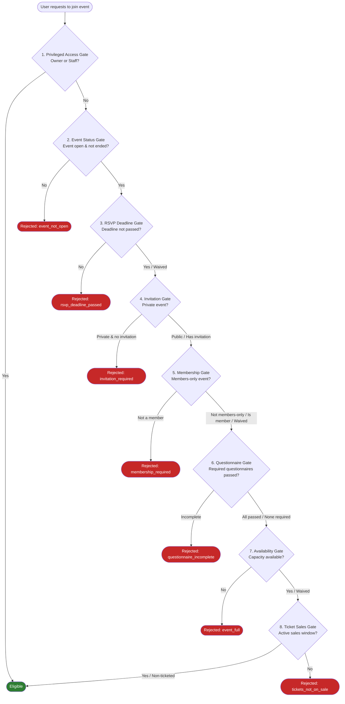
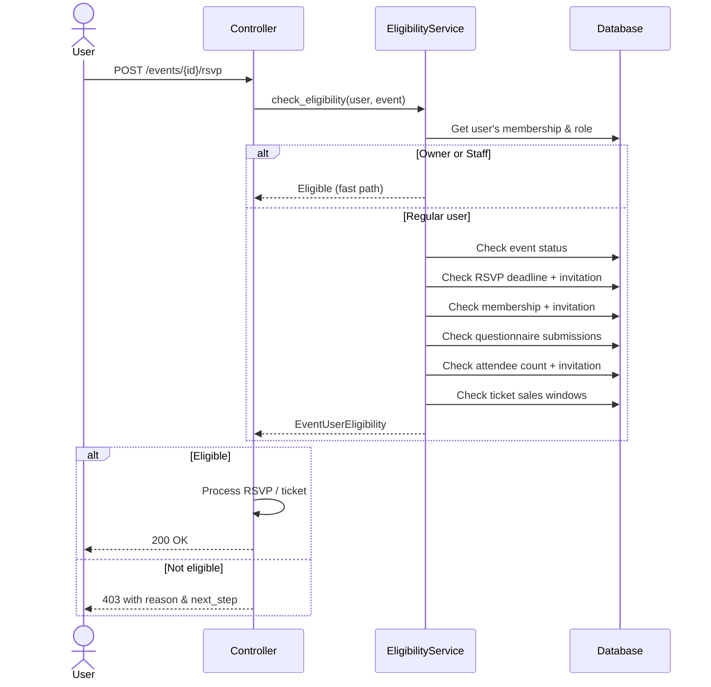

# Eligibility Pipeline

The eligibility pipeline is the **most critical flow** in Revel. It determines whether a user can participate in an event by running a sequence of checks called **gates**. Each gate evaluates a specific condition and can either pass, fail with a reason, or be waived by special circumstances (such as an invitation).

!!! danger "This is core business logic"
    Changes to the eligibility pipeline affect every user's ability to join events. Any modifications must be thoroughly tested and reviewed. The `EligibilityService` is the single source of truth for event access decisions.

## Pipeline Overview

## Gate Details

### 1. Privileged Access Gate

The first gate provides a **fast path** for organization owners and staff. If the requesting user is an owner or staff member of the organization that owns the event, they are immediately granted access -- no further gates are checked.

!!! tip "Why this is first"
    Owners and staff always need access to their own events for management purposes (check-in, monitoring, testing). Placing this gate first avoids unnecessary computation.

---

### 2. Event Status Gate

Checks the fundamental state of the event:

- Is the event **published** and **open** for registration?
- Has the event's **end date** not passed?
- Is the event in a valid state (not cancelled, not draft)?

!!! note
    This gate cannot be waived. A closed or ended event is closed for everyone.

---

### 3. RSVP Deadline Gate

For non-ticketed events, checks whether the RSVP deadline has passed.

!!! info "Invitation waiver"
    This gate **can be waived** by a valid `EventInvitation`. Invited users can RSVP even after the deadline has passed.

---

### 4. Invitation Gate

For **private events**, checks whether the user has a valid `EventInvitation`.

- Public events: gate is skipped entirely
- Private events without invitation: rejected with `invitation_required`
- Private events with invitation: proceed to next gate

!!! note
    Invitations are one-time use and tied to a specific user (by email or account).

---

### 5. Membership Gate

For **members-only events**, checks whether the user is an active member of the organization.

!!! info "Invitation waiver"
    This gate **can be waived** by a valid `EventInvitation`. Non-members can participate in members-only events if they were explicitly invited.

---

### 6. Questionnaire Gate

Checks whether the user has **submitted and passed** all required questionnaires for the event.

- If no questionnaires are required, the gate passes
- If questionnaires exist but are incomplete, returns `next_step: COMPLETE_QUESTIONNAIRE`
- If questionnaires were submitted but failed, returns the failure reason

!!! warning "Questionnaires can use AI evaluation"
    Some questionnaires use LLM-powered evaluation. See [Questionnaires](questionnaires.md) for details on evaluation modes and scoring.

---

### 7. Availability Gate

Checks whether the event has reached its `max_attendees` limit.

!!! info "Invitation waiver"
    This gate **can be waived** by a valid `EventInvitation`. Invited users can join even when the event is technically full.

When the event is full and the user is not invited, the service may suggest `next_step: JOIN_WAITLIST` if a waitlist is enabled.

---

### 8. Ticket Sales Gate

For **ticketed events**, checks whether there is at least one ticket tier with an active sales window (i.e., the current time falls between `sales_start` and `sales_end`).

- Non-ticketed events: gate is skipped
- No active sales window: rejected with `tickets_not_on_sale`

!!! note
    This gate cannot be waived by invitations. Ticket sales windows are strict.

## Response Structure

When a user fails a gate, the `EligibilityService` returns an `EventUserEligibility` object containing:

| Field | Description |
|---|---|
| `eligible` | `False` -- the user cannot participate |
| `reason` | Machine-readable reason code (e.g., `event_full`, `invitation_required`) |
| `message` | Human-readable explanation (localized) |
| `next_step` | Optional suggested action the user can take |

### Possible Next Steps

| Next Step | When Suggested |
|---|---|
| `COMPLETE_QUESTIONNAIRE` | User has not completed required questionnaires |
| `JOIN_WAITLIST` | Event is full but has a waitlist enabled |
| `REQUEST_INVITATION` | Private event, user can request an invitation |
| `JOIN_ORGANIZATION` | Members-only event, user can apply for membership |
| `PURCHASE_TICKET` | Ticketed event with active sales window |

## Invitation Waivers Summary

!!! info "Which gates can invitations bypass?"

    | Gate | Waivable? |
    |---|---|
    | Privileged Access | N/A (already a fast path) |
    | Event Status | No |
    | RSVP Deadline | **Yes** |
    | Invitation | N/A (this is the invitation check itself) |
    | Membership | **Yes** |
    | Questionnaire | No |
    | Availability | **Yes** |
    | Ticket Sales | No |

## Sequence Diagram

