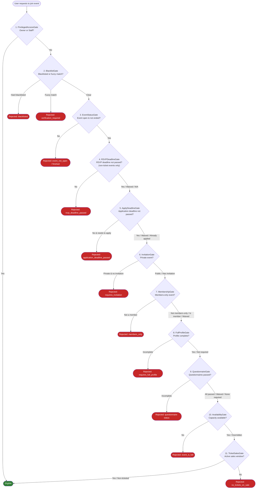
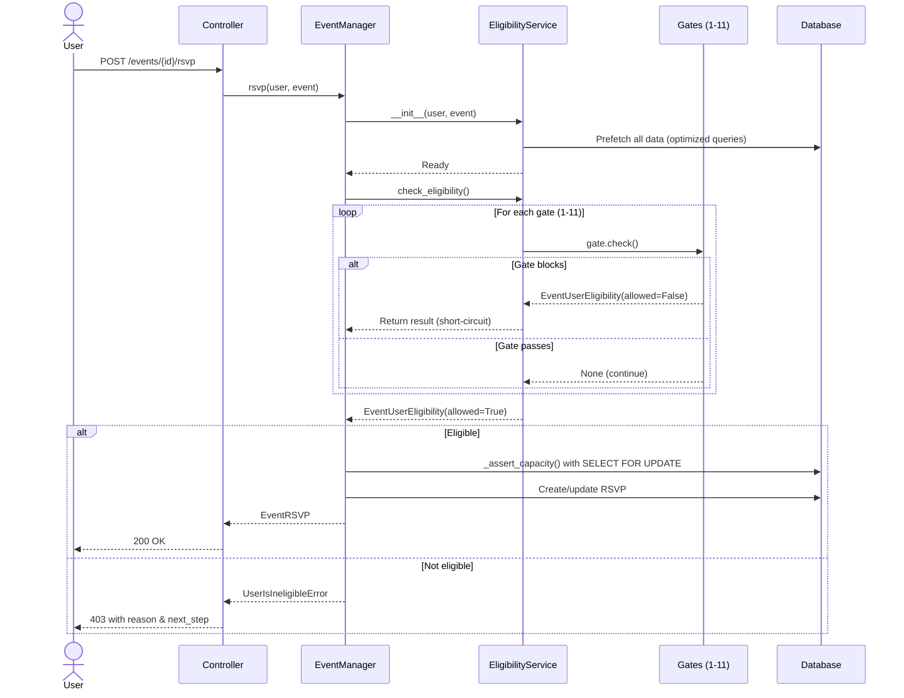

# Eligibility Pipeline

The eligibility pipeline is the **most critical flow** in Revel. It determines whether a user can participate in an event by running a sequence of checks called **gates**. Each gate evaluates a specific condition and can either pass (return `None`), or fail by returning an `EventUserEligibility` result with `allowed=False` and an actionable `next_step`. Some gates can be bypassed by invitation waivers.

!!! danger "This is core business logic"
    Changes to the eligibility pipeline affect every user's ability to join events. Any modifications must be thoroughly tested and reviewed. The `EligibilityService` is the single source of truth for event access decisions.

## Pipeline Overview

The pipeline consists of **11 gates** executed in strict order. The first gate to return a result short-circuits the pipeline -- no subsequent gates are evaluated.



## Gate Details

### 1. PrivilegedAccessGate

The first gate provides a **fast path** for organization owners and staff. If the requesting user is the organization owner or a staff member, they are immediately granted access with `allowed=True` -- no further gates are checked.

!!! tip "Why this is first"
    Owners and staff always need access to their own events for management purposes (check-in, monitoring, testing). Placing this gate first avoids unnecessary computation.

**Source:** `events/service/event_manager/gates.py` -- `PrivilegedAccessGate`

---

### 2. BlacklistGate

Checks whether the user is blocked from participating in the organization's events. This gate has two levels of blocking:

1. **Hard block** -- The user is definitively blacklisted (FK match or hard identifier match). Returns `allowed=False` with no `next_step` and no recourse.
2. **Soft block (fuzzy match)** -- The user's name fuzzy-matches a blacklist entry. This requires verification through a whitelist request flow:
    - **Active members** bypass fuzzy matching entirely (trusted users).
    - If fuzzy-matched but **already whitelisted**, the gate passes.
    - If a **whitelist request is pending**, returns `next_step=WAIT_FOR_WHITELIST_APPROVAL`.
    - If a **whitelist request was rejected**, returns no `next_step` (no recourse).
    - If **no request exists yet**, returns `next_step=REQUEST_WHITELIST`.

!!! note
    This gate cannot be waived by invitations. Blacklist checks are absolute.

**Source:** `events/service/event_manager/gates.py` -- `BlacklistGate`

---

### 3. EventStatusGate

Checks the fundamental state of the event:

- Has the event's **end date** passed? If so, returns reason `EVENT_HAS_FINISHED` with no `next_step`.
- Is the event **status** set to `OPEN`? If not, returns reason `EVENT_IS_NOT_OPEN` with `next_step=WAIT_FOR_EVENT_TO_OPEN`.

!!! note
    This gate cannot be waived. A closed or ended event is closed for everyone.

**Source:** `events/service/event_manager/gates.py` -- `EventStatusGate`

---

### 4. RSVPDeadlineGate

For **non-ticketed events**, checks whether the RSVP deadline (`event.rsvp_before`) has passed.

- **Ticketed events** -- gate is skipped entirely (returns `None`).
- **No deadline set** -- gate passes.
- **Deadline passed** -- returns `allowed=False` with reason `RSVP_DEADLINE_PASSED`.

!!! info "Invitation waiver: `waives_rsvp_deadline`"
    This gate **can be waived** by an `EventInvitation` with `waives_rsvp_deadline=True`. Invited users can RSVP even after the deadline has passed.

**Source:** `events/service/event_manager/gates.py` -- `RSVPDeadlineGate`

---

### 5. ApplyDeadlineGate

Checks whether the **application deadline** has passed for users who still need to apply. The effective deadline is `event.apply_before` if set, otherwise falls back to the event start time (`event.effective_apply_deadline`).

This gate only blocks users who have **not yet completed** their required application steps:

- Needs to submit an **invitation request** (private event that accepts requests, user has no invitation and no existing request).
- Needs to complete a required **questionnaire** (admission questionnaire not yet submitted or previously rejected).

Users who have already applied (submitted a request or completed questionnaires) pass through even after the deadline.

!!! info "Invitation waiver: `waives_apply_deadline`"
    This gate **can be waived** by an `EventInvitation` with `waives_apply_deadline=True`.

**Source:** `events/service/event_manager/gates.py` -- `ApplyDeadlineGate`

---

### 6. InvitationGate

For **private events**, ensures the user has a valid `EventInvitation`.

- **Public / members-only events** -- gate is skipped entirely.
- **Has invitation** -- gate passes.
- **Pending invitation request** -- returns `next_step=WAIT_FOR_INVITATION_APPROVAL`.
- **Rejected invitation request** -- returns no `next_step` (no recourse).
- **No invitation and no request** -- returns `next_step=REQUEST_INVITATION` if the event accepts invitation requests, otherwise no `next_step`.

**Source:** `events/service/event_manager/gates.py` -- `InvitationGate`

---

### 7. MembershipGate

For **members-only events**, ensures the user is an active member of the organization.

- **Not a members-only event** -- gate is skipped.
- **User is an active member** -- gate passes.
- **User has inactive membership** -- returns reason `MEMBERSHIP_INACTIVE` with no `next_step`.
- **User has no membership** -- returns reason `MEMBERS_ONLY` with `next_step=BECOME_MEMBER` if the organization accepts membership requests.

!!! info "Invitation waiver: `waives_membership_required`"
    This gate **can be waived** by an `EventInvitation` with `waives_membership_required=True`. Non-members can participate in members-only events if they were explicitly invited with this waiver.

**Source:** `events/service/event_manager/gates.py` -- `MembershipGate`

---

### 8. FullProfileGate

When an event has `requires_full_profile=True`, ensures the user has a complete profile:

- **Profile picture** present
- **Pronouns** set
- **Name** provided (at least one of `first_name`, `last_name`, or `preferred_name`)

If any fields are missing, returns `allowed=False` with `next_step=COMPLETE_PROFILE` and a `missing_profile_fields` list indicating which fields need to be filled in (e.g., `["profile_picture", "pronouns", "name"]`).

!!! note
    This gate cannot be waived by invitations.

**Source:** `events/service/event_manager/gates.py` -- `FullProfileGate`

---

### 9. QuestionnaireGate

Checks whether the user has submitted and passed all required admission questionnaires linked to the event's organization. This gate performs three sub-checks in order:

1. **Missing questionnaires** -- User has not submitted a required questionnaire, or their approved submission has expired (`max_submission_age`). Returns `next_step=COMPLETE_QUESTIONNAIRE` with `questionnaires_missing` list.
2. **Pending review** -- Submission exists but evaluation is `PENDING_REVIEW` or not yet created. Returns `next_step=WAIT_FOR_QUESTIONNAIRE_EVALUATION` with `questionnaires_pending_review` list.
3. **Failed questionnaires** -- Evaluation was `REJECTED`:
    - If max attempts exceeded, returns `questionnaires_failed` list with no `next_step`.
    - If retake is allowed and cooldown has passed, adds to `questionnaires_missing` for resubmission.
    - If retake is allowed but cooldown has not passed, returns `next_step=WAIT_TO_RETAKE_QUESTIONNAIRE` with `retry_on` datetime.

**Questionnaire scoping:**

- **Global questionnaires** -- Submission is shared across all events.
- **Per-event questionnaires** (`per_event=True`) -- Submission is scoped to the specific event.
- **Member exemptions** (`members_exempt=True`) -- Active members skip the questionnaire.

!!! info "Invitation waiver: `waives_questionnaire`"
    This gate **can be waived** by an `EventInvitation` with `waives_questionnaire=True`. All questionnaire requirements are bypassed.

!!! warning "Questionnaires can use AI evaluation"
    Some questionnaires use LLM-powered evaluation. See [Questionnaires](questionnaires.md) for details on evaluation modes and scoring.

**Source:** `events/service/event_manager/gates.py` -- `QuestionnaireGate`

---

### 10. AvailabilityGate

Checks whether the event has reached its capacity limit. Uses `event.effective_capacity`, which is the minimum of `max_attendees` and `venue.capacity` (or whichever is set; 0 means unlimited).

- **Unlimited capacity** (`effective_capacity == 0`) -- gate passes.
- **Counting logic:**
    - **Ticketed events** -- counts non-cancelled tickets.
    - **RSVP events** -- counts `YES` RSVPs.
- **Event full** -- returns `next_step=JOIN_WAITLIST` if waitlist is open and user is not already waitlisted, `next_step=WAIT_FOR_OPEN_SPOT` if already on the waitlist, or no `next_step` if no waitlist.

!!! info "Invitation waiver: `overrides_max_attendees`"
    This gate **can be bypassed** by an `EventInvitation` with `overrides_max_attendees=True`. Invited users can join even when the event is technically full.

!!! note "Two-phase capacity check"
    This gate performs a **preliminary** check using prefetched in-memory data (zero DB queries). The final authoritative capacity check happens in `EventManager._assert_capacity()` within a database transaction with row-level locking (`select_for_update`) to prevent race conditions.

**Source:** `events/service/event_manager/gates.py` -- `AvailabilityGate`

---

### 11. TicketSalesGate

For **ticketed events**, checks whether there is at least one ticket tier with an active sales window.

- **Non-ticketed events** -- gate is skipped.
- For each tier, checks if the current time falls within the sales window:
    - `sales_start_at` to `sales_end_at` (falls back to `event.start` if `sales_end_at` is not set).
    - Tiers with no sales window configured are assumed to always be on sale.
- If **no tier** has active sales, returns reason `NO_TICKETS_ON_SALE` with no `next_step`.

!!! note
    This gate cannot be waived by invitations. Ticket sales windows are strict.

**Source:** `events/service/event_manager/gates.py` -- `TicketSalesGate`

---

## Response Structure

When a user fails a gate, the `EligibilityService` returns an `EventUserEligibility` object (a Pydantic `BaseModel`):

```python
class EventUserEligibility(BaseModel):
    allowed: bool
    event_id: uuid.UUID
    reason: str | None = None
    next_step: NextStep | None = None
    questionnaires_missing: list[uuid.UUID] | None = None
    questionnaires_pending_review: list[uuid.UUID] | None = None
    questionnaires_failed: list[uuid.UUID] | None = None
    retry_on: datetime.datetime | None = None
    missing_profile_fields: list[str] | None = None
```

| Field | Type | Description |
|---|---|---|
| `allowed` | `bool` | Whether the user can participate |
| `event_id` | `UUID` | The event being checked |
| `reason` | `str \| None` | Translated human-readable reason (from `Reasons` enum) |
| `next_step` | `NextStep \| None` | Suggested action the user can take to become eligible |
| `questionnaires_missing` | `list[UUID] \| None` | IDs of questionnaires the user needs to complete |
| `questionnaires_pending_review` | `list[UUID] \| None` | IDs of questionnaires awaiting evaluation |
| `questionnaires_failed` | `list[UUID] \| None` | IDs of questionnaires the user has permanently failed |
| `retry_on` | `datetime \| None` | When the user can retake a failed questionnaire |
| `missing_profile_fields` | `list[str] \| None` | Profile fields that need to be completed (e.g., `profile_picture`, `pronouns`, `name`) |

!!! note
    On success (`allowed=True`), all optional fields default to `None`.

---

## NextStep Enum Values

All possible `NextStep` values and when they are returned:

| NextStep | Gate | When Suggested |
|---|---|---|
| `REQUEST_WHITELIST` | BlacklistGate | User fuzzy-matches a blacklist entry and needs to request verification |
| `WAIT_FOR_WHITELIST_APPROVAL` | BlacklistGate | Whitelist request is pending |
| `WAIT_FOR_EVENT_TO_OPEN` | EventStatusGate | Event exists but is not yet open |
| `WAIT_FOR_INVITATION_APPROVAL` | InvitationGate | Invitation request has been submitted and is pending |
| `REQUEST_INVITATION` | InvitationGate | Private event, user can request an invitation |
| `BECOME_MEMBER` | MembershipGate | Members-only event, organization accepts membership requests |
| `UPGRADE_MEMBERSHIP` | MembershipGate | Reserved for membership tier requirements |
| `COMPLETE_PROFILE` | FullProfileGate | User profile is missing required fields |
| `COMPLETE_QUESTIONNAIRE` | QuestionnaireGate | User has not completed required questionnaires |
| `WAIT_FOR_QUESTIONNAIRE_EVALUATION` | QuestionnaireGate | Questionnaire submitted, awaiting evaluation |
| `WAIT_TO_RETAKE_QUESTIONNAIRE` | QuestionnaireGate | Failed questionnaire, retake cooldown has not elapsed |
| `JOIN_WAITLIST` | AvailabilityGate | Event is full, waitlist is open, user is not on it |
| `WAIT_FOR_OPEN_SPOT` | AvailabilityGate | Event is full, user is already on the waitlist |
| `PURCHASE_TICKET` | EventManager | Returned by `EventManager.rsvp()` when event requires a ticket |
| `RSVP` | EventManager | Returned when event requires RSVP |

---

## Invitation Waivers Summary

`EventInvitation` objects carry boolean flags that can bypass specific gates. These are set per-invitation when an organizer creates the invitation.

!!! info "Which gates can invitations bypass?"

    | Gate | Waiver Field | Effect |
    |---|---|---|
    | PrivilegedAccessGate | N/A | Already a fast path for owners/staff |
    | BlacklistGate | None | Cannot be waived |
    | EventStatusGate | None | Cannot be waived |
    | RSVPDeadlineGate | `waives_rsvp_deadline` | Invited user can RSVP after the deadline |
    | ApplyDeadlineGate | `waives_apply_deadline` | Invited user can apply after the deadline |
    | InvitationGate | N/A | This is the invitation check itself |
    | MembershipGate | `waives_membership_required` | Non-member can join members-only event |
    | FullProfileGate | None | Cannot be waived |
    | QuestionnaireGate | `waives_questionnaire` | All questionnaire requirements bypassed |
    | AvailabilityGate | `overrides_max_attendees` | Invited user can join a full event |
    | TicketSalesGate | None | Cannot be waived |

Additionally, `waives_purchase` is available on invitations and checked by `EligibilityService.waives_purchase()`. It grants complimentary access and is used downstream in the ticket checkout flow, not within the eligibility gates themselves.

---

## Architecture

### EligibilityService

The `EligibilityService` class (`events/service/event_manager/service.py`) is the orchestrator. It:

1. **Pre-fetches all data** in `__init__` using optimized queries with `select_related`, `prefetch_related`, and annotations -- ensuring subsequent gate checks require **zero additional database queries**.
2. **Instantiates all 11 gates** in order, passing itself as a handler so gates can access shared prefetched data.
3. **Runs gates sequentially** in `check_eligibility()` -- the first gate to return an `EventUserEligibility` short-circuits the pipeline.
4. If all gates pass, returns `EventUserEligibility(allowed=True, event_id=...)`.

```python
def check_eligibility(self, bypass: bool = False) -> EventUserEligibility:
    if bypass:
        return EventUserEligibility(allowed=True, event_id=self.event.pk)
    for gate in self._gates:
        if result := gate.check():
            return result
    return EventUserEligibility(allowed=True, event_id=self.event.id)
```

### EventManager

The `EventManager` class (`events/service/event_manager/manager.py`) wraps `EligibilityService` and adds transactional operations:

- **`rsvp()`** -- Checks eligibility, then asserts capacity with row-level locking, then creates/updates the RSVP. Users who already have a `YES` RSVP bypass eligibility checks when changing status (to prevent them from being "trapped" if requirements change).
- **`check_eligibility()`** -- Delegates to `EligibilityService.check_eligibility()` with an optional `raise_on_false` parameter that raises `UserIsIneligibleError`.

### Sequence Diagram



---

## Reason Codes

All reason strings from the `Reasons` enum (translated at runtime via `gettext`):

| Reason Constant | Message |
|---|---|
| `BLACKLISTED` | "You are not allowed to participate in this organization's events." |
| `VERIFICATION_REQUIRED` | "Additional verification required." |
| `WHITELIST_PENDING` | "Your verification request is pending approval." |
| `WHITELIST_REJECTED` | "Your verification request was rejected." |
| `EVENT_HAS_FINISHED` | "Event has finished." |
| `EVENT_IS_NOT_OPEN` | "Event is not open." |
| `RSVP_DEADLINE_PASSED` | "The RSVP deadline has passed." |
| `APPLICATION_DEADLINE_PASSED` | "The application deadline has passed." |
| `REQUIRES_INVITATION` | "Requires invitation." |
| `INVITATION_REQUEST_PENDING` | "Your invitation request is pending approval." |
| `INVITATION_REQUEST_REJECTED` | "Your invitation request was rejected." |
| `MEMBERS_ONLY` | "Only members are allowed." |
| `MEMBERSHIP_INACTIVE` | "Your membership is not active." |
| `MEMBERSHIP_TIER_REQUIRED` | "This ticket tier requires a specific membership tier." |
| `REQUIRES_FULL_PROFILE` | "Requires full profile." |
| `QUESTIONNAIRE_MISSING` | "Questionnaire has not been filled." |
| `QUESTIONNAIRE_PENDING_REVIEW` | "Waiting for questionnaire evaluation." |
| `QUESTIONNAIRE_FAILED` | "Questionnaire evaluation was insufficient." |
| `QUESTIONNAIRE_RETAKE_COOLDOWN` | "Questionnaire evaluation was insufficient. You can try again in {retry_on}." |
| `EVENT_IS_FULL` | "Event is full." |
| `SOLD_OUT` | "Sold out" |
| `NO_TICKETS_ON_SALE` | "Tickets are not currently on sale." |
| `REQUIRES_TICKET` | "Requires a ticket." |
| `MUST_RSVP` | "Must RSVP" |
| `REQUIRES_PURCHASE` | "Requires purchase." |
| `NOTHING_TO_PURCHASE` | "Nothing to purchase." |
