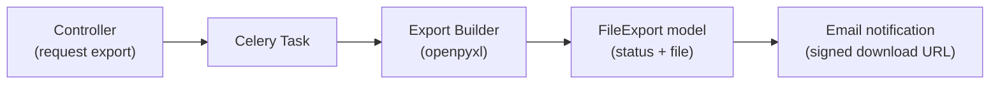

# Exports

Revel supports asynchronous data exports for attendee lists, questionnaire submissions, and
revenue & VAT reports. Exports are generated as background Celery tasks, tracked through a
`FileExport` row, and delivered via a time-limited signed download link (and, for some types,
email).

Not every export is a single `.xlsx`: the attendee and questionnaire exports produce one XLSX
workbook, while the **revenue & VAT report** is a multi-file **ZIP** (XLSX Summary +
Transactions, plus a per-VAT-rate PDF). See [Revenue & VAT Export](#revenue-vat-export).

!!! info "Mechanics vs. narrative"
    This page covers the **artifact mechanics** (the `FileExport` lifecycle, builders, and
    download security). The financial meaning of revenue reports — the aggregation engine, VAT
    bucketing, refund attribution, and scheduled delivery — lives in
    [Billing & VAT → Revenue & VAT Reporting](billing-and-vat.md#revenue-vat-reporting).

## Architecture

## FileExport Model

The `FileExport` model (`common/models.py`) tracks the lifecycle of every export job:

| Field | Description |
|---|---|
| `requested_by` | User who requested the export |
| `export_type` | `questionnaire_submissions`, `attendee_list`, or `revenue_vat_report` |
| `status` | `PENDING` → `PROCESSING` → `READY` or `FAILED` |
| `file` | `ProtectedFileField` — the generated artifact (a `.xlsx` workbook or a `.zip` bundle), served via HMAC-signed URLs |
| `parameters` | JSON dict with export-specific inputs (event ID, questionnaire ID, etc.) |
| `error_message` | Populated on failure |
| `completed_at` | Timestamp when the export finished |

The lifecycle helpers live in `common/service/export_service.py`:

- `start_export()` — transitions to `PROCESSING`
- `complete_export()` — saves the file and transitions to `READY`
- `fail_export()` — records the error and transitions to `FAILED`

## Export Types

### Attendee Export

**Location:** `events/service/export/attendee_export.py`

Generates a workbook with two sheets:

- **Summary** — event metadata, attendee counts (tickets vs. RSVPs, checked-in), pronoun distribution
- **Attendees** — one row per ticket/RSVP: name, email, pronouns, type, tier, status, seat, payment info

### Questionnaire Export

**Location:** `events/service/export/questionnaire_export.py`

Generates a workbook with two sheets:

- **Summary** — submission statistics (total, unique users, approved/rejected/pending), score distribution (avg/min/max), pronoun distribution
- **Submissions** — one row per submission: user info, evaluation status/score/comments, and one column per question (MC options joined with `;`, free-text answers, file upload filenames)

### Revenue & VAT Export

**Location:** `events/service/revenue_report_service.py`

Unlike the attendee and questionnaire exports, this one bundles **multiple files into a ZIP**
(`build_zip` → `build_xlsx` + `build_pdf`):

- **XLSX** — two sheets: **Summary** (per currency, one row per VAT rate, a Refunds row, and a
  bold Net-taxable-turnover total) and **Transactions** (one row per sale/refund line).
- **PDF** — rendered with WeasyPrint (`reports/revenue_vat_report.html`): per-VAT-rate table,
  refunds, and net taxable turnover.

**Caching:** `get_or_generate_revenue_report()` reuses an existing READY `FileExport` whose
parameters (org, optional event, date range) and a content hash over the in-scope rows match,
unless the request passes `?refresh=true` — in which case a fresh export is always enqueued.
The actual build runs in the `events.generate_revenue_report` Celery task (dispatched on
`transaction.on_commit`); a failure marks the export `FAILED` before re-raising.

**Scheduled delivery:** the `events.send_scheduled_revenue_reports` Beat task generates and
emails the just-closed period's ZIP to opted-in orgs (the financial details live in
[Billing & VAT → Scheduled Delivery](billing-and-vat.md#scheduled-delivery)).

The aggregation logic that feeds these builders is documented in
[Billing & VAT → Revenue & VAT Reporting](billing-and-vat.md#revenue-vat-reporting).

### Shared Formatting

**Location:** `events/service/export/formatting.py`

Reusable styling utilities applied to all exports: header row styling (white-on-blue), auto-fitted column widths, and summary sheet label formatting.

## Download Security

All export files — workbooks and ZIP bundles alike — are stored as `ProtectedFileField` entries,
using the same HMAC-signed URL mechanism described in [Protected Files](protected-files.md).
For every `FileExport` type, the signed download URL is generated with a **7-day expiry**
(`EXPORT_URL_EXPIRES_IN`) once the export reaches `READY` — exposed on the export's API response
(`download_url`) and, for the attendee/questionnaire exports, delivered via email.
