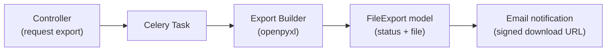

# XLSX Exports

Revel supports asynchronous Excel exports for attendee lists and questionnaire submissions. Exports are generated as background Celery tasks and delivered via email with a time-limited download link.

## Architecture

## FileExport Model

The `FileExport` model (`common/models.py`) tracks the lifecycle of every export job:

| Field | Description |
|---|---|
| `requested_by` | User who requested the export |
| `export_type` | `questionnaire_submissions` or `attendee_list` |
| `status` | `PENDING` → `PROCESSING` → `READY` or `FAILED` |
| `file` | `ProtectedFileField` — the generated `.xlsx` file (HMAC-signed URLs) |
| `parameters` | JSON dict with export-specific inputs (event ID, questionnaire ID, etc.) |
| `error_message` | Populated on failure |
| `completed_at` | Timestamp when the export finished |

The lifecycle helpers live in `common/service/export_service.py`:

- `start_export()` — transitions to `PROCESSING`
- `complete_export()` — saves the file and transitions to `READY`
- `fail_export()` — records the error and transitions to `FAILED`

## Export Types

### Attendee Export

**Location:** `events/service/export/attendee_export.py`

Generates a workbook with two sheets:

- **Summary** — event metadata, attendee counts (tickets vs. RSVPs, checked-in), pronoun distribution
- **Attendees** — one row per ticket/RSVP: name, email, pronouns, type, tier, status, seat, payment info

### Questionnaire Export

**Location:** `events/service/export/questionnaire_export.py`

Generates a workbook with two sheets:

- **Summary** — submission statistics (total, unique users, approved/rejected/pending), score distribution (avg/min/max), pronoun distribution
- **Submissions** — one row per submission: user info, evaluation status/score/comments, and one column per question (MC options joined with `;`, free-text answers, file upload filenames)

### Shared Formatting

**Location:** `events/service/export/formatting.py`

Reusable styling utilities applied to all exports: header row styling (white-on-blue), auto-fitted column widths, and summary sheet label formatting.

## Download Security

Export files are stored as `ProtectedFileField` entries, using the same HMAC-signed URL mechanism described in [Protected Files](protected-files.md). Download links are generated with a 7-day expiry and delivered via email.
