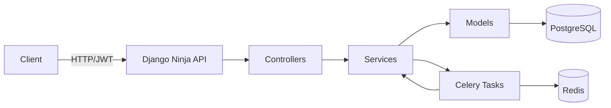

# Architecture

Revel's backend is a Django application that uses **Django Ninja** for the API layer, **Celery** for async tasks, and **PostgreSQL** (with PostGIS) for storage. The codebase follows a clear separation between controllers (API endpoints), services (business logic), and models (data layer).

## Core Principles

- **Service layer owns business logic** -- controllers are thin, models are data-only
- **Hybrid service pattern** -- functions for stateless ops, classes for stateful workflows
- **Explicit over magic** -- no DI container, no framework lock-in beyond Django Ninja
- **Type safety** -- strict mypy, typed schemas, model enums as source of truth

## Sections

| Topic | What You'll Learn |
|-------|------------------|
| [Service Layer](service-layer.md) | When to use functions vs. classes, controller integration |
| [Controllers](controllers.md) | Django Ninja Extra patterns, auth, throttling |
| [Permissions & Roles](permissions.md) | Organization roles, event-level access control |
| [Eligibility Pipeline](eligibility-pipeline.md) | The gate-by-gate system that determines event access |
| [Protected Files](protected-files.md) | HMAC-signed URLs with Caddy (and why not S3) |
| [Notifications](notifications.md) | Multi-channel delivery: in-app, email, Telegram |
| [File Security](security.md) | EXIF stripping, ClamAV malware scanning, quarantine |
| [Questionnaires](questionnaires.md) | LLM-powered evaluation, prompt injection protection |
