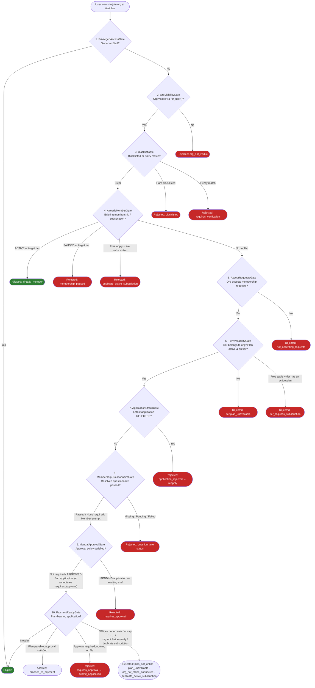
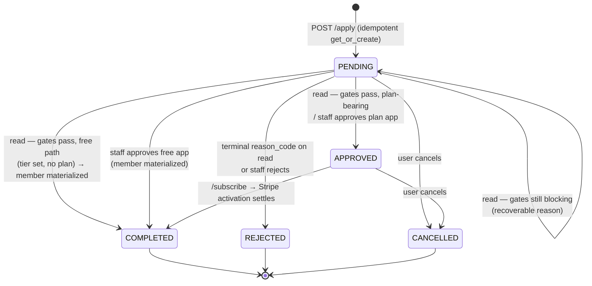

# Membership Eligibility Pipeline

The membership-eligibility pipeline is the organization-level sibling of the [event eligibility pipeline](eligibility-pipeline.md). It determines whether a user can **join an organization** at a target membership tier (optionally on a paid plan) by running a sequence of checks called **gates**. Each gate evaluates one membership policy and can pass (return `None` to fall through), **block** (`allowed=False` with an actionable `next_step`), or — unlike the event pipeline — **allow** early (`allowed=True`, e.g. for owners or existing members).

The same gate stack powers two things:

1. **Previews** — `GET /join-eligibility` runs the gates with no side effects so the frontend can render the right join CTA.
2. **The application state machine** — every read of an application re-runs the gates and may advance its status ("advance on every read").

!!! danger "This is core business logic"
    Changes to this pipeline affect every user's ability to join organizations, and the
    "advance on read" state machine mutates `OrganizationMembershipRequest` rows. The
    `MembershipEligibilityService` is the single source of truth for membership-join
    decisions. Any modifications must be thoroughly tested and reviewed.

## Pipeline Overview

The pipeline consists of **10 gates** executed in strict order. The first gate to return a verdict (blocking *or* allowing) short-circuits the pipeline; no subsequent gates are evaluated.



## Gate Details

### 1. PrivilegedAccessGate

The first gate provides a **fast path** for organization owners and staff: they are immediately granted access with `allowed=True`; no further gates are checked.

**Source:** `events/service/membership_manager/gates.py`: `PrivilegedAccessGate`

---

### 2. OrgVisibilityGate

The organization must be visible to the user via `Organization.objects.for_user()` (visibility rules, bans, hard blacklists). If not, blocks with reason `ORG_NOT_VISIBLE` and no `next_step`.

!!! note "Controllers convert this to a 404"
    The gate exists as a defense-in-depth layer; the `/join-eligibility` and `/apply`
    controllers additionally raise a plain **404** for invisible organizations *before*
    running the pipeline, so slug-guessing callers cannot enumerate private orgs
    (see [Endpoints](#endpoints)).

**Source:** `events/service/membership_manager/gates.py`: `OrgVisibilityGate`

---

### 3. BlacklistGate

Mirrors the event pipeline's blacklist semantics:

1. **Hard block**: definitively blacklisted (FK or hard identifier match). Blocks with reason `BLACKLISTED`, no `next_step`, no recourse.
2. **Soft block (fuzzy name match)**: routes through the whitelist verification flow:
    - Already **whitelisted** → gate passes.
    - Whitelist request **pending** → blocks with `next_step=WAIT_FOR_WHITELIST_APPROVAL` (recoverable — the application row stays `PENDING`).
    - Whitelist request **rejected** → blocks with no `next_step`.
    - **No request yet** → blocks with reason `REQUIRES_VERIFICATION` and `next_step=REQUIRES_INVITATION`; the frontend routes the user through the existing whitelist-request endpoint.

Blacklist/whitelist state is computed lazily on first access and cached for the service instance.

**Source:** `events/service/membership_manager/gates.py`: `BlacklistGate`

---

### 4. AlreadyMemberGate

Inspects the user's existing memberships and subscriptions in the organization:

- **Free-apply bypass guard**: when applying via the free path (`plan is None`) while holding any **non-terminal `MembershipSubscription`** in the org, blocks with `DUPLICATE_ACTIVE_SUBSCRIPTION` — a user must not clobber their paid membership through the free flow.
- **ACTIVE membership at the target tier** → *allows* early with `next_step=ALREADY_MEMBER` (the only allowing verdict that carries a `next_step`).
- **PAUSED membership at the target tier** → blocks with `MEMBERSHIP_PAUSED` and no `next_step`. PAUSED is admin/Stripe-imposed; the user must contact the organization to resume.
- **ACTIVE membership at a different tier** falls through, so subsequent gates can re-gate tier upgrades.

**Source:** `events/service/membership_manager/gates.py`: `AlreadyMemberGate`

---

### 5. AcceptRequestsGate

The organization must have `accept_membership_requests=True`. Otherwise blocks with `NOT_ACCEPTING_REQUESTS` and `next_step=REQUIRES_INVITATION` (the user can still join via an organization invitation token).

**Source:** `events/service/membership_manager/gates.py`: `AcceptRequestsGate`

---

### 6. TierAvailabilityGate

Sanity-checks the target tier and (optional) plan:

- The tier must belong to this organization → otherwise `TIER_UNAVAILABLE`.
- **Free apply (`plan is None`) against a monetized tier** — one that carries at least one active subscription plan — blocks with `TIER_REQUIRES_SUBSCRIPTION`. A free `/apply` must not hand out a paid tier's benefits without payment; the user is directed to subscribe to a plan instead.
- When a plan **is** supplied: it must be `is_active` and belong to the target tier → otherwise `PLAN_UNAVAILABLE`. Plan-bearing applications fall through to `PaymentReadyGate`.

**Source:** `events/service/membership_manager/gates.py`: `TierAvailabilityGate`

---

### 7. ApplicationStatusGate

Blocks when the user's **most recent** application for this (org, tier) is `REJECTED`, with reason `APPLICATION_REJECTED` and `next_step=REAPPLY`.

`REJECTED` is terminal for the **row**, not for the user: a fresh `POST /apply` creates a new `PENDING` row (the partial unique constraint only forbids duplicate `PENDING` rows), and since this gate only inspects the *latest* application per tier, the new `PENDING` row supersedes the old `REJECTED` one and the gates evaluate the fresh attempt from scratch.

!!! info "Permanently blocking a user"
    Organizations that want to permanently keep someone out must **blacklist** them —
    rejecting an application only rejects that attempt.

**Source:** `events/service/membership_manager/gates.py`: `ApplicationStatusGate`

---

### 8. MembershipQuestionnaireGate

Enforces the **resolved membership questionnaire**: the tier-level `membership_questionnaire` override wins; otherwise the organization's `default_membership_questionnaire` applies; `NULL` on both means no questionnaire is required (see [Policy resolution](#policy-resolution-tier-overrides-org-defaults)).

Evaluation against the user's most recent `READY` submission:

- **`members_exempt=True`** grandfathers existing members: any ACTIVE membership at *any* tier in the org skips the questionnaire. Orgs that want to re-gate tier upgrades set `members_exempt=False`.
- **No submission** → blocks with `MEMBERSHIP_QUESTIONNAIRE_MISSING` and `next_step=SUBMIT_QUESTIONNAIRE` (+ `questionnaire_id`).
- **`requires_evaluation=False`** → a submission's mere existence passes the gate.
- **Evaluation missing or `PENDING_REVIEW`** → blocks with `MEMBERSHIP_QUESTIONNAIRE_PENDING` and `next_step=WAIT_FOR_QUESTIONNAIRE_EVALUATION`.
- **`APPROVED`** → passes, unless the approval is older than `max_submission_age` (then treated as missing → resubmit).
- **Rejected** → retake policy branches:
    - `can_retake_after` set and cooldown still running → `MEMBERSHIP_QUESTIONNAIRE_RETAKE_COOLDOWN` with `next_step=WAIT_TO_RETAKE_QUESTIONNAIRE` and `retry_on`.
    - Cooldown elapsed → treated as missing (resubmit).
    - No retake configured → **terminal failure** `MEMBERSHIP_QUESTIONNAIRE_FAILED`, no `next_step`.
    - Attempts cap reached → **terminal failure** `MEMBERSHIP_QUESTIONNAIRE_ATTEMPTS_EXHAUSTED`, no `next_step`: whatever the retake policy says, the user can never satisfy the gate again.

Those last two — `MEMBERSHIP_QUESTIONNAIRE_FAILED` and `MEMBERSHIP_QUESTIONNAIRE_ATTEMPTS_EXHAUSTED` — are the two reason codes in `TERMINAL_REJECTION_CODES` (see [State machine](#application-state-machine)).

**Source:** `events/service/membership_manager/gates.py`: `MembershipQuestionnaireGate`

---

### 9. ManualApprovalGate

When the resolved manual-approval policy is on (tier-level `requires_membership_approval` override when not `NULL`, else org `default_requires_membership_approval`):

- **`APPROVED` application** → falls through (the staff decision is in).
- **`PENDING` application** → blocks with `REQUIRES_APPROVAL`, `next_step=WAIT_FOR_APPROVAL`, and the `application_id` to poll.
- **No application on file** (or only a terminal `CANCELLED`/`COMPLETED` one) → **falls through** so the user can actually apply. Blocking here soft-locked users who had never applied: the frontend rendered a disabled "application pending" state with no path to the Join CTA (#787). Instead the gate sets `handler.approval_required_annotation`, so `check_eligibility()`'s final *allowing* verdict carries `reason_code=REQUIRES_APPROVAL` with no prose and no `next_step` — the frontend can still say "joining goes through staff approval" while offering the Join CTA.

`REJECTED` never reaches this gate — `ApplicationStatusGate` blocks it first with `next_step=REAPPLY`.

!!! note "The fall-through is deliberate, not an `_allow`"
    A returned verdict short-circuits the chain, and `PaymentReadyGate` runs *after* this
    gate — so a plan-bearing check with no application must still fall through to reach its
    `PLAN_NOT_ONLINE` block.

**Source:** `events/service/membership_manager/gates.py`: `ManualApprovalGate`

---

### 10. PaymentReadyGate

The final pre-payment readiness check. A no-op when no plan is supplied. A plan-bearing check that survives every prior gate ends here in an **allowing** `PROCEED_TO_PAYMENT` verdict — `POST /subscribe` opens Stripe Checkout on it.

Blocks, in order:

| Condition | Reason code | next_step |
|---|---|---|
| Approval required but no application on file (`ManualApprovalGate`'s fall-through annotation) | `requires_approval` | `submit_application` — create the application first so staff have something to approve |
| Plan is not ONLINE | `plan_not_online` | — |
| Org not Stripe-connected | `org_not_stripe_connected` | — |
| Plan `sales_status` ≠ OPEN, or at its `max_subscriptions` cap | `plan_unavailable` | — |
| Caller already holds a non-terminal subscription in the org | `duplicate_active_subscription` | — (`/subscribe` deliberately lets this one fall through to the subscription machinery, which resumes a pending checkout with a 409 instead of dead-ending) |

**Source:** `events/service/membership_manager/gates.py`: `PaymentReadyGate`

---

## Response Structure

Every check returns a `MembershipEligibility` object (a Pydantic `BaseModel`), serialized on the wire as `MembershipEligibilitySchema`:

```python
class MembershipEligibility(BaseModel):
    allowed: bool
    organization_id: uuid.UUID
    tier_id: uuid.UUID | None = None
    plan_id: uuid.UUID | None = None
    reason: str | None = None
    reason_code: ReasonCode | None = None  # stable machine-readable identifier
    next_step: MembershipNextStep | None = None
    questionnaire_id: uuid.UUID | None = None
    application_id: uuid.UUID | None = None
    retry_on: datetime.datetime | None = None
```

| Field | Type | Description |
|---|---|---|
| `allowed` | `bool` | Whether the user can join (or already has joined) |
| `organization_id` | `UUID` | The organization being checked |
| `tier_id` | `UUID \| None` | Target tier, when one was supplied |
| `plan_id` | `UUID \| None` | Target plan, when one was supplied |
| `reason` | `str \| None` | Translated human-readable reason — for display only |
| `reason_code` | `ReasonCode \| None` | Stable machine-readable identifier mirroring `reason` (snake_case, never translated) — switch on this in clients |
| `next_step` | `MembershipNextStep \| None` | Suggested action to make progress |
| `questionnaire_id` | `UUID \| None` | The questionnaire to submit / being evaluated |
| `application_id` | `UUID \| None` | The application row to poll (injected by `/apply` and `GET /applications/{id}`) |
| `retry_on` | `datetime \| None` | When a failed questionnaire can be retaken |

!!! note
    Unlike the event pipeline, `allowed=True` can carry a `next_step`
    (`ALREADY_MEMBER` from `AlreadyMemberGate`) so the frontend can render
    "You're already a member" instead of a join CTA.

---

## MembershipNextStep Enum Values

All possible `MembershipNextStep` values and when they are returned:

| NextStep | Gate | When Suggested |
|---|---|---|
| `submit_questionnaire` | MembershipQuestionnaireGate | Questionnaire not submitted, expired, or retake cooldown elapsed |
| `wait_for_questionnaire_evaluation` | MembershipQuestionnaireGate | Submission awaiting evaluation |
| `wait_to_retake_questionnaire` | MembershipQuestionnaireGate | Failed questionnaire, retake cooldown running (`retry_on` set) |
| `wait_for_approval` | ManualApprovalGate | Manual-approval policy on, staff decision pending |
| `wait_for_whitelist_approval` | BlacklistGate | Fuzzy-matched, whitelist request pending |
| `requires_invitation` | BlacklistGate, AcceptRequestsGate | Verification needed, or org not accepting requests — join via invitation/whitelist flow |
| `submit_application` | PaymentReadyGate | Plan-bearing check on an approval-gated tier with no application on file — `POST /apply` first |
| `proceed_to_payment` | PaymentReadyGate | Plan-bearing check passed every gate (allowing verdict) — `POST /subscribe` opens Checkout |
| `already_member` | AlreadyMemberGate | ACTIVE membership at the target tier (allowing verdict) |
| `reapply` | ApplicationStatusGate | Latest application was rejected; a fresh `POST /apply` starts over |

---

## Reason Codes

As in the event pipeline, reasons are emitted in two forms: `reason` (translated prose, display only) and `reason_code` (stable snake_case `ReasonCode` — switch on this). The `advance_application` state machine itself switches on `reason_code`.

| `ReasonCode` value | English message |
|---|---|
| `org_not_visible` | "This organization is not available." |
| `blacklisted` | "You are not allowed to join this organization." |
| `requires_verification` | "Additional verification required." |
| `whitelist_pending` | "Your verification request is pending approval." |
| `whitelist_rejected` | "Your verification request was rejected." |
| `already_active_member` | "You are already a member at this tier." |
| `not_accepting_requests` | "This organization is not accepting new members." |
| `tier_unavailable` | "The requested tier is not available." |
| `tier_requires_subscription` | "This tier requires a paid subscription. Subscribe to a plan to join." |
| `plan_unavailable` | "The requested plan is not available." |
| `application_rejected` | "Your application was rejected." |
| `membership_questionnaire_missing` | "Membership questionnaire has not been filled." |
| `membership_questionnaire_pending` | "Waiting for questionnaire evaluation." |
| `membership_questionnaire_failed` | "Membership questionnaire evaluation was insufficient." |
| `membership_questionnaire_retake_cooldown` | "Membership questionnaire evaluation was insufficient. You can try again later." |
| `membership_questionnaire_attempts_exhausted` | "You have reached the maximum number of attempts." |
| `requires_approval` | "Your application is awaiting staff approval." |
| `plan_not_online` | "This plan is not configured for online checkout." |
| `org_not_stripe_connected` | "This organization cannot accept online payments yet." |
| `duplicate_active_subscription` | "You already have an active subscription in this organization." |
| `membership_paused` | "Your membership at this tier is paused. Contact the organization to resume." |

---

## Application State Machine

Applications are `OrganizationMembershipRequest` rows with five statuses:

| Status | Meaning | Terminal? |
|---|---|---|
| `PENDING` | Gates still blocking on a recoverable condition, or awaiting staff | No |
| `APPROVED` | A **plan-bearing** application passed the gates (or was staff-approved); awaiting the member's payment via `/subscribe`. Swept to `CANCELLED` after 30 unpaid days (`events.expire_stale_approved_applications`) | No |
| `REJECTED` | Terminal questionnaire failure observed on read, or staff rejected | Yes |
| `CANCELLED` | User cancelled their own application | Yes |
| `COMPLETED` | Membership materialized (free path) | Yes |

A **partial unique index** (`unique_pending_application_per_user_org_tier`, with `nulls_distinct=False`) enforces at most one `PENDING` application per `(organization, user, tier)` — including the tier-less (`NULL`) legacy case. Terminal rows are excluded, which is precisely what makes re-applying after rejection possible.



### Advance on every read

`advance_application()` (`events/service/membership_manager/service.py`) is called by `POST /apply` and `GET /applications/{id}`. On each call it:

1. **Re-fetches the row under `select_for_update(of=("self",))`** so concurrent reads serialize. The full state prefetch runs *inside* the lock (a handful of short queries) — prefetching outside and re-checking inside would open a TOCTOU window. `of=("self",)` locks only the OMR row; the nullable FK joins would otherwise trip Postgres' "FOR UPDATE cannot be applied to the nullable side of an outer join".
2. **Runs the full gate chain** against current state.
3. **Terminal rows never advance** — `REJECTED` / `CANCELLED` / `COMPLETED` return a fresh eligibility verdict for the response payload but perform no mutation.
4. **`PENDING` + `allowed=True`** advances:
    - tier set, no plan → `_complete_free_application()`: `OrganizationMember` created/updated to `ACTIVE` at the tier, row → `COMPLETED`.
    - plan set → row → `APPROVED` (awaiting payment via `/subscribe`; the Stripe activation settles it `COMPLETED`).
    - tier-less and plan-less → stays `PENDING` (legacy path; staff assigns a tier at approval).
5. **`PENDING` + blocked** auto-rejects **only** when `reason_code` is in the explicit terminal allowlist:

```python
TERMINAL_REJECTION_CODES: t.Final[frozenset[ReasonCode]] = frozenset(
    {
        ReasonCode.MEMBERSHIP_QUESTIONNAIRE_FAILED,
        # A user at the attempts cap can never satisfy the questionnaire gate again,
        # whatever the retake policy says — as terminal as an outright failure.
        ReasonCode.MEMBERSHIP_QUESTIONNAIRE_ATTEMPTS_EXHAUSTED,
    }
)
```

!!! warning "A missing `next_step` is NOT a terminal signal"
    `WHITELIST_PENDING`, `ORG_NOT_VISIBLE`, `MEMBERSHIP_PAUSED`,
    `DUPLICATE_ACTIVE_SUBSCRIPTION`, etc. can all block with no user-facing next step,
    yet every one of them is recoverable upstream (staff whitelists the user, the org
    becomes visible again, ...). Auto-rejection therefore keys strictly off the
    `TERMINAL_REJECTION_CODES` allowlist — everything else leaves the row `PENDING` so
    it can resume when the condition clears. An auto-rejection also queues the same
    `MEMBERSHIP_REQUEST_REJECTED` notification a staff rejection would, so
    system-driven rejections are never silent.

### Free-path defense in depth

`_complete_free_application()` refuses to materialize a member when the user has any non-terminal `MembershipSubscription` in the org, or when the existing membership at the target tier is `PAUSED`. `AlreadyMemberGate` is the primary line of defense; these guards catch any future gate reordering that would bypass it.

### Staff approval

`approve_membership_request()` (`events/service/organization_service/membership.py`) uses the application's pre-set tier, or requires the staff caller to pass one (tier-less legacy applications):

- **No plan** → row → `COMPLETED`, `OrganizationMember` created/updated `ACTIVE` at the tier, `MEMBERSHIP_REQUEST_APPROVED` notification on commit.
- **Plan-bearing** → row → `APPROVED`; the member then calls `POST /subscribe`, which re-runs the gates, opens Stripe Checkout, and links the created subscription to the application (`application.subscription`). No membership is granted yet — `_ensure_active_member` mints it on the first Stripe activation and settles the application `COMPLETED` in the same funnel.

---

## Endpoints

All member-facing routes live on `MeMembershipApplicationsController` (`events/controllers/me_applications.py`); staff decisions on `OrganizationAdminMembershipRequestsController` (`events/controllers/organization_admin/membership_requests.py`, `manage_members` permission).

| Method & Path | Purpose |
|---|---|
| `GET /api/me/organizations/{slug}/join-eligibility?tier_id=&plan_id=` | Pure preview — runs the gates with **no side effects**; drives the join CTA |
| `POST /api/me/organizations/{slug}/apply` | Create or refresh an application; returns `201` with `{application, eligibility}` |
| `GET /api/me/applications/{id}` | Poll one application — **advances state on read** |
| `GET /api/me/applications` | Paginated list of the caller's applications across orgs |
| `POST /api/me/applications/{id}/cancel` | Cancel own `PENDING`/`APPROVED` application; idempotent on terminal rows |
| `GET /api/organization-admin/{slug}/membership-requests` | Staff: list applications (filterable by status) |
| `POST /api/organization-admin/{slug}/membership-requests/{id}/approve` | Staff: approve (optional `tier_id` for tier-less applications) |
| `POST /api/organization-admin/{slug}/membership-requests/{id}/reject` | Staff: reject → `REJECTED` + notification |

### Anti-enumeration: invisible orgs are 404s

Both `GET /join-eligibility` and `POST /apply` resolve the organization through `Organization.objects.for_user()` and raise a plain **404** when it is not visible to the caller. A `200` carrying `org_not_visible` (or a 403) would confirm the org's existence — and leak its UUID — to slug-guessing callers.

### `/apply` pre-gate hard blocks

`POST /apply` runs a **preview** of the gate chain *before* creating any row, and refuses with a `403` when the verdict is blocking with `next_step` in `{None, REQUIRES_INVITATION}`. This avoids:

- persisting `PENDING` rows for users with no in-app recourse (hard blacklist, org not accepting requests, tier/plan unavailable, terminal questionnaire failure),
- queueing noisy staff notifications for dead-end applications.

Recoverable blocks (questionnaire pending, manual approval, whitelist pending) **do** create the row — it is exactly the polling record that drives advance-on-read. A `REJECTED`-latest-row verdict carries `next_step=REAPPLY` and likewise passes the pre-gate: the fresh `PENDING` row supersedes the rejected one.

Additional `/apply` behavior:

- **`plan_id`** (optional) makes it a paid application: the tier is derived from the plan when `tier_id` is omitted, the row records the target plan, and a re-`POST` with a different plan repoints the `PENDING` row.
- **Idempotent**: a re-`POST` while a `PENDING` row exists re-runs the gates against the existing row (and may advance it); a concurrent duplicate insert caught by the partial unique index fetches the winner instead of erroring.
- **`questionnaire_submission_id`** (optional) is persisted onto the row as audit evidence. It must reference a `READY` submission owned by the caller for the questionnaire that actually gates this (org, tier) — a nonexistent id and another user's id fail identically (anti-enumeration). A re-`POST` can attach a submission to a `PENDING` row that lacked one.

### Polling contract

The frontend flow after `POST /apply`:

```mermaid
sequenceDiagram
    actor User
    participant API as Controller
    participant MM as membership_manager
    participant DB as Database

    User->>API: POST /me/organizations/{slug}/apply
    API->>API: 404 if org invisible; 403 on hard-block preview
    API->>MM: apply_for_membership(...)
    MM->>DB: get_or_create PENDING (partial unique index)
    MM->>DB: SELECT ... FOR UPDATE (advance_application)
    MM->>MM: run 10 gates
    MM->>DB: maybe advance PENDING → APPROVED/COMPLETED/REJECTED
    MM-->>API: (application, eligibility)
    API-->>User: 201 {application, eligibility(application_id)}

    loop until terminal or allowed
        User->>API: GET /me/applications/{id}
        API->>MM: advance_application(app)
        MM-->>API: (application, eligibility)
        API-->>User: 200 {application, eligibility}
    end
```

`eligibility.next_step` tells the user what to do (submit the questionnaire, wait for staff, ...); `application.status` tells them where the row stands. Both are returned together on every poll.

---

## Policy Resolution: Tier Overrides, Org Defaults

Two membership policies can be set at the organization level and overridden per tier (`events/service/membership_manager/resolvers.py`):

| Policy | Org field | Tier override | Resolution |
|---|---|---|---|
| Membership questionnaire | `Organization.default_membership_questionnaire` | `MembershipTier.membership_questionnaire` | Tier FK wins when set; `NULL` on both → no questionnaire |
| Manual approval | `Organization.default_requires_membership_approval` | `MembershipTier.requires_membership_approval` (nullable boolean) | Tier value wins when **not `NULL`**; `NULL` → inherit org default |

Model-level `clean()` validation guarantees the questionnaire FK belongs to the same organization and is of type `MEMBERSHIP`.

### Tier gates and subscription plans coexist (Phase 2)

`POST /subscribe` runs the full gate stack before opening Stripe Checkout, so a tier can be gated (questionnaire and/or manual approval) **and** monetized, and both are enforced. The Phase-1 mutual-exclusion guards (`_assert_tier_ungated` / `_assert_tier_not_monetized`) are gone; enabling a gate on a monetized tier and putting a plan on a gated tier are both ordinary mutations now.

Deliberate boundaries of the unified pipeline:

- **`change-plan` and `revive` are not re-gated.** Both act on someone who already passed the gates once (an existing member switching plans, a lapsed member reviving within the revival window). Re-running questionnaire/approval on them would let a config change retroactively lock out standing members; an organizer who wants a lapsed member re-vetted can reject the revival path by archiving the plan.
- **Org-wide defaults now apply to paid tiers.** `default_requires_membership_approval` / `default_membership_questionnaire` fold into the resolved policy exactly as on free tiers. **Deploy note:** any pre-existing org that combines an org default with active plans becomes gated on its paid tiers at deploy — audit with:

  ```sql
  SELECT o.slug FROM events_organization o
  WHERE (o.default_membership_questionnaire_id IS NOT NULL OR o.default_requires_membership_approval)
  AND EXISTS (SELECT 1 FROM events_membershipsubscriptionplan p
              JOIN events_membershiptier t ON p.tier_id = t.id
              WHERE t.organization_id = o.id AND p.is_active);
  ```

- **`TIER_REQUIRES_SUBSCRIPTION` still blocks the *free* path on a monetized tier** (gate #6): the verdict means "join by subscribing"; the public tier listing (`GET /organizations/{slug}/membership-tiers`, #830) gives the frontend the plans to offer.
- **Approved-but-unpaid applications expire.** The daily beat `events.expire_stale_approved_applications` cancels plan-bearing `APPROVED` rows older than 30 days with no live linked subscription, so the staff board doesn't accumulate applicants who never paid.

---

## Architecture

### MembershipEligibilityService

The `MembershipEligibilityService` class (`events/service/membership_manager/service.py`) is the orchestrator, mirroring the event pipeline's `EligibilityService`:

1. **Prefetches state in `__init__`**: owner/staff ids, all memberships keyed by tier, the existence of any non-terminal subscription, the **latest application per tier** (`DISTINCT ON (tier_id)` ordered by `-created_at`, so a long history of terminal rows never bloats the query), and the resolved questionnaire plus the user's latest `READY` submission.
2. **Blacklist state is lazy**: computed on first property access via a `@cached_property`, so previews that short-circuit earlier (owner, invisible org) never pay for fuzzy matching.
3. **Instantiates the 10 gates** in order and runs them sequentially in `check_eligibility()`; the first non-`None` verdict wins.

```python
def check_eligibility(self) -> MembershipEligibility:
    for gate in self._gates:
        result = gate.check()
        if result is not None:
            return result
    return MembershipEligibility(allowed=True, organization_id=..., tier_id=..., plan_id=...)
```

### Relationship to the event pipeline

| | Event pipeline | Membership pipeline |
|---|---|---|
| Question | "Can this user attend this event?" | "Can this user join this org at this tier/plan?" |
| Gates | 11 | 10 |
| Allowing short-circuits | Owner/staff only | Owner/staff, and `ALREADY_MEMBER` |
| Waivers | Invitation waiver flags | None — invitations bypass the pipeline entirely (org tokens grant membership directly) |
| Side effects | None (transactional ops in `EventManager`) | `advance_application` mutates the application row on read |
| Result type | `EventUserEligibility` | `MembershipEligibility` |

The event pipeline's `MembershipGate` (gate 7 there) is a *consumer* of this pipeline's output: `next_step=BECOME_MEMBER` on an event sends the user into this membership flow.

---

## Cross-references

- [Membership Subscriptions](membership-subscriptions.md) — plans, ONLINE/OFFLINE billing, dunning, revival; the paid-membership machinery this pipeline hands off to at `PROCEED_TO_PAYMENT`.
- [Eligibility Pipeline](eligibility-pipeline.md) — the event-level sibling this document mirrors.
- [Questionnaires](questionnaires.md) — evaluation modes behind `MembershipQuestionnaireGate`.
- [Permissions & Roles](permissions.md) — the `manage_members` permission gating staff decisions.
