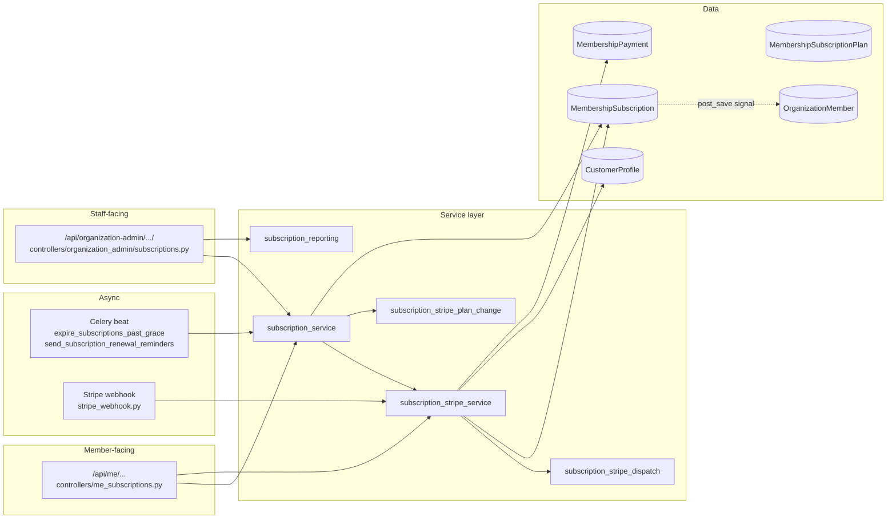

# Membership Subscriptions

Revel lets organizations charge recurring membership fees, with two collection
modes that share one local state machine:

- **OFFLINE**: Staff records payments by hand (cash, bank transfer, anything
  non-Stripe). The grace-expiry Celery beat task drives the state machine.
- **ONLINE**: Stripe Subscriptions on the org's Connect account. Stripe drives
  the state machine via webhooks; the local row mirrors what Stripe says.

The split is captured in [ADR-0011](../adr/0011-membership-subscriptions-offline-online-hybrid.md);
the Stripe Connect model is captured in [ADR-0012](../adr/0012-stripe-connect-direct-charges-subscriptions.md);
the revival flow rules are captured in [ADR-0013](../adr/0013-subscription-terminal-states-and-revival.md);
the dunning + audit choices are captured in [ADR-0014](../adr/0014-reactive-dunning-and-simple-history-audit.md).

## Architecture Overview



## Data Model

All in `src/events/models/subscription.py`. Re-exported via
`events/models/__init__.py`.

### `MembershipSubscriptionPlan`

| Field | Notes |
|---|---|
| `tier` | FK to `MembershipTier` — multiple plans per tier (Monthly, Annual, …) |
| `name`, `description` | Operator-controlled |
| `price`, `currency` | `Decimal(10,2)` + ISO 4217. Currency is validated against the platform's supported list |
| `period_unit`, `period_count` | Rolling cadence only: `(MONTH, 1)`, `(MONTH, 3)`, `(YEAR, 1)`, … |
| `is_active` | Archived (`False`) plans are hidden from public listings but keep their FKs |
| `payment_method` | `OFFLINE` (default) or `ONLINE`. **Not patchable** — see ADR-0011 |
| `stripe_product_id`, `stripe_price_id` | Provisioned lazily by `ensure_stripe_price` on the org's Connect account |
| `history` | `simple_history` audit table |

Constraint: `unique_plan_name_per_tier(tier, name)`.

### `MembershipSubscription`

| Field | Notes |
|---|---|
| `user`, `plan`, `organization` | `organization` is denormalized for permission/query simplicity; `clean()` enforces `plan.tier.organization_id == organization_id` |
| `status` | See [State Machine](#state-machine) |
| `current_period_start` / `current_period_end` | Driven by `record_payment` (OFFLINE) or `invoice.paid` (ONLINE) |
| `cancel_at_period_end`, `cancelled_at` | Scheduled vs. immediate cancellation |
| `expired_at` | Stamped on every transition into EXPIRED. Drives revival window |
| `stripe_subscription_id` | Unique; nullable. Populated after the Stripe Subscription is created |
| `pending_plan`, `stripe_schedule_id` | Downgrade flow: the schedule's second phase resolves on `customer.subscription.updated` |
| `history` | `simple_history` audit table |

Class attribute `TERMINAL_STATUSES = frozenset({"cancelled", "expired"})` is
the single runtime source of truth. The same tuple
(`_TERMINAL_STATUS_VALUES`) is referenced from `Meta.constraints` so the
partial-unique index and the runtime check can never diverge.

Constraints / indexes:

- `one_active_subscription_per_user_org` — partial unique on `(user,
  organization)` excluding terminal statuses. Lets a member create a fresh
  subscription cleanly once a previous one is CANCELLED or EXPIRED.
- `Index(organization, status)` and `Index(user, status)` — list/dashboard
  queries.
- `Index(current_period_end)` — daily scan in the expiry beat task.

### `MembershipPayment`

A payment recorded against a subscription. OFFLINE: created by
`record_payment`. ONLINE: created/upserted by `record_stripe_payment_from_invoice`
on `invoice.paid` / `invoice.payment_failed`. The unique-by-side-effect key
is `stripe_invoice_id` (uses `update_or_create` for webhook idempotency).

### `CustomerProfile`

Per-(user, organization) Stripe Customer reference. Created lazily by
`ensure_customer_profile`. Two constraints keep duplicates out:
`unique_customer_per_user_org(user, org)` and
`unique_stripe_customer_per_org(organization, stripe_customer_id)`.

### `Organization` additions

- `membership_grace_period_days` (default `7`) — how long PAST_DUE lasts
  before EXPIRED.
- `membership_refund_policy` — markdown, displayed to members.
- `membership_subscription_revival_window_days` (default `30`) — how long
  after `expired_at` revival is allowed. `0` disables revival entirely.

## State Machine

```text
                    record_payment
PENDING ─────────────────────────────────► ACTIVE ◄───────────────────┐
   │ (ONLINE: invoice.paid)                  │ ▲                       │
   │                                         │ │ resume                │ record_payment / invoice.paid
   │                                pause    ▼ │                       │
   │                                       PAUSED                      │
   │                                                                   │
ACTIVE  ──(period_end<now, !cancel_at_period_end, Celery)──► PAST_DUE ─┘
ACTIVE  ──(period_end<now, cancel_at_period_end=True, Celery)──► EXPIRED  (terminal)
PAST_DUE ──(period_end + grace_days < now, Celery)──► EXPIRED            (terminal)

ACTIVE/PAUSED ──(cancel_subscription, immediate=True)──► CANCELLED       (terminal)
ACTIVE/PAUSED/PAST_DUE ──(cancel_subscription, immediate=False)──► (unchanged, cancel_at_period_end=True)

EXPIRED ──(revive_subscription within window)──► ACTIVE (OFFLINE) / PENDING (ONLINE, awaits invoice.paid)
```

Key invariants:

- Terminal subscriptions (`CANCELLED`, `EXPIRED`) **never** advance their
  period. `record_payment` raises 400; `_apply_stripe_price_swap`
  short-circuits.
- Subscription tier wins over member tier on the `OrganizationMember` sync
  signal — see [Member Sync](#member-sync).
- ONLINE subscriptions in PENDING do **not** grant ACTIVE membership. The
  member is only synced ACTIVE once Stripe confirms the first invoice (or
  the Stripe webhook reports `status=active`).

## Service Layer

### `events/service/subscription_service.py`

Function-based service that owns the OFFLINE flow and the dispatch layer for
ONLINE operations. Imports `subscription_stripe_service` lazily inside
functions to avoid a cycle.

| Function | Responsibility |
|---|---|
| `create_plan` / `update_plan` / `archive_plan` / `delete_plan` | Plan CRUD. ONLINE plans trigger `ensure_stripe_price`. Currency edits are refused when active subs exist. `delete_plan` catches `ProtectedError` from the FK |
| `create_subscription` | Refuses BANNED users and duplicate non-terminal subs; auto-creates an `OrganizationMember` at `plan.tier`. OFFLINE only — ONLINE goes via `start_online_subscription` so the user can confirm payment |
| `record_payment` | Advances `current_period_*`, revives PENDING/PAST_DUE → ACTIVE. Refuses terminal. Dispatches `RENEWAL_SUCCEEDED` only on a real renewal (prior_status ∈ {ACTIVE, PAST_DUE}). `dispatch_renewal_notification=False` for revival callers |
| `cancel_subscription` | `immediate=True` → CANCELLED. `immediate=False` → `cancel_at_period_end=True` and let the beat task finish it. Refuses scheduled cancel on PAUSED (frozen time would never reach the boundary). Routes ONLINE through `cancel_online_subscription` |
| `pause_subscription` / `resume_subscription` | Local for OFFLINE; routes to Stripe `pause_collection` for ONLINE. Refuses ONLINE without `stripe_subscription_id` to keep local PAUSED in lockstep with Stripe |
| `revive_subscription` | EXPIRED → ACTIVE (OFFLINE, with `initial_payment`) or PENDING + fresh Stripe Subscription (ONLINE). Stripe call runs outside the row lock |
| `change_plan` | Routes ONLINE to `subscription_stripe_plan_change.change_online_plan`; OFFLINE does an immediate same-org/same-currency swap |
| `migrate_plan_subscribers` | Force-migrates non-terminal subs on a plan to its current Stripe price (`proration_behavior='none'`). Per-sub errors are reported individually; no rollback. Batches the "previous price" lookup with `DISTINCT ON` to avoid N+1 |
| `refund_payment` | Marks payment REFUNDED. If the refund fully covers the current period → calls `cancel_subscription(immediate=True)` |
| `_dispatch_*` | Private notification helpers — one per `NotificationType`. Always render via the existing notification dispatcher |

### `events/service/subscription_stripe_service.py`

| Function | Responsibility |
|---|---|
| `ensure_customer_profile` | Get-or-create the per-(user, org) Stripe Customer. Deterministic `idempotency_key=cust:{user}:{org}` |
| `ensure_stripe_price` | Create/refresh Stripe Product+Price for an ONLINE plan. Detects price-input changes (`_price_inputs_changed`) and archives the old Price + creates a new one (Stripe Prices are immutable) |
| `archive_stripe_price` | Deactivates the Stripe Price when a plan is archived — existing subscribers keep paying via their own subscription's price binding |
| `start_online_subscription` | Creates local PENDING row, then Stripe Subscription with `payment_behavior='default_incomplete'`. Returns `client_secret`. Rolls back the local row if Stripe fails or returns no confirmable PaymentIntent |
| `create_revival_subscription` | Provisions a fresh Stripe Subscription for an EXPIRED row. Idempotency key scoped to `expired_at`. The old `stripe_subscription_id` survives in `historical_membership_subscription` |
| `cancel_online_subscription`, `pause_online_subscription`, `resume_online_subscription` | Stripe mutations + local mirror. The dispatch helpers in `subscription_service` cover the OFFLINE-equivalent local-only behavior |
| `update_subscription_price` | Single-call Stripe price swap used by `migrate_plan_subscribers`. `proration_behavior='none'` — new price takes effect at the next renewal |
| `create_billing_portal_session` | Customer Portal URL on the org's Connect account. **Requires** an existing `CustomerProfile` (404 otherwise) — only members who have actually subscribed can get a portal session |
| `sync_subscription_from_stripe` | Mirrors `customer.subscription.{created,updated,deleted}` payloads. Uses `_resolve_target_status` (terminal wins over `pause_collection`), `_apply_period_dates`, and `_apply_stripe_price_swap` (terminal rows frozen) |
| `record_stripe_payment_from_invoice` | Upserts the `MembershipPayment` row on `invoice.paid` / `invoice.payment_failed`. `update_or_create(stripe_invoice_id=...)` is the idempotency anchor |

### `events/service/subscription_stripe_plan_change.py`

Extracted from `subscription_stripe_service.py` to stay under the 1000-line
file limit. All plan-change logic for ONLINE subs:

- `_classify_plan_change` normalizes both prices to a per-month figure
  (`_monthly_equivalent_price`) before comparing, so a Monthly →
  Annual swap is classified on per-month cost, not raw headline price.
- `_upgrade_online_subscription` (more expensive per month): immediate Stripe
  `Subscription.modify` with `proration_behavior='create_prorations'` and
  `payment_behavior='allow_incomplete'`. Local plan is swapped synchronously
  so the API response reflects the change without waiting for the webhook.
- `_downgrade_online_subscription` (cheaper or equal per month): Stripe
  `SubscriptionSchedule` with two phases (current price for the rest of the
  period; new price after). `end_behavior='release'` falls back to a normal
  rolling renewal once the second phase consumes its single iteration. Local
  row carries `pending_plan` + `stripe_schedule_id` until the phase
  transition arrives via `customer.subscription.updated`, at which point
  `_apply_stripe_price_swap` clears both fields.

### `events/service/subscription_stripe_dispatch.py`

Notification dispatch helpers for the Stripe sync/invoice code paths.
Holds the gates that prevent double-firing on re-delivered webhooks:

- `_dispatch_sync_notifications` — gated on transitions captured by
  `prior_status` / `prior_cap` snapshots.
- `_dispatch_invoice_notifications` — gated on `payment_created` (from
  `update_or_create`) and `prior_status` so the first invoice of a brand-new
  subscription does not fire `RENEWAL_SUCCEEDED`.

### `events/service/subscription_reporting.py`

Per-organization metrics for the admin dashboard:

- **`active_count`** = ACTIVE + PAST_DUE (still-paying customers).
- **`mrr`** = sum of `_monthly_equivalent(plan)` over `active_count` subs.
  Annual plans divide by `period_count * 12`. The sum is quantized **once**
  at the end (`Decimal("0.01")`) to avoid accumulated rounding drift.
- **`mrr_currency`** = the shared currency, or `"MIXED"` (with
  `mixed_currency_warning=True` and `mrr=0`) if the org has subs in
  multiple currencies.
- **`churned_30d`** = subs that transitioned to CANCELLED/EXPIRED in the
  last 30 days (`cancelled_at >= cutoff OR expired_at >= cutoff`).
- **`churn_rate_30d`** = `churned_30d / (active_count + churned_30d)` —
  intentional approximation; see Phase 4 spec §9.

A single aggregate query produces the status breakdown; the MRR loop uses
`select_related("plan")` to avoid N+1.

### `events/utils/subscription_periods.py`

Pure utilities:

- `calculate_period_end(period_start, plan)` — uses
  `dateutil.relativedelta` so Jan 31 + 1 month → Feb 28/29 behaves
  correctly. Explicit branch on `plan.period_unit` (`MONTH` / `YEAR`) so a
  future unit isn't silently treated as months.
- `REMINDER_DAYS = 3` — used by the renewal-reminder beat task.

## Permissions

A new `manage_subscriptions` permission on `PermissionMap` (default: owner ✓,
staff ✓, member ✗). Used by `OrganizationPermission("manage_subscriptions")`
on the admin controller. Members access their own subscriptions through the
JWT-authenticated `MeSubscriptionsController` (no permission gate; `self.user()`
scopes every query).

## Member Sync (signal)

`events/signals.py::sync_member_from_subscription` listens to `post_save` on
`MembershipSubscription`:

| Subscription status | OrganizationMember status |
|---|---|
| PENDING (ONLINE) | unchanged — waits for `invoice.paid` |
| PENDING (OFFLINE) / ACTIVE / PAST_DUE | ACTIVE |
| PAUSED | PAUSED |
| CANCELLED / EXPIRED | CANCELLED |

Rules baked into the signal:

- **Never creates a member.** Creation lives in
  `create_subscription` (OFFLINE) or `_ensure_active_member` (ONLINE,
  gated on the first paid invoice).
- **Leaves BANNED alone.** A banned member stays banned regardless of
  subscription activity.
- **Subscription tier wins.** `member.tier` is updated to `plan.tier` on
  every sync.
- **Older terminal rows do not clobber.** If a newer non-terminal sub
  exists for the same (user, org), the signal returns early — re-saving a
  historical CANCELLED row from the admin must not flip the user back to
  CANCELLED.

## Async Surface

### Celery beat tasks

| Task | Schedule | Purpose |
|---|---|---|
| `events.expire_subscriptions_past_grace` | Daily (migration `0070`) | ACTIVE lapsed → PAST_DUE (or EXPIRED with `cancel_at_period_end`); PAST_DUE past grace → EXPIRED. Dispatches `PAYMENT_FAILED` and `SUBSCRIPTION_EXPIRED` for OFFLINE subs |
| `events.send_subscription_renewal_reminders` | Daily (migration `0074`) | Fires `SUBSCRIPTION_RENEWAL_REMINDER` for ACTIVE subs whose `current_period_end.date() == today + REMINDER_DAYS` and `cancel_at_period_end=False` |

Both tasks iterate IDs (`values_list("id", flat=True).iterator()`) and
re-load each row under `select_for_update + select_related(...)` so concurrent
`record_payment` calls or webhook updates cannot be clobbered. Preconditions
are re-checked inside the lock.

### Stripe webhooks

`events/service/stripe_webhooks.py` dispatches subscription events to
`subscription_stripe_service`:

| Event | Handler |
|---|---|
| `customer.subscription.created` / `.updated` / `.deleted` | `sync_subscription_from_stripe` |
| `invoice.paid` | `record_stripe_payment_from_invoice(..., succeeded=True)` |
| `invoice.payment_failed` | `record_stripe_payment_from_invoice(..., succeeded=False)` |
| `charge.refunded` | If a `MembershipPayment` matches the `payment_intent_id`, delegates to `_handle_subscription_refund` → `subscription_service.refund_payment`. Partial refunds against subscriptions are ignored (logged); only fully refunded charges flip the row to REFUNDED |

The webhook endpoint listens to Connect events (see
[Billing & VAT](billing-and-vat.md) for the "platform vs. connected" caveat).

## API Surface

### Member-facing (`/api/me/...`)

| Method | Path | Purpose |
|---|---|---|
| GET | `/membership-subscriptions` | List the caller's subscriptions across orgs |
| GET | `/organizations/{org_id}/subscription` | Caller's current non-terminal sub in this org |
| POST | `/organizations/{org_id}/subscribe` | Start an ONLINE subscription. Returns `client_secret` for Stripe.js |
| POST | `/organizations/{org_id}/subscription/cancel` | Self-cancel; `immediate` flag |
| POST | `/organizations/{org_id}/subscription/change-plan` | Self-service plan change (direction inferred from price delta) |
| POST | `/organizations/{org_id}/subscription/revive` | Revive own EXPIRED sub within the org's revival window |
| POST | `/organizations/{org_id}/billing-portal` | Stripe Customer Portal session URL. `return_url` validated as `HttpUrl` |

### Staff-facing (`/api/organization-admin/{slug}/...`)

Guarded by `OrganizationPermission("manage_subscriptions")`.

| Method | Path | Purpose |
|---|---|---|
| GET | `/subscriptions/metrics` | Per-org MRR / churn / status breakdown |
| GET / POST | `/tiers/{tier_id}/plans` | List / create plans on a tier |
| PATCH | `/plans/{plan_id}` | Edit plan (currency edits refused with active subs) |
| POST | `/plans/{plan_id}/archive` | `is_active = False` |
| DELETE | `/plans/{plan_id}` | Hard-delete (`ProtectedError` if subs reference it) |
| POST | `/plans/{plan_id}/migrate-subscribers` | Force-migrate non-terminal subs to the plan's current price |
| GET | `/subscriptions` | Paginated, searchable list of all subs in the org |
| GET | `/subscriptions/{sub_id}` | Single sub |
| POST | `/subscriptions` | Create OFFLINE sub on behalf of a user (refuses ONLINE plans — the member must subscribe themselves) |
| POST | `/subscriptions/{sub_id}/payments` | Record OFFLINE payment (refuses ONLINE) |
| POST | `/subscriptions/{sub_id}/cancel` / `pause` / `resume` / `revive` | Lifecycle ops; route ONLINE through Stripe service |
| POST | `/payments/{payment_id}/refund` | Mark payment REFUNDED. If full refund of current period → auto-cancel |

## Notifications

Six new types (`notifications/enums.py`), each with email, in-app, and
Telegram templates under `notifications/templates/notifications/{email,in_app,telegram}/`:

- `SUBSCRIPTION_RENEWAL_SUCCEEDED` — true renewals only (prior_status ∈
  {ACTIVE, PAST_DUE}). Suppressed for first payment and revival payments.
- `SUBSCRIPTION_PAYMENT_FAILED` — ONLINE: `invoice.payment_failed` webhook.
  OFFLINE: `ACTIVE → PAST_DUE` in the beat task.
- `SUBSCRIPTION_EXPIRED` — Terminal transition. Includes a revival CTA URL
  only when the window applies.
- `SUBSCRIPTION_CANCELLATION_CONFIRMED` — Local row transition only. Webhook
  does not re-dispatch when the local flag was already set.
- `SUBSCRIPTION_RENEWAL_REMINDER` — Beat task at `period_end - 3 days`.
- `SUBSCRIPTION_PRICE_MIGRATION_NOTICE` — Per affected sub in
  `migrate_plan_subscribers`. Skipped when the subscriber's last payment
  matched the new price already.

Per-type opt-out via `UserNotificationPreference`. The Phase 4 migration
back-fills default-on preferences for the six new types across all existing
users.

## Migrations

| Migration | Purpose |
|---|---|
| `0070_organization_membership_grace_period_days_and_more` | Phase 1: plan / subscription / payment models + `manage_subscriptions` permission + daily beat task `events.expire_subscriptions_past_grace` |
| `0071_subscription_stripe_fields` | Phase 2: `payment_method`, `stripe_product_id`, `stripe_price_id`, `stripe_subscription_id`, `CustomerProfile` |
| `0072_subscription_pending_plan_and_schedule` | Phase 3: `pending_plan`, `stripe_schedule_id` |
| `0073_phase4_subscriptions` | Phase 4: `expired_at`, `membership_subscription_revival_window_days`, `HistoricalRecords` for the four subscription models |
| `0074_subscription_renewal_reminder_beat` | Phase 4: daily `events.send_subscription_renewal_reminders` periodic task |

## Audit

`HistoricalRecords()` on `MembershipSubscriptionPlan`,
`MembershipSubscription`, `MembershipPayment`, and `CustomerProfile`. The
admin classes use `SimpleHistoryAdmin` for a "History" tab with row diffs.
History starts at first save after the Phase 4 migration; no backfill. See
[ADR-0014](../adr/0014-reactive-dunning-and-simple-history-audit.md).

## Cross-references

- [Service Layer](service-layer.md) — hybrid function/class service pattern
  this system follows.
- [Billing & VAT](billing-and-vat.md) — Stripe Connect webhook caveat,
  platform fee model, attendee invoicing (ticket-side, not subscription-side).
- [Permissions](permissions.md) — `OrganizationPermission` mechanics that
  the staff subscription endpoints inherit.
- [Notifications](notifications.md) — dispatcher and channel selection used
  by the six subscription notification types.
- ADRs: [0011](../adr/0011-membership-subscriptions-offline-online-hybrid.md),
  [0012](../adr/0012-stripe-connect-direct-charges-subscriptions.md),
  [0013](../adr/0013-subscription-terminal-states-and-revival.md),
  [0014](../adr/0014-reactive-dunning-and-simple-history-audit.md).
