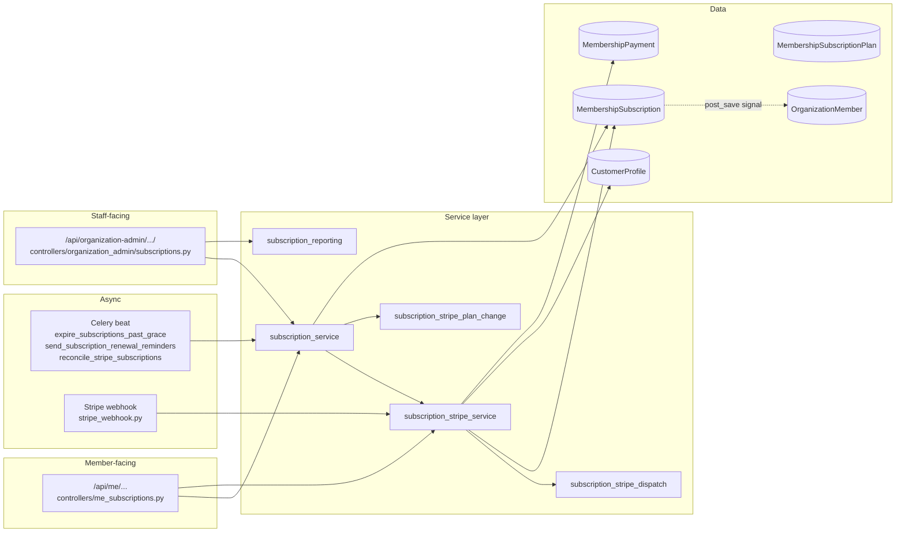

# Membership Subscriptions

Revel lets organizations charge recurring membership fees, with three collection
modes that share one local state machine:

- **OFFLINE**: Staff records payments by hand (cash, bank transfer, anything
  non-Stripe). The grace-expiry Celery beat task drives the state machine.
- **ONLINE**: Stripe Subscriptions on the org's Connect account. Stripe drives
  the state machine via webhooks; the local row mirrors what Stripe says.
- **FREE** (#832): no money at all. Members self-subscribe and the row lands
  ACTIVE immediately — no Stripe object, no checkout, nothing to collect. FREE
  plans are necessarily `LIFETIME`, so nothing ever renews or lapses either.
  This is the "free but *gated*" membership: the tier's questionnaire and
  manual-approval gates still have to pass, which is the whole reason the mode
  exists (a plan-less tier joins through `/apply`, which cannot enforce a
  subscription cap or a paused sale).

The split is captured in [ADR-0012](../adr/0012-membership-subscriptions-offline-online-hybrid.md);
the Stripe Connect model is captured in [ADR-0013](../adr/0013-stripe-connect-direct-charges-subscriptions.md);
the revival flow rules are captured in [ADR-0014](../adr/0014-subscription-terminal-states-and-revival.md);
the dunning + audit choices are captured in [ADR-0015](../adr/0015-reactive-dunning-and-simple-history-audit.md).

## Architecture Overview


```mermaid
flowchart LR
    subgraph Members["Member-facing"]
        MeAPI["/api/me/...<br>controllers/me_subscriptions.py"]
    end

    subgraph Staff["Staff-facing"]
        AdminAPI["/api/organization-admin/.../<br>controllers/organization_admin/subscriptions.py"]
    end

    subgraph Services["Service layer"]
        Sub[subscription_service]
        Stripe[subscription_stripe_service]
        PlanChange[subscription_stripe_plan_change]
        Dispatch[subscription_stripe_dispatch]
        Report[subscription_reporting]
    end

    subgraph Async["Async"]
        Beat["Celery beat<br>expire_subscriptions_past_grace<br>send_subscription_renewal_reminders<br>reconcile_stripe_subscriptions"]
        Webhook["Stripe webhook<br>stripe_webhook.py"]
    end

    subgraph Data["Data"]
        Plan[(MembershipSubscriptionPlan)]
        SubModel[(MembershipSubscription)]
        Pay[(MembershipPayment)]
        Cust[(CustomerProfile)]
        Member[(OrganizationMember)]
    end

    MeAPI --> Sub
    MeAPI --> Stripe
    AdminAPI --> Sub
    AdminAPI --> Report
    Sub --> Stripe
    Sub --> PlanChange
    Stripe --> Dispatch
    Sub --> SubModel
    Stripe --> SubModel
    Stripe --> Cust
    Stripe --> Pay
    Beat --> Sub
    Webhook --> Stripe
    SubModel -.post_save signal.-> Member
```

## Data Model

All in `src/events/models/subscription.py`. Re-exported via
`events/models/__init__.py`.

### `MembershipSubscriptionPlan`

| Field | Notes |
|---|---|
| `tier` | FK to `MembershipTier` — multiple plans per tier (Monthly, Annual, …) |
| `name`, `description` | Operator-controlled |
| `price`, `currency` | `Decimal(10,2)` + ISO 4217. Currency is validated against the platform's supported list. Bound to `payment_method` — see the shape rules below |
| `period_unit`, `period_count` | Rolling cadence — `(MONTH, 1)`, `(MONTH, 3)`, `(YEAR, 1)`, … — **or** `LIFETIME`, a non-renewing term. `LIFETIME` ignores `period_count`, leaves `current_period_end` NULL forever, and is therefore invisible to every renewal/lapse/expiry beat (they all filter on that column, which SQL NULL never matches) |
| `is_active` | Archived (`False`) plans are hidden from public listings but keep their FKs |
| `sales_status` | `OPEN` (default) / `PAUSED`. Pausing stops **member self-service** sales (subscribe, revive, switching into the plan) without touching existing subscribers; staff endpoints bypass it. Orthogonal to archiving: archived = retired, paused = temporarily closed |
| `max_subscriptions` | Cap on concurrent **non-terminal** subscriptions (the venue's "card stock"). `NULL` = unlimited. Counted live under a plan-row lock, so slots reclaim automatically when a subscription terminalizes — no counter to drift. Hard limit: applies to staff too |
| `payment_method` | `OFFLINE` (default), `ONLINE`, or `FREE`. **Not patchable** — see ADR-0012 |
| `stripe_product_id`, `stripe_price_id` | Provisioned lazily by `ensure_stripe_price` on the org's Connect account. Always empty for OFFLINE and FREE |
| `history` | `simple_history` audit table |

Constraint: `unique_plan_name_per_tier(tier, name)`.

#### Plan shape rules

`payment_method` constrains `price` and `period_unit`. Enforced once in
`events/utils/subscription_plan_rules.py:validate_plan_shape`, called from both
`PlanCreateSchema` (422 at create) and `subscription_service.update_plan` (400
at patch, against the *merged* post-patch values) so the two cannot drift.

| `payment_method` | `price` | `period_unit` | Why |
|---|---|---|---|
| `OFFLINE` | ≥ 0 | any, incl. `LIFETIME` | Staff settle off-book; `LIFETIME` expresses a one-off paid membership |
| `ONLINE` | > 0 | `MONTH` / `YEAR` only | Stripe has nothing to bill at 0, and its recurring intervals are month/year — a paid lifetime membership is expressible as OFFLINE, which has no Stripe object |
| `FREE` | = 0 | `LIFETIME` only | A finite free term would be selected by the lapse beat and expire with no way to renew (there is no payment to record) |

#### Sale controls

`ensure_plan_on_sale` (PAUSED check, member paths only — staff callers pass
`enforce_sales_status=False`) and `ensure_plan_sales_capacity` (cap check,
everyone) live in `subscription_service` and are enforced on **create**,
**revive** and **plan switches**. The capacity check `select_for_update`s the
plan row so concurrent creations serialize, mirroring the capacity-reclaim
invariants of ticket tiers. The public plan schema exposes `sales_status` and a
computed `sold_out` flag so the frontend can render "sold out" vs "sales
paused" vs a normal subscribe CTA.

### `MembershipSubscription`

| Field | Notes |
|---|---|
| `user`, `plan`, `organization` | `organization` is denormalized for permission/query simplicity; `clean()` enforces `plan.tier.organization_id == organization_id` |
| `status` | See [State Machine](#state-machine) |
| `current_period_start` / `current_period_end` | Driven by `record_payment` (OFFLINE) or `invoice.paid` (ONLINE). On a `LIFETIME` plan `current_period_end` stays **NULL forever** — that NULL is what keeps the beats away from it |
| `cancel_at_period_end`, `cancelled_at` | Scheduled vs. immediate cancellation |
| `expired_at` | Stamped on every transition into EXPIRED. Drives revival window |
| `stripe_subscription_id` | Unique; nullable. Populated after the Stripe Subscription is created |
| `pending_plan`, `stripe_schedule_id` | Downgrade flow: the schedule's second phase resolves on `customer.subscription.updated` |
| `history` | `simple_history` audit table |

Class attribute `TERMINAL_STATUSES = frozenset({"cancelled", "expired"})` is
the single runtime source of truth. The same tuple
(`_TERMINAL_STATUS_VALUES`) is referenced from `Meta.constraints` so the
partial-unique index and the runtime check can never diverge.

Constraints / indexes:

- `one_active_subscription_per_user_org` — partial unique on `(user,
  organization)` excluding terminal statuses. Lets a member create a fresh
  subscription cleanly once a previous one is CANCELLED or EXPIRED.
- `Index(organization, status)` and `Index(user, status)` — list/dashboard
  queries.
- `Index(current_period_end)` — daily scan in the expiry beat task.

### `MembershipPayment`

A payment recorded against a subscription. OFFLINE: created by
`record_payment`. ONLINE: created/upserted by `record_stripe_payment_from_invoice`
on `invoice.paid` / `invoice.payment_failed`. The unique-by-side-effect key
is `stripe_invoice_id` (uses `update_or_create` for webhook idempotency).

### `CustomerProfile`

Per-(user, organization) Stripe Customer reference. Created lazily by
`ensure_customer_profile`. Two constraints keep duplicates out:
`unique_customer_per_user_org(user, org)` and
`unique_stripe_customer_per_org(organization, stripe_customer_id)`.

### `Organization` additions

- `membership_grace_period_days` (default `7`) — how long PAST_DUE lasts
  before EXPIRED.
- `membership_refund_policy` — markdown, displayed to members.
- `membership_subscription_revival_window_days` (default `30`) — how long
  after `expired_at` revival is allowed. `0` disables revival entirely.

## State Machine

```text
                    record_payment
PENDING ─────────────────────────────────► ACTIVE ◄───────────────────┐
   │ (ONLINE: invoice.paid)                  │ ▲                       │
   │                                         │ │ resume                │ record_payment / invoice.paid
   │                                pause    ▼ │                       │
   │                                       PAUSED                      │
   │                                                                   │
ACTIVE  ──(period_end<now, !cancel_at_period_end, Celery)──► PAST_DUE ─┘
ACTIVE  ──(period_end<now, cancel_at_period_end=True, Celery)──► CANCELLED (terminal)
PAST_DUE ──(period_end + grace_days < now, Celery)──► EXPIRED            (terminal)

ACTIVE/PAUSED ──(cancel_subscription, immediate=True)──► CANCELLED       (terminal)
ACTIVE/PAUSED/PAST_DUE ──(cancel_subscription, immediate=False)──► (unchanged, cancel_at_period_end=True)

EXPIRED ──(revive_subscription within window)──► ACTIVE (OFFLINE) / PENDING (ONLINE, awaits invoice.paid)
```

Key invariants:

- Terminal subscriptions (`CANCELLED`, `EXPIRED`) **never** advance their
  period. `record_payment` raises 400; `_apply_stripe_price_swap`
  short-circuits.
- **CANCELLED vs. EXPIRED is the revival discriminator.** EXPIRED means an
  involuntary lapse — `expired_at` is stamped and the org's revival window
  applies. CANCELLED means the member (or staff) chose to stop, whether
  immediately or at the period boundary; `expired_at` stays `NULL` and
  `revive_subscription` refuses the row. A lapsed ACTIVE row with
  `cancel_at_period_end=True` therefore lands **CANCELLED**, not EXPIRED
  (`_terminalize_cancelled_row`), so the member is never offered a "revive?"
  CTA for a cancellation they asked for.
- Subscription tier wins over member tier on the `OrganizationMember` sync
  signal — see [Member Sync](#member-sync).
- ONLINE subscriptions in PENDING do **not** grant ACTIVE membership. The
  member is only synced ACTIVE once Stripe confirms the first invoice (or
  the Stripe webhook reports `status=active`).

## Service Layer

### `events/service/subscription_service.py`

Function-based service that owns the OFFLINE flow and the dispatch layer for
ONLINE operations. Imports `subscription_stripe_service` lazily inside
functions to avoid a cycle.

| Function | Responsibility |
|---|---|
| `create_plan` / `update_plan` / `archive_plan` / `delete_plan` | Plan CRUD. ONLINE plans trigger `ensure_stripe_price`. Currency edits are refused when active subs exist. `delete_plan` catches `ProtectedError` from the FK |
| `create_subscription` | Refuses BANNED users, duplicate non-terminal subs, and cap-full plans (`ensure_plan_sales_capacity`, under the plan-row lock); auto-creates an `OrganizationMember` at `plan.tier`. OFFLINE and FREE only — ONLINE goes via `start_online_subscription` so the user can confirm payment. A FREE plan additionally lands the row **ACTIVE** with `current_period_start=now` and a NULL period end (nothing to pay, nothing to renew) |
| `record_payment` | Advances `current_period_*`, revives PENDING/PAST_DUE → ACTIVE. Refuses terminal. Dispatches `RENEWAL_SUCCEEDED` only on a real renewal (prior_status ∈ {ACTIVE, PAST_DUE}). `dispatch_renewal_notification=False` for revival callers |
| `cancel_subscription` | `immediate=True` → CANCELLED. `immediate=False` → `cancel_at_period_end=True` and let the beat task finish it. Refuses scheduled cancel on PAUSED (frozen time would never reach the boundary). Routes ONLINE through `cancel_online_subscription` |
| `pause_subscription` / `resume_subscription` | Local for OFFLINE; routes to Stripe `pause_collection` for ONLINE. Refuses ONLINE without `stripe_subscription_id` to keep local PAUSED in lockstep with Stripe |
| `revive_subscription` | EXPIRED → ACTIVE (OFFLINE, with `initial_payment` — staff callers only; the member endpoint refuses OFFLINE plans) or PENDING + hosted Checkout for a fresh Stripe Subscription (ONLINE); staff-initiated ONLINE revivals also email the member the checkout link (`SUBSCRIPTION_REVIVAL_CHECKOUT`). Enforces the plan cap (a revived sub re-occupies a slot) and, for member callers, `sales_status` (`enforce_sales_status=False` for staff) |
| `change_plan` | Routes ONLINE to `subscription_stripe_plan_change.change_online_plan`; OFFLINE does an immediate same-org/same-currency swap |
| `migrate_plan_subscribers` | Force-migrates non-terminal subs on a plan to its current Stripe price (`proration_behavior='none'`). Per-sub errors are reported individually; no rollback. Batches the "previous price" lookup with `DISTINCT ON` to avoid N+1 |
| `refund_payment` | (in `subscription_refunds`) Marks payment REFUNDED and stamps `refund_amount` / `refunded_at`. If the refund fully covers the current period → `_cancel_refunded_subscription`, **not** `cancel_subscription(immediate=True)`: the refund callers already hold row locks, so the local row is terminalized (CANCELLED) under the lock and the Stripe-side cancel is deferred to `on_commit` as a best-effort call — never a network call under a row lock |
| `_dispatch_*` | Private notification helpers — one per `NotificationType`. Always render via the existing notification dispatcher |

### `events/service/subscription_stripe_service.py`

| Function | Responsibility |
|---|---|
| `ensure_customer_profile` | Get-or-create the per-(user, org) Stripe Customer. Deterministic `idempotency_key=cust:{user}:{org}` |
| `ensure_stripe_price` | Create/refresh Stripe Product+Price for an ONLINE plan. Detects price-input changes (`_price_inputs_changed`) and archives the old Price + creates a new one (Stripe Prices are immutable) |
| `archive_stripe_price` | Deactivates the Stripe Price when a plan is archived — existing subscribers keep paying via their own subscription's price binding |
| `start_online_subscription` | Refuses PAUSED plans (member path), then creates local PENDING row, then a hosted Checkout Session (`mode='subscription'`) on the org's Connect account. Returns `checkout_url`; the session id lands on `stripe_checkout_session_id` and the Stripe Subscription is only created (and linked via `checkout.session.completed`) when the member completes the session. Rolls back the local row if Stripe fails. An existing PENDING row is resumed (same session `url`) while its session is still `open` on the same plan, expired + cleared when superseded (revival rows revert to EXPIRED instead of deleting the ledger), or answered with a `SubscriptionActivationPendingError` (409, `code=subscription_activation_pending`) when the session already completed and only the activation webhooks are outstanding |
| `create_revival_checkout` | Mints a hosted Checkout Session for a fresh Stripe Subscription on an EXPIRED row (old Stripe sub cancelled first — a failure here fails the revival, since the id is about to be cleared — then `stripe_subscription_id` cleared, row → PENDING). Idempotency key is **per attempt** (`sub-revival:{pk}:{uuid4}`): anchoring it on `expired_at` would repeat the key across retries after an abandoned checkout (which preserves `expired_at`) while the session's `expires_at` is recomputed from `now()` — same key, different params, which Stripe rejects for ~24h. The caller's row lock serializes concurrent attempts, and a `mode=subscription` session only charges on completion, so an orphaned session cannot double-charge. The old `stripe_subscription_id` survives in `historical_membership_subscription` |
| `cancel_online_subscription`, `pause_online_subscription`, `resume_online_subscription` | Stripe mutations + local mirror. The dispatch helpers in `subscription_service` cover the OFFLINE-equivalent local-only behavior |
| `update_subscription_price` | Single-call Stripe price swap used by `migrate_plan_subscribers`. `proration_behavior='none'` — new price takes effect at the next renewal |
| `create_billing_portal_session` | Customer Portal URL on the org's Connect account. **Requires** an existing `CustomerProfile` (404 otherwise) — only members who have actually subscribed can get a portal session |
| `sync_subscription_from_stripe` | Mirrors `customer.subscription.{created,updated,deleted}` payloads. Uses `_resolve_target_status` (terminal wins over `pause_collection`), `_apply_period_dates`, and `_apply_stripe_price_swap` (terminal rows frozen) |
| `record_stripe_payment_from_invoice` | Upserts the `MembershipPayment` row on `invoice.paid` / `invoice.payment_failed`. `update_or_create(stripe_invoice_id=...)` is the idempotency anchor |

### `events/service/subscription_stripe_plan_change.py`

Extracted from `subscription_stripe_service.py` to stay under the 1000-line
file limit. All plan-change logic for ONLINE subs:

- `_classify_plan_change` normalizes both prices to a per-month figure
  (`_monthly_equivalent_price`) before comparing, so a Monthly →
  Annual swap is classified on per-month cost, not raw headline price.
- `_upgrade_online_subscription` (more expensive per month): immediate Stripe
  `Subscription.modify` with `proration_behavior='always_invoice'` and
  `payment_behavior='allow_incomplete'`. Local plan is swapped synchronously
  so the API response reflects the change without waiting for the webhook —
  which is exactly why the proration must be invoiced **on the spot** rather
  than merely queued. `create_prorations` only parks line items on the *next*
  invoice, so the member would hold the pricier tier free for a whole cycle,
  and an immediate cancel (Stripe defaults to `invoice_now=False,
  prorate=False`) would discard the delta outright. If the invoice fails, the
  subscription goes `past_due` and the normal dunning flow takes over; the
  price swap stands either way.
- `_downgrade_online_subscription` (cheaper or equal per month): Stripe
  `SubscriptionSchedule` with two phases (current price for the rest of the
  period; new price after, for a `duration` of one new-plan billing period —
  `iterations` was removed by the pinned Stripe API version).
  `end_behavior='release'` falls back to a normal rolling renewal at the new
  price once that second phase completes. Local
  row carries `pending_plan` + `stripe_schedule_id` until the phase
  transition arrives via `customer.subscription.updated`, at which point
  `_apply_stripe_price_swap` clears both fields.

### `events/service/subscription_stripe_dispatch.py`

Notification dispatch helpers for the Stripe sync/invoice code paths.
Holds the gates that prevent double-firing on re-delivered webhooks:

- `_dispatch_sync_notifications` — gated on transitions captured by
  `prior_status` / `prior_cap` snapshots.
- `_dispatch_invoice_notifications` — gated on `payment_created` (from
  `update_or_create`) and `prior_status` so the first invoice of a brand-new
  subscription does not fire `RENEWAL_SUCCEEDED`.

### `events/service/subscription_reporting.py`

Per-organization metrics for the admin dashboard:

- **`active_count`** = ACTIVE + PAST_DUE (still-paying customers).
- **`mrr`** = sum, over the `active_count` subs, of each sub's monthly
  equivalent. The per-sub amount is **the subscriber's latest successful
  non-proration payment**, falling back to `plan.price` when there is none
  (OFFLINE pre-payment, brand-new rows) — grandfathered ONLINE subscribers
  keep paying their old Stripe price, so `plan.price` alone would overstate
  them, and a one-off proration charge from a plan change is not a recurring
  amount. A single batched `DISTINCT ON` query fetches those amounts, keeping
  the per-sub loop N+1-free. Annual plans divide by `period_count * 12`. The
  sum is quantized **once** at the end (`Decimal("0.01")`) to avoid
  accumulated rounding drift.
- **`mrr_currency`** = the shared currency, or `"MIXED"` (with
  `mixed_currency_warning=True` and `mrr=0`) if the org has subs in
  multiple currencies.
- **`churned_30d`** = subs that transitioned to CANCELLED/EXPIRED in the
  last 30 days (`cancelled_at >= cutoff OR expired_at >= cutoff`).
- **`churn_rate_30d`** = `churned_30d / (active_count + churned_30d)` —
  intentional approximation; see Phase 4 spec §9.

A single aggregate query produces the status breakdown; the MRR loop uses
`select_related("plan")` plus the batched payment lookup above to avoid N+1.
`LIFETIME` plans normalize to **0** monthly: they are one-off, so folding them
into MRR would inflate it permanently off a payment that happens once — or, for
FREE plans, never.

### `events/utils/subscription_periods.py`

Pure utilities:

- `calculate_period_end(period_start, plan)` — uses
  `dateutil.relativedelta` so Jan 31 + 1 month → Feb 28/29 behaves
  correctly. Explicit branch on `plan.period_unit` (`MONTH` / `YEAR`) so a
  future unit isn't silently treated as months. Returns **`None`** for
  `LIFETIME`; callers must propagate that NULL rather than substituting a
  date. (`record_payment` is the one place that needs a non-null value anyway —
  `MembershipPayment.period_end` is `NOT NULL` — so a lifetime payment is
  recorded as the point event it is, `period_end == period_start`, while the
  subscription's own `current_period_end` stays NULL.)
- `REMINDER_DAYS = 3` — used by the renewal-reminder beat task.

## Permissions

A new `manage_subscriptions` permission on `PermissionMap` (default: owner ✓,
staff ✓, member ✗). Used by `OrganizationPermission("manage_subscriptions")`
on the admin controller. Members access their own subscriptions through the
JWT-authenticated `MeSubscriptionsController` (no permission gate; `self.user()`
scopes every query).

## Member Sync (signal)

`events/signals.py::sync_member_from_subscription` listens to `post_save` on
`MembershipSubscription`:

| Subscription status | OrganizationMember status |
|---|---|
| PENDING (ONLINE) | unchanged — waits for `invoice.paid` |
| PENDING (OFFLINE) / ACTIVE / PAST_DUE | ACTIVE |
| PAUSED | PAUSED |
| CANCELLED / EXPIRED | CANCELLED |

Rules baked into the signal:

- **Never creates a member.** Creation lives in
  `create_subscription` (OFFLINE) or `_ensure_active_member` (ONLINE,
  gated on the first paid invoice).
- **Leaves BANNED alone.** A banned member stays banned regardless of
  subscription activity.
- **Subscription tier wins.** `member.tier` is updated to `plan.tier` on
  every sync.
- **Older terminal rows do not clobber.** If a newer non-terminal sub
  exists for the same (user, org), the signal returns early — re-saving a
  historical CANCELLED row from the admin must not flip the user back to
  CANCELLED.

## Async Surface

### Celery tasks

All in `src/events/tasks/subscriptions.py`.

| Task | Schedule | Purpose |
|---|---|---|
| `events.expire_subscriptions_past_grace` | Daily, 04:00 UTC (migration `0070`) | ACTIVE lapsed → **CANCELLED** when `cancel_at_period_end` (chosen cancel: `cancelled_at` stamped, `expired_at` left unset, no notification — `CANCELLATION_CONFIRMED` already fired), else → PAST_DUE; PAST_DUE past grace → EXPIRED. Dispatches `PAYMENT_FAILED` (OFFLINE) and `SUBSCRIPTION_EXPIRED`. ONLINE rows terminalized here are queued for a best-effort Stripe cancel **after** the row locks are released, so Smart Retries stop dunning them |
| `events.send_subscription_renewal_reminders` | Daily, 05:00 UTC (migration `0102`) | Fires `SUBSCRIPTION_RENEWAL_REMINDER` for ACTIVE subs whose `current_period_end.date() == today + REMINDER_DAYS` and `cancel_at_period_end=False`. The target date comes from `timezone.localdate()`, matching the `__date` lookup's local-timezone rendering |
| `events.reconcile_stripe_subscriptions` | Nightly, 03:30 UTC (migration `0103`) | Drift repair: re-retrieves each ONLINE Stripe Subscription and feeds it through `sync_subscription_from_stripe` (Stripe call **outside** the per-row transaction). Also sweeps stale PENDING checkout rows holding a cap slot, and backfills paid invoices whose `invoice.paid` was lost |
| `events.migrate_plan_subscribers` | On demand | Async wrapper for the staff "migrate subscribers" endpoint (one Stripe retrieve+modify per ONLINE subscriber is too slow for a request). Dispatched via `transaction.on_commit`; results are reported through structured logs and the Celery result |
| `events.resync_org_subscription_fees` | On demand | Dispatched by the `vies_service` wrappers when a VAT-status change moves an org's effective fee percent; re-applies `application_fee_percent` on its live Stripe subscriptions (schedule-managed rows are skipped so a pending downgrade isn't dropped) |

The row-walking tasks materialize their id/row lists with **`list()`, never
`.iterator()`** — a server-side cursor cannot survive the per-row commits these
loops perform under PgBouncer transaction pooling (see #458 and
[engineering notes](../engineering-notes.md)). Each row is then re-loaded under
`select_for_update + select_related(...)`, with preconditions re-checked inside
the lock, so concurrent `record_payment` calls or webhook updates cannot be
clobbered.

### Stripe webhooks

`events/service/stripe_webhooks.py` dispatches subscription events to
`subscription_stripe_service`:

| Event | Handler |
|---|---|
| `checkout.session.completed` (`mode=subscription`) | `handle_subscription_checkout_completed` — looks up the local row via `metadata.membership_subscription_id` and links `stripe_subscription_id` from `session.subscription` (the Stripe Subscription only exists once the session completes). Ticket/series-pass sessions keep their existing path |
| `customer.subscription.created` / `.updated` / `.deleted` | `sync_subscription_from_stripe` |
| `invoice.paid` | `record_stripe_payment_from_invoice(..., succeeded=True)` |
| `invoice.payment_failed` | `record_stripe_payment_from_invoice(..., succeeded=False)` |
| `invoice.payment_action_required` | Same as `payment_failed`: an off-session renewal blocked on SCA/3DS keeps the invoice open with no failure event, so this is the only prompt signal to go PAST_DUE and dun the member (the portal link in the notification is where they complete confirmation) |
| `charge.refunded` | If a `MembershipPayment` matches the `payment_intent_id`, delegates to `_handle_subscription_refund` → `subscription_refunds.refund_payment`. Only a **fully** refunded charge flips the row to REFUNDED and triggers the auto-cancel. A partial refund is recorded on the audit fields (`refund_amount`, `refunded_at`, `stripe_refund_id`) while `status` stays SUCCEEDED — the member keeps the period they partly paid for. `amount_refunded` is cumulative, so a later top-up refund reaching the full charge falls through to the full-refund branch |

A monotonicity guard in `record_stripe_payment_from_invoice` protects the
ledger against out-of-order delivery: a late `payment_failed` (Stripe gives no
ordering guarantee, and a failed→retried→paid invoice emits both events) never
downgrades a payment row already recorded as SUCCEEDED.

The webhook endpoint listens to Connect events (see
[Billing & VAT](billing-and-vat.md) for the "platform vs. connected" caveat).

## API Surface

### Member-facing (`/api/me/...`)

| Method | Path | Purpose |
|---|---|---|
| GET | `/membership-subscriptions` | List the caller's subscriptions across orgs |
| GET | `/organizations/{org_id}/subscription` | Caller's current non-terminal sub in this org |
| POST | `/organizations/{org_id}/subscribe` | Start an ONLINE or FREE subscription. Runs the full eligibility gate stack first. **ONLINE**: returns a hosted Stripe Checkout `checkout_url` (redirect flow, same as tickets); an abandoned checkout is resumed — re-subscribing returns the still-open session's URL instead of a 400, or mints a fresh session once the old one expired. **FREE**: `checkout_url` is `null` and the returned subscription is already ACTIVE with the membership granted and any originating application settled COMPLETED — the frontend must branch on the null rather than redirecting |
| POST | `/organizations/{org_id}/subscription/cancel` | Self-cancel; `immediate` flag |
| POST | `/organizations/{org_id}/subscription/change-plan` | Self-service plan change (direction inferred from price delta). Refused into PAUSED or sold-out plans |
| POST | `/organizations/{org_id}/subscription/revive` | Revive own EXPIRED sub within the org's revival window. **ONLINE plans only** — payment is collected by Stripe via the returned `checkout_url`. OFFLINE revival is staff-only (members must never self-record money); members get a 400 directing them to the organization |
| POST | `/organizations/{org_id}/billing-portal` | Stripe Customer Portal session URL. `return_url` validated as `HttpUrl` |

### Staff-facing (`/api/organization-admin/{slug}/...`)

Guarded by `OrganizationPermission("manage_subscriptions")`.

| Method | Path | Purpose |
|---|---|---|
| GET | `/subscriptions/metrics` | Per-org MRR / churn / status breakdown |
| GET / POST | `/tiers/{tier_id}/plans` | List / create plans on a tier |
| PATCH | `/plans/{plan_id}` | Edit plan (currency edits refused with active subs) |
| POST | `/plans/{plan_id}/archive` | `is_active = False` |
| DELETE | `/plans/{plan_id}` | Hard-delete (`ProtectedError` if subs reference it) |
| POST | `/plans/{plan_id}/migrate-subscribers` | Force-migrate non-terminal subs to the plan's current price |
| GET | `/subscriptions` | Paginated, searchable list of all subs in the org |
| GET | `/subscriptions/{sub_id}` | Single sub |
| POST | `/subscriptions` | Create OFFLINE sub on behalf of a user (refuses ONLINE plans — the member must subscribe themselves) |
| POST | `/subscriptions/{sub_id}/payments` | Record OFFLINE payment (refuses ONLINE) |
| POST | `/subscriptions/{sub_id}/cancel` / `pause` / `resume` / `revive` | Lifecycle ops; route ONLINE through Stripe service |
| POST | `/payments/{payment_id}/refund` | Mark payment REFUNDED. If full refund of current period → auto-cancel |

## Notifications

Seven new types (`notifications/enums.py`), each with email, in-app, and
Telegram templates under `notifications/templates/notifications/{email,in_app,telegram}/`:

- `SUBSCRIPTION_RENEWAL_SUCCEEDED` — true renewals only (prior_status ∈
  {ACTIVE, PAST_DUE}). Suppressed for first payment and revival payments.
- `SUBSCRIPTION_PAYMENT_FAILED` — ONLINE: `invoice.payment_failed` webhook.
  OFFLINE: `ACTIVE → PAST_DUE` in the beat task.
- `SUBSCRIPTION_EXPIRED` — Terminal transition. Includes a revival CTA URL
  only when the window applies.
- `SUBSCRIPTION_CANCELLATION_CONFIRMED` — Local row transition only. Webhook
  does not re-dispatch when the local flag was already set.
- `SUBSCRIPTION_RENEWAL_REMINDER` — Beat task at `period_end - 3 days`.
- `SUBSCRIPTION_PRICE_MIGRATION_NOTICE` — Per affected sub in
  `migrate_plan_subscribers`. Skipped when the subscriber's last payment
  matched the new price already.
- `SUBSCRIPTION_REVIVAL_CHECKOUT` — Staff-initiated ONLINE revival: staff
  cannot pay on the member's behalf, so the member is emailed the hosted
  Checkout link to complete the renewal themselves.

Per-type opt-out via `UserNotificationPreference`. The Phase 4 migration
back-fills default-on preferences for the seven new types across all existing
users.

## Migrations

| Migration | Purpose |
|---|---|
| `0101_memberships_subscriptions_integration` | Single squashed schema migration for the whole stack: eligibility-pipeline fields (org/tier questionnaire + approval knobs, application statuses, partial unique index), Phase 2–4 subscription fields (`CustomerProfile`, Stripe ids, `pending_plan`, `expired_at`, history tables) and the sale controls (`sales_status`, `max_subscriptions`) |
| `0102_subscription_renewal_reminder_beat` | Data migration: daily `events.send_subscription_renewal_reminders` periodic task (05:00 UTC, an hour after the expiry sweep) |
| `0103_subscription_reconcile_beat` | Data migration: nightly `events.reconcile_stripe_subscriptions` periodic task (03:30 UTC, before the 04:00 expiry sweep) |

(The Phase 1 foundation — plan/subscription/payment models, `manage_subscriptions`
permission, `events.expire_subscriptions_past_grace` beat task — shipped to
`main` earlier and is not part of this branch's migrations.)

## Audit

`HistoricalRecords()` on `MembershipSubscriptionPlan`,
`MembershipSubscription`, `MembershipPayment`, and `CustomerProfile`. The
admin classes use `SimpleHistoryAdmin` for a "History" tab with row diffs.
History starts at first save after the Phase 4 migration; no backfill. See
[ADR-0015](../adr/0015-reactive-dunning-and-simple-history-audit.md).

## Cross-references

- [Service Layer](service-layer.md) — hybrid function/class service pattern
  this system follows.
- [Billing & VAT](billing-and-vat.md) — Stripe Connect webhook caveat,
  platform fee model (including subscription platform fees), attendee
  invoicing (ticket-side only).
- [Permissions](permissions.md) — `OrganizationPermission` mechanics that
  the staff subscription endpoints inherit.
- [Notifications](notifications.md) — dispatcher and channel selection used
  by the seven subscription notification types.
- ADRs: [0012](../adr/0012-membership-subscriptions-offline-online-hybrid.md),
  [0013](../adr/0013-stripe-connect-direct-charges-subscriptions.md),
  [0014](../adr/0014-subscription-terminal-states-and-revival.md),
  [0015](../adr/0015-reactive-dunning-and-simple-history-audit.md).
