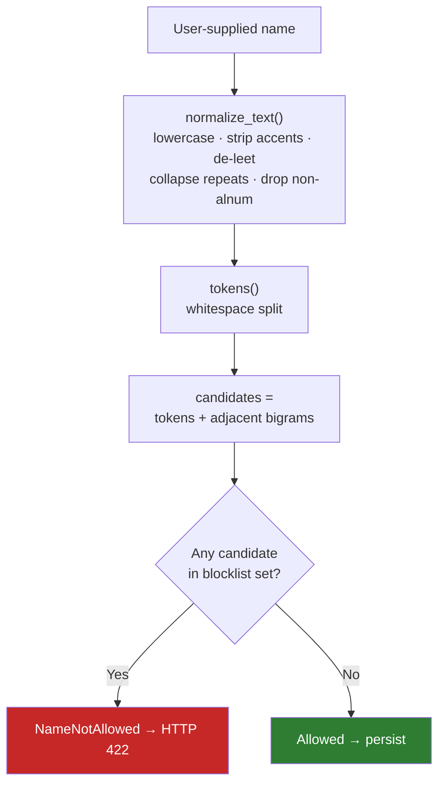

# Content Moderation (Name Blocklist)

Revel ships a small, self-contained **moderation** app that screens user-supplied **names**
against a curated multi-language blocklist before they are persisted. It exists to stop slurs and
abusive terms from entering shared, user-visible vocabularies — today, the free-text **food item**
names that feed dietary-restriction autocomplete.

!!! info "Scope"
    This is a **deterministic, exact-match** name screen — not a general content-moderation or
    LLM-based toxicity classifier. It is intentionally narrow and auditable. Prompt-injection
    defenses for free-text questionnaire answers are a separate system; see
    [Questionnaires → Prompt Injection Protection](questionnaires.md#prompt-injection-protection).

## Where it lives

The app is registered in `INSTALLED_APPS` (`src/revel/settings/base.py`) and has no models or
migrations of its own — the wordlists are flat files on disk.

```
src/moderation/
├── blocklist/
│   ├── normalize.py   # canonicalization (defeat evasion)
│   ├── loader.py      # load + memoize wordlists
│   └── screen.py      # is_blocked() / assert_name_allowed() / NameNotAllowed
└── data/blocklist/
    ├── en.txt
    ├── de.txt
    ├── it.txt
    └── fr.txt
```

## Screening Pipeline



### 1. Normalization (`normalize.py`)

Before matching, both the input name and every blocklist term are pushed through
`normalize_text()`, which canonicalizes text to defeat common evasion tricks:

| Step | Purpose | Example |
|---|---|---|
| Lowercase | Case-insensitive matching | `Foo` → `foo` |
| Unicode NFKD + strip combining marks | Defeat accent/diacritic evasion | `fóò` → `foo` |
| Leet translation | Map common substitutions back to letters | `f00` → `foo` (`3→e 0→o 1→i 4→a 5→s 7→t $→s @→a`) |
| Collapse 3+ repeats | Defeat character padding | `fooooo` → `fo` |
| Drop non-alphanumeric | Remove separator/punctuation evasion | `f-o-o` → `foo` |
| Collapse whitespace | Stable tokenization | `foo   bar` → `foo bar` |

`tokens()` then splits the normalized string on whitespace into a list of tokens.

### 2. Matching (`screen.py`)

`is_blocked()` builds a candidate set and tests it for **exact** membership in the normalized
blocklist:

```python
def is_blocked(text: str, *, wordlist: frozenset[str] | None = None) -> bool:
    words = wordlist if wordlist is not None else load_blocklist()
    if not words:
        return False
    toks = tokens(text)
    candidates = toks + ["".join(pair) for pair in zip(toks, toks[1:])]
    return any(c in words for c in candidates)
```

Candidates are:

1. **Each normalized token**, and
2. **Each adjacent bigram** — neighbouring tokens joined with no separator. This catches a term
   that gets split across two tokens once separators are stripped (e.g. `bad word` → `badword`).

!!! warning "Exact match only — no fuzzy matching"
    Matching is **exact set membership** against the normalized wordlist. There is **no** edit
    distance, substring, or fuzzy matching. A term must normalize to exactly a blocklist entry
    (as a single token or an adjacent bigram) to be blocked. This keeps the screen fast,
    deterministic, and free of false positives — at the cost of not catching every creative
    misspelling. The normalization layer is what absorbs the common evasions.

### 3. Loading (`loader.py`)

`load_blocklist()` reads all four language files (`en`, `de`, `it`, `fr`), skips blank lines and
`#` comments, normalizes each term the same way as input, and returns a single
`frozenset[str]`. The result is memoized with `functools.lru_cache(maxsize=1)`, so the files are
read once per process.

!!! note "Wordlists are reviewed like code"
    The `data/blocklist/*.txt` files are curated and audited; terms are added out-of-band by
    maintainers. Each file is kept minimal and intentionally small.

## The Guard: `assert_name_allowed` / `NameNotAllowed`

The public entry point is `assert_name_allowed(name)`. It raises `NameNotAllowed` — a subclass of
ninja's `HttpError` that renders as **HTTP 422** with a translated message — when the name is
blocked:

```python
class NameNotAllowed(HttpError):
    def __init__(self) -> None:
        super().__init__(422, str(_("This name is not allowed.")))

def assert_name_allowed(name: str) -> None:
    if is_blocked(name):
        raise NameNotAllowed
```

Because `NameNotAllowed` subclasses `HttpError`, it renders directly through ninja's standard
error handling — no per-app exception handler is needed.

## Integration Point

!!! info "Single integration point today"
    The guard is currently wired into **one** place: free-text **food item / dietary restriction
    name creation** in `accounts/controllers/dietary.py`. These are the only endpoints where a user
    types a name into a shared, autocompleted vocabulary, so they are the relevant attack surface.

`assert_name_allowed()` is called at the top of both write paths, **before** any `FoodItem` row is
created:

| Endpoint | Guarded field |
|---|---|
| `POST /api/dietary/food-items` | `payload.name` |
| `POST /api/dietary/restrictions` | `payload.food_item_name` (the food item is auto-created if missing) |

A blocked name returns `422` and **no** `FoodItem` (or `DietaryRestriction`) row is created.
Benign names proceed through the normal `get_or_create_with_race_protection` flow.

## Staff Remediation

The screen is preventative, but the wordlist is deliberately minimal and matching is exact, so
some offensive items can still slip through. When that happens, staff can remove them through the
Django admin: `FoodItem` is registered (`FoodItemAdmin` in `accounts/admin/user.py`) with name
search, and offending rows can be deleted there. (Food items cannot be **added** through the
admin — `has_add_permission` is superuser-only — they are only ever created through the dietary
flow, which is exactly the path the guard protects.)
