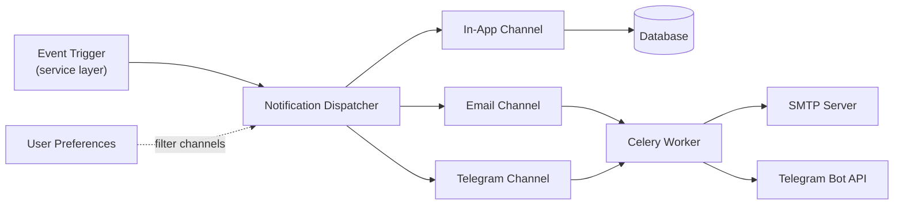

# Notifications

Revel has a multi-channel notification system that delivers messages through **in-app notifications**, **email**, and **Telegram**. The system is designed to be extensible, user-configurable, and respectful of user preferences.

## Architecture



## Channels

| Channel | Delivery | Templates | Notes |
|---|---|---|---|
| **In-App** | Immediate (database) | `notifications/templates/notifications/in_app/` | Stored as model instances, queryable via API |
| **Email** | Async (Celery) | Django email templates | Supports HTML and plain text |
| **Telegram** | Async (Celery) | `notifications/templates/notifications/telegram/` | Markdown-formatted messages via bot |

!!! tip "User preferences control everything"
    Users can configure which channels receive which notification types. The dispatcher respects these preferences before sending. Notifications also support **digest mode** for batching.

## Notification Types

The following notification types are supported across all channels:

### Event Notifications

| Type | Description |
|---|---|
| `event_cancelled` | An event the user RSVP'd to has been cancelled |
| `event_open` | An event is now open for registration |
| `event_reminder` | Reminder before an upcoming event |
| `event_updated` | Event details have changed |

### Invitation & Membership

| Type | Description |
|---|---|
| `invitation_received` | User received an event invitation |
| `invitation_request_created` | Someone requested an invitation (staff notification) |
| `membership_promoted` | User's membership role was upgraded |
| `membership_removed` | User was removed from an organization |
| `membership_request_approved` | Membership request was approved |
| `membership_request_rejected` | Membership request was rejected |
| `membership_request_created` | Someone requested membership (staff notification) |
| `membership_granted` | User was granted membership directly |

### Tickets & Payments

| Type | Description |
|---|---|
| `ticket_created` | Ticket was successfully created |
| `ticket_cancelled` | Ticket was cancelled |
| `ticket_checked_in` | User was checked in at an event |
| `ticket_refunded` | Ticket payment was refunded |
| `ticket_updated` | Ticket details were updated |
| `payment_confirmation` | Payment was processed successfully |
| `rsvp_confirmation` | RSVP was confirmed |
| `rsvp_updated` | RSVP details were updated |
| `rsvp_cancelled` | RSVP was cancelled |

### Waitlist & Availability

| Type | Description |
|---|---|
| `waitlist_spot_available` | A spot opened up on a waitlisted event |

### Questionnaires

| Type | Description |
|---|---|
| `questionnaire_submitted` | A questionnaire submission was received (staff notification) |
| `questionnaire_evaluation_result` | Evaluation result sent to the user |

### Potluck

| Type | Description |
|---|---|
| `potluck_item_created` | A new potluck item was added |
| `potluck_item_created_and_claimed` | A potluck item was added and claimed in one action |
| `potluck_item_claimed` | Someone claimed a potluck item |
| `potluck_item_unclaimed` | A potluck claim was removed |
| `potluck_item_updated` | A potluck item was updated |
| `potluck_item_deleted` | A potluck item was deleted |

### Whitelist Requests

| Type | Description |
|---|---|
| `whitelist_request_created` | User requested whitelist access (staff notification) |
| `whitelist_request_approved` | Whitelist request was approved |
| `whitelist_request_rejected` | Whitelist request was rejected |

### Announcements

| Type | Description |
|---|---|
| `org_announcement` | Organization-wide announcement |

### Following

| Type | Description |
|---|---|
| `new_event_from_followed_org` | A followed organization published a new event |
| `new_event_from_followed_series` | A new event was added to a followed series |
| `organization_followed` | Someone followed an organization (org staff notification) |
| `event_series_followed` | Someone followed an event series (org staff notification) |

## Template Structure

Templates are organized by channel under `src/notifications/templates/notifications/`:

```
notifications/
  templates/
    notifications/
      in_app/
        event_cancelled.md
        event_open.md
        ...
      email/
        event_cancelled.html
        event_cancelled.txt
        ...
      emails/
        digest.html
        digest.txt
      telegram/
        event_cancelled.md
        event_open.md
        ...
```

!!! note "Template formats"
    Both in-app and Telegram templates use Markdown (`.md` files). Email templates use Django's standard template system with `.html` and `.txt` variants.

## User Preferences

Users configure their notification preferences per channel and per type. The preference model supports:

- **Per-channel toggles**: Enable/disable each channel independently
- **Per-type toggles**: Fine-grained control over which notifications to receive
- **Digest mode**: Batch notifications into periodic summaries instead of sending individually

!!! info "Defaults"
    New users receive most notification types on all available channels by default. Exceptions: **potluck notifications** are restricted to in-app only (no email or Telegram) and **guest users** have potluck notifications disabled entirely. Telegram notifications always require the user to have linked their Telegram account.

## Implementation Details

The notification system is implemented in `notifications/service/`, which includes:

- **Dispatcher**: Routes notifications to the appropriate channels based on user preferences
- **Eligibility checks**: Determines which users should receive a given notification (e.g., only attendees of an event)
- **Reminder scheduling**: Schedules event reminders via Celery Beat periodic tasks
- **Digest batching**: Aggregates notifications into periodic digest emails
- **Unsubscribe handling**: Manages per-type and per-channel opt-outs

Notifications are triggered from the service layer via Django signals and direct dispatcher calls. Delivery for email and Telegram channels is always asynchronous via Celery tasks.
