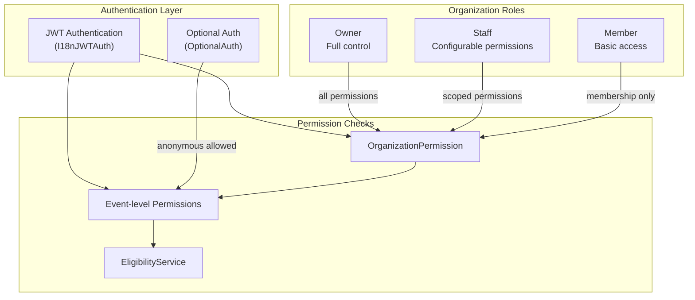
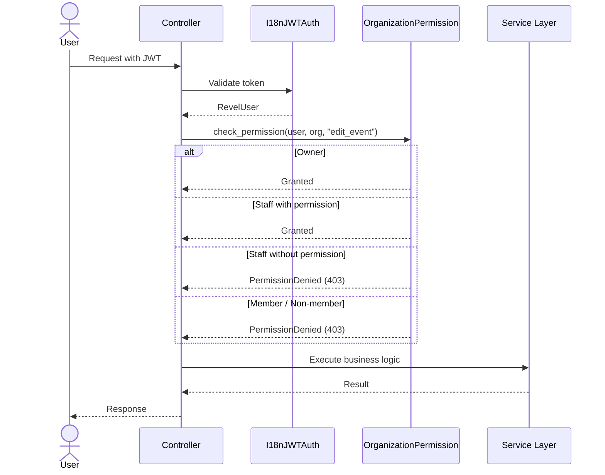

# Permissions & Roles

Revel implements a layered permission system that spans organizations, events, and individual actions. Permissions are enforced at the API layer via custom permission classes and checked in service methods for business logic.

## Permission Hierarchy



## Organization Roles

Every user's relationship with an organization is defined by their **membership role**:

| Role | Description | Permissions |
|---|---|---|
| **Owner** | Organization creator or promoted owner | Full control over all organization resources. Cannot be removed. |
| **Staff** | Trusted team members | Configurable subset of permissions (see below). |
| **Member** | Regular participants | Can view member-only events. No management capabilities. |

!!! info "Role assignment"
    Users become Members by joining an organization (or being approved). Owners can promote Members to Staff and configure their permissions. Only Owners can promote other users to Owner.

## Staff Permissions

Staff members receive a granular set of permissions defined in `PermissionsSchema`. Each permission is a boolean flag:

| Permission | Description |
|---|---|
| `create_event` | Create new events under the organization |
| `edit_event` | Modify existing event details |
| `manage_members` | Approve/reject membership requests, remove members |
| `evaluate_questionnaire` | Review and score questionnaire submissions |
| `check_in_attendees` | Check in ticket holders at events |
| `manage_blacklist` | Add/remove entries from the organization blacklist |
| `manage_whitelist` | Manage whitelist entries for events |
| `manage_potluck` | Manage potluck items and claims |
| `manage_invitations` | Send and revoke event invitations |

!!! note "Permissions are per-organization"
    A user can be Staff in one organization and a Member in another. Permissions do not carry across organizations.

### PermissionsSchema

Permissions are stored as a structured JSON field on the membership model, validated by `PermissionsSchema`:

```python
class PermissionsSchema(Schema):
    create_event: bool = False
    edit_event: bool = False
    manage_members: bool = False
    evaluate_questionnaire: bool = False
    check_in_attendees: bool = False
    manage_blacklist: bool = False
    manage_whitelist: bool = False
    manage_potluck: bool = False
    manage_invitations: bool = False
```

Owners implicitly have **all** permissions -- the schema is only checked for Staff members.

## Authentication

### JWT Authentication (I18nJWTAuth)

The default authentication class. Requires a valid JWT access token in the `Authorization` header. Also handles internationalization by reading the user's preferred language.

```python
@api_controller("/api/events", auth=I18nJWTAuth(), throttle=UserDefaultThrottle())
class EventController(ControllerBase):
    ...
```

### Optional Authentication (OptionalAuth)

For endpoints that work for both authenticated and anonymous users (e.g., viewing public event details):

```python
@route.get("/{event_id}", auth=OptionalAuth())
def get_event(self, event_id: UUID) -> EventDetailSchema:
    # self.user() returns RevelUser or None
    ...
```

!!! warning "Always check for None"
    When using `OptionalAuth`, `self.user()` may return `None`. Guard any user-dependent logic accordingly.

## Permission Classes

### OrganizationPermission

The primary permission checker for organization-scoped actions. Located in `events/permissions.py`:

```python
class OrganizationPermission:
    """Checks if the requesting user has the required permission
    for the target organization."""

    def __init__(self, permission: str) -> None:
        self.permission = permission

    def has_permission(self, user: RevelUser, organization: Organization) -> bool:
        membership = get_membership(user, organization)
        if membership is None:
            return False
        if membership.role == Membership.Role.OWNER:
            return True
        if membership.role == Membership.Role.STAFF:
            return getattr(membership.permissions, self.permission, False)
        return False
```

### Usage in Controllers

```python
@route.post("/{org_id}/events", throttle=WriteThrottle())
def create_event(self, org_id: UUID, payload: EventCreateSchema) -> Event:
    organization = get_object_or_404(Organization, id=org_id)
    check_permission(self.user(), organization, "create_event")  # (1)!
    return event_service.create_event(organization, payload)
```

1. Raises `PermissionDenied` (403) if the user lacks the required permission.

## Event-Level Permissions

Beyond organization roles, events have their own access controls:

| Control | Description |
|---|---|
| **Visibility** | Public events are visible to all. Private events require an invitation. |
| **Members-only** | Restricts participation to organization members (can be waived by invitation). |
| **Questionnaire** | Requires passing a questionnaire before participation. |
| **Max attendees** | Caps event capacity (can be waived by invitation). |
| **RSVP deadline** | Time limit for RSVPs (can be waived by invitation). |

!!! tip "See also"
    The [Eligibility Pipeline](eligibility-pipeline.md) documents how these controls are evaluated in sequence to determine whether a user can participate in an event.

## Permission Flow


