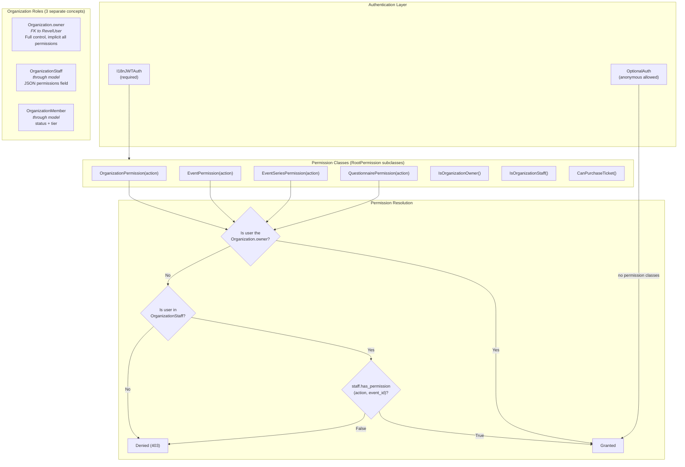
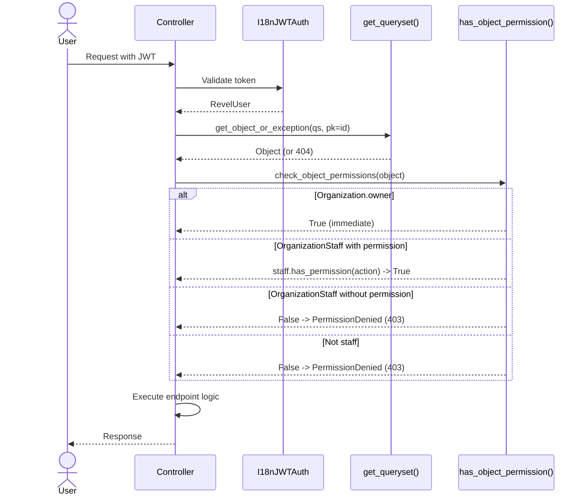

# Permissions & Roles

Revel implements a layered permission system built on three distinct concepts: **organization ownership**, **staff memberships with granular permissions**, and **member memberships with statuses**. Permissions are enforced at the API layer via Django Ninja Extra permission classes that use the `has_object_permission` pattern.

## Permission Hierarchy



## Organization Roles

Revel does **not** use a single `role` field. Instead, a user's relationship with an organization is determined by three independent models:

### 1. Organization Owner (`Organization.owner`)

A direct `ForeignKey` from `Organization` to `RevelUser`. There is exactly one owner per organization.

```python
class Organization(TimeStampedModel, ...):
    owner = models.ForeignKey(
        settings.AUTH_USER_MODEL,
        on_delete=models.PROTECT,
        related_name="owned_organizations",
    )
```

!!! info "Owner privileges"
    The owner **implicitly bypasses all permission checks**. Every permission class checks `organization.owner_id == request.user.id` first and returns `True` immediately if it matches.

### 2. Organization Staff (`OrganizationStaff`)

A **through model** for the `Organization.staff_members` M2M field. Each staff record carries a JSON `permissions` field validated by `PermissionsSchema`.

```python
class OrganizationStaff(TimeStampedModel):
    organization = models.ForeignKey(Organization, on_delete=models.CASCADE)
    user = models.ForeignKey(settings.AUTH_USER_MODEL, on_delete=models.CASCADE)
    permissions = models.JSONField(
        default=_get_default_permissions,
        validators=[_validate_permissions],
    )

    class Meta:
        constraints = [
            models.UniqueConstraint(
                fields=["organization", "user"],
                name="unique_organization_staff",
            )
        ]
```

### 3. Organization Member (`OrganizationMember`)

A **through model** for the `Organization.members` M2M field. Members have a `status` and an optional `tier`.

```python
class OrganizationMember(TimeStampedModel):
    class MembershipStatus(models.TextChoices):
        ACTIVE = "active"
        PAUSED = "paused"
        CANCELLED = "cancelled"
        BANNED = "banned"

    organization = models.ForeignKey(Organization, on_delete=models.CASCADE)
    user = models.ForeignKey(settings.AUTH_USER_MODEL, on_delete=models.CASCADE)
    status = models.CharField(
        default=MembershipStatus.ACTIVE,
        choices=MembershipStatus.choices,
    )
    tier = models.ForeignKey(MembershipTier, on_delete=models.SET_NULL, null=True)
```

| Status | Visibility | Ticket Purchase | Notes |
|---|---|---|---|
| **ACTIVE** | Can see members-only/private orgs | Yes (if tier matches) | Full membership |
| **PAUSED** | Can see members-only/private orgs | Depends on context | Temporarily inactive |
| **CANCELLED** | Treated as no membership | No | As if the record doesn't exist |
| **BANNED** | Cannot see **any** orgs (even public) | No | Total exclusion |

!!! warning "Members have no management permissions"
    `OrganizationMember` does **not** carry any permission flags. Members cannot manage events, tickets, or organization settings. Membership only controls **visibility** and **ticket purchase eligibility**.

## Staff Permissions (`PermissionMap` and `PermissionsSchema`)

Staff permissions are stored as structured JSON on `OrganizationStaff.permissions`, validated by two Pydantic models defined in `events/models/organization.py`:

### `PermissionMap`

A flat set of boolean flags representing individual actions:

| Permission | Default | Description |
|---|---|---|
| `view_organization_details` | `True` | View organization admin details |
| `create_event` | `False` | Create new events |
| `create_event_series` | `False` | Create event series |
| `edit_event_series` | `False` | Edit event series |
| `delete_event_series` | `False` | Delete event series |
| `edit_event` | `True` | Edit existing events |
| `delete_event` | `False` | Delete events |
| `open_event` | `True` | Open an event for registration |
| `manage_tickets` | `True` | Manage ticket tiers and settings |
| `close_event` | `True` | Close event registration |
| `manage_event` | `True` | General event management |
| `check_in_attendees` | `True` | Check in ticket holders |
| `invite_to_event` | `True` | Send event invitations |
| `edit_organization` | `False` | Edit organization settings |
| `manage_members` | `False` | Manage members and membership requests |
| `manage_potluck` | `False` | Manage potluck items |
| `create_questionnaire` | `False` | Create questionnaires |
| `edit_questionnaire` | `False` | Edit questionnaires |
| `delete_questionnaire` | `False` | Delete questionnaires |
| `evaluate_questionnaire` | `True` | Review and score questionnaire submissions |
| `send_announcements` | `False` | Send announcements to members |

### `PermissionsSchema` (with per-event overrides)

Wraps `PermissionMap` with support for **per-event overrides**:

```python
class PermissionsSchema(BaseModel):
    model_config = ConfigDict(extra="forbid")
    default: PermissionMap = Field(default_factory=PermissionMap)
    event_overrides: dict[uuid.UUID, PermissionMap] = Field(default_factory=dict)
```

The JSON stored on `OrganizationStaff.permissions` looks like:

```json
{
  "default": {
    "create_event": false,
    "edit_event": true,
    "check_in_attendees": true,
    ...
  },
  "event_overrides": {
    "550e8400-e29b-41d4-a716-446655440000": {
      "edit_event": false,
      "check_in_attendees": true,
      ...
    }
  }
}
```

!!! tip "Per-event override resolution"
    When checking a permission, `OrganizationStaff.has_permission(permission, event_id)` first looks in `event_overrides[event_id]`. If found, it uses that map. Otherwise, it falls back to `default`.

    ```python
    def has_permission(self, permission: str, event_id: str | None = None) -> bool:
        if event_id:
            event_permissions = self.permissions.get("event_overrides", {}).get(event_id, {})
            if event_permissions:
                return bool(event_permissions.get(permission, False))
        return bool(self.permissions.get("default", {}).get(permission, False))
    ```

## Permission Classes

All permission classes live in `events/controllers/permissions.py` and inherit from `RootPermission`, which itself extends Django Ninja Extra's `BasePermission`.

### `RootPermission` (base class)

```python
class RootPermission(BasePermission):
    def __init__(self, action: str) -> None:
        self.action = action

    def has_permission(self, request, controller) -> bool:
        return True  # Always passes; actual check is in has_object_permission
```

!!! note "Why `has_permission` always returns `True`"
    Django Ninja Extra calls `has_permission` first (request-level), then `has_object_permission` (object-level). The actual authorization logic lives entirely in `has_object_permission`, which receives the resolved object from `get_object_or_exception`.

### Permission Class Reference

| Class | `action` parameter | Object type | Description |
|---|---|---|---|
| `OrganizationPermission(action)` | Any `PermissionMap` field | `Organization` | Checks owner or staff permission on the org |
| `EventPermission(action)` | Any `PermissionMap` field | `Event` | Checks owner or staff permission via `event.organization` |
| `EventSeriesPermission(action)` | Any `PermissionMap` field | `EventSeries` | Checks owner or staff permission via `series.organization` |
| `QuestionnairePermission(action)` | Any `PermissionMap` field | `OrganizationQuestionnaire` | Delegates to `OrganizationPermission` via `questionnaire.organization` |
| `IsOrganizationOwner()` | `"is_owner"` (ignored) | `Organization` | Owner-only; raises `PermissionDenied` for non-owners |
| `IsOrganizationStaff()` | `"is_staff"` (ignored) | `Organization` | Owner **or** any staff member (no specific permission needed) |
| `CanDuplicateEvent()` | `"create_event"` | `Event` | Checks `create_event` via the event's organization |
| `ManagePotluckPermission()` | `"manage_potluck"` | `PotluckItem` | Item creator, org owner, or staff with `manage_potluck` |
| `PotluckItemPermission(action)` | Configurable | `Event` | Owner, staff, or attendee (with special `potluck_open` check) |
| `CanPurchaseTicket()` | `"can_purchase"` | `TicketTier` | Checks sale window + `purchasable_by` eligibility |

### Common Permission Check Pattern

Every action-based permission class follows the same resolution order:

```python
class OrganizationPermission(RootPermission):
    def has_object_permission(self, request, controller, obj: Organization) -> bool:
        # 1. Owner always passes
        if obj.owner_id == request.user.id:
            return True
        # 2. Look up staff membership
        if staff_member := OrganizationStaff.objects.filter(
            organization=obj, user_id=request.user.id,
        ).first():
            # 3. Check specific permission flag
            return staff_member.has_permission(self.action)
        # 4. Not owner, not staff -> denied
        return False
```

## Usage in Controllers

Permissions are wired to endpoints via the `permissions=` parameter on either the `@api_controller` decorator (class-level default) or individual `@route.*` decorators (per-endpoint override).

### Class-Level Permissions

When all endpoints in a controller share the same permission, set it at the class level:

```python
@api_controller(
    "/event-series-admin/{series_id}",
    auth=I18nJWTAuth(),
    permissions=[EventSeriesPermission("edit_event_series")],
    tags=["Event Series Admin"],
    throttle=WriteThrottle(),
)
class EventSeriesAdminController(UserAwareController):
    ...
```

### Per-Endpoint Permissions

Override permissions on specific endpoints when they require different access levels:

```python
@api_controller(
    "/organization-admin/{slug}",
    auth=I18nJWTAuth(),
    tags=["Organization Admin"],
    throttle=WriteThrottle(),
)
class OrganizationAdminCoreController(OrganizationAdminBaseController):
    @route.get(
        "",
        permissions=[IsOrganizationStaff()],  # Any staff can view
        throttle=UserDefaultThrottle(),
    )
    def get_organization(self, slug: str) -> models.Organization:
        return self.get_one(slug)

    @route.put(
        "",
        permissions=[OrganizationPermission("edit_organization")],  # Needs specific permission
    )
    def update_organization(self, slug: str, payload: schema.OrganizationEditSchema):
        organization = self.get_one(slug)
        return update_db_instance(organization, payload)

    @route.post(
        "/stripe/connect",
        permissions=[IsOrganizationOwner()],  # Owner only
    )
    def stripe_connect(self, slug: str, payload: EmailSchema):
        ...
```

### How `get_object_or_exception` Triggers Permission Checks

The `get_object_or_exception` method (inherited from `ControllerBase`) fetches the object from the queryset and then calls `check_object_permissions` against the controller's permission classes. This is why permission classes receive the resolved object in `has_object_permission`.

```python
class EventAdminBaseController(UserAwareController):
    def get_queryset(self) -> QuerySet[models.Event]:
        return models.Event.objects.for_user(self.user(), include_past=True)

    def get_one(self, event_id: UUID) -> models.Event:
        # Fetches object AND runs has_object_permission for all permission classes
        return t.cast(
            models.Event,
            self.get_object_or_exception(self.get_queryset(), pk=event_id),
        )
```



## Authentication

### `I18nJWTAuth`

The default authentication class. Requires a valid JWT access token in the `Authorization` header. Activates the authenticated user's preferred language for the request.

```python
@api_controller("/events", auth=I18nJWTAuth(), throttle=UserDefaultThrottle())
class EventAdminController(UserAwareController):
    ...
```

### `OptionalAuth`

Extends `I18nJWTAuth` for endpoints that work with or without authentication. If no token is present, sets `request.user` to `AnonymousUser` and continues.

```python
@api_controller("/event-series", auth=OptionalAuth(), tags=["Event Series"])
class EventSeriesController(UserAwareController):
    def list_event_series(self, ...):
        # self.maybe_user() returns RevelUser or AnonymousUser
        ...
```

!!! warning "Use `maybe_user()` with `OptionalAuth`"
    When using `OptionalAuth`, call `self.maybe_user()` (returns `RevelUser | AnonymousUser`) instead of `self.user()` (which casts to `RevelUser` unconditionally). Both are defined on `UserAwareController`.

## Ticket Purchase Eligibility

`CanPurchaseTicket` is a specialized permission class that checks both the **sale window** and **audience restrictions** on a `TicketTier`:

| `TicketTier.PurchasableBy` | Who can purchase |
|---|---|
| `PUBLIC` | Anyone |
| `MEMBERS` | Organization members only |
| `INVITED` | Event invitees only |
| `INVITED_AND_MEMBERS` | Members or invitees |

The check order: sale window -> org owner -> org staff -> membership/invitation check.

!!! warning "Membership status not filtered"
    The membership check currently queries `OrganizationMember` without filtering by `status=ACTIVE`. This means paused or cancelled members may still pass the check. This is a known limitation.

## Organization Visibility

Organizations use a `Visibility` enum (from `VisibilityMixin`) that controls who can discover them:

| Visibility | Who can see |
|---|---|
| `PUBLIC` | Everyone (except banned/blacklisted users) |
| `MEMBERS_ONLY` | Active/paused members, staff, and owner |
| `PRIVATE` | Active/paused members, staff, and owner |
| `STAFF_ONLY` | Staff and owner only |

!!! info "See also"
    The [Eligibility Pipeline](eligibility-pipeline.md) documents how event-level access controls (questionnaires, max attendees, RSVP deadlines) are evaluated in sequence.
