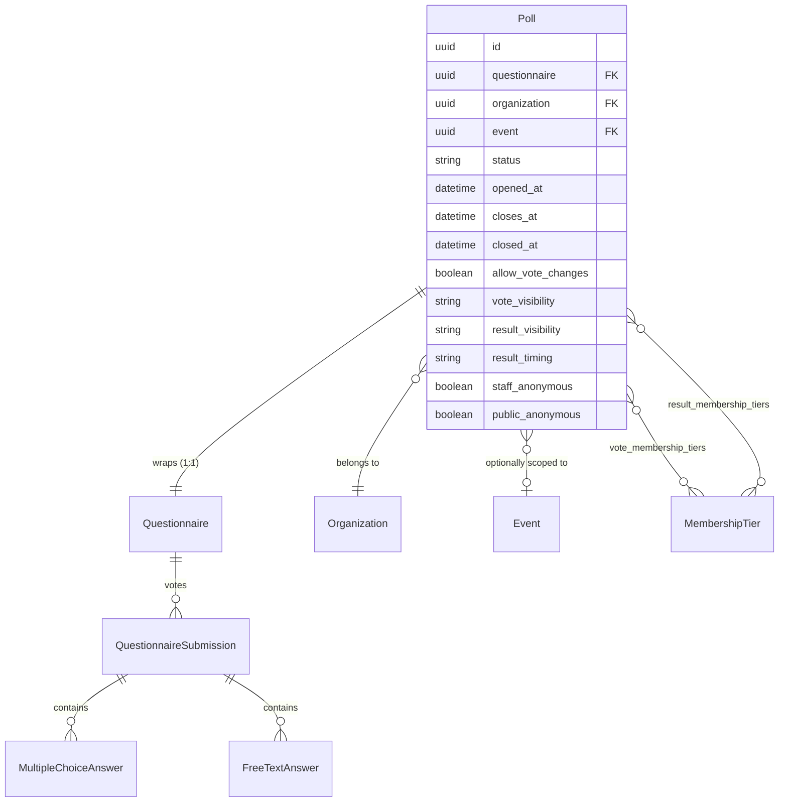
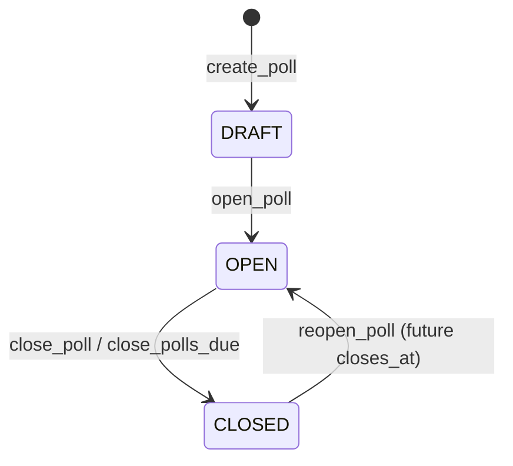

# Polls

Polls are **organization-managed votes** layered on top of the [questionnaire](questionnaires.md) engine. A `Poll` does not store votes itself — it is a thin wrapper around a `Questionnaire`, and every vote is an ordinary `QuestionnaireSubmission`. This lets polls reuse the question/option/answer model, the per-viewer shuffle, and the file-upload machinery for free, while adding poll-specific concerns: lifecycle (draft/open/closed), audience & result visibility, anonymity, and vote-change policy.

The feature is gated by the `manage_polls` organization permission (owner ✓, staff ✓ by default, member ✗).

---

## Overview

A poll wraps exactly one questionnaire (`OneToOneField`, `on_delete=CASCADE` from poll → questionnaire). The wrapped questionnaire is always forced to `evaluation_mode=MANUAL` so the poll never triggers the LLM/automatic evaluation pipeline — a poll collects answers, it does not grade them.

Casting a vote is the same operation as finalizing a questionnaire submission: a `QuestionnaireSubmission` in `READY` status, with the MC/free-text/file-upload answer rows hanging off it. Because the questionnaire's unique constraint already enforces **one submission per `(user, questionnaire)`**, a user can hold at most one vote per poll. Changing a vote replaces the answers in place.

---

## Data model (`Poll`)

`src/polls/models.py`.

| Field | Type | Notes |
|---|---|---|
| `questionnaire` | OneToOne → `Questionnaire` | The vote container. Cascade deletes votes when the poll is torn down. |
| `organization` | FK → `Organization` | Owner of the poll; drives `manage_polls` checks. |
| `event` | FK → `Event`, nullable | Optional event scoping. **Required** when any visibility is `PRIVATE` or `ATTENDEES_ONLY` (enforced by a `CheckConstraint`). |
| `status` | `PollStatus` | `DRAFT` / `OPEN` / `CLOSED`. |
| `opened_at` / `closes_at` / `closed_at` | DateTime, nullable | `closes_at` is the optional auto-close deadline; `opened_at` / `closed_at` are stamped on transition. |
| `allow_vote_changes` | bool | When `False`, a second vote raises `PollVoteAlreadyCastError` (409) and withdrawing is forbidden. |
| `vote_visibility` | `ResourceVisibility` | Who may **cast** a vote (and, combined with results, who may see the poll exists). |
| `result_visibility` | `ResourceVisibility` | Who may **see results** (default `STAFF_ONLY`). |
| `result_timing` | `PollResultTiming` | `NEVER` (default) / `AFTER_VOTE` / `AFTER_CLOSE`. |
| `vote_membership_tiers` / `result_membership_tiers` | M2M → `MembershipTier` | Optional tier restriction applied on top of `MEMBERS_ONLY` visibility. |
| `staff_anonymous` / `public_anonymous` | bool, default `True` | Whether voter identity is hidden from staff / non-staff viewers in results. |

### Constraints & invariants

- **`poll_public_results_must_be_anonymous`** — if `result_visibility` is `PUBLIC` or `UNLISTED`, `public_anonymous` must be `True`. You cannot expose voter identities on a publicly-readable result set.
- **`poll_restricted_visibility_requires_event`** — `PRIVATE` / `ATTENDEES_ONLY` visibility (vote or result) requires an attached `event`, since those audiences are defined by event relationships (ticket / RSVP / invitation).
- **Anonymity is immutable after creation.** `Poll.save()` re-reads the old row and raises `PollAnonymityImmutableError` if `staff_anonymous` or `public_anonymous` changed. The only way to get a poll with different anonymity is to [duplicate](#duplicating-a-poll) it (where overrides are allowed because the copy is a fresh row).

---

## Lifecycle

All lifecycle transitions live in `src/polls/service/poll_service.py` and take a `SELECT FOR UPDATE` lock on the poll row inside `transaction.atomic()`, so a close racing with an in-flight vote resolves deterministically.

- **`open_poll`** — only a `DRAFT` poll can be opened directly; stamps `opened_at`.
- **`close_poll`** — only an `OPEN` poll can be closed; stamps `closed_at`.
- **`reopen_poll`** — only a `CLOSED` poll can be reopened, and only with a meaningful future deadline: the caller must supply a future `closes_at`, set `clear_closes_at=True`, or have an existing future `closes_at`. Reopening with a past deadline would close again on the next sweep.
- **Auto-close** — the `polls.tasks.close_polls_due` Celery task sweeps `OPEN` polls whose `closes_at` has elapsed, re-checking each under a row lock before flipping it to `CLOSED`. It snapshots candidate IDs first and processes each in its own transaction (no server-side cursor — PgBouncer-safe, see [engineering notes](../engineering-notes.md)).

!!! note "DRAFT polls are invisible to non-staff"
    A DRAFT poll's detail endpoint never leaks its questions/options to non-staff even if the caller knows the UUID and the poll's `vote_visibility` is `PUBLIC` — `can_see_poll` short-circuits to `False` for DRAFT unless the viewer is staff/owner.

---

## Visibility & eligibility

Pure-logic helpers live in `src/polls/service/eligibility.py` (no DB writes; they take a resolved `Poll` + user). The same `ResourceVisibility` enum used for events/resources drives the audience checks.

| Visibility | Who passes |
|---|---|
| `PUBLIC` / `UNLISTED` | Everyone (anonymous included). |
| `MEMBERS_ONLY` | Active org members; if tiers are set, the member's tier must be in the list. |
| `ATTENDEES_ONLY` | Users with a non-cancelled ticket or YES RSVP for the linked event. |
| `PRIVATE` | Attendees **or** invited users for the linked event. |
| `STAFF_ONLY` | Org staff / owner only. |

Staff/owner (and Django superusers/staff) always pass every check. Banned / hard-blacklisted users see no polls from that organization, mirroring `EventQuerySet.for_user`.

Three derived predicates govern access:

- **`can_see_poll`** — viewer is in the vote audience **or** the result audience **or** has already voted. Used by list + detail.
- **`can_vote`** — viewer passes `vote_visibility` (and is authenticated). The `OPEN` status check is applied separately by the caller.
- **`can_see_results`** — viewer passes `result_visibility` **and** the `result_timing` gate (`NEVER` → never; `AFTER_CLOSE` → only when `CLOSED`; `AFTER_VOTE` → only after the viewer voted). Staff/owner bypass timing.

### Listing performance

The list endpoint annotates each row via `PollQuerySet.with_user_annotations` (a set of `Exists()` subqueries for ownership/staff/membership/ticket/RSVP/invitation/voted flags) so per-row schema resolvers compute eligibility with a **flat** query count regardless of page size. `Poll.objects.for_user` applies the visibility filter at the SQL level. Tier-restricted `MEMBERS_ONLY` polls are intentionally not refined in the listing (a benign false-positive that the fine-grained per-poll check then resolves), matching the listings-vs-access split used for events.

---

## Voting

`poll_service.vote` and `poll_service.withdraw_vote`, both under a poll-row `SELECT FOR UPDATE`:

1. The poll must be `OPEN` → else `PollNotOpenError` (**423 Locked**).
2. The user must pass `can_vote` → else `PollNotEligibleError` (**403**).
3. If a submission already exists and `allow_vote_changes=False` → `PollVoteAlreadyCastError` (**409**).
4. Otherwise create/reuse the `QuestionnaireSubmission` (`READY`, `submitted_at=now`), clear any prior answers, and re-write the MC/free-text/file-upload answers. Each answer is validated against the poll's own questionnaire (questions must belong to it, options to their question, files to the uploader) — bogus IDs raise `PollValidationError` (**422**) and roll back.

Withdrawing requires `OPEN` **and** `allow_vote_changes=True` (`PollVoteChangesNotAllowedError` → **403**), and simply deletes the submission.

---

## Results & anonymity

`compute_poll_results` (`src/polls/service/aggregation.py`) aggregates the `READY` submissions for the poll's questionnaire:

- **MC distributions** reuse `aggregate_mc_distributions` from the events questionnaire service (shared code path).
- **`total_voters`** is the distinct count of submitting users.
- **Free-text responses** are returned verbatim, ordered by submission time.

Whether **voter identity** is attached is decided by `_viewer_sees_identity`: a staff/owner viewer sees identity only when `staff_anonymous=False`; a non-staff viewer only when `public_anonymous=False`. When identity is hidden, free-text `user_*` fields are `None` and each MC option's `voters` is `None` (not `[]`, so the frontend can distinguish "anonymous poll" from "nobody picked this").

---

## Duplicating a poll

`poll_service.duplicate_poll` deep-copies the wrapped questionnaire (`duplicate_questionnaire_content` — sections, questions, options, intra-questionnaire dependency remapping) and creates a fresh poll in `DRAFT` with a reset lifecycle (`opened_at` / `closed_at` / `closes_at` cleared). It copies visibility, result timing, vote-change policy, and both membership-tier M2Ms. Because the copy is a new row, `staff_anonymous` / `public_anonymous` may be overridden in the payload (otherwise the template's values are copied verbatim); overriding `public_anonymous=False` while the result visibility is public raises `PollResultsMustBeAnonymousError`. **Votes, submissions, answers, evaluations, and uploaded files are never copied.**

---

## API

`PollController` (`src/polls/controllers/poll_controller.py`), mounted at `/api/polls`, `OptionalAuth` (anonymous reads allowed). Reads return `404` when a poll doesn't exist vs `403` when it exists but the caller can't see it, so frontends can branch without inspecting bodies.

| Method | Path | Permission | Purpose |
|---|---|---|---|
| `GET` | `/polls/` | visibility filter | Paginated list (filter by `organization_id`, `event_id`, `status`). |
| `GET` | `/polls/{id}/` | `can_see_poll` | Detail incl. per-user flags and (when allowed) results. |
| `GET` | `/polls/{id}/results` | `can_see_results` | Aggregated results, honoring visibility + timing + anonymity. |
| `POST` | `/polls/organizations/{org_id}` | `manage_polls` | Create a poll (+ its questionnaire) in `DRAFT`. |
| `PATCH` | `/polls/{id}/` | `manage_polls` | Partial update (poll fields + wrapped `name`/`description`). |
| `POST` | `/polls/{id}/open` · `/close` · `/reopen` | `manage_polls` | Lifecycle transitions. |
| `POST` | `/polls/{id}/duplicate` | `manage_polls` | Deep-copy into a new DRAFT poll. |
| `DELETE` | `/polls/{id}/` | **org owner only** (`IsPollOrganizationOwner`) | Hard-delete the poll, its questionnaire, and all votes. |
| `POST` | `/polls/{id}/vote` | authenticated + `can_vote` | Cast or replace a vote. |
| `DELETE` | `/polls/{id}/vote` | authenticated | Withdraw a vote (OPEN + `allow_vote_changes`). |

Service-layer exceptions are translated to HTTP statuses by the per-app handlers in `src/polls/exception_handlers.py` (`PollNotOpenError` → 423, `PollNotEligibleError` → 403, `PollVoteAlreadyCastError` → 409, `PollValidationError` → 422).

---

## Related reading

- [Questionnaires](questionnaires.md) — the underlying question/submission engine polls reuse.
- [Permissions](permissions.md) — `manage_polls` and the organization role model.
- [Service Layer](service-layer.md) — poll lifecycle follows the function-based service pattern with row-locked transitions.
