# Protected Files (HMAC)

Revel uses an **HMAC-based forward authentication** pattern to serve protected files through Caddy without exposing file storage directly. This approach keeps the architecture simple while providing robust access control.

!!! info "Related decision"
    See [ADR-0001: HMAC + Caddy over S3](../adr/0001-hmac-caddy-over-s3.md) for the full rationale behind choosing HMAC over pre-signed URLs.

## Architecture

```mermaid
sequenceDiagram
    actor Client
    participant Caddy as Caddy (Reverse Proxy)
    participant Django as Django API
    participant Storage as File Storage

    Client->>Caddy: GET /media/protected/{hmac}/{expiry}/{path}
    Caddy->>Django: forward_auth → /api/media/validate/{hmac}/{expiry}/{path}

    Django->>Django: Validate HMAC signature
    Django->>Django: Check expiry timestamp
    Django->>Django: Timing-safe comparison

    alt Valid signature & not expired
        Django-->>Caddy: 200 OK
        Caddy->>Storage: Serve file from disk
        Storage-->>Caddy: File contents
        Caddy-->>Client: 200 + file + Cache-Control: private
    else Invalid or expired
        Django-->>Caddy: 401 Unauthorized
        Caddy-->>Client: 401 Unauthorized
    end
```



## How It Works

1. **URL Generation**: When a schema serializes a protected file field, `get_file_url()` generates a signed URL containing an HMAC signature and expiry timestamp.
2. **Client Request**: The client requests the signed URL from Caddy.
3. **Forward Auth**: Caddy's `forward_auth` directive sends the request to Django's validation endpoint before serving the file.
4. **Validation**: Django recomputes the HMAC using `SECRET_KEY` and compares it using timing-safe comparison. It also checks that the expiry timestamp has not passed.
5. **Response**: If valid, Caddy serves the file directly from storage. If invalid, the client receives a 401.

## Why HMAC Over MinIO/S3 Pre-Signed URLs?

!!! warning "MinIO licensing change"
    MinIO moved to AGPL v3 and removed pre-compiled binaries for the community edition. This made it a less attractive option for self-hosted deployments.

| Factor | HMAC + Caddy | MinIO/S3 Pre-Signed URLs |
|---|---|---|
| **Additional services** | None -- Caddy already serves files | Requires running MinIO or S3 |
| **Licensing** | No restrictions | MinIO is AGPL v3 |
| **Complexity** | Django generates URLs, Caddy validates | SDK integration, bucket policies, IAM |
| **File size** | Perfect for <100MB (no streaming needed) | Better for large files with multipart upload |
| **Vendor lock-in** | None -- pure Django + Caddy | Tied to S3-compatible API |
| **Cost** | Zero additional infrastructure | Storage service costs |

!!! tip "Simple is better"
    For a platform where files are profile pictures, event banners, and documents (all well under 100MB), HMAC + Caddy is the right tool for the job.

## Model Fields

### ProtectedFileField & ProtectedImageField

Custom model fields that store files in a protected storage location:

```python
from common.storage import ProtectedFileField, ProtectedImageField

class Event(models.Model):
    banner = ProtectedImageField(
        upload_to="events/banners/",
        blank=True,
        null=True,
    )
    document = ProtectedFileField(
        upload_to="events/documents/",
        blank=True,
        null=True,
    )
```

These fields work identically to Django's `FileField` and `ImageField` but store files in the protected media directory.

## Signed URL Generation

In schemas, use `get_file_url()` to generate signed URLs:

```python
from common.storage import get_file_url

class EventSchema(ModelSchema):
    banner_url: str | None = None

    @staticmethod
    def resolve_banner_url(obj: Event) -> str | None:
        if not obj.banner:
            return None
        return get_file_url(obj.banner)
```

The generated URL has this structure:

```
/media/protected/{hmac_signature}/{expiry_timestamp}/{file_path}
```

## Security Details

!!! danger "Security-critical configuration"
    The HMAC signing uses Django's `SECRET_KEY`. If the secret key is compromised, all protected file URLs can be forged.

| Security Feature | Implementation |
|---|---|
| **Signing key** | Django `SECRET_KEY` |
| **URL expiry** | 1 hour (configurable) |
| **Comparison** | Timing-safe (`hmac.compare_digest`) |
| **Rate limiting** | Applied to the validation endpoint |
| **Cache headers** | `Cache-Control: private` for protected files |

### Timing-Safe Comparison

!!! note "Why timing-safe?"
    Standard string comparison (`==`) leaks information about how many characters matched via timing differences. `hmac.compare_digest()` takes constant time regardless of how many characters match, preventing timing attacks.

## Caddy Configuration

!!! warning "Handle path ordering matters"
    In Caddy's configuration, the `handle_path` directives for protected and public media must be ordered correctly. Protected paths must be matched **before** public paths.

```
# Protected files - requires forward_auth
handle_path /media/protected/* {
    forward_auth django:8000 {
        uri /api/media/validate/{path}
    }
    file_server {
        root /data/media/protected
    }
}

# Public files - served directly
handle_path /media/public/* {
    header Cache-Control "public, max-age=31536000"
    file_server {
        root /data/media/public
    }
}
```

### Cache Headers

| File Type | Cache-Control | Rationale |
|---|---|---|
| Protected files | `private` | Must not be cached by shared caches; URL expires |
| Public files | `public, max-age=31536000` | Static assets (logos, public images) can be cached aggressively |

## File Upload & Malware Scanning

!!! info "ClamAV integration"
    Uploaded files pass through a malware scanning pipeline using ClamAV before being stored. Files that fail scanning are quarantined and never served. See the security documentation for details.
