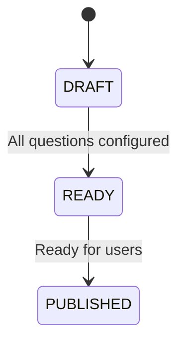
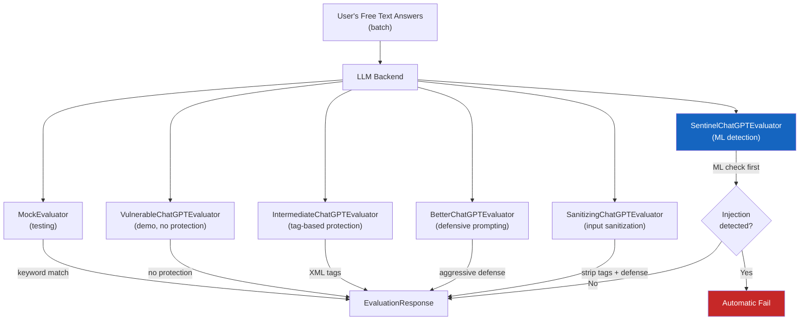
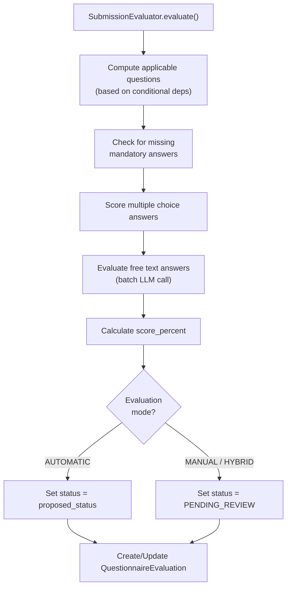
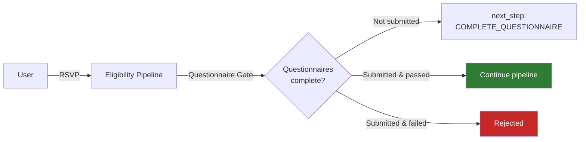

# Questionnaires

The questionnaire system allows event organizers to gate participation behind customizable questionnaires with support for **AI-powered evaluation**, **prompt injection detection**, and flexible scoring rules.

## Data Model

```mermaid
erDiagram
    Questionnaire ||--o{ QuestionnaireSection : "has sections"
    Questionnaire ||--o{ MultipleChoiceQuestion : "has MC questions"
    Questionnaire ||--o{ FreeTextQuestion : "has FT questions"
    Questionnaire ||--o{ FileUploadQuestion : "has FU questions"
    Questionnaire ||--o{ QuestionnaireSubmission : "receives submissions"
    QuestionnaireSection ||--o{ MultipleChoiceQuestion : "contains"
    QuestionnaireSection ||--o{ FreeTextQuestion : "contains"
    QuestionnaireSection ||--o{ FileUploadQuestion : "contains"
    QuestionnaireSection }o--o| MultipleChoiceOption : "depends_on_option"
    MultipleChoiceQuestion ||--o{ MultipleChoiceOption : "has options"
    MultipleChoiceQuestion ||--o{ MultipleChoiceAnswer : "receives answers"
    MultipleChoiceQuestion }o--o| MultipleChoiceOption : "depends_on_option"
    FreeTextQuestion ||--o{ FreeTextAnswer : "receives answers"
    FreeTextQuestion }o--o| MultipleChoiceOption : "depends_on_option"
    FileUploadQuestion ||--o{ FileUploadAnswer : "receives answers"
    FileUploadQuestion }o--o| MultipleChoiceOption : "depends_on_option"
    QuestionnaireSubmission ||--o{ MultipleChoiceAnswer : "contains"
    QuestionnaireSubmission ||--o{ FreeTextAnswer : "contains"
    QuestionnaireSubmission ||--o{ FileUploadAnswer : "contains"
    QuestionnaireSubmission ||--o| QuestionnaireEvaluation : "evaluated by"
    FileUploadAnswer }o--o{ QuestionnaireFile : "references files"

    Questionnaire {
        string name
        string description
        decimal min_score
        string llm_guidelines
        string llm_backend
        string status
        string evaluation_mode
        boolean shuffle_questions
        boolean shuffle_sections
        int max_attempts
        duration can_retake_after
    }

    QuestionnaireSection {
        string name
        string description
        int order
        FK depends_on_option
    }

    MultipleChoiceQuestion {
        string question
        string hint
        string reviewer_notes
        decimal positive_weight
        decimal negative_weight
        boolean is_fatal
        boolean is_mandatory
        int order
        boolean allow_multiple_answers
        boolean shuffle_options
        FK depends_on_option
    }

    FreeTextQuestion {
        string question
        string hint
        string reviewer_notes
        decimal positive_weight
        decimal negative_weight
        boolean is_fatal
        boolean is_mandatory
        int order
        string llm_guidelines
        FK depends_on_option
    }

    FileUploadQuestion {
        string question
        string hint
        string reviewer_notes
        decimal positive_weight
        decimal negative_weight
        boolean is_fatal
        boolean is_mandatory
        int order
        list allowed_mime_types
        int max_file_size
        int max_files
        FK depends_on_option
    }

    MultipleChoiceOption {
        string option
        boolean is_correct
        int order
    }

    MultipleChoiceAnswer {
        FK submission
        FK question
        FK option
    }

    FreeTextAnswer {
        FK submission
        FK question
        string answer
    }

    FileUploadAnswer {
        FK submission
        FK question
        M2M files
    }

    QuestionnaireFile {
        FK uploader
        file file
        string original_filename
        string file_hash
        string mime_type
        int file_size
    }

    QuestionnaireSubmission {
        FK questionnaire
        FK user
        string status
        datetime submitted_at
        json metadata
    }

    QuestionnaireEvaluation {
        FK submission
        decimal score
        string status
        string proposed_status
        string comments
        boolean automatically_evaluated
        FK evaluator
        json raw_evaluation_data
    }
```

### Hierarchy

**Questionnaire** &rarr; **QuestionnaireSection** (optional) &rarr; **Questions** &rarr; **Options/Answers**

!!! note "Sections are optional"
    Questions can belong directly to a questionnaire or be organized into sections. Sections support independent shuffling for randomized question order.

## Question Types

| Type | Model | Description | Evaluation | Default `positive_weight` |
|---|---|---|---|---|
| **Multiple Choice** | `MultipleChoiceQuestion` | Predefined options via `MultipleChoiceOption`, single or multiple correct answers | Automatic: correct options are marked via `is_correct` on each `MultipleChoiceOption` | `1.0` |
| **Free Text** | `FreeTextQuestion` | Open-ended text response | LLM-powered (batch) or manual evaluation; supports per-question `llm_guidelines` | `1.0` |
| **File Upload** | `FileUploadQuestion` | File/image uploads (PDF, images, etc.) | Informational only; no automatic scoring; manual review by evaluators | `0.0` |

### Common Fields (BaseQuestion)

All question types inherit from `BaseQuestion` and share these fields:

| Field | Type | Default | Description |
|---|---|---|---|
| `question` | MarkdownField | (required) | The question text (supports Markdown) |
| `hint` | MarkdownField | `null` | Additional context shown to the user below the question |
| `reviewer_notes` | MarkdownField | `null` | Notes for reviewers, not shown to users |
| `positive_weight` | Decimal (0 to 100) | `1.0` | Points awarded for a correct answer |
| `negative_weight` | Decimal (-100 to 100) | `0.0` | Points deducted for an incorrect answer |
| `is_fatal` | Boolean | `False` | Failing this question fails the entire submission |
| `is_mandatory` | Boolean | `False` | The question must be answered for submission |
| `order` | Integer | `0` | Display order (ignored if `shuffle_questions` is enabled) |
| `depends_on_option` | FK to `MultipleChoiceOption` | `null` | Conditional display: question shown only if this option was selected |

### FileUploadQuestion Extra Fields

| Field | Type | Default | Description |
|---|---|---|---|
| `allowed_mime_types` | ArrayField (list of strings) | `[]` (allow all) | Restrict accepted file types (e.g., `image/jpeg`, `application/pdf`) |
| `max_file_size` | PositiveInteger | `5242880` (5 MB) | Maximum file size in bytes per file |
| `max_files` | PositiveInteger (1 to 10) | `1` | Maximum number of files allowed |

!!! info "File Upload Scoring"
    `FileUploadQuestion` uses the `InformationalQuestionMixin` which overrides the default `positive_weight` to `0.0`. These questions are treated as informational/supplementary since automatic LLM evaluation of files is not yet implemented.

### QuestionnaireFile Model

Uploaded files are stored in a user-scoped library (`QuestionnaireFile`) and can be reused across multiple questions and questionnaires via M2M relationship with `FileUploadAnswer`. Files are stored with UUID-based paths to prevent enumeration attacks, and duplicate uploads per user are prevented via a SHA-256 hash constraint.

!!! warning "Privacy-first deletion policy"
    When a user deletes a `QuestionnaireFile`, it is **hard deleted** from storage immediately, even if referenced by submitted questionnaires. User privacy (GDPR compliance) takes precedence over data integrity. Submissions with deleted files will show the file as unavailable.

## Questionnaire Status Lifecycle

Questionnaires follow a three-stage status lifecycle:



| Status | Description |
|---|---|
| `DRAFT` | Questionnaire is being authored; not visible to users |
| `READY` | Configuration is complete; can be reviewed before publishing |
| `PUBLISHED` | Live and accepting submissions from users |

## Submission Status

Submissions also have their own status flow:

| Status | Description |
|---|---|
| `DRAFT` | User has started but not yet submitted; only one draft per user per questionnaire is allowed (enforced by a unique constraint) |
| `READY` | User has finalized and submitted; `submitted_at` is set automatically |

## Conditional Sections and Questions

Both `QuestionnaireSection` and all question types support conditional display via the `depends_on_option` foreign key to `MultipleChoiceOption`.

- A **section** with `depends_on_option` set is only shown if the referenced option was selected by the user.
- A **question** with `depends_on_option` set is only shown if the referenced option was selected.
- The referenced option must belong to the same questionnaire (validated in `clean()`).

!!! example "Conditional logic"
    A multiple choice question asks "Do you have dietary restrictions?" with options "Yes" and "No". A follow-up free text question "Please describe your restrictions" has `depends_on_option` set to the "Yes" option. The follow-up is only shown (and only scored) if the user selected "Yes".

During evaluation, the `SubmissionEvaluator` computes which questions are **applicable** based on the user's selected options. Questions that were not shown (because their condition was not met) are excluded from scoring and mandatory checks.

## Retry Mechanics

Questionnaires support configurable retry behavior:

| Field | Type | Default | Description |
|---|---|---|---|
| `max_attempts` | Integer | `0` | Maximum number of submissions allowed. `0` means unlimited |
| `can_retake_after` | DurationField | `null` | Cooldown period before the user can resubmit |

## Evaluation Modes

Questionnaires support three evaluation modes:

| Mode | Description |
|---|---|
| **AUTOMATIC** | Submission is fully evaluated programmatically (MC) and by LLM (free text). The `proposed_status` is finalized immediately as the `status` |
| **MANUAL** | All submissions require human review by organization staff. Status is set to `PENDING_REVIEW` |
| **HYBRID** | Automatic evaluation runs and produces a `proposed_status`, but a human reviewer must confirm or override. Status is set to `PENDING_REVIEW` |

!!! tip "Choose wisely"
    Use AUTOMATIC for high-volume events where speed matters. Use MANUAL when human judgment is critical. Use HYBRID for a balance of both.

### QuestionnaireEvaluation

Each submission can have at most one `QuestionnaireEvaluation` (OneToOne relationship). The evaluation stores:

| Field | Type | Description |
|---|---|---|
| `score` | Decimal | Percentage score (can be `-100.0` for fatal/mandatory failures) |
| `status` | Enum | `APPROVED`, `REJECTED`, or `PENDING_REVIEW` |
| `proposed_status` | Enum | `APPROVED` or `REJECTED` (the automatic evaluation's recommendation) |
| `comments` | Text | Evaluator comments |
| `automatically_evaluated` | Boolean | Whether this evaluation was created by the automatic pipeline |
| `evaluator` | FK to User | The human evaluator (if manually reviewed) |
| `raw_evaluation_data` | JSON | Structured `EvaluationAuditData` for the full audit trail |

The `raw_evaluation_data` field stores an `EvaluationAuditData` Pydantic model containing:

- `mc_points_scored` / `max_mc_points`: multiple choice scoring breakdown
- `ft_points_scored` / `max_ft_points`: free text scoring breakdown
- `missing_mandatory`: list of UUIDs for unanswered mandatory questions
- `llm_response`: the complete `EvaluationResponse` from the LLM batch evaluation

## Scoring System

### Weights and Thresholds

Each question has a `positive_weight` (points for correct answers) and a `negative_weight` (points deducted for incorrect answers). The questionnaire defines a `min_score` (0 to 100 scale) that the percentage score must meet or exceed.

```
total_points_scored = mc_points_scored + ft_points_scored
total_max_points   = max_mc_points + max_ft_points

score_percent = (total_points_scored / total_max_points) * 100
pass          = score_percent >= min_score
```

!!! note "File upload questions excluded from scoring"
    `FileUploadQuestion` defaults to `positive_weight=0.0` and is not included in the automatic scoring calculation. Only MC and FT points contribute to the score.

### Multiple Choice Scoring

For each `MultipleChoiceAnswer`:

- If `option.is_correct` is `True`: `mc_points_scored += question.positive_weight`
- If `option.is_correct` is `False`: `mc_points_scored -= question.negative_weight`

### Free Text Scoring

Free text answers are evaluated in a single batch call to the configured LLM backend. For each answer:

- If `is_passing` is `True`: `ft_points_scored += question.positive_weight`
- If `is_passing` is `False`: `ft_points_scored -= question.negative_weight`

LLM guidelines are provided at two levels:

1. **Questionnaire-level**: `Questionnaire.llm_guidelines`: global guidelines sent to every LLM call
2. **Question-level**: `FreeTextQuestion.llm_guidelines`: per-question guidelines that supplement the questionnaire-level guidelines

### Fatal Questions

!!! danger "Single wrong answer = automatic fail"
    Questions marked as `is_fatal=True` cause an immediate failure regardless of the overall score. When a fatal question is answered incorrectly, the score is set to `-100.0`. Use these for non-negotiable requirements (e.g., age verification, code of conduct agreement).

### Mandatory Questions

Questions marked as `is_mandatory=True` must be answered. If any applicable mandatory question is left unanswered, the score is set to `-100.0` and the submission fails. Only questions that are **applicable** (based on conditional dependencies) are checked for mandatory compliance.

## LLM Evaluation

Free text questions are evaluated by a pluggable LLM backend. The backend is configured per questionnaire via the `llm_backend` field, which stores the fully-qualified Python path to the evaluator class.

### Backend Pipeline



### Available Backends

All backends implement the `FreeTextEvaluator` protocol and accept a batch of `AnswerToEvaluate` objects.

| Backend | Class | Security Level | Description |
|---|---|---|---|
| `MockEvaluator` | `questionnaires.llms.MockEvaluator` | N/A | Approves answers containing the word "good", rejects otherwise. For testing only |
| `VulnerableChatGPTEvaluator` | `questionnaires.llms.VulnerableChatGPTEvaluator` | None | Intentionally vulnerable to prompt injection. For demonstration purposes |
| `IntermediateChatGPTEvaluator` | `questionnaires.llms.IntermediateChatGPTEvaluator` | Low-Medium | Uses simple XML-like tags (`<ANSWER_TEXT>`, `<GUIDELINES>`) to separate user input from instructions |
| `BetterChatGPTEvaluator` | `questionnaires.llms.BetterChatGPTEvaluator` | Medium | Aggressive defensive prompting; explicitly instructs the LLM to ignore instructions within `<ANSWER_TEXT>` tags and fail prompt injection attempts |
| `SanitizingChatGPTEvaluator` | `questionnaires.llms.SanitizingChatGPTEvaluator` | Medium-High | Extends `BetterChatGPTEvaluator` by stripping all XML-like tags and their content from user answers before sending to the LLM |
| `SentinelChatGPTEvaluator` | `questionnaires.llms.SentinelChatGPTEvaluator` | **Highest** | Extends `BetterChatGPTEvaluator` with a local ML model (Hugging Face Transformers) that classifies answers as `benign` or `jailbreak` before LLM evaluation |

!!! info "Default backend"
    The default LLM backend is `SanitizingChatGPTEvaluator`. In `DEMO_MODE`, the backend is overridden to `MockEvaluator` regardless of configuration.

!!! note "Sentinel model setup"
    The `SentinelChatGPTEvaluator` requires the `transformers` library (`uv sync --group sentinel`) and a downloaded model (`python manage.py download_sentinel_model`). It is conditionally imported only when `transformers` is available.

### Inheritance Hierarchy

All ChatGPT-based evaluators share a common base class:

```
FreeTextEvaluator (Protocol)
├── MockEvaluator
└── BaseChatGPTEvaluator
    ├── VulnerableChatGPTEvaluator
    ├── IntermediateChatGPTEvaluator
    └── BetterChatGPTEvaluator
        ├── SanitizingChatGPTEvaluator (sanitizes input, then calls super)
        └── SentinelChatGPTEvaluator (ML check, then calls super)
```

### Prompt Injection Protection

!!! warning "LLM evaluators are attack surfaces"
    Users submitting free text answers can attempt prompt injection attacks to manipulate the LLM into granting a passing score.

The **SentinelChatGPTEvaluator** provides the strongest protection. It works in two stages:

1. **Detection**: Each answer is classified by the local Sentinel ML model as `benign` or `jailbreak`
2. **Evaluation**: Only if all answers pass the injection check are they forwarded to the LLM for evaluation

!!! danger "Zero tolerance policy"
    If the Sentinel model detects prompt injection in **any** answer, the **entire batch** is short-circuited: flagged answers receive automatic failure results, and the remaining answers are not forwarded to the LLM. This prevents any possibility of an injected prompt reaching the evaluator.

## Evaluation Pipeline (SubmissionEvaluator)

The `SubmissionEvaluator` class orchestrates the full evaluation of a submitted questionnaire:



The entire evaluation runs inside a database transaction (`@transaction.atomic`) to ensure it is an all-or-nothing operation.

## Service Layer (QuestionnaireService)

The `QuestionnaireService` class provides CRUD operations for questionnaires and handles submission:

- **`build()`**: Constructs the questionnaire schema for API responses, applying shuffle logic for questions, options, and sections
- **`submit()`**: Validates answers against the questionnaire, checks mandatory questions, validates file uploads, and creates the submission with all answers
- **`create_questionnaire()`**: Creates a complete questionnaire with sections, questions, and options from a single schema
- **`create_section()` / `create_mc_question()` / `create_ft_question()` / `create_fu_question()`**: Individual creation methods supporting nested conditional content
- **`evaluate_submission()`**: Creates or updates a manual evaluation for a submission

## Integration with Eligibility

Questionnaires integrate with the [Eligibility Pipeline](eligibility-pipeline.md) through the **Questionnaire Gate**:

1. Event is configured to require one or more questionnaires
2. When a user attempts to RSVP/purchase a ticket, the eligibility pipeline checks questionnaire status
3. If questionnaires are incomplete, the user receives `next_step: COMPLETE_QUESTIONNAIRE`
4. If questionnaires are submitted but failed, the user is rejected with the failure reason


