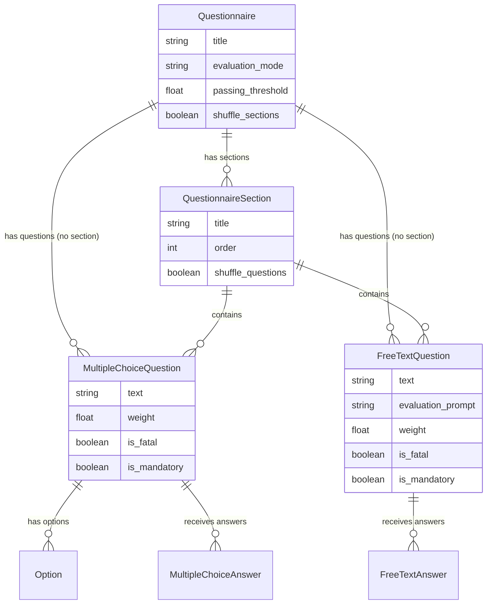
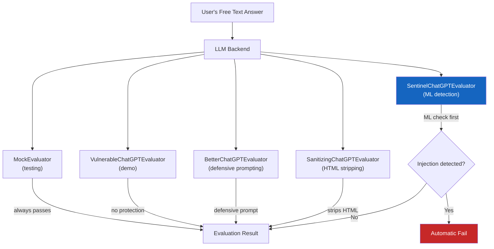
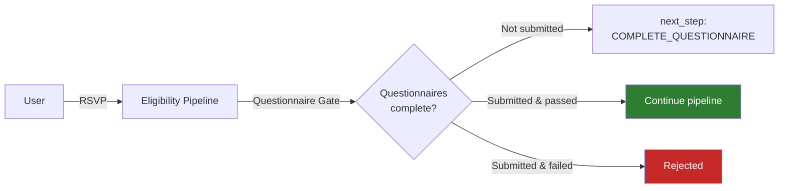

# Questionnaires

The questionnaire system allows event organizers to gate participation behind customizable questionnaires with support for **AI-powered evaluation**, **prompt injection detection**, and flexible scoring rules.

## Data Model



### Hierarchy

**Questionnaire** &rarr; **QuestionnaireSection** (optional) &rarr; **Questions** &rarr; **Options/Answers**

!!! note "Sections are optional"
    Questions can belong directly to a questionnaire or be organized into sections. Sections support independent shuffling for randomized question order.

## Question Types

| Type | Description | Evaluation |
|---|---|---|
| **Multiple Choice** | Predefined options, one or more correct answers | Automatic -- correct options are marked in the model |
| **Free Text** | Open-ended text response | LLM-powered or manual evaluation |

## Evaluation Modes

Questionnaires support three evaluation modes:

| Mode | Description |
|---|---|
| **AUTOMATIC** | All questions are evaluated programmatically (multiple choice) or by LLM (free text) |
| **MANUAL** | All submissions require human review by organization staff |
| **HYBRID** | Multiple choice is auto-evaluated; free text questions are flagged for human review |

!!! tip "Choose wisely"
    Use AUTOMATIC for high-volume events where speed matters. Use MANUAL when human judgment is critical. Use HYBRID for a balance of both.

## Scoring System

### Weights & Thresholds

Each question has a **weight** that determines its contribution to the total score. The questionnaire defines a **passing_threshold** (0.0 to 1.0) that the weighted score must meet or exceed.

```
score = sum(correct_weight) / sum(total_weight)
pass = score >= passing_threshold
```

### Fatal Questions

!!! danger "Single wrong answer = automatic fail"
    Questions marked as `is_fatal=True` cause an immediate failure regardless of the overall score. Use these for non-negotiable requirements (e.g., age verification, code of conduct agreement).

### Mandatory Questions

Questions marked as `is_mandatory=True` must be answered. Skipping a mandatory question results in the submission being marked incomplete.

## LLM Evaluation

Free text questions can be evaluated by an LLM backend. Each question includes an `evaluation_prompt` that instructs the LLM how to assess the answer.

### Backend Pipeline



### Available Backends

| Backend | Use Case | Security Level |
|---|---|---|
| `MockEvaluator` | Unit and integration testing | N/A |
| `VulnerableChatGPTEvaluator` | Demonstrates prompt injection vulnerabilities | None -- intentionally vulnerable |
| `BetterChatGPTEvaluator` | Production use with defensive system prompts | Medium |
| `SanitizingChatGPTEvaluator` | Strips HTML/script tags before evaluation | Medium-High |
| `SentinelChatGPTEvaluator` | ML-based prompt injection detection before evaluation | **Highest** |

### Prompt Injection Protection

!!! warning "LLM evaluators are attack surfaces"
    Users submitting free text answers can attempt prompt injection attacks to manipulate the LLM into granting a passing score.

The **SentinelChatGPTEvaluator** is the recommended production backend. It works in two stages:

1. **Detection**: The Sentinel ML model analyzes the user's answer for prompt injection patterns
2. **Evaluation**: Only if the answer passes the injection check is it forwarded to the LLM for evaluation

!!! danger "Zero tolerance policy"
    If the Sentinel model detects prompt injection, the answer is **automatically failed** without being sent to the LLM. This prevents any possibility of the injected prompt reaching the evaluator.

## Integration with Eligibility

Questionnaires integrate with the [Eligibility Pipeline](eligibility-pipeline.md) through the **Questionnaire Gate**:

1. Event is configured to require one or more questionnaires
2. When a user attempts to RSVP/purchase a ticket, the eligibility pipeline checks questionnaire status
3. If questionnaires are incomplete, the user receives `next_step: COMPLETE_QUESTIONNAIRE`
4. If questionnaires are submitted but failed, the user is rejected with the failure reason


