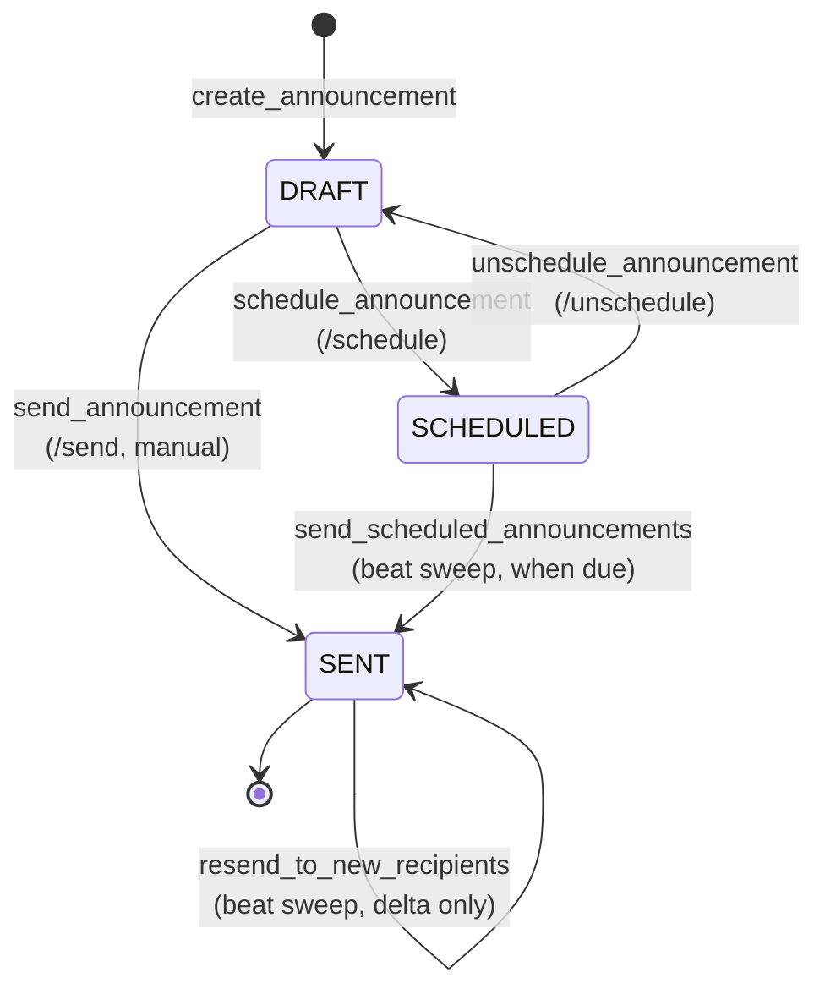
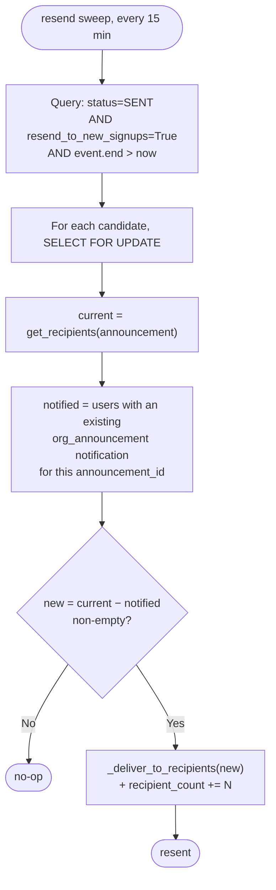

# Scheduled Announcements

Organization announcements are no longer send-now-only. As of **1.64.0** a draft can be
**scheduled** to fire at a future time — either an **absolute** timestamp or a time
**relative to the event's start or end** — and event announcements can be **re-delivered to
attendees who sign up after the first send**. Two Celery-beat sweeps do the work; the
announcement model and the existing notification dispatcher do the rest.

This page documents the scheduling and resend mechanics. For the announcement
notification itself (`org_announcement`) and the multi-channel delivery path, see
[Notifications](notifications.md).

!!! note "Immediate send is unchanged"
    Sending an announcement **now** (`POST /announcements/{id}/send`) works exactly as
    before. Scheduling is an opt-in layer on top: a scheduled announcement is just a
    `DRAFT` that has been parked in `SCHEDULED` until a sweep decides it is due.

---

## Status model

An `Announcement` (`src/events/models/announcement.py`) moves through three statuses:

| Status | Meaning |
|---|---|
| `DRAFT` | Editable, never delivered. The default on create. |
| `SCHEDULED` | Has a resolved future send time; waiting for the beat sweep. Still editable. |
| `SENT` | Delivered (immutable except for the resend bookkeeping). |



Only `DRAFT` and `SCHEDULED` announcements can be **updated** or **deleted**; `SENT` is
preserved for audit.

---

## Scheduling: absolute vs relative

`schedule_announcement` (`announcement_service.py`) accepts **exactly one** of two modes.
The choice is enforced both at the schema level (`AnnouncementScheduleSchema`) and in the
model's `clean()`.

| Mode | Fields | Resolves to |
|---|---|---|
| **Absolute** | `scheduled_at` (an `AwareDatetime`) | `scheduled_at` verbatim |
| **Relative** | `schedule_anchor` (`event_start` / `event_end`) + `schedule_offset_minutes` (signed) | `anchor_time + offset` |

`schedule_offset_minutes` is signed: `-1440` means 24 hours **before** the anchor,
`+1440` means 24 hours **after**. The resolved time must be **in the future** at schedule
time, or `/schedule` returns **422**.

### Invariants (enforced in `Announcement.clean()` and the service)

- Absolute and relative scheduling are **mutually exclusive** — provide one, not both.
- Relative scheduling requires **both** an anchor and an offset.
- Relative scheduling requires an **event-targeted** announcement (there is no anchor
  without an event).

### Relative schedules auto-shift with the event

The live send time is **not** frozen at schedule time. It is recomputed on every sweep
from the model's `effective_send_at` property:

```python
@property
def effective_send_at(self) -> dt.datetime | None:
    if self.schedule_anchor is None:
        return self.scheduled_at          # absolute: fixed
    if self.event is None:
        return None
    anchor_time = (
        self.event.start
        if self.schedule_anchor == self.ScheduleAnchor.EVENT_START
        else self.event.end
    )
    return anchor_time + dt.timedelta(minutes=self.schedule_offset_minutes or 0)
```

!!! tip "Move the event, and the announcement follows"
    An announcement scheduled for "1 hour before the doors open" stays correct if the
    organizer reschedules the event. Because the sweep reads `effective_send_at` fresh on
    every run, a relative schedule **auto-shifts** with `event.start` / `event.end`.
    Absolute schedules (`scheduled_at`) are fixed and never move.

---

## Endpoints

Mounted on `OrganizationAdminAnnouncementsController`
(`src/events/controllers/organization_admin/announcements.py`), under
`/organization-admin/{slug}/...` with the `send_announcements` org permission.

| Method | Path | From → To | Purpose |
|---|---|---|---|
| `POST` | `/announcements/{id}/schedule` | `DRAFT` → `SCHEDULED` | Park a draft with an absolute or relative schedule. Body is `AnnouncementScheduleSchema`. |
| `POST` | `/announcements/{id}/unschedule` | `SCHEDULED` → `DRAFT` | Cancel a schedule and clear all schedule fields. |
| `POST` | `/announcements/{id}/send` | `DRAFT` → `SENT` | Manual immediate send (unchanged). |

Both schedule endpoints map service `ValueError`s (wrong status, unresolvable or past
time, missing event for relative mode) to **HTTP 422**.

---

## Delivery: background sweeps

Both sweeps live in `src/events/announcement_tasks.py` (split out of `events.tasks` to
keep that module under the 1000-line limit; the registered task **names** are preserved so
the beat schedule in migration `0082` keeps working). The worker registers them via
`EventsConfig.ready` importing the module.

| Task | Cadence | Purpose |
|---|---|---|
| `events.send_scheduled_announcements` | Every **5 min** (migration `0082`) | Send `SCHEDULED` announcements whose `effective_send_at` is now due. |
| `events.resend_announcements_to_new_signups` | Every **15 min** (migration `0082`, offset to reduce lock contention) | Re-deliver `SENT` event announcements with `resend_to_new_signups=True` to attendees who joined since the last delivery. |

### Scheduled-send sweep

`send_scheduled_announcements` snapshots candidate IDs, then re-fetches each under
`select_for_update` (per the PgBouncer / server-side-cursor rule, #458), **recomputes
`effective_send_at` live** (so relative schedules pick up any event move), and sends the
due ones via `announcement_service.send_announcement`.

!!! note "Overlapping runs are safe"
    `send_announcement` re-checks the status inside its own row-locked transaction, so a
    double-send caused by two overlapping beat runs is harmless — the second run sees the
    announcement is already `SENT` and skips it.

---

## Resend to new sign-ups

An **event** announcement can opt into `resend_to_new_signups=True`. After the first send,
the 15-minute sweep keeps re-delivering it to attendees who join later — until the event
ends.



Key properties of `resend_to_new_recipients` (`announcement_service.py`):

- **No double-notify.** The set of already-notified users is derived from the existing
  `org_announcement` notifications keyed on `context__announcement_id` — that notification
  ledger **is** the dedup mechanism. Only `current − notified` get a new notification.
- **Stop condition is the query.** The sweep only considers announcements whose
  `event.end > now`; once the event ends, the announcement simply drops out of the
  candidate set. `resend_to_new_recipients` also re-checks `event.end <= now` under the
  lock as a guard.
- **Event-only.** `resend_to_new_signups` requires an event-targeted announcement
  (validated in both `clean()` and the service) — "new sign-ups" only has meaning for an
  event's attendee set.
- **Row-locked + idempotent.** Each candidate is processed under `select_for_update`, and
  `recipient_count` is bumped with an `F()` update for the delta actually delivered.

!!! info "Recipients = event attendees"
    For an event announcement, recipients are users with an **active or checked-in ticket**
    or a **YES RSVP** (`_get_event_recipients`). As more people buy tickets or RSVP yes,
    the recipient set grows — which is exactly what the resend sweep picks up.

---

## Lifecycle examples

### Example 1: Relative schedule that survives a reschedule

1. Organizer drafts "Doors update" targeting event *E* (`start = Sat 20:00`).
2. `POST /schedule` with `schedule_anchor=event_start`, `schedule_offset_minutes=-60`.
   - `effective_send_at` resolves to `Sat 19:00`; it's in the future → status `SCHEDULED`.
3. The next day the organizer moves *E* to `Sat 21:00`.
4. The 5-minute sweep recomputes `effective_send_at = Sat 20:00`. It does **not** fire at
   19:00 (that time no longer resolves) — it fires at the new 20:00.

### Example 2: Resend to late RSVPs

1. Organizer sends "Bring your ID" for event *E* with `resend_to_new_signups=True`.
   - 40 current attendees are notified; status `SENT`, `recipient_count=40`.
2. Over the next two days, 12 more people RSVP yes.
3. The 15-minute sweep computes `current=52`, `notified=40`, `new=12`, delivers to the 12,
   and bumps `recipient_count` to 52. The original 40 are never re-notified.
4. Event *E* ends. The announcement drops out of the sweep's query; no further resends.

### Example 3: Unschedule before it fires

1. A `SCHEDULED` announcement is parked for next week.
2. The organizer changes their mind and calls `POST /unschedule`.
   - Status → `DRAFT`; `scheduled_at`, `schedule_anchor`, `schedule_offset_minutes` are
     all cleared. The sweep no longer considers it.

---

## Related reading

- [Notifications](notifications.md) — announcements deliver as `org_announcement`
  notifications through the standard multi-channel dispatcher.
- [Service Layer](service-layer.md) — `announcement_service.py` follows the function-based
  service pattern.
- [Permissions](permissions.md) — the `send_announcements` org permission gates all of
  these endpoints.
