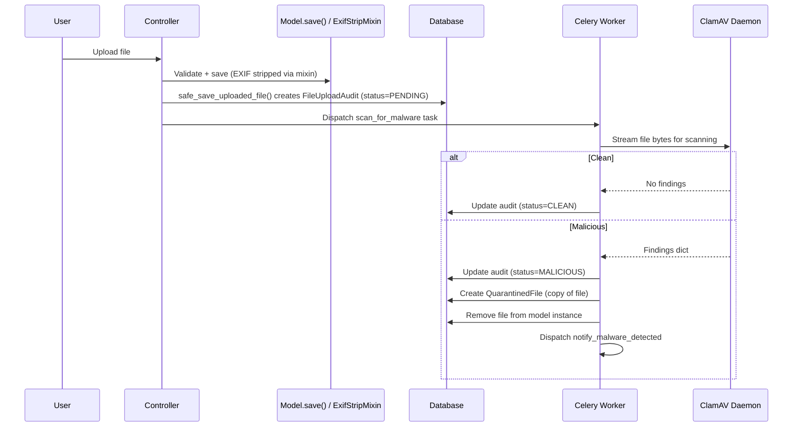

# File Security

Revel processes user-uploaded files (profile pictures, event banners, questionnaire attachments) and applies two security measures before storing them: **EXIF metadata stripping** and **ClamAV malware scanning**.

---

## EXIF Metadata Stripping

All uploaded images have their EXIF metadata removed before storage. EXIF data can contain sensitive information such as GPS coordinates, device identifiers, timestamps, and camera settings.

### How It Works

The `strip_exif()` function in `common/utils.py` reconstructs the image from raw pixel data, discarding all metadata:

```python
def strip_exif(image_file: File) -> InMemoryUploadedFile:
    image = Image.open(image_file)
    # Create a new image from raw pixel data to strip EXIF metadata
    image_no_exif = Image.frombytes(image.mode, image.size, image.tobytes())
    # ... save to new file
```

This approach strips **all** metadata (EXIF, IPTC, XMP) rather than selectively removing fields, which is simpler and more robust.

### When It Runs

EXIF stripping happens during `model.save()` via `ExifStripMixin` (defined in `common/models.py`). Models that handle image uploads inherit from this mixin and declare `IMAGE_FIELDS`. The mixin's `save()` override calls `_strip_exif_from_image_fields()`, which processes each image field **before** the file is persisted to storage. For questionnaire file uploads, `strip_exif()` is called directly in the file service.

---

## ClamAV Malware Scanning

All uploaded files are scanned for malware using [ClamAV](https://www.clamav.net/), an open-source antivirus engine. ClamAV runs as a Docker service alongside the application.

### Architecture



### Scan Flow

1. **Upload**: The controller calls `safe_save_uploaded_file()`, which saves the model instance (triggering `ExifStripMixin.save()` for EXIF stripping), then creates a `FileUploadAudit` record with status `PENDING`.
2. **Async scan**: A Celery task (`scan_for_malware`) reads the file bytes and streams them to the ClamAV daemon via `pyclamd`.
3. **Clean file**: If no threats are found, the audit record is updated to `CLEAN`. The file remains in place.
4. **Malicious file**: If threats are found:
    - The audit record is updated to `MALICIOUS`.
    - The file is copied to a `QuarantinedFile` record for admin review.
    - The file is **removed from the model instance** (field set to `None`).
    - Email notifications are sent to the uploader, the organization owner (if applicable), and all superusers/staff.

### Models

| Model | Purpose |
|---|---|
| `FileUploadAudit` | Tracks every file upload with app, model, field, file hash, uploader, and scan status |
| `QuarantinedFile` | Stores a copy of malicious files along with ClamAV findings for admin review |

### Notification

When malware is detected, the system sends email notifications to three audiences:

- **Uploader**: informed that their upload was flagged
- **Organization owner**: if the file belongs to an organization-scoped model
- **Superusers and staff**: receive detailed findings and a link to the quarantined file in Django Admin

### Configuration

ClamAV connection settings are in `revel/settings/base.py`:

| Setting | Description |
|---|---|
| `CLAMAV_HOST` | Hostname of the ClamAV daemon |
| `CLAMAV_PORT` | Port of the ClamAV daemon |

In development, ClamAV runs as a Docker service defined in `compose.yaml`. See [Troubleshooting](../getting-started/troubleshooting.md#external-services) for setup details.

!!! note "Async scanning"
    Files are available immediately after upload. The malware scan runs asynchronously. If a file is found to be malicious, it is removed retroactively. This trade-off prioritizes user experience over strict pre-screening.
