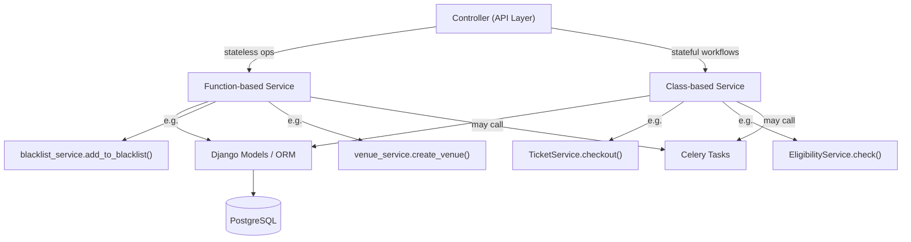

# Service Layer

Revel uses a **hybrid approach** to services: function-based for stateless operations, class-based for stateful workflows. This is an intentional design decision -- not every service needs to be a class, and not every operation needs to be a standalone function.

!!! info "Related decisions"
    See [ADR-0002: Hybrid Service Architecture](../adr/0002-hybrid-service-architecture.md) and [ADR-0005: No Dependency Injection](../adr/0005-no-dependency-injection.md) for the rationale behind this approach.

## Architecture Overview



## Choosing the Right Pattern

=== "Function-based Services"

    Use functions when the operation is **stateless** and **single-purpose**.

    **When to use:**

    - Single-purpose operations: CRUD, validation, simple queries
    - Cross-entity operations spanning multiple models without shared context
    - Utility helpers: formatting, calculations, lookups

    ```python
    # Good - stateless operations as functions
    def add_to_blacklist(organization: Organization, email: str, ...) -> Blacklist:
        return Blacklist.objects.create(organization=organization, email=email, ...)

    def create_venue(organization: Organization, payload: VenueCreateSchema) -> Venue:
        return Venue.objects.create(organization=organization, **payload.model_dump())
    ```

    **Characteristics:**

    - No shared state between calls
    - Each function receives everything it needs via arguments
    - Easy to test in isolation
    - Import the module, call the function

=== "Class-based Services"

    Use classes when the operation is **stateful** and involves **multi-step workflows**.

    **When to use:**

    - Request-scoped workflows sharing context (user, event, organization)
    - Multi-step processes: checkout flows, eligibility checks, complex validations
    - Stateful computations: when you'd pass the same 3+ arguments to multiple related functions

    ```python
    class TicketService:
        def __init__(self, *, event: Event, tier: TicketTier, user: RevelUser) -> None:
            self.event = event
            self.tier = tier
            self.user = user

        def checkout(self, price_override: Decimal | None = None) -> str | Ticket:
            match self.tier.payment_method:
                case TicketTier.PaymentMethod.ONLINE:
                    return self._stripe_checkout(price_override)
                case TicketTier.PaymentMethod.FREE:
                    return self._free_checkout()
    ```

    **Characteristics:**

    - Shared context via `__init__` avoids passing the same arguments everywhere
    - Private methods (`_stripe_checkout`) encapsulate implementation details
    - Instantiated per-request -- never a singleton
    - Makes complex workflows readable and maintainable

## Mixed Modules Are OK

!!! tip "A single service module can contain both patterns"
    A file like `ticket_service.py` can have `TicketService` (checkout workflow) **and** `check_in_ticket()` (standalone operation). This is intentional -- don't force everything into one pattern.

```python
# ticket_service.py

class TicketService:
    """Handles the multi-step checkout workflow."""

    def __init__(self, *, event: Event, tier: TicketTier, user: RevelUser) -> None:
        self.event = event
        self.tier = tier
        self.user = user

    def checkout(self, price_override: Decimal | None = None) -> str | Ticket:
        ...


def check_in_ticket(ticket: Ticket, *, staff_user: RevelUser) -> Ticket:
    """Standalone operation -- no shared state needed."""
    ticket.checked_in_at = timezone.now()
    ticket.checked_in_by = staff_user
    ticket.save(update_fields=["checked_in_at", "checked_in_by"])
    return ticket
```

## Controller Integration

```python
# Function-based - import module, call directly
from events.service import blacklist_service

entry = blacklist_service.add_to_blacklist(organization, email=email)
```

```python
# Class-based - instantiate per request
from events.service.ticket_service import TicketService

service = TicketService(event=event, tier=tier, user=user)
result = service.checkout()
```

!!! note "Module imports vs class imports"
    For function-based services, import the **module** (not the function) to keep call sites explicit: `blacklist_service.add_to_blacklist()` is clearer than a bare `add_to_blacklist()`.

## Why Not Dependency Injection?

!!! warning "Intentional omission"
    We intentionally avoid Django Ninja Extra's DI container. Here's why:

| Concern | Our approach | DI container |
|---|---|---|
| **Request context** | Services need user, event, org -- instantiated per request | DI containers favour singletons or request-scoped factories |
| **Traceability** | `grep TicketService` finds all usages | DI registration is indirect and harder to trace |
| **Framework coupling** | Zero lock-in beyond Django Ninja | Tied to the DI framework's lifecycle |
| **Complexity** | Manual instantiation is simple and clear | Registration, resolution, scoping add cognitive overhead |

The KISS principle wins here. Explicit instantiation is one line of code and makes the dependency graph obvious.

## Key Guidelines

!!! danger "Business logic belongs in services, not controllers or models"
    Controllers should be thin -- validate input, call a service, return output. Models should define data and relationships. Services contain the business rules.

!!! tip "Let exceptions propagate"
    Do not catch exceptions for the sake of catching them. Especially in Celery tasks, it may be important to let them propagate instead of having the tasks fail silently.
