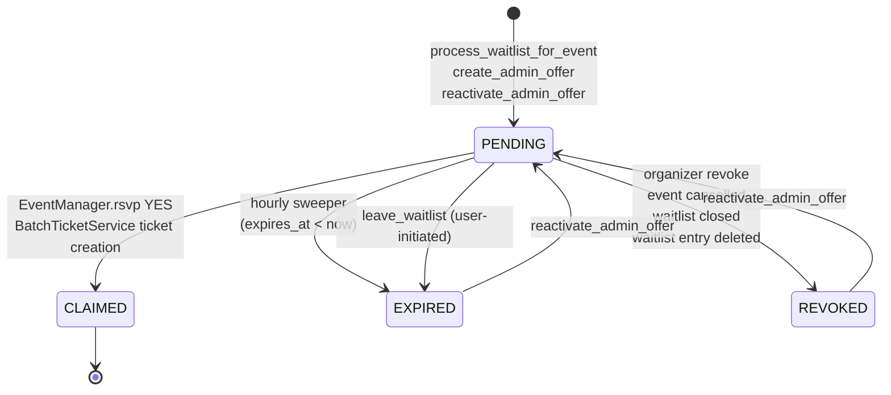
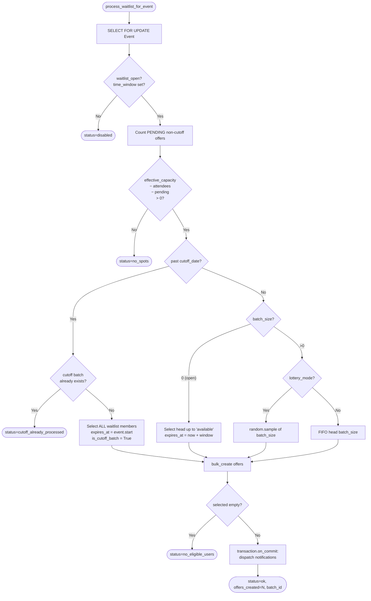

# Advanced Waitlist Management

The advanced waitlist replaces the legacy passive `EventWaitList` queue with a configurable, **batched, time-limited offer** flow. When capacity opens, the system selects a batch of waitlist members (FIFO or lottery), notifies them with an expiry deadline, and **reserves** their seats during the notification window so non-waitlist users can't squeeze in.

The feature is **opt-in per event**: setting `Event.waitlist_time_window` to a non-null duration turns it on. When it's `NULL`, the event keeps the legacy passive behavior (users join the waitlist but no offers are ever issued).

!!! danger "This feature interacts with capacity counting"
    Pending unexpired offers count toward `Event.effective_capacity` in both [`AvailabilityGate`](eligibility-pipeline.md#10-availabilitygate) and the row-locked `_assert_capacity()` check. Changes to the offer model or selection algorithm can directly affect whether non-waitlist users can register. Review the [Race-safety](#race-safety) section before touching the writers.

---

## Overview

### The legacy waitlist (still supported)

The legacy waitlist is a one-table queue: `EventWaitList(event, user)`. Users join when an event is full. There is no callback — organizers manually scan the queue, the system never reaches out. The relevant gate (`AvailabilityGate`) only knows about `attendee_count` and surfaces `JOIN_WAITLIST` / `WAIT_FOR_OPEN_SPOT`.

Events keep this behavior whenever `waitlist_time_window IS NULL`. Migration `0073_advanced_waitlist` is backwards compatible: existing events default to the legacy mode and continue to work exactly as before.

### The active waitlist (this feature)

When `waitlist_time_window` is set, the system layers an **offer model** on top of the queue:

1. A capacity-freeing event (cancellation, refund, RSVP change, settings update) calls `enqueue_waitlist_processing(event_id)`.
2. The Celery task `events.process_waitlist_for_event` locks the event row, computes available capacity (accounting for pending offers), and either creates a fresh batch of `WaitlistOffer` rows or returns a no-op.
3. Each offer holder receives a `WAITLIST_SPOT_AVAILABLE` notification with an expiry deadline.
4. Within the window, the offer holder can register normally (RSVP YES or buy a ticket); the existing capacity gates **pass** because their own offer is netted out of the reserved pool.
5. On successful registration, the offer is flipped `PENDING → CLAIMED` and the user's `EventWaitList` row is removed.
6. Unclaimed offers expire on the hourly sweeper or are revoked by an admin; either path enqueues another processing pass so the next batch can go out.

---

## Opt-in & configuration

Five fields on `Event` configure the active waitlist (`src/events/models/event.py`):

| Field | Type | Effect |
|---|---|---|
| `waitlist_open` | `bool` | Master switch — opens the queue. Independent of `waitlist_time_window`. |
| `waitlist_time_window` | `Duration \| NULL` | **Activates** the advanced waitlist. `NULL` = legacy passive mode. Bounded to `[1h, 7d]`. |
| `waitlist_batch_size` | `PositiveInt` | Number of users to notify per round. `0` = **open mode** — notify every eligible waitlist member at once, up to `available`. |
| `waitlist_cutoff_date` | `DateTime \| NULL` | After this datetime, batching stops. One final "all-hands" batch fires (`is_cutoff_batch=True`), then `AvailabilityGate` resumes normal first-come behavior. |
| `waitlist_lottery_mode` | `bool` | If `True`, randomly sample batch members instead of taking the FIFO head. Cutoff overrides lottery. |

### Validation rules (`Event.clean()`)

`Event._clean_waitlist_config()` enforces:

- `waitlist_time_window`, when set, is between `1h` and `7d`.
- `waitlist_cutoff_date` requires `waitlist_time_window` to also be set.
- `waitlist_cutoff_date` is strictly before `event.start`.

!!! note "Editing settings mid-flight is allowed"
    Settings can be edited while batches are in flight. Existing in-flight offers retain their original `expires_at`. Future batches use the new config. The only special transition is `waitlist_open: True → False`, which proactively REVOKES all pending offers so seats return immediately to the public pool (see `update_waitlist_settings` and `update_event` in `event_admin/`).

### Configuration matrix

| `waitlist_open` | `waitlist_time_window` | `waitlist_batch_size` | `waitlist_cutoff_date` | Behavior |
|---|---|---|---|---|
| `False` | any | any | any | Waitlist closed. Joining returns 400. |
| `True` | `NULL` | any | `NULL` | **Legacy passive waitlist.** No offers. No notifications. |
| `True` | `2h` | `0` | `NULL` | **Open active mode.** When seats free, every eligible queue member is notified at once. |
| `True` | `2h` | `5` | `NULL` | **Batched FIFO.** First 5 in queue get a 2-hour offer each batch. |
| `True` | `2h` | `5` | event.start - 6h | **Batched FIFO with cutoff.** Six hours before start, switches to an all-hands batch expiring at `event.start`. |
| `True` | `2h` | `5` | event.start - 6h, `lottery=True` | Same as above but each batch is sampled at random until cutoff. |

---

## Data model

The advanced waitlist uses **two** tables: one for the queue and one for the time-bounded reservation.

### `EventWaitList` — the queue

Unchanged from the legacy design. One row per `(event, user)`. `created_at` defines FIFO ordering.

### `WaitlistOffer` — the reservation

```python
class WaitlistOffer(TimeStampedModel):
    class WaitlistOfferStatus(models.TextChoices):
        PENDING = "pending", "Pending"
        CLAIMED = "claimed", "Claimed"
        EXPIRED = "expired", "Expired"
        REVOKED = "revoked", "Revoked"

    event = models.ForeignKey(Event, related_name="waitlist_offers", ...)
    user = models.ForeignKey(..., related_name="waitlist_offers")
    status = models.CharField(choices=WaitlistOfferStatus.choices, default=PENDING, db_index=True)
    expires_at = models.DateTimeField(db_index=True)
    batch_id = models.UUIDField(db_index=True)
    notified_at = models.DateTimeField(null=True, blank=True)
    claimed_at = models.DateTimeField(null=True, blank=True)
    is_cutoff_batch = models.BooleanField(default=False)
```

The partial unique constraint guarantees **at most one PENDING offer per `(event, user)`**:

```python
models.UniqueConstraint(
    fields=["event", "user"],
    condition=models.Q(status="pending"),
    name="unique_pending_waitlist_offer",
)
```

This is what makes the offer-aware capacity arithmetic safe — a single user can never reserve two seats simultaneously, and admin-side reactivations / manual creates fail loudly (`IntegrityError`) if they would violate it.

### State machine



!!! note "PENDING is the only reserved state"
    Only PENDING (with `expires_at > now` and `is_cutoff_batch=False`) reserves capacity. Every other state — including a still-PENDING-but-time-expired offer — is functionally inert in the gate and `_assert_capacity()`. The hourly sweeper's only job is to make the lifecycle explicit; correctness of read paths does not depend on its cadence.

---

## Capacity & reservation semantics

The defining trait of the advanced waitlist is that **pending offers count toward capacity**. Two layers compute capacity, and both apply the same arithmetic:

- `AvailabilityGate` (`events/service/event_manager/gates.py`) — in-memory check on prefetched data, zero DB queries on the fast path.
- `EventManager._assert_capacity()` (`events/service/event_manager/manager.py`) and `BatchTicketService._assert_event_capacity()` (`events/service/batch_ticket_service.py`) — final authoritative checks inside a row-locked transaction.

The arithmetic in both places is:

```
held = count(PENDING offers WHERE expires_at > now AND is_cutoff_batch = False)
if user has their own such offer:
    held -= 1
if attendee_count + held >= effective_capacity:
    reject
```

Where `attendee_count` is the count of non-cancelled tickets (for ticketed events) or YES RSVPs (for RSVP events) — **unchanged** from the legacy contract.

### Why a user's own offer is netted out

A pending offer is a seat **reserved for that user**, not from them. If we didn't subtract their own offer from `held`, the user could never claim their own seat — the capacity check would always show "full". See `_pending_offer_count_for_check()` in `gates.py` and the symmetric `has_own_offer` branch in `manager.py::_assert_capacity`.

### Cutoff offers do NOT reserve

Cutoff offers (`is_cutoff_batch=True`) are explicitly excluded from the `held` count. They compete first-come-first-served against any remaining real seats — winners pass `_assert_capacity()`, losers get the regular `EVENT_IS_FULL` rejection. This is what lets the cutoff "all-hands" batch outnumber the available capacity safely (see [Selection algorithm](#selection-algorithm) below).

### `attendee_count` is unchanged

The denormalized `Event.attendee_count` field still tracks **committed** attendees only. Reservation lives entirely in the offers table. The legacy `build_attendee_visibility_flags` task and any analytics that count "real" attendees are unaffected.

### What the user sees

| Scenario | Reason | NextStep |
|---|---|---|
| Capacity available | — | allowed |
| Full on attendees alone, user not on waitlist, waitlist open | `EVENT_IS_FULL` | `JOIN_WAITLIST` |
| Full on attendees alone, user already on waitlist | `EVENT_IS_FULL` | `WAIT_FOR_OPEN_SPOT` |
| Full because of reserved offers, user **not** on waitlist | `SPOTS_RESERVED_FOR_WAITLIST` | `JOIN_WAITLIST` |
| Full because of reserved offers, user on waitlist (no offer) | `ON_WAITLIST_WAITING_FOR_BATCH` | `WAIT_FOR_OPEN_SPOT` |
| User holds a PENDING unexpired offer | — | allowed; `active_offer_expires_at` populated |
| Post-cutoff, normal rules | `EVENT_IS_FULL` | (no next step beyond JOIN_WAITLIST) |

`AvailabilityGate.check()` populates `pending_offers_count`, `next_batch_at` (earliest non-cutoff PENDING expiry, resolved into the user's timezone), and `waitlist_position` (1-based FIFO position when on the waitlist).

---

## Selection algorithm

`process_waitlist_for_event(event_id)` in `events/service/waitlist_service.py` is the **single entrypoint** for batch creation. It is decorated `@transaction.atomic` and acquires `SELECT FOR UPDATE` on the Event row first, which serializes concurrent invocations for the same event.



### Key invariants

- **Disabled / no-spots short-circuit** before any selection work. Cheap idempotent re-runs are free.
- **Excludes users who already hold a PENDING offer** via `.exclude(user__waitlist_offers__status=PENDING)`. The unique partial constraint on `WaitlistOffer` would otherwise reject the bulk-create on duplicates.
- **Cutoff branch** is one-shot. The second call after cutoff returns `cutoff_already_processed` and lets `AvailabilityGate` take over for the rest of the event lifetime. Cutoff offers expire at **`event.start`**, not at `now + window`.
- **Notifications fire on `transaction.on_commit`** to avoid sending offers for a rolled-back batch.

### Idempotency

The Event row lock at the top of `process_waitlist_for_event` serializes concurrent calls. A second concurrent invocation either:

1. Sees `available <= 0` after the first commits (typical) → returns `no_spots`.
2. Sees `cutoff_already_processed` → returns no-op.
3. Sees fresh capacity → creates the next batch.

This is what makes the helper `enqueue_waitlist_processing(event_id)` safe to call **multiple times in a single transaction** and from any path. The Celery wrapper task (`events.process_waitlist_for_event`) is a thin shim — see [`tasks.py`](#celery-tasks).

---

## Triggering

Every code path that can **free capacity** explicitly calls `enqueue_waitlist_processing(event_id)`. The helper wraps the dispatch in `transaction.on_commit`, so it's safe to call from inside any atomic block — the task only fires if the surrounding transaction commits.

!!! note "Explicit calls, not signals"
    The design uses explicit enqueues at each capacity-freeing site rather than broad `post_save` signals. This makes the dataflow greppable (`grep -r enqueue_waitlist_processing src/`), keeps the trigger surface visible during code review, and avoids accidentally firing on saves that don't actually free a seat. The one exception is the `post_delete` signal on `EventWaitList` — see [Soft-lock defense](#soft-lock-defense).

### Trigger sites

| Path | Source | Reason |
|---|---|---|
| User cancels own ticket | `service/cancellation_service.py::cancel_ticket_by_user` | Ticket → CANCELLED frees a seat |
| Admin refunds ticket (offline) | `controllers/event_admin/tickets.py::refund_ticket` | Same |
| Admin cancels ticket (offline) | `controllers/event_admin/tickets.py::cancel_ticket` | Same |
| Stripe refund webhook | `service/stripe_webhooks.py` (dedup per event) | Async cancellation path |
| Stripe checkout cancel | `service/stripe_service.py::cancel_checkout` | Releases reserved capacity |
| User RSVP YES → non-YES | `service/event_manager/manager.py::rsvp` | Seat freed |
| Admin RSVP create/update YES → non-YES | `controllers/event_admin/rsvps.py` | Seat freed |
| Admin deletes a YES RSVP | `controllers/event_admin/rsvps.py::delete_rsvp` | Seat freed |
| Capacity increased | `controllers/event_admin/core.py::update_event` | `max_attendees` ↑ or venue capacity ↑ |
| Event un-cancelled | `controllers/event_admin/core.py::update_event_status` | `CANCELLED` → other status restores meaningful capacity |
| Waitlist join (self-heal) | `controllers/event_public/attendance.py::join_waitlist` | Race with concurrent cancellation could leave the joiner first in line with seats already free |
| Leave-waitlist while holding an offer | `controllers/event_public/attendance.py::leave_waitlist` | EXPIRES the offer, then enqueues |
| Offer claim (defensive nudge) | `service/event_manager/manager.py::_claim_active_offer` and `service/batch_ticket_service.py::_claim_waitlist_offer_if_any` | Other unclaimed offers in the batch could otherwise strand seats |
| Offer expiry sweeper | `tasks.py::expire_waitlist_offers_task` | Per affected event after bulk EXPIRE |
| Hourly safety net | `tasks.py::nudge_open_waitlists_task` | See [Soft-lock defense](#soft-lock-defense) |
| Admin revokes a pending offer | `controllers/event_admin/waitlist_offers.py::revoke_waitlist_offer` | Returns the seat |
| `EventWaitList` row deleted | `signals.py::handle_waitlist_entry_deleted` (`post_delete`) | REVOKES the matching PENDING offer and enqueues |

### Trigger semantics

- `enqueue_waitlist_processing(event_id)` uses `transaction.on_commit` — safe to call multiple times in one transaction; the broker still only sees one job per call but the underlying processor is idempotent.
- `enqueue_waitlist_processing` is a **no-op** outside an atomic block (the `on_commit` hook fires immediately when there is no transaction) — every caller is in one in practice.
- The processor's Event row lock means concurrent enqueues for the same event are serialized server-side; only one batch can land at a time.

---

## Claim flow

Claiming is **implicit**. A user who holds a PENDING unexpired offer registers like any other user — RSVP YES or buy a ticket — and the registration path flips the offer to CLAIMED as a bookkeeping step. The user is not gated by `AvailabilityGate` because the gate already netted their own offer out of the held pool.

Two symmetric implementations:

### `EventManager._claim_active_offer()`

Called inside `EventManager.rsvp()` immediately after a successful RSVP YES (`src/events/service/event_manager/manager.py:89-119`):

```python
offer = (
    WaitlistOffer.objects.select_for_update()
    .filter(event=..., user=..., status=PENDING, expires_at__gt=now)
    .first()
)
if offer is None:
    return
offer.status = WaitlistOffer.WaitlistOfferStatus.CLAIMED
offer.claimed_at = now
offer.save(update_fields=["status", "claimed_at"])
EventWaitList.objects.filter(event=..., user=...).delete()
enqueue_waitlist_processing(self.event.id)  # defensive nudge
```

### `BatchTicketService._claim_waitlist_offer_if_any()`

Called inside `BatchTicketService._create_tickets()` after `bulk_create` (`src/events/service/batch_ticket_service.py:591-625`). Same shape as above. Fires on **PENDING-ticket creation** too (online checkout) because the PENDING ticket already counts toward capacity — without claiming the offer here, the user would consume two capacity slots.

### Post-delete cleanup

When the claim deletes the `EventWaitList` row, the `post_delete` signal on `EventWaitList` (`signals.py::handle_waitlist_entry_deleted`) is **idempotent**: it only revokes PENDING offers via a conditional UPDATE. Since the claim flow flipped status to CLAIMED **before** deleting the row, the signal's UPDATE matches zero rows and is a no-op — no double-bookkeeping. The signal exists because `EventWaitList` rows are also deleted from other paths (admin delete, `leave_waitlist`, ad-hoc ORM filters) where the offer **does** need revoking.

---

## Notifications

The advanced waitlist reuses the existing `WAITLIST_SPOT_AVAILABLE` notification type. See [Notifications](notifications.md) for the channel architecture.

### Dispatch

`process_waitlist_for_event` calls `_dispatch_offer_notifications(offer_ids)` on commit, which enqueues `events.send_waitlist_offer_notification` once per offer. The task (`tasks.py::send_waitlist_offer_notification_task`):

1. Reloads the offer with `select_related("user", "event__organization")`.
2. **Skips** if status is no longer PENDING (race with sweeper/claim/revoke) or if `expires_at <= now`.
3. Resolves `expires_at` and `event.start` into the event's timezone via `get_event_timezone(offer.event)`.
4. Builds the context (see below) and sends `notification_requested` with `notification_type=WAITLIST_SPOT_AVAILABLE`.
5. Writes `notified_at = timezone.now()` to the offer.

### Notification context

| Field | Example |
|---|---|
| `event_id`, `event_name`, `event_url` | Routing data |
| `event_start`, `event_start_formatted` | Localized event start |
| `organization_id`, `organization_name` | For UI grouping |
| `offer_id` | For deep-linking the user to their offer |
| `expires_at`, `expires_at_formatted` | Deadline (event timezone) |
| `time_remaining_formatted` | `naturaltime(expires_at)` — e.g. "in 23 hours" |
| `is_cutoff_batch` | Templates render a different copy for cutoff batches |

Templates live under `notifications/templates/notifications/{email,in_app,telegram}/waitlist_spot_available.*`. The cutoff variant uses `` to render the "final call" copy.

!!! note "No expiry notification"
    The offer itself states the deadline. We do not send a separate "your offer expired" notification — it would be noise for users who didn't intend to claim, and would arrive after the seat was already returned to the pool.

---

## Admin endpoints

`EventAdminWaitlistOffersController` (`src/events/controllers/event_admin/waitlist_offers.py`) is mounted under `/event-admin/{event_id}/...` with class-level `manage_event` permission and `WriteThrottle`. The list endpoint relaxes the permission to `invite_to_event`.

| Method | Path | Permission | Purpose |
|---|---|---|---|
| `GET` | `/waitlist-settings` | `manage_event` | Returns `WaitlistSettingsSchema` |
| `PATCH` | `/waitlist-settings` | `manage_event` | Updates waitlist config. `waitlist_open: True → False` revokes pending offers. |
| `GET` | `/waitlist-offers` | `invite_to_event` | Paginated `WaitlistOfferSchema`, filterable by status |
| `POST` | `/waitlist-offers` | `manage_event` | Manually create an offer for an existing `EventWaitList` entry |
| `POST` | `/waitlist-offers/{offer_id}/revoke` | `manage_event` | Flip a PENDING offer to REVOKED and enqueue the next batch |
| `POST` | `/waitlist-offers/{offer_id}/reactivate` | `manage_event` | Reopen an EXPIRED or REVOKED offer (capacity-checked) |

### Capacity-aware admin overrides

Both `create_admin_offer` and `reactivate_admin_offer` (in `waitlist_service.py`) lock the Event row first, recompute `attendee_count + non-cutoff PENDING`, and raise `ValueError("capacity")` if creating/reactivating would breach `effective_capacity`. The controller maps this to **HTTP 409 Conflict** with a hint to revoke an existing pending offer.

The unique partial constraint (`unique_pending_waitlist_offer`) is enforced at the database layer. If another writer lands a PENDING offer for the same `(event, user)` between the controller's existence check and the save, the `IntegrityError` is mapped to **HTTP 409 Conflict**.

### Lock ordering

`reactivate_admin_offer` locks the **Event row first**, then the offer row:

```python
event = Event.objects.select_for_update().get(pk=event_id)
offer = WaitlistOffer.objects.select_for_update().get(pk=offer_id, event_id=event_id)
```

This matches the lock order in every other writer in this module (`process_waitlist_for_event`, `_assert_capacity`, `_assert_event_capacity`, `create_admin_offer`) and avoids deadlock with concurrent claim flows. See [Race-safety](#race-safety).

---

## Eligibility integration

### New `Reasons` (`events/service/event_manager/enums.py`)

```python
SPOTS_RESERVED_FOR_WAITLIST = gettext_noop("Spots are currently reserved for waitlist members.")
ON_WAITLIST_WAITING_FOR_BATCH = gettext_noop("You are on the waitlist. Waiting for your turn.")
```

### `NextStep`

No new values. When a user holds an active offer, `AvailabilityGate` lets them through with `allowed=True` (no `next_step`); the offer details land in the new `EventUserEligibility` fields below.

### New `EventUserEligibility` fields (`events/service/event_manager/types.py`)

| Field | Populated when |
|---|---|
| `pending_offers_count` | `AvailabilityGate` returns full — total non-cutoff PENDING offers (excluding user's own) |
| `next_batch_at` | Earliest non-cutoff PENDING `expires_at`, resolved into user's timezone |
| `waitlist_position` | User is on the waitlist (1-based FIFO position) |
| `active_offer_expires_at` | User holds their own PENDING unexpired offer; populated even on `allowed=True` responses so the frontend can render the countdown |

### `Event` schema (`events/schema/event.py`)

The public `EventSchema` gains:

```python
seats_held: int = 0
```

Resolved via the prefetched `pending_waitlist_offer_count` annotation (non-cutoff PENDING unexpired offers), with a fallback to a direct COUNT query when the annotation isn't present. This lets the frontend show "12 seats held by waitlist" on listings without an extra round-trip.

### EligibilityService prefetching

`EligibilityService.__init__` (`events/service/event_manager/service.py:98-121`) annotates the event with `pending_waitlist_offer_count` and resolves `self.active_waitlist_offer` (the user's own PENDING unexpired offer for this event, or `None`) in a single query. Both are consumed by `AvailabilityGate` with zero further queries on the fast path.

See [Eligibility Pipeline → AvailabilityGate](eligibility-pipeline.md#10-availabilitygate) for the gate's place in the overall pipeline.

---

## Soft-lock defense

A **soft-lock** is a state where the waitlist has eligible members and the event has freed seats, but no trigger fires because the freeing event was external (e.g., a manual DB edit, a Celery task that timed out before its `on_commit`, an out-of-band cancellation). Two layers defend against this:

### Defensive nudge on every claim

`_claim_active_offer` and `_claim_waitlist_offer_if_any` both call `enqueue_waitlist_processing(event_id)` immediately after a successful claim, even though the claim itself doesn't free a seat. The rationale: if a batch had 5 offers and only 3 claimed, the remaining 2 must EXPIRE before their seats are returned. The defensive nudge at claim time ensures **as soon as one user claims**, a new processing pass runs — which is a cheap no-op when there's nothing to do (the processor short-circuits on `available <= 0`).

### Hourly nudge task

`tasks.py::nudge_open_waitlists_task` runs hourly at minute 30 (offset from the expiry sweeper at minute 0 to avoid lock contention) and enqueues `process_waitlist_for_event_task` for every event with `waitlist_open=True AND waitlist_time_window IS NOT NULL`. The processor is idempotent, so this is a cheap safety net that catches any soft-lock within an hour.

!!! warning "Both layers are needed"
    The claim-time nudge handles the common case (a batch with mixed claim/expiry). The hourly task is the **belt-and-suspenders** for unanticipated state — code paths added later that forget to enqueue, manual DB edits, anything we didn't think of. Removing either layer is not safe.

---

## Race-safety

Every writer that touches capacity or offers acquires locks in the same order:

1. `SELECT FOR UPDATE` on the **Event row** first.
2. `SELECT FOR UPDATE` on the relevant child rows (Ticket, EventRSVP, WaitlistOffer) second.

Writers that follow this order:

- `process_waitlist_for_event` (`waitlist_service.py`)
- `create_admin_offer` (`waitlist_service.py`)
- `reactivate_admin_offer` (`waitlist_service.py`)
- `EventManager._assert_capacity` (`event_manager/manager.py`)
- `BatchTicketService._assert_event_capacity` (`batch_ticket_service.py`)
- `EventManager._claim_active_offer` (`event_manager/manager.py`)
- `BatchTicketService._claim_waitlist_offer_if_any` (`batch_ticket_service.py`)

Because the Event row is the **single common ancestor** of all concurrent flows, locking it first means at most one writer can be inside the critical section per event at a time, and deadlocks between concurrent writers are impossible.

!!! danger "Lock order matters"
    Any new writer that touches `WaitlistOffer` rows must lock the Event row first. The most recent fix in this area (`5029f35: consistent lock order in reactivate_admin_offer`) addressed exactly this — the previous version locked the offer first, which could deadlock against a concurrent `_assert_capacity` that locked the event first then tried to lock the offer.

### Why cutoff offers safely outnumber capacity

The cutoff batch deliberately notifies **every** eligible waitlist member, which can exceed available seats. This works because:

- Cutoff offers are excluded from the reserved `held` count (the `is_cutoff_batch=False` filter in `_pending_offer_count_for_check`, `_assert_capacity`, `_assert_event_capacity`, and `process_waitlist_for_event`).
- Concurrent claims serialize on the Event row lock in `_assert_capacity` / `_assert_event_capacity`.
- The first N claimers (where N = real available seats) pass. The (N+1)th sees `attendee_count >= effective_capacity` and gets `EVENT_IS_FULL`.

The cutoff batch is therefore a controlled FCFS race, not a reservation.

---

## Celery tasks

All defined in `src/events/tasks.py`.

| Task | Schedule | Purpose |
|---|---|---|
| `events.process_waitlist_for_event` | On-demand (via `enqueue_waitlist_processing`) | Wraps `process_waitlist_for_event(uuid)`; idempotent |
| `events.expire_waitlist_offers` | Hourly @ `minute=0` UTC (migration `0074`) | Flip PENDING offers with `expires_at <= now` to EXPIRED, then enqueue one process pass per affected event |
| `events.nudge_open_waitlists` | Hourly @ `minute=30` UTC (migration `0075`) | Safety net: enqueue process for every event with the advanced waitlist active |
| `events.send_waitlist_offer_notification` | On-demand (per offer, on commit) | Dispatches `WAITLIST_SPOT_AVAILABLE`. Skips if status drifted from PENDING or if the offer has already expired by the time the task runs. |

### Sweeper details

`expire_waitlist_offers_task` uses a single `SELECT FOR UPDATE` + `UPDATE ... SET status=EXPIRED` for atomicity. Note that PostgreSQL rejects `FOR UPDATE` with `DISTINCT`, so the task materializes event IDs and de-duplicates in Python before enqueuing follow-up processing.

Read paths defensively filter `expires_at > now` everywhere, so the **sweeper's cadence only affects the timing of the next-batch enqueue, not correctness**. A PENDING row whose `expires_at` has passed is already inert in capacity arithmetic.

---

## Lifecycle examples

### Example 1: Batched FIFO, partial claim

Setup: ticketed event, `effective_capacity=10`, `attendee_count=10`, `waitlist_open=True`, `waitlist_time_window=2h`, `waitlist_batch_size=3`, lottery off. Three users on the waitlist: A (joined first), B, C, D, E (in FIFO order).

1. A registered attendee cancels their ticket.
   - `cancellation_service.cancel_ticket_by_user` flips Ticket → CANCELLED and calls `enqueue_waitlist_processing(event_id)`.
2. `process_waitlist_for_event` runs.
   - Locks Event row. `pending=0`, `attendee_count=9`, `available=1`.
   - Wait, but `batch_size=3` and `available=1` → `batch_count = min(3, 1) = 1`.
   - Picks A. Creates one `WaitlistOffer(status=PENDING, expires_at=now+2h, batch_id=u1, is_cutoff_batch=False)`.
3. On commit, `send_waitlist_offer_notification` dispatches `WAITLIST_SPOT_AVAILABLE` to A.
4. From this moment, the gate shows `attendee_count=9`, `held=1`, `effective=10` → `SPOTS_RESERVED_FOR_WAITLIST` for any new visitor.
5. A clicks the link, RSVPs YES.
   - `_assert_capacity` locks the Event row, computes `count=9`, `pending=1`, `has_own_offer=True`, so `pending → 0`. `9 + 0 < 10` → passes.
   - RSVP created. `_claim_active_offer` flips the offer to CLAIMED, deletes A's `EventWaitList` row, and enqueues a defensive nudge.
6. The nudge processes — `attendee_count=10`, no free seats → `no_spots`. No-op.

### Example 2: Cutoff batch with contention

Setup: same as Example 1, but `waitlist_cutoff_date = event.start - 1h`. Now `now > cutoff_date`. Two seats still free, waitlist has [B, C, D].

1. The first `process_waitlist_for_event` after cutoff runs.
   - `past_cutoff=True`, no existing cutoff-batch row.
   - Selects **all** of [B, C, D]. Creates three offers with `expires_at = event.start`, `is_cutoff_batch=True`, same `batch_id`.
2. All three users are notified.
3. B and C both click immediately. The first one's RSVP YES lands → `count=10`, gate passes for them. The second one races: `_assert_capacity` locks the Event row, sees `count=10`, `pending=0` (cutoff offers excluded), returns `EVENT_IS_FULL`. The second user sees a polite error.
4. D arrives, sees the same `EVENT_IS_FULL`.
5. The remaining offers stay PENDING until `event.start`, then the sweeper flips them to EXPIRED. Since the event is past, no further processing happens.

### Example 3: Soft-lock recovery

Setup: as in Example 1. A batch of 3 was issued. Only one user claimed; the other two abandoned.

- Defensive nudge at claim time fires `process_waitlist_for_event`. `pending=2 (still PENDING for the abandoners), attendee_count=8, available=0`. No-op.
- 2 hours later, the sweeper runs. Two offers → EXPIRED. The sweeper enqueues one `process_waitlist_for_event` for the affected event.
- The processor sees `pending=0, attendee_count=8, available=2`, batch size=3 → creates 2 new offers (capped at `available`).

If the sweeper run had somehow been missed (broker outage, etc.), the **hourly nudge task** at `minute=30` would catch it on the next cycle.

---

## Operational notes

### Organizer view

- The waitlist offers admin endpoint exposes everything an organizer needs to inspect or override the system: list by status, manually create offers from queue entries, revoke pending offers, reactivate expired/revoked offers with a new deadline.
- `WaitlistSettingsSchema` (`schema/waitlist.py`) is the single source of truth for the configuration form. Updating it via `PATCH` immediately affects future batches; in-flight batches keep their original timing.
- Capacity-aware overrides: admins are protected from accidentally overcommitting capacity via manual offer creation. The 409 response means "revoke an existing pending offer first."
- Closing the waitlist (`waitlist_open: True → False`) is explicit and revokes pending offers immediately. The action is logged via the standard admin trail.

### Attendee view

- Users on a full event see the legacy `EVENT_IS_FULL` only when both attendees and reservations are fully committed. The new copy `SPOTS_RESERVED_FOR_WAITLIST` (with a `next_batch_at` hint) appears when seats exist but are held by other waitlist members.
- A user holding an active offer hits `allowed=True` with `active_offer_expires_at` populated — the frontend renders a countdown.
- `/events/{id}/my-status` (`event_public/attendance.py::get_my_event_status`) is the single endpoint that surfaces all of this. The frontend reads `EventUserEligibility` fields directly.
- `seats_held` is exposed on the public `Event` schema for listing pages.

### Joining the waitlist

`POST /events/{id}/waitlist/join` (`event_public/attendance.py::join_waitlist`) is more strict than the legacy implementation:

1. Returns **409 Conflict** if the event has capacity right now (the FE should refresh and let the user register directly).
2. Returns 4xx with `EventUserEligibility` if the user fails any other gate (blacklist, invitation, membership, etc.) — joining the waitlist when you can't claim an offer would be a dead end.
3. Otherwise creates the `EventWaitList` row idempotently and **self-heals** by enqueuing a processing pass (in case a cancellation landed between page load and click).

### Leaving the waitlist

`DELETE /events/{id}/waitlist/leave` flips any PENDING unexpired offer to EXPIRED in the same atomic block, then deletes the queue entry. If the user had a held seat, `enqueue_waitlist_processing` runs so the next user gets the seat. The `post_delete` signal's REVOKE is a no-op here because the offer was already EXPIRED before the row deletion.

---

## Related reading

- [Eligibility Pipeline](eligibility-pipeline.md) — `AvailabilityGate` is gate 10 and consumes the offer-aware capacity math described here.
- [Notifications](notifications.md) — `WAITLIST_SPOT_AVAILABLE` lives in the standard multi-channel dispatcher.
- [Service Layer](service-layer.md) — `waitlist_service.py` follows the function-based service pattern; `BatchTicketService` (which holds the claim hook for ticket flows) is the class-based counterpart.
