# Internationalization (i18n)

Revel supports multiple languages with full translation coverage across API responses, emails, and notifications.

## Supported Languages

| Code | Language | Style |
|---|---|---|
| `en` | English | Default |
| `de` | German | Informal ("du") |
| `it` | Italian | Informal ("tu") |

---

## How It Works

```mermaid
flowchart LR
    A[User.language field] --> B[I18nJWTAuth middleware]
    B --> C[django.utils.translation.activate]
    C --> D[All _&#40;&#41; strings resolve in user's language]
    D --> E[API response / Email / Notification]
```



1. **User preference**: The `User.language` field stores each user's language preference
2. **Automatic activation**: `I18nJWTAuth` reads the user's language and activates it on every authenticated request
3. **Lazy translation**: All user-facing strings are wrapped with `gettext_lazy` (imported as `_`)
4. **Email templates**: Use `` and `` Django template tags

---

## Developer Workflows

### Adding a New Language

1. Add the language to `LANGUAGES` in Django settings
2. Extract translatable strings:
   ```bash
   make makemessages
   ```
3. Translate the new `.po` file at `src/locale/{lang}/LC_MESSAGES/django.po`
4. Compile translations:
   ```bash
   make compilemessages
   ```
5. Commit both `.po` and `.mo` files

### Updating Existing Translations

```bash
# 1. Extract new/changed strings
make makemessages

# 2. Translate new strings in .po files
#    (look for empty msgstr entries)

# 3. Compile to binary .mo files
make compilemessages

# 4. Commit both .po and .mo files
git add src/locale/
git commit -m "chore(i18n): update translations"
```

---

## File Structure

```
src/locale/
├── de/
│   └── LC_MESSAGES/
│       ├── django.po    # German translations (source)
│       └── django.mo    # German translations (compiled)
├── en/
│   └── LC_MESSAGES/
│       ├── django.po
│       └── django.mo
└── it/
    └── LC_MESSAGES/
        ├── django.po
        └── django.mo
```

---

## Rules & Best Practices

!!! success "Do"
    - **Always** use `I18nJWTAuth` for authenticated endpoints -- it activates the user's language automatically
    - **Always** wrap user-facing strings with `_()`
    - **Always** call `str()` on lazy translations when used in API responses (e.g., in serializers or plain dicts)
    - **Always** commit `.mo` files to git (see rationale below)
    - Use `.format()` for string interpolation with translations:
      ```python
      _("Welcome, {name}!").format(name=user.first_name)
      ```

!!! failure "Don't"
    - **Don't** translate log messages or developer-facing content
    - **Don't** hardcode user-facing strings -- always use `_()`
    - **Don't** use f-strings with `_()` -- the variable parts won't be extracted:
      ```python
      # Bad - f-string breaks extraction
      _(f"Welcome, {name}!")

      # Good - use .format() instead
      _("Welcome, {name}!").format(name=name)
      ```

!!! info "Why .mo Files Are in Git"
    Unlike traditional Django projects, Revel commits compiled `.mo` files to version control. This ensures deployment environments don't need `gettext` installed and eliminates a build step. See **ADR-0007** for the full rationale.

---

## Troubleshooting

### Translations Not Showing

| Check | Fix |
|---|---|
| `.mo` files exist and are up to date | Run `make compilemessages` |
| User has correct language set | Verify `User.language` field |
| Endpoint uses `I18nJWTAuth` | Switch from plain `JWTAuth` to `I18nJWTAuth` |
| String is wrapped with `_()` | Add the `_()` wrapper |
| Lazy translation resolved to string | Call `str()` on the value |

### CI Failing on i18n Check

The CI pipeline runs `make i18n-check` to verify `.mo` files match `.po` sources. If it fails:

```bash
# Recompile and commit
make compilemessages
git add src/locale/
git commit -m "chore(i18n): recompile .mo files"
```

### Variables Not Interpolated

```python
# Problem: {name} appears literally in output
message = _("Hello, {name}!")

# Solution: call .format() after translation
message = _("Hello, {name}!").format(name=user.first_name)
```
