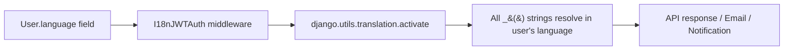

# Internationalization (i18n)

Revel supports multiple languages with full translation coverage across API responses, emails, and notifications.

## Supported Languages

| Code | Language | Style |
|---|---|---|
| `en` | English | Default |
| `de` | German | Informal ("du") |
| `it` | Italian | Informal ("tu") |
| `fr` | French | Informal ("tu") |

---

## How It Works


```mermaid
flowchart LR
    A[User.language field] --> B[I18nJWTAuth middleware]
    B --> C[django.utils.translation.activate]
    C --> D[All _&#40;&#41; strings resolve in user's language]
    D --> E[API response / Email / Notification]
```

1. **User preference**: The `User.language` field stores each user's language preference
2. **Automatic activation**: `I18nJWTAuth` reads the user's language and activates it on every authenticated request
3. **Lazy translation**: All user-facing strings are wrapped with `gettext_lazy` (imported as `_`)
4. **Email templates**: Use `` and `` Django template tags

---

## Developer Workflows

### Adding a New Language

1. Add the language to `LANGUAGES` in Django settings (and to `LANGUAGES` in
   `scripts/check_translations.py`)
2. Extract translatable strings:
   ```bash
   make makemessages
   ```
3. Translate the new `.po` file at `src/locale/{lang}/LC_MESSAGES/django.po`
   (fill every `msgstr`; clear every `fuzzy` flag)
4. Commit the `.po` file only — `.mo` is built automatically (see ADR-0011)

### Updating Existing Translations

```bash
# 1. Extract new/changed strings (deterministic: no POT-Creation-Date churn)
make makemessages

# 2. Translate new strings in .po files
#    (look for empty msgstr entries and `fuzzy` markers)

# 3. Verify the catalog is complete (keys extracted + translated)
make i18n-check

# 4. Commit the .po files (no .mo — they are git-ignored, built in the image)
git add src/locale/
git commit -m "chore(i18n): update translations"
```

!!! warning "Don't commit `.mo` files"
    Compiled `.mo` binaries are git-ignored and built during the Docker image
    build (and before tests). Only the `.po` sources are committed. See
    [ADR-0011](../adr/0011-mo-files-built-not-committed.md).

---

## File Structure

```
src/locale/
├── de/
│   └── LC_MESSAGES/
│       └── django.po    # German translations (source; .mo built, not committed)
├── it/
│   └── LC_MESSAGES/
│       └── django.po    # Italian translations (source; .mo built, not committed)
└── fr/
    └── LC_MESSAGES/
        └── django.po    # French translations (source; .mo built, not committed)
```

!!! note "No English locale directory"
    English is the source language. Translatable strings are written in English directly in the code, so there is no `en/` locale directory.

---

## Rules & Best Practices

!!! success "Do"
    - **Always** use `I18nJWTAuth` for authenticated endpoints. It activates the user's language automatically
    - **Always** wrap user-facing strings with `_()`
    - **Always** call `str()` on lazy translations when used in API responses (e.g., in serializers or plain dicts)
    - **Always** translate every new key (no empty `msgstr`, no `fuzzy`) — CI enforces it
    - Use `.format()` for string interpolation with translations:
      ```python
      _("Welcome, {name}!").format(name=user.first_name)
      ```

!!! failure "Don't"
    - **Don't** translate log messages or developer-facing content
    - **Don't** hardcode user-facing strings; always use `_()`
    - **Don't** use f-strings with `_()`. The variable parts won't be extracted:
      ```python
      # Bad - f-string breaks extraction
      _(f"Welcome, {name}!")

      # Good - use .format() instead
      _("Welcome, {name}!").format(name=name)
      ```

!!! info "Why .mo Files Are NOT in Git"
    Revel does **not** commit compiled `.mo` files. They are built from the `.po`
    sources during the Docker image build (and before tests), while translation
    *completeness* is enforced statically on the `.po` sources by
    `scripts/check_translations.py`. See
    [ADR-0011: Build Compiled Translations, Don't Commit Them](../adr/0011-mo-files-built-not-committed.md)
    for the full rationale (it reverts the earlier
    [ADR-0006](../adr/0006-mo-files-in-git.md)).

---

## Troubleshooting

### Translations Not Showing

| Check | Fix |
|---|---|
| Catalogs compiled locally | Run `make compilemessages` (`.mo` is not committed) |
| User has correct language set | Verify `User.language` field |
| Endpoint uses `I18nJWTAuth` | Switch from plain `JWTAuth` to `I18nJWTAuth` |
| String is wrapped with `_()` | Add the `_()` wrapper |
| Lazy translation resolved to string | Call `str()` on the value |

### CI Failing on i18n Check

The CI pipeline runs `make i18n-check` (`scripts/check_translations.py`), which
verifies the `.po` sources are **complete** — every code string is extracted and
every entry is translated (no empty `msgstr`, no `fuzzy`). If it fails:

```bash
# 1. Extract any missing keys, then translate the empty/fuzzy entries it reports
make makemessages
#    ...edit src/locale/{lang}/LC_MESSAGES/django.po...

# 2. Re-check and commit the .po sources
make i18n-check
git add src/locale/
git commit -m "chore(i18n): complete translations"
```

### Variables Not Interpolated

```python
# Problem: {name} appears literally in output
message = _("Hello, {name}!")

# Solution: call .format() after translation
message = _("Hello, {name}!").format(name=user.first_name)
```
