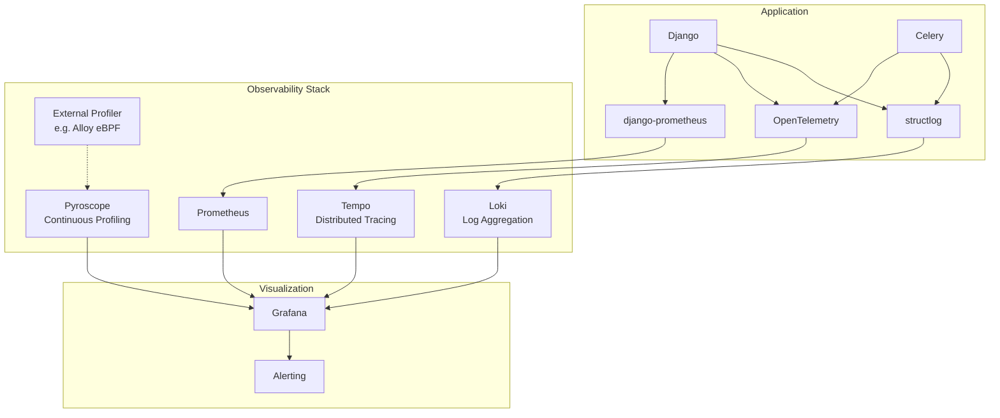

# Observability

Revel uses **Loki, Grafana, Tempo, and Prometheus** plus Pyroscope for comprehensive observability across logs, traces, metrics, and profiling.

---

## Architecture Overview



| Component | Purpose | Retention |
|---|---|---|
| **Loki** | Log aggregation | 30 days |
| **Tempo** | Distributed tracing (OpenTelemetry) | 30 days |
| **Prometheus** | Time-series metrics | 30 days |
| **Pyroscope** | Continuous profiling (flamegraphs) | 30 days |
| **Grafana** | Unified visualization & alerting | -- |

---

## Quick Start

```bash
# Start development services (PostgreSQL, Redis, ClamAV, Mailpit)
docker compose up -d

# Start the observability stack (Loki, Tempo, Prometheus, Grafana, Pyroscope)
docker compose -f docker-compose-observability.yml up -d

# Start Django with observability enabled
make run

# Access the UIs
# Grafana:    http://localhost:3000  (admin / admin)
# Prometheus: http://localhost:9090
# Pyroscope:  http://localhost:4040
```

---

## Structured Logging

Revel uses **structlog** with JSON output, optimized for Loki ingestion.

### Key Features

- **JSON output**: Machine-parseable log events for Loki
- **PII scrubbing**: Automatic redaction of passwords, card numbers, and SSNs. Email addresses in non-email fields are replaced with `[EMAIL]`, but fields named `email` are intentionally preserved for log correlation.
- **Async logging**: `QueueHandler` for non-blocking log emission (~50-100x faster than synchronous)
- **Automatic context enrichment**: Every log event includes contextual fields from middleware

### Enriched Fields

=== "HTTP Requests"

    Fields automatically added by the logging middleware (`StructlogContextMiddleware`):

    | Field | Description |
    |---|---|
    | `request_id` | Unique ID per request |
    | `user_id` | Authenticated user's ID |
    | `ip_address` | Client IP address |
    | `method` | HTTP method (GET, POST, etc.) |
    | `path` | Request path |
    | `trace_id` | OpenTelemetry trace ID (for log-to-trace correlation) |
    | `endpoint` | Resolved Django view name |
    | `organization_id` | Organization context (when available) |

=== "Celery Tasks"

    Fields automatically added for background tasks:

    | Field | Description |
    |---|---|
    | `task_id` | Celery task ID |
    | `task_name` | Task function name |
    | `queue` | Queue the task runs on |
    | `retries` | Current retry count |

### Usage

```python
import structlog

logger = structlog.get_logger(__name__)

# Structured key-value logging
logger.info("ticket_purchased", user_id=user.id, event_id=event.id, tier=tier.name)

# Automatic PII scrubbing
logger.info("login_attempt", email=email, password=password)
# Output: {"event": "login_attempt", "email": "user@example.com", "password": "[REDACTED]"}
# Note: `email` fields are preserved for log correlation; only passwords/cards/SSNs are redacted.
# Email patterns in non-email fields (e.g., a free-text "message" field) are replaced with [EMAIL].
```

---

## Distributed Tracing

OpenTelemetry provides end-to-end tracing across Django requests, Celery tasks, and database queries.

### Auto-Instrumented Components

- Django HTTP requests
- Celery task execution
- PostgreSQL queries
- Redis operations

### Sampling Configuration

| Environment | Sample Rate | Rationale |
|---|---|---|
| Development | 100% | Full visibility for debugging |
| Production | 10% | Balance between visibility and overhead |

Traces are exported via OTLP protocol to Tempo.

---

## Metrics

### Sources

- **django-prometheus**: HTTP request duration, status codes, database connection pool, active requests
- **PostgreSQL exporter**: Database-level metrics (connections, query performance, replication)
- **Redis exporter**: Memory usage, connected clients, command stats

### Metrics Endpoint

```
http://localhost:8000/metrics
```

Exposes Prometheus-format metrics from the Django application.

!!! note "Custom Business Metrics"
    Custom business metrics (ticket sales, payment volumes, evaluation throughput) are planned but not yet implemented.

---

## Profiling

Revel uses **Pyroscope** for continuous profiling with flamegraph visualization.

!!! warning "Pyroscope SDK Incompatibility"
    The Pyroscope Python SDK (`pyroscope-io`) is currently disabled due to incompatibility with Grafana Pyroscope 1.6+. Profiling can be provided externally (e.g., via a Grafana Alloy eBPF agent at the infrastructure level) without requiring SDK integration. This may change when the SDK is updated.

---

## Alerting

Grafana provides the alerting layer, replacing the previous database-based error tracking system.

### Alert Types

| Alert | Trigger |
|---|---|
| High error rate | 5xx responses exceed threshold |
| Auth failures | Repeated failed login attempts |
| Database errors | Connection pool exhaustion, slow queries |
| Payment failures | Stripe webhook errors or checkout failures *(planned)* |
| Celery task failures | Task error rate exceeds threshold *(planned)* |
| GDPR export failures | Data export tasks failing *(planned)* |
| LLM evaluation failures | AI evaluation errors or timeouts *(planned)* |

### Notification Channels

Grafana supports multiple notification channels:

- Email
- Slack
- Discord
- PagerDuty

---

## Configuration

The observability stack is controlled by a single environment variable:

```bash
# Enable/disable observability (default: varies by environment)
ENABLE_OBSERVABILITY=True
```

| Environment | Default | Rationale |
|---|---|---|
| Development | `True` | Full observability for debugging |
| Production | `True` | Required for monitoring |
| CI | `False` | Speed + avoids connection errors to non-existent services |

!!! info "CI Behavior"
    Observability is disabled in CI to prevent connection errors (no Loki/Tempo/Prometheus running) and to keep test execution fast. The `ENABLE_OBSERVABILITY=False` flag disables all exporters and the async log queue.

---

## Example Queries

=== "Loki (LogQL)"

    ```logql
    # All errors in the last hour
    {app="revel"} |= "error" | json

    # Errors for a specific user
    {app="revel"} | json | user_id="<uuid>"

    # Slow requests (>1s)
    {app="revel"} | json | duration > 1000

    # Celery task failures
    {app="revel", component="celery"} |= "task_failure"

    # Payment-related logs
    {app="revel"} | json | logql_filter="payment"
    ```

=== "Prometheus (PromQL)"

    ```promql
    # Request rate by status code (5m window)
    rate(django_http_responses_total_by_status_total[5m])

    # 95th percentile request duration
    histogram_quantile(0.95, rate(django_http_requests_latency_seconds_by_view_method_bucket[5m]))

    # Active database connections
    django_db_connections_total

    # Celery task success rate
    rate(celery_task_succeeded_total[5m]) / rate(celery_task_received_total[5m])

    # Error rate percentage
    100 * rate(django_http_responses_total_by_status_total{status=~"5.."}[5m])
      / rate(django_http_responses_total_by_status_total[5m])
    ```

=== "Tempo (Traces)"

    Search for traces in Grafana's Tempo data source:

    - **By service**: `service.name = "revel"`
    - **By endpoint**: `http.target = "/api/events/"`
    - **By status**: `status.code = error`
    - **By duration**: `duration > 1s`
    - **By user**: Tag `user.id = "<uuid>"`

    Traces can be correlated with logs via the `request_id` field, which appears in both Loki logs and Tempo trace attributes.
