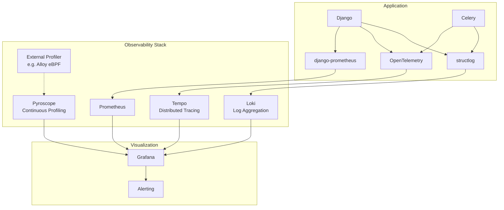

# Observability

Revel uses **Loki, Grafana, Tempo, and Prometheus** plus Pyroscope for comprehensive observability across logs, traces, metrics, and profiling.

---

## Architecture Overview


```mermaid
flowchart TB
    subgraph Application
        DJ[Django] --> SL[structlog]
        DJ --> OT[OpenTelemetry]
        DJ --> PM[django-prometheus]
        CL[Celery] --> SL
        CL --> OT
    end

    subgraph Observability Stack
        SL --> LK[Loki<br/>Log Aggregation]
        OT --> TP[Tempo<br/>Distributed Tracing]
        PM --> PR[Prometheus]
        AL[External Profiler<br/>e.g. Alloy eBPF] -.-> PY[Pyroscope<br/>Continuous Profiling]
    end

    subgraph Visualization
        LK --> GF[Grafana]
        TP --> GF
        PR --> GF
        PY --> GF
        GF --> ALR[Alerting]
    end
```

| Component | Purpose | Retention |
|---|---|---|
| **Loki** | Log aggregation | 30 days |
| **Tempo** | Distributed tracing (OpenTelemetry) | 30 days |
| **Prometheus** | Time-series metrics | 30 days |
| **Pyroscope** | Continuous profiling (flamegraphs) | 30 days |
| **Grafana** | Unified visualization & alerting | N/A |

---

## Quick Start

```bash
# Start development services (PostgreSQL, Redis, ClamAV, Mailpit)
docker compose up -d

# Start the observability stack (Loki, Tempo, Prometheus, Grafana, Pyroscope)
docker compose -f docker-compose-observability.yml up -d

# Start Django with observability enabled
make run

# Access the UIs
# Grafana:    http://localhost:3000  (admin / admin)
# Prometheus: http://localhost:9090
# Pyroscope:  http://localhost:4040
```

---

## Structured Logging

Revel uses **structlog** with JSON output, optimized for Loki ingestion.

### Key Features

- **JSON output**: Machine-parseable log events for Loki
- **PII scrubbing**: Automatic redaction of passwords, card numbers, and SSNs. Email addresses in non-email fields are replaced with `[EMAIL]`, but fields named `email` are intentionally preserved for log correlation.
- **Async logging**: `QueueHandler` for non-blocking log emission (~50-100x faster than synchronous)
- **Automatic context enrichment**: Every log event includes contextual fields from middleware

### Enriched Fields

=== "HTTP Requests"

    Fields automatically added by the logging middleware (`StructlogContextMiddleware`):

    | Field | Description |
    |---|---|
    | `request_id` | Unique ID per request |
    | `user_id` | Authenticated user's ID |
    | `ip_address` | Client IP address |
    | `method` | HTTP method (GET, POST, etc.) |
    | `path` | Request path |
    | `trace_id` | OpenTelemetry trace ID (for log-to-trace correlation) |
    | `endpoint` | Resolved Django view name |
    | `organization_id` | Organization context (when available) |

=== "Celery Tasks"

    Fields automatically added for background tasks:

    | Field | Description |
    |---|---|
    | `task_id` | Celery task ID |
    | `task_name` | Task function name |
    | `queue` | Queue the task runs on |
    | `retries` | Current retry count |

### Usage

```python
import structlog

logger = structlog.get_logger(__name__)

# Structured key-value logging
logger.info("ticket_purchased", user_id=user.id, event_id=event.id, tier=tier.name)

# Automatic PII scrubbing
logger.info("login_attempt", email=email, password=password)
# Output: {"event": "login_attempt", "email": "user@example.com", "password": "[REDACTED]"}
# Note: `email` fields are preserved for log correlation; only passwords/cards/SSNs are redacted.
# Email patterns in non-email fields (e.g., a free-text "message" field) are replaced with [EMAIL].
```

---

## Distributed Tracing

OpenTelemetry provides end-to-end tracing across Django requests, Celery tasks, and database queries.

### Auto-Instrumented Components

- Django HTTP requests
- Celery task execution
- PostgreSQL queries
- Redis operations

### Sampling Configuration

| Environment | Sample Rate | Rationale |
|---|---|---|
| Development | 100% | Full visibility for debugging |
| Production | 10% | Balance between visibility and overhead |

Traces are exported via OTLP protocol to Tempo.

---

## Metrics

### Sources

- **django-prometheus**: HTTP request duration, status codes, database connection pool, active requests
- **PostgreSQL exporter**: Database-level metrics (connections, query performance, replication)
- **Redis exporter**: Memory usage, connected clients, command stats

### Metrics Endpoint

```
http://localhost:8000/metrics
```

Exposes Prometheus-format metrics from the Django application.

### Custom Business Metrics

Custom metrics live in `common/observability/metrics.py`, on the default
`prometheus_client` registry that `django_prometheus` already exposes at `/metrics` — no
extra wiring. **Only add one if someone is going to alert on it**, and keep labels
low-cardinality (never a session id, user id, or event id — those belong on the log line).

| Metric | Meaning |
|---|---|
| `revel_stripe_session_total_mismatch_total{call_site}` | Stripe's session total disagreed with `sum(Payment.amount)`. `call_site="preflight"`: caught before the session existed, nobody charged. `call_site="webhook"`: **the buyer has been charged**. |
| `revel_stripe_session_paid_without_payments_total` | A session that captured money was confirmed with no `Payment` rows to confirm — charged buyer, no record. |

Both are **one-occurrence incidents**, so they alert with no `for:` delay:

```promql
increase(revel_stripe_session_total_mismatch_total[5m]) > 0
increase(revel_stripe_session_paid_without_payments_total[5m]) > 0
```

Each increment is paired with a self-contained `ERROR` log line carrying the identifiers to
act on — see [the money-correctness runbook](#money-correctness-stripe-session-total-mismatch).

!!! warning "Counters are per gunicorn worker"
    Production runs several gunicorn workers with no `PROMETHEUS_MULTIPROC_DIR`, so each
    worker keeps its own counters and a scrape reaches one of them. That is fine for
    "did this ever happen" alerting — the incremented worker holds its non-zero value and is
    eventually scraped — but these values are **not** exact rates. Only define
    alert-on-any-occurrence metrics here until multiprocess mode is configured.

---

## Profiling

Revel uses **Pyroscope** for continuous profiling with flamegraph visualization.

!!! warning "Pyroscope SDK Incompatibility"
    The Pyroscope Python SDK (`pyroscope-io`) is currently disabled due to incompatibility with Grafana Pyroscope 1.6+. Profiling can be provided externally (e.g., via a Grafana Alloy eBPF agent at the infrastructure level) without requiring SDK integration. This may change when the SDK is updated.

---

## Alerting

Grafana provides the alerting layer, replacing the previous database-based error tracking system.

### Alert Types

| Alert | Trigger |
|---|---|
| Stripe session total mismatch | `revel_stripe_session_total_mismatch_total` increases (see [runbook](#money-correctness-stripe-session-total-mismatch)) |
| Paid session with no payments | `revel_stripe_session_paid_without_payments_total` increases |
| High error rate | 5xx responses exceed threshold |
| Auth failures | Repeated failed login attempts |
| Database errors | Connection pool exhaustion, slow queries |
| Payment failures | Stripe webhook errors or checkout failures *(planned)* |
| Celery task failures | Task error rate exceeds threshold *(planned)* |
| GDPR export failures | Data export tasks failing *(planned)* |
| LLM evaluation failures | AI evaluation errors or timeouts *(planned)* |

### Notification Channels

Grafana supports multiple notification channels:

- Email
- Slack
- Discord
- PagerDuty

### Money-correctness: Stripe session total mismatch

`severity: critical`, **no `for:` delay — one occurrence is the incident.**

The checkout path refuses to write a ledger entry it cannot reconcile: if Stripe's session
total disagrees with `sum(Payment.amount)`, the webhook raises, the whole transaction rolls
back, and Stripe redelivers. That is the correct failure mode, but the rollback discards
every database trace of *the attempt* — so detection does two things at once:

- **The implicated `Payment`/`Ticket` rows are placed under an incident hold** (#756):
  `record_session_total_mismatch` dispatches `events.hold_mismatch_payments` (a bare
  `.delay()` — the broker message survives the rollback), which stamps
  `Payment.incident_hold_at`. `events.cleanup_expired_payments` retains held rows instead of
  deleting them on the normal ~hourly schedule, so you find real rows to reconcile against.
  The hold is bounded: it lapses after `INCIDENT_HOLD_RETENTION` (30 days,
  `events/tasks/payments.py`), after which the sweep reclaims the rows normally.
- Everything needed to recover the buyer is still emitted **at the moment of detection**, on
  one self-contained log line — the only record in the rare race where the sweep locked the
  rows before the hold landed:

```logql
{service_name="web", level="error"} |= "stripe_session_total_mismatch"
{service_name="web", level="error"} |= "stripe_session_paid_without_payments"
```

The line carries `session_id`, `payment_intent_id`, `user_id`, `user_email`,
`charged_minor_units` vs `recorded_minor_units`, and a `payments[]` breakdown of
`ticket_id` / `event_id` / `tier_id` / `guest_name` / `amount`.

**Remediation** (`call_site="webhook"` — the buyer *has* been charged):

1. Find the session/PaymentIntent in Stripe and confirm the captured amount.
2. Refund it.
3. Reconcile against the retained rows: filter the Payment admin by
   "incident hold" (or look up the `payment_ids` from the log line). Re-issue the tickets
   from those rows — or from the `payments[]` breakdown on the log line if the sweep won
   the race before the hold landed.
4. Diff `charged_minor_units` against `recorded_minor_units` to find the pricing bug.
5. **Resolve the hold**: clear `incident_hold_at` on the retained payments in the Payment
   admin. The next sweep run reclaims the rows and releases their tier capacity. An
   unresolved hold lapses on its own after 30 days — the rows are never immortal, but
   resolving explicitly is what keeps the tier's `quantity_sold` honest sooner.

`call_site="preflight"` is the safe half: it fires before a payable session exists, so nobody
has been charged. Still critical — it means a pricing bug shipped — but there is no money to
chase, only a 500 the buyer saw.

!!! note "Do not alert on `stripe_session_rounding_drift`"
    That `WARNING` is structurally unavoidable rounding on zero-decimal currencies, and paging
    on it would page on every reverse-charge cart.

---

## Configuration

The observability stack is controlled by a single environment variable:

```bash
# Enable/disable observability (default: varies by environment)
# (legacy name ENABLE_OBSERVABILITY is still honoured as a deprecated alias)
FEATURE_OBSERVABILITY=True
```

| Environment | Default | Rationale |
|---|---|---|
| Development | `True` | Full observability for debugging |
| Production | `True` | Required for monitoring |
| CI | `False` | Speed + avoids connection errors to non-existent services |

!!! info "CI Behavior"
    Observability is disabled in CI to prevent connection errors (no Loki/Tempo/Prometheus running) and to keep test execution fast. The `FEATURE_OBSERVABILITY=False` flag disables all exporters and the async log queue.

---

## Reading Production Logs

For day-to-day operations, prefer the operator CLI over hand-writing LogQL:

```bash
# last hour of web errors
.venv/bin/python scripts/loki_logs.py web --level error

# everything for one request, across services, last 6h
.venv/bin/python scripts/loki_logs.py --request-id 9f3c... --since 6h --forward

# 500s in the API, last 2h
.venv/bin/python scripts/loki_logs.py web --status-code 500 --since 2h
```

`scripts/loki_logs.py` talks to Loki through the Grafana datasource proxy (Loki
itself is not exposed publicly) using a Grafana service-account token read from
`GRAFANA_TOKEN`. It filters by service, level, status code, user id, request/trace
id, path, IP, and free-text grep, and has a `-q/--query` raw-LogQL escape hatch.

!!! tip "`loki-logs` skill"

    The `loki-logs` Claude skill wraps this CLI for log investigations (a prod
    error, a stuck Celery task, tracing one request/trace_id/user across services).

---

## Example Queries

=== "Loki (LogQL)"

    Since 1.62.4 each event is a single JSON render, and the request-metadata fields
    (`status_code`, `user_id`, `method`, `path`, `request_id`, `trace_id`,
    `ip_address`, `user_agent`) are promoted to **structured metadata** (1.62.5) —
    filter them with `| field="value"`, no `| json` parse needed. Stream **labels**
    are `service_name`, `level`, and `environment`.

    ```logql
    # All web errors in the last hour
    {service_name="web", level="error"}

    # Errors for a specific user (structured-metadata label filter)
    {service_name="web", level="error"} | user_id="<uuid>"

    # 500s in the API (status_code is a structured-metadata label)
    {service_name="web"} | status_code="500"

    # Celery task failures
    {service_name="celery_default"} |= "task_failure"

    # Payment-related logs
    {service_name="web"} |= "stripe"
    ```

=== "Prometheus (PromQL)"

    ```promql
    # Request rate by status code (5m window)
    rate(django_http_responses_total_by_status_total[5m])

    # 95th percentile request duration
    histogram_quantile(0.95, rate(django_http_requests_latency_seconds_by_view_method_bucket[5m]))

    # Active database connections
    django_db_connections_total

    # Celery task success rate
    rate(celery_task_succeeded_total[5m]) / rate(celery_task_received_total[5m])

    # Error rate percentage
    100 * rate(django_http_responses_total_by_status_total{status=~"5.."}[5m])
      / rate(django_http_responses_total_by_status_total[5m])
    ```

=== "Tempo (Traces)"

    Search for traces in Grafana's Tempo data source:

    - **By service**: `service.name = "revel"`
    - **By endpoint**: `http.target = "/api/events/"`
    - **By status**: `status.code = error`
    - **By duration**: `duration > 1s`
    - **By user**: Tag `user.id = "<uuid>"`

    Traces can be correlated with logs via the `request_id` field, which appears in both Loki logs and Tempo trace attributes.
