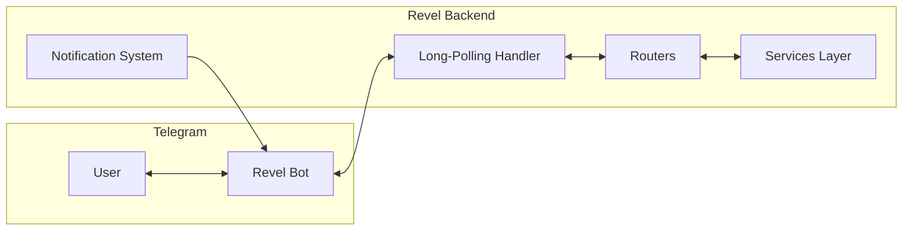

# Telegram Bot

The `telegram` app (`src/telegram/`) integrates Revel with Telegram, providing account linking, event interactions, and organizer notifications.

---

## Overview

## Core Features

### Account Linking via OTP

Users link their Telegram account to their Revel account using a one-time password (OTP):

1. User sends `/connect` to the bot
2. Bot generates a 9-digit OTP code and displays it to the user
3. User enters the OTP code in the Revel web app
4. The web app validates the code and links the accounts

Once linked, the user can receive notifications and interact with events directly from Telegram.

### Inline Keyboards

User interactions are driven by inline keyboard buttons rather than free-text input, providing a guided experience. Organizers receive action buttons on notifications (e.g., approve/reject invitation requests, approve/reject whitelist requests).

### Notification Delivery

The bot integrates with Revel's notification system to deliver messages to users and organizers via Celery tasks:

- Event updates and reminders
- RSVP and ticket confirmations
- Questionnaire submissions requiring review
- Invitation and whitelist request actions

### Event Interactions

Users can interact with events directly from Telegram callback queries:

- RSVP to events
- Request invitations
- Join waitlists
- Request membership

### Superuser Broadcast

Superusers can broadcast messages to all bot users via a dedicated FSM flow.

---

## Technical Details

| Aspect | Detail |
|---|---|
| **Location** | `src/telegram/` |
| **Framework** | [aiogram](https://docs.aiogram.dev/) |
| **Update mode** | Long-polling (not webhooks) |
| **State management** | Minimal FSM via aiogram (preferences and broadcast flows) |
| **Authentication** | Telegram user ID mapped to Revel accounts via `TelegramUser` model |
| **Notifications** | Delivered via Celery tasks for async processing |
| **Commands** | `/start`, `/connect`, `/preferences`, `/cancel`, `/unsubscribe` (plus hidden handlers: `/toc`, `/privacy`) |
| **Management command** | `python src/manage.py run_telegram_bot` (or `make run-telegram`) |

### Bot Commands

| Command | Description |
|---|---|
| `/start` | Welcome message, shows linked status |
| `/connect` | Link Telegram account to Revel via OTP |
| `/preferences` | Manage notification preferences *(not yet implemented)* |
| `/cancel` | Cancel current FSM conversation |
| `/toc` | Terms and conditions |
| `/privacy` | Privacy policy |
| `/unsubscribe` | Turn off all Telegram notifications |

### Configuration

| Setting | Default | Description |
|---|---|---|
| `TELEGRAM_BOT_TOKEN` | `0000000000:AABBCCDD` (placeholder) | Bot token from [@BotFather](https://t.me/BotFather) |
| `TELEGRAM_SUPERUSER_IDS` | `""` | Comma-separated Telegram user IDs with superuser access |
| `TELEGRAM_STAFF_IDS` | `""` | Comma-separated Telegram user IDs with staff access |
| `TELEGRAM_OTP_EXPIRATION_MINUTES` | `15` | How long an OTP code is valid for account linking |

!!! note "Active Development"
    The Telegram bot is an active area of development. Features and conversation flows are being expanded. Refer to the [GitHub issues](https://github.com/letsrevel/revel-backend/issues) for planned work. Check the source code in `src/telegram/` for the most current implementation details.
