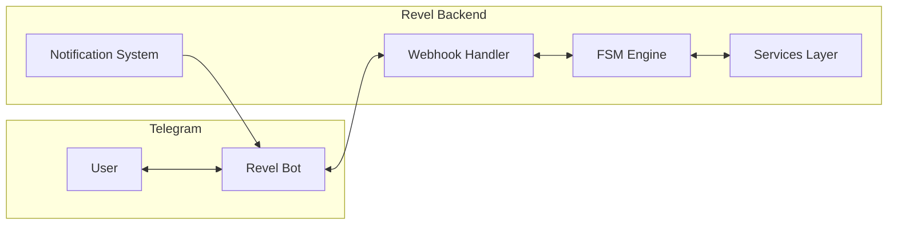
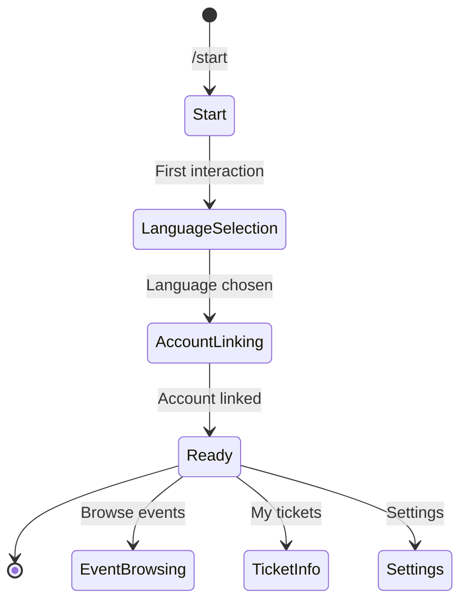

# Telegram Bot

The `telegram` app (`src/telegram/`) integrates Revel with Telegram, providing conversational bot interactions and organizer notifications.

---

## Overview

## Core Features

### FSM-Based Conversation Flows

The bot uses a **finite state machine** (FSM) pattern to manage multi-step conversations. Each conversation flow defines states and transitions, allowing the bot to guide users through structured interactions.

### Inline Keyboards

User interactions are driven by inline keyboard buttons rather than free-text input, providing a guided experience and reducing input errors.

### Account Linking

Users can link their Telegram account to their Revel account, enabling:

- Receiving notifications via Telegram
- Viewing their tickets and RSVPs
- Interacting with events directly from the chat

### Organizer Notifications

The bot integrates with Revel's notification system to deliver messages to organizers:

- New ticket purchases
- RSVP updates
- Questionnaire submissions requiring review
- Event capacity warnings

---

## Technical Details

| Aspect | Detail |
|---|---|
| **Location** | `src/telegram/` |
| **Webhook** | Receives updates from Telegram via webhook |
| **State management** | FSM states stored in the database |
| **Authentication** | Telegram user ID mapped to Revel accounts |
| **Notifications** | Delivered via Celery tasks for async processing |

!!! note "Active Development"
    The Telegram bot is an active area of development. Features and conversation flows are being expanded. Refer to the source code in `src/telegram/` for the most current implementation details.
