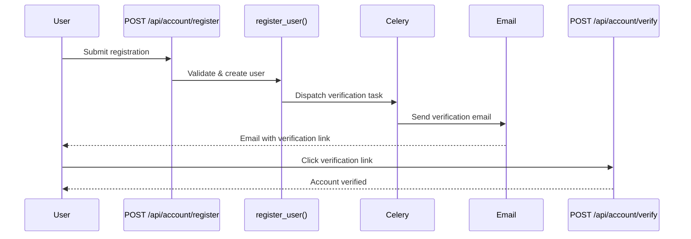
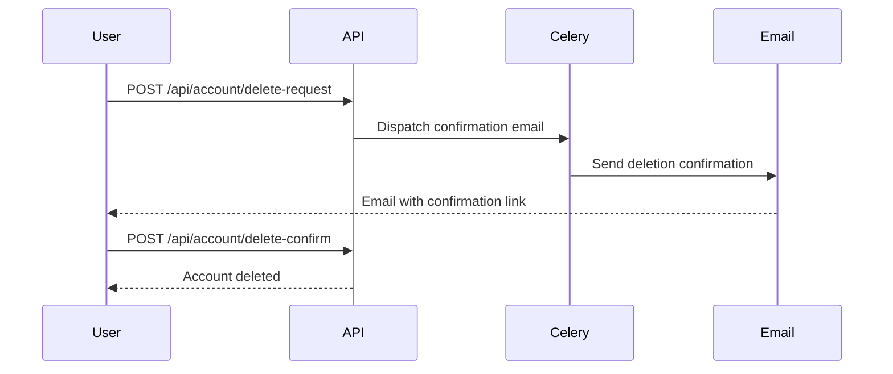
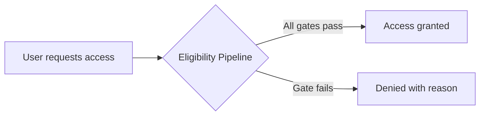
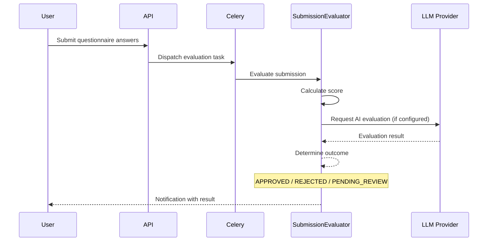
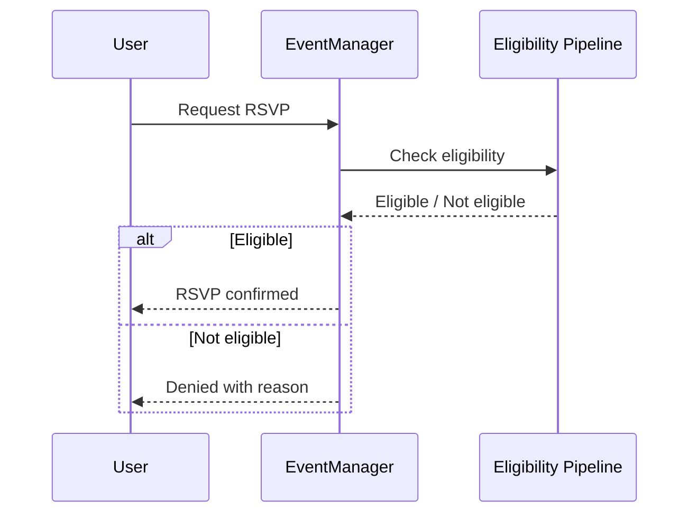
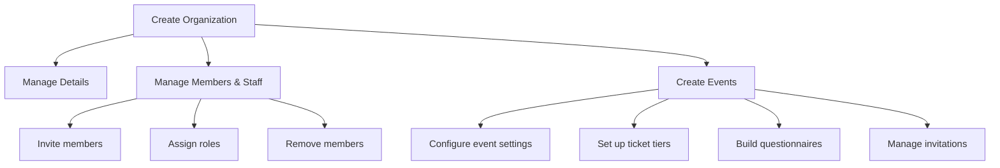
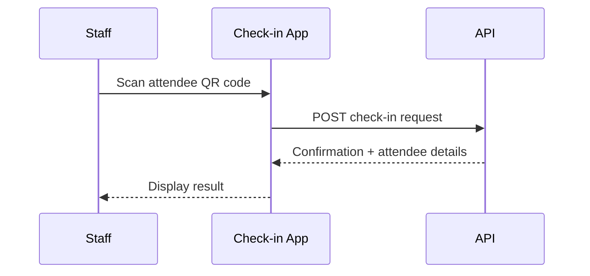

# User Journey

This guide documents the primary user flows through the Revel platform, covering both attendee and organizer perspectives.

---

## Account Flows

### Registration & Email Verification

New users register via the API, receive a verification email, and confirm their address.



### Authentication

=== "Standard Login"

    ```http
    POST /api/auth/token/pair
    Content-Type: application/json

    {
      "email": "user@example.com",
      "password": "secret"
    }
    ```

    Returns an access/refresh JWT token pair.

=== "With 2FA (TOTP)"

    If the user has TOTP enabled, the initial login returns a partial token. The user must then submit the TOTP code to complete authentication.

=== "Google SSO"

    Users can authenticate via Google Single Sign-On. The flow exchanges a Google OAuth token for Revel JWT tokens.

### Profile & Password Management

| Endpoint | Method | Description |
|---|---|---|
| `/api/account/me` | `GET` | Retrieve current user profile |
| `/api/account/me` | `PUT` | Update profile fields |
| `/api/account/password-reset` | `POST` | Request password reset email |
| `/api/account/password-reset-confirm` | `POST` | Confirm reset with token + new password |

### Account Deletion



!!! bug "Known Limitation"
    Account deletion fails with a `ProtectedError` if the user has associated `Payment` records. This is a known issue -- users with payment history cannot currently self-delete their accounts.

---

## Core Flows

### Event Eligibility Check

Before a user can RSVP or purchase a ticket, they must pass the **eligibility pipeline** -- a series of gates that check membership, questionnaire status, blacklists, capacity, and more.

!!! info "See Also"
    The eligibility pipeline is documented in detail in the [Architecture section](../architecture/index.md). This section covers only the user-facing flow.



### Questionnaire Submission & Evaluation

Some events require users to complete a questionnaire before gaining access.



The evaluation mode depends on the questionnaire configuration:

| Mode | Behavior |
|---|---|
| **Automatic** | Score-based with optional LLM evaluation; no human review |
| **Manual** | All submissions go to `PENDING_REVIEW` for organizer review |
| **Hybrid** | LLM evaluates first; edge cases sent to `PENDING_REVIEW` |

---

## Attendee Flows

### Browsing Events & Organizations

Users browse public events and organizations. Visibility is handled by the `for_user` queryset manager, which filters based on:

- Event/organization visibility settings (public, members-only, private)
- User membership status
- Event publication state (draft events hidden from non-organizers)

### RSVPing to an Event



### Getting Tickets

The ticket acquisition flow depends on the payment method configured for the ticket tier:

=== "Free / Offline"

    Ticket is issued directly upon request (after eligibility check).

=== "Online (Stripe)"

    ```mermaid
    sequenceDiagram
        participant U as User
        participant API as API
        participant S as Stripe

        U->>API: Request ticket checkout
        API->>S: Create Stripe session
        S-->>API: Checkout URL
        API-->>U: Redirect to Stripe
        U->>S: Complete payment
        S->>API: Webhook confirmation
        API-->>U: Ticket issued
    ```

### Managing Potluck Items

For potluck-style events, attendees can:

1. View the potluck item list for the event
2. Claim items they will bring
3. Release items they can no longer bring
4. Add custom items to the list

---

## Organizer Flows

### Organization Management



### Managing Members & Staff

| Action | Required Permission |
|---|---|
| Edit organization details | `edit_organization` |
| Invite/remove members | `manage_members` |
| Assign staff roles | `manage_members` |

### Invitations

Organizers can invite users to events in two ways:

- **Direct invitation**: User has an account -- invitation is linked immediately
- **Pending invitation**: User does not have an account -- invitation is stored by email and linked upon registration

### Building Questionnaires

Organizers create questionnaires with configurable:

- Questions (multiple types: text, choice, scale, etc.)
- Scoring rules per question
- Evaluation mode (automatic, manual, hybrid)
- Pass/fail thresholds

### Reviewing Submissions

For questionnaires in **manual** or **hybrid** mode, organizers review submissions in the admin panel or via the API:

1. View pending submissions
2. Read answers and AI evaluation (if available)
3. Approve or reject each submission

### Event Check-In



!!! note "Permission Required"
    Check-in requires the `check_in_attendees` permission, typically granted to staff members.
