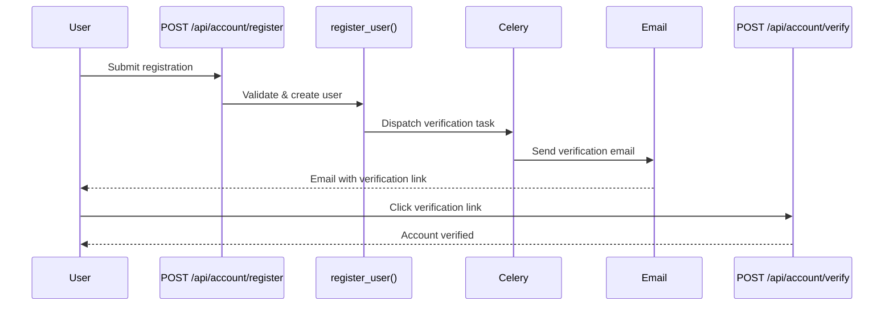
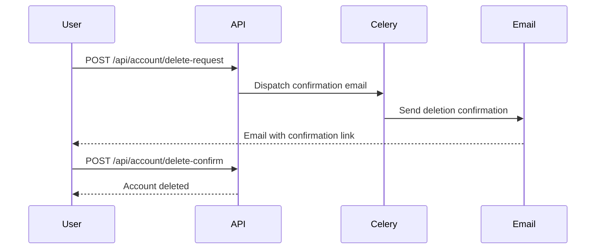
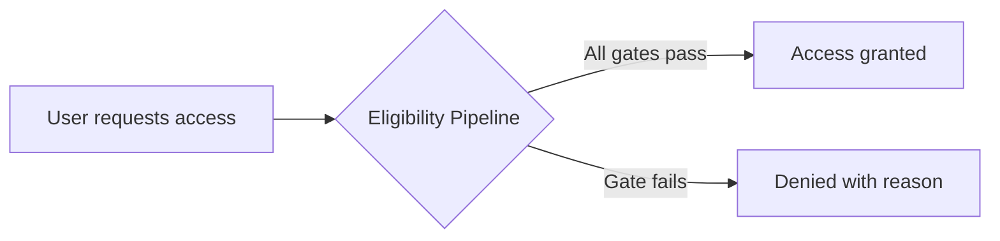
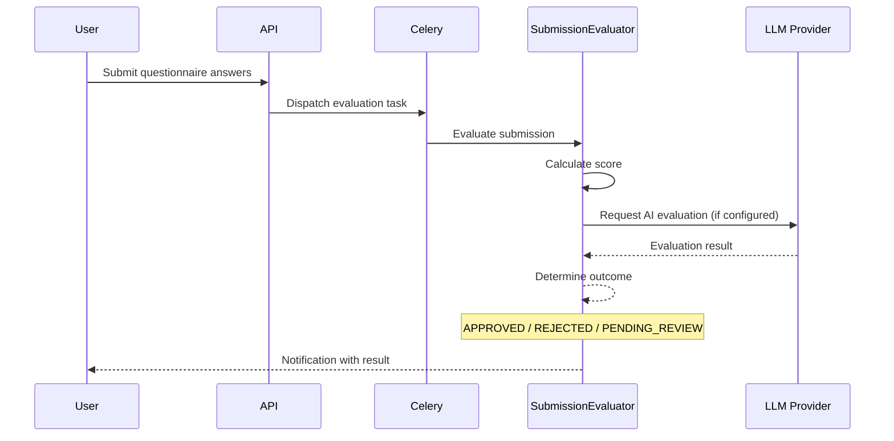
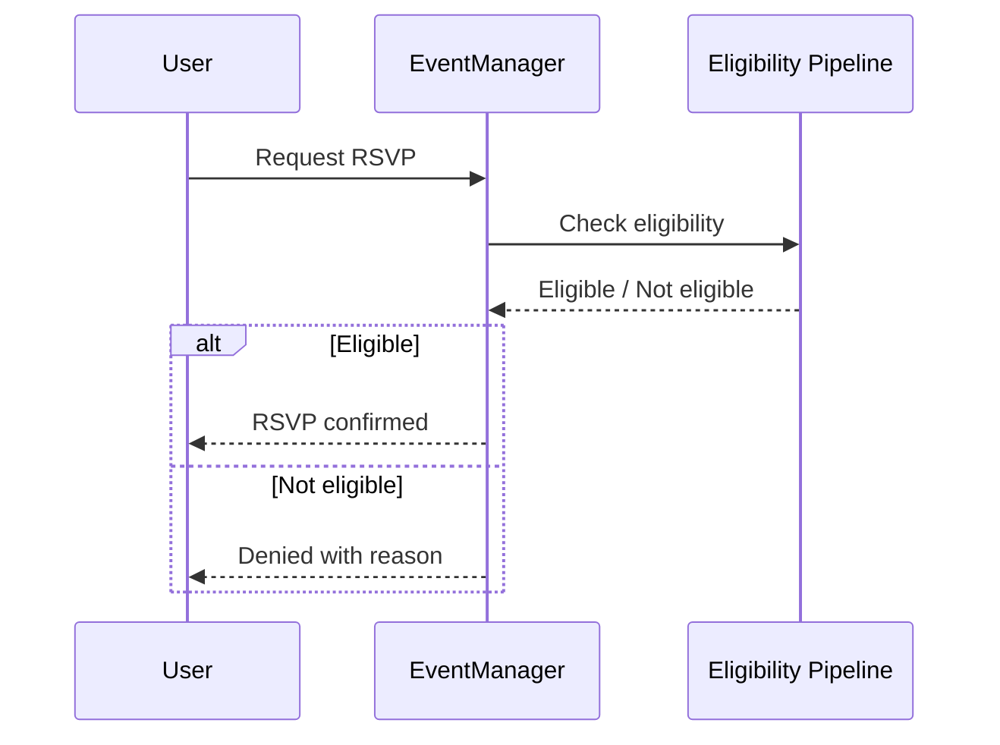
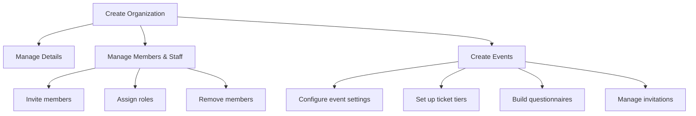
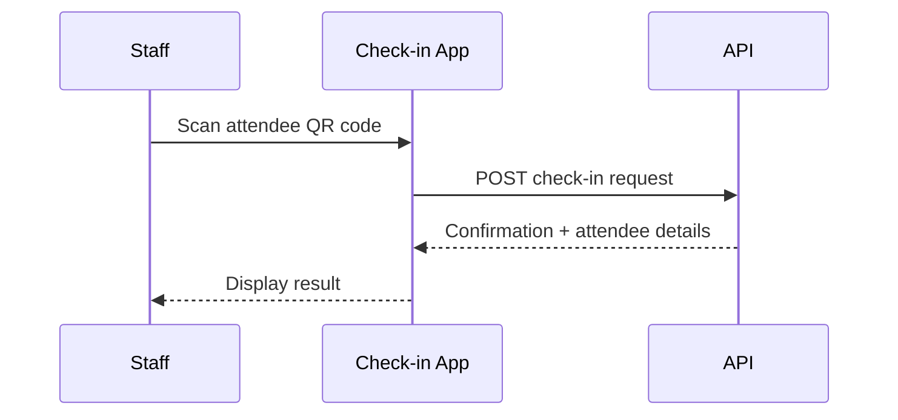
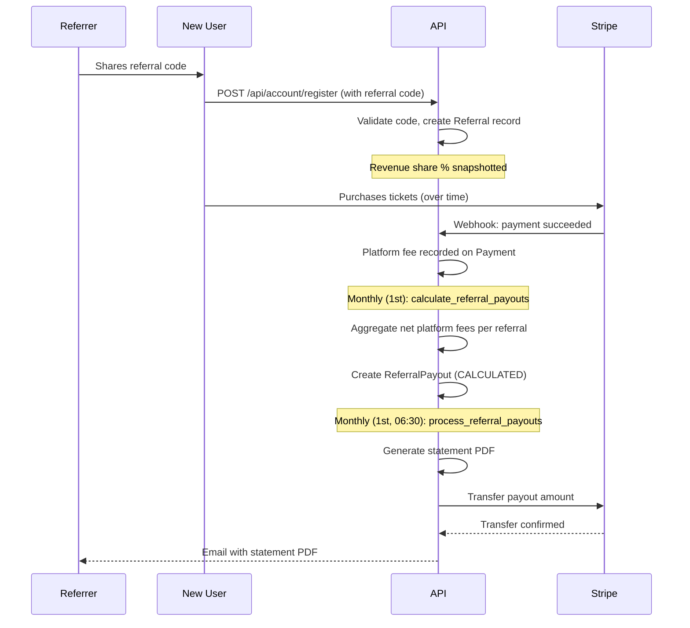
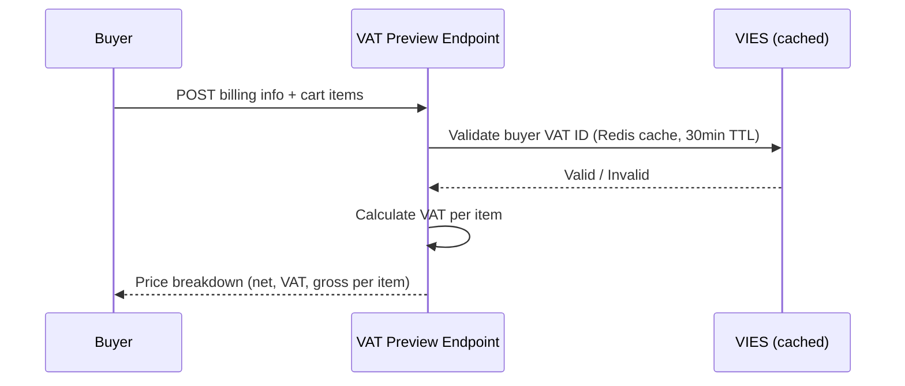

# User Journey

This guide documents the primary user flows through the Revel platform, covering both attendee and organizer perspectives.

!!! tip "This guide is a curated overview"
    This page covers the primary flows at a glance. It is **not exhaustive** — for the full, canonical, persona-based user journey map (used to drive E2E test cases), see [`USER_JOURNEYS.md`](https://github.com/letsrevel/revel-backend/blob/main/USER_JOURNEYS.md) in the repository root. Where a subsystem has a dedicated architecture page, the relevant section links to it.

---

## Account Flows

### Registration & Email Verification

New users register via the API, receive a verification email, and confirm their address.


```mermaid
sequenceDiagram
    participant U as User
    participant API as POST /api/account/register
    participant S as register_user()
    participant C as Celery
    participant E as Email
    participant V as POST /api/account/verify

    U->>API: Submit registration
    API->>S: Validate & create user
    S->>C: Dispatch verification task
    C->>E: Send verification email
    E-->>U: Email with verification link
    U->>V: Click verification link
    V-->>U: Account verified
```

### Authentication

=== "Standard Login"

    ```http
    POST /api/auth/token/pair
    Content-Type: application/json

    {
      "email": "user@example.com",
      "password": "secret"
    }
    ```

    Returns an access/refresh JWT token pair.

=== "With 2FA (TOTP)"

    If the user has TOTP enabled, the initial login returns a partial token. The user must then submit the TOTP code to complete authentication.

=== "Google SSO"

    Users can authenticate via Google Single Sign-On. The flow exchanges a Google OAuth token for Revel JWT tokens.

    !!! note "Feature flag"
        Google SSO is gated behind the `FEATURE_GOOGLE_SSO` environment variable. When disabled, the endpoint returns `403`.

### Profile & Password Management

| Endpoint | Method | Description |
|---|---|---|
| `/api/account/me` | `GET` | Retrieve current user profile |
| `/api/account/me` | `PUT` | Update profile fields |
| `/api/account/password/reset-request` | `POST` | Request password reset email |
| `/api/account/password/reset` | `POST` | Confirm reset with token + new password |

### Account Deletion


```mermaid
sequenceDiagram
    participant U as User
    participant API as API
    participant C as Celery
    participant E as Email

    U->>API: POST /api/account/delete-request
    API->>C: Dispatch confirmation email
    C->>E: Send deletion confirmation
    E-->>U: Email with confirmation link
    U->>API: POST /api/account/delete-confirm
    API-->>U: Account deleted
```

!!! info "Payment records"
    Payment records cascade-delete with the user account. This works because Stripe retains the financial records on their side for the organization, so local deletion does not cause data loss for accounting purposes. This is a pragmatic simplification; a future iteration may introduce soft-deletion or anonymization of payment records instead.

---

## Core Flows

### Event Eligibility Check

Before a user can RSVP or purchase a ticket, they must pass the **eligibility pipeline**, a series of gates that check membership, questionnaire status, blacklists, capacity, and more.

!!! info "See Also"
    The eligibility pipeline is documented in detail in the [Architecture section](../architecture/index.md). This section covers only the user-facing flow.


```mermaid
flowchart LR
    A[User requests access] --> B{Eligibility Pipeline}
    B -->|All gates pass| C[Access granted]
    B -->|Gate fails| D[Denied with reason]
```

### Questionnaire Submission & Evaluation

Some events require users to complete a questionnaire before gaining access.


```mermaid
sequenceDiagram
    participant U as User
    participant API as API
    participant C as Celery
    participant SE as SubmissionEvaluator
    participant LLM as LLM Provider

    U->>API: Submit questionnaire answers
    API->>C: Dispatch evaluation task
    C->>SE: Evaluate submission
    SE->>SE: Calculate score
    SE->>LLM: Request AI evaluation (if configured)
    LLM-->>SE: Evaluation result
    SE-->>SE: Determine outcome
    Note over SE: APPROVED / REJECTED / PENDING_REVIEW
    SE-->>U: Notification with result
```

The evaluation mode depends on the questionnaire configuration:

| Mode | Behavior |
|---|---|
| **Automatic** | Score-based with optional LLM evaluation; no human review |
| **Manual** | All submissions go to `PENDING_REVIEW` for organizer review |
| **Hybrid** | LLM evaluates first; edge cases sent to `PENDING_REVIEW` |

---

## Attendee Flows

### Browsing Events & Organizations

Users browse public events and organizations. Visibility is handled by the `for_user` queryset manager, which filters based on:

- Event/organization visibility settings (public, unlisted, members-only, private)
- User membership status
- Event publication state (draft events hidden from non-organizers)

!!! info "Unlisted visibility"
    Organizations and events set to **UNLISTED** are accessible via direct link but hidden from browse/search listings. This is useful for soft launches or invite-link-only events.

### RSVPing to an Event


```mermaid
sequenceDiagram
    participant U as User
    participant EM as EventManager
    participant EP as Eligibility Pipeline

    U->>EM: Request RSVP
    EM->>EP: Check eligibility
    EP-->>EM: Eligible / Not eligible
    alt Eligible
        EM-->>U: RSVP confirmed
    else Not eligible
        EM-->>U: Denied with reason
    end
```

### Getting Tickets

The ticket acquisition flow depends on the payment method configured for the ticket tier:

=== "Free / Offline"

    Ticket is issued directly upon request (after eligibility check).

=== "Online (Stripe)"

    ```mermaid
    sequenceDiagram
        participant U as User
        participant API as API
        participant S as Stripe

        U->>API: Request ticket checkout
        API->>S: Create Stripe session
        S-->>API: Checkout URL
        API-->>U: Redirect to Stripe
        U->>S: Complete payment
        S->>API: Webhook confirmation
        API-->>U: Ticket issued
    ```

### Series Passes (Season Tickets)

For event series, attendees can buy a [series pass](../architecture/series-passes.md) instead of individual tickets: one purchase (pro-rata priced by how many covered events remain) materializes a real ticket for every covered event, all drawn from the same tier capacity as direct sales. The pass has its own QR (`series:<uuid>`) accepted at check-in for any covered event, plus its own PDF and Apple Wallet downloads.

### Managing Potluck Items

For potluck-style events, attendees can:

1. View the potluck item list for the event
2. Claim items they will bring
3. Release items they can no longer bring
4. Add custom items to the list

!!! info "Automatic release"
    If a user cancels their RSVP or ticket, any potluck items they claimed are automatically released back to the pool.

---

## Organizer Flows

### Organization Management


```mermaid
flowchart TD
    A[Create Organization] --> B[Manage Details]
    A --> C[Manage Members & Staff]
    A --> D[Create Events]

    C --> C1[Invite members]
    C --> C2[Assign roles]
    C --> C3[Remove members]

    D --> D1[Configure event settings]
    D --> D2[Set up ticket tiers]
    D --> D3[Build questionnaires]
    D --> D4[Manage invitations]
```

### Managing Members & Staff

| Action | Required Permission |
|---|---|
| Edit organization details | `edit_organization` |
| Invite/remove members | `manage_members` |
| Assign staff roles | `manage_members` |

### Invitations

Organizers can invite users to events in two ways:

- **Direct invitation**: User has an account; invitation is linked immediately
- **Pending invitation**: User does not have an account; invitation is stored by email and linked upon registration. A notification email is sent to the pending invitee with event details.

Organizers can set a custom `invitation_message` on the event. This message is rendered into every invitation (direct, token claim, and pending conversion) using safe string interpolation with placeholders: `{user_name}`, `{event_name}`, `{organization_name}`, `{event_date}`. The message is included in invitation emails (HTML and plain text) and Telegram notifications.

### Building Questionnaires

Organizers create questionnaires with configurable:

- Questions (multiple types: text, choice, scale, etc.)
- Scoring rules per question
- Evaluation mode (automatic, manual, hybrid)
- Pass/fail thresholds

### Reviewing Submissions

For questionnaires in **manual** or **hybrid** mode, organizers review submissions in the admin panel or via the API:

1. View pending submissions
2. Read answers and AI evaluation (if available)
3. Approve or reject each submission

### Event Check-In


```mermaid
sequenceDiagram
    participant S as Staff
    participant App as Check-in App
    participant API as API

    S->>App: Scan attendee QR code
    App->>API: POST check-in request
    API-->>App: Confirmation + attendee details
    App-->>S: Display result
```

!!! note "Permission Required"
    Check-in requires the `check_in_attendees` permission, typically granted to staff members.

---

## Additional Flows

### Apple Wallet Pass

After obtaining a ticket, users can add it to Apple Wallet:

1. User requests a wallet pass for their ticket via the API
2. The system generates a `.pkpass` file containing event details, QR code, and branding
3. The pass is returned for download and can be added to Apple Wallet

### GDPR Data Export

Users can request a full export of their personal data:

1. User requests data export via `POST /api/account/export-data`
2. A Celery task gathers all personal data (profile, tickets, RSVPs, questionnaire submissions, etc.)
3. The export file is made available for download

### Organization Following

Users can follow organizations and event series to receive notifications about new events:

- Follow/unfollow via the API
- Configure notification preferences (new events, announcements)
- Choose public or private follow visibility

### Waitlist

When an event or ticket tier reaches capacity:

1. User joins the waitlist
2. When a spot opens (cancellation or capacity increase), the next waitlisted user is notified
3. The user can then complete their RSVP or ticket purchase

### Discount Codes

Organizers can create discount codes to offer reduced pricing on ticket purchases:

1. Create code with type (percentage or fixed amount), value, and optional scope (events, series, tiers)
2. Set limits: max uses, per-user limit, minimum purchase amount, validity window
3. Buyer enters code during checkout → validated and applied to price
4. Usage tracked per code and per user

!!! note "Duplicate codes & delete-vs-deactivate"
    Creating a code whose string already exists returns a clear **409 Conflict** (it used to surface as an opaque 500). Deleting a code that has **never been used** hard-deletes it; deleting a code that **has been used** deactivates it instead, preserving usage history.

### Billing Profile Management

Users participating in the referral program can set up a billing profile:

| Method | Endpoint | Description |
|---|---|---|
| `GET` | `/api/me/billing` | Retrieve billing profile |
| `POST` | `/api/me/billing` | Create billing profile |
| `PUT` | `/api/me/billing` | Update billing name, address, and email |
| `DELETE` | `/api/me/billing` | Delete billing profile |
| `PUT` | `/api/me/billing/vat-id` | Add or update VAT ID |
| `DELETE` | `/api/me/billing/vat-id` | Remove VAT ID |

!!! note "Referral payouts"
    A complete billing profile with self-billing agreement and connected Stripe account is required before referral payouts can be processed.

### Bookmarks

Users can privately bookmark events for later. Bookmarks do not sign you up and do not affect eligibility.

- `POST /api/events/{event_id}/bookmark` → `201` for a new bookmark, `200` if it already existed
- `DELETE /api/events/{event_id}/bookmark` is idempotent and works even for events you can no longer see
- `is_bookmarked` is reflected on event list/detail responses; find them via the `bookmarked` facet on `/dashboard/events` (bookmarked **unlisted** events surface there even though they stay hidden from discovery)

### Self-Service Ticket Cancellation & Refunds

Opt-in per ticket tier via `allow_user_cancellation`, `cancellation_deadline_hours`, and `refund_policy` (tiered % by hours-before-event + flat fee). Buyers see the cancellation terms **before purchase** on `TicketTierSchema`, and the active policy is **snapshotted onto the ticket at purchase** (`refund_policy_snapshot`) so later policy changes never affect issued tickets.

- `GET /events/tickets/{id}/cancellation-preview` — policy windows + a live refund quote for this ticket
- `POST /events/tickets/{id}/cancel` — works for free, offline, at-the-door, and online (Stripe) tickets; online tickets trigger a per-`Payment`, partial-amount-aware Stripe refund
- Blocked cases (already cancelled, checked-in, event started, past deadline) return `409 CancellationBlockedErrorSchema` with a stable `code`; cancelling an already-cancelled ticket returns 409
- Triggers a `TICKET_CANCELLED` / `TICKET_REFUNDED` notification (immediate transactional email) reporting the actual `refund_amount`

### Recurring Events & Series

Organizers can run first-class recurring series: a `RecurrenceRule` + a template event drive rolling-window materialization, where each occurrence is a real, independent `Event`. A daily Celery beat task keeps the window populated; template edits propagate to future occurrences via a field whitelist, and a drift endpoint surfaces occurrences that no longer match the rule after a cadence change. A single `SERIES_EVENTS_GENERATED` digest is sent per generated batch.

- Admin: `POST /organization-admin/{slug}/create-recurring-event`, plus `PATCH .../event-series/{id}/template` (with `?propagate=`), `.../recurrence`, `POST .../generate` / `.../pause` / `.../resume` / `.../cancel-occurrence`, and `GET .../event-series/{id}/drift`

!!! info "See Also"
    Full architecture: [Recurring Event Series](../architecture/recurring-series.md).

### Open-Ended Events

An event can be marked `is_open_ended` for ongoing/no-fixed-end events. `end` is still set (defaults to start + 24h) and used internally for ICS/Wallet/upcoming gates; the flag is a display signal so the frontend can render "Ongoing" and hide the end time.

### Membership Subscriptions

> **Phase 1 — OFFLINE only.** Subscriptions are staff-managed (recorded payments), not self-served Stripe billing.

Organizers configure recurring membership plans per membership tier (`MembershipSubscriptionPlan`), gated by the `manage_subscriptions` permission (owner ✓, staff ✓ by default, member ✗). Staff create/list/get subscriptions, drive the lifecycle (cancel / pause / resume), and record payments (`MembershipPayment`, with `occurred_at` to backfill the real payment date). A `post_save` signal syncs `OrganizationMember.status + tier` from the subscription (never creating members, never touching a `BANNED` member), and a daily beat task expires subscriptions past the org's grace period.

- Member view: `GET /me/membership-subscriptions`, `GET /me/organizations/{org_id}/subscription`, and `GET /me/memberships` (unified memberships list, inlining the most recent non-terminal subscription per org)
- Org policy: `membership_grace_period_days` (default 7), `membership_refund_policy`

### Polls

Organization-managed polls built on the questionnaire pipeline — a `Poll` is 1:1 with a `Questionnaire` and votes are stored as `QuestionnaireSubmission` rows. Creation and management require the `manage_polls` permission. Polls have a draft/open/closed lifecycle, configurable audience/result visibility, anonymity, and a vote-change policy.

- `/api/polls/` group: list, detail, `GET /{id}/results`, create (`POST /polls/organizations/{org_id}`), patch, `open` / `close` / `reopen`, `duplicate`, delete (owner-only), `POST /{id}/vote`, `DELETE /{id}/vote`

!!! info "See Also"
    Full architecture: [Polls](../architecture/polls.md).

### Content Moderation

Offensive **food-item names** are blocked at creation across all supported languages (the `moderation` app), and staff can delete offensive food items via the admin. Quarantined (malware-flagged) uploads are stored behind a protected, signed-URL media path — never publicly downloadable; staff retrieve them via a signed admin link.

!!! info "See Also"
    Full architecture: [Content Moderation](../architecture/moderation.md).

### Event Schedule / Timeline

Organizers author an ordered list of display-only sessions via `PUT /event-admin/{event_id}/schedule`. Each session has a title, Markdown description, relative start offset, optional duration/location, and an `is_required` badge. The schedule is exposed on the public event detail and copied verbatim on event duplication and recurring-series materialization.

### Revenue & VAT Reporting

A VAT-precise financial-reporting suite for organizers, driven by one tax engine so every view reconciles (online Stripe + offline/at-the-door payments, per currency and per VAT rate; refunds attributed to the period they occurred).

- Live org financials: `GET /organization-admin/{slug}/revenue` (sortable, period- and currency-filtered)
- Downloadable report: `POST /organization-admin/{slug}/revenue-report` → poll `GET .../revenue-reports/{id}`; output is a ZIP bundling an XLSX (Summary + Transactions) and a PDF (per-VAT-rate table)
- Scheduled delivery: org-level `revenue_report_cadence` (`NONE` / `QUARTERLY` / `MONTHLY`, **owner-only** to change) emails the just-closed period's report to the org billing email and owner
- Per-event: `GET /event-admin/{event_id}/tickets/revenue` → `EventFinancialsSchema`

!!! info "See Also"
    Full architecture: [Billing & VAT](../architecture/billing-and-vat.md).

### Guest Checkout & Guest-to-User Upgrade

When an event has `can_attend_without_login=True`, anonymous visitors can attend without an account: a guest RSVP or guest ticket checkout creates a guest `RevelUser` (`guest=True`) from just a name and email. If the guest later registers with the same email, an activation link upgrades the guest account to a full user and all previous guest tickets/RSVPs are preserved.

### Self-Served Email Change

Users can change their own email address:

- `POST /account/email-change-request` — requires the current password; sends a single-use confirmation link to the **new** address (proof of control)
- `POST /account/email-change-confirm` — swaps `email` + `username`, **blacklists every outstanding JWT** for the user, and returns a fresh token pair so the confirming device stays signed in

Both addresses receive completion emails; the old address also gets an in-flight notice with a masked rendering of the new address. The flow rejects Google-SSO accounts and same-email / already-taken targets with clear `400`s, and silently no-ops for globally-banned targets.

---

## Referral Program

### Referral Flow


```mermaid
sequenceDiagram
    participant R as Referrer
    participant N as New User
    participant API as API
    participant S as Stripe

    R->>N: Shares referral code
    N->>API: POST /api/account/register (with referral code)
    API->>API: Validate code, create Referral record
    Note over API: Revenue share % snapshotted

    N->>S: Purchases tickets (over time)
    S->>API: Webhook: payment succeeded
    API->>API: Platform fee recorded on Payment

    Note over API: Monthly (1st): calculate_referral_payouts
    API->>API: Aggregate net platform fees per referral
    API->>API: Create ReferralPayout (CALCULATED)

    Note over API: Monthly (1st, 06:30): process_referral_payouts
    API->>API: Generate statement PDF
    API->>S: Transfer payout amount
    S-->>API: Transfer confirmed
    API-->>R: Email with statement PDF
```

### Payout Documents

The document type depends on the referrer's billing profile:

| Referrer Type | Document | VAT Treatment |
|---|---|---|
| B2B (validated VAT ID) | Self-billing invoice (Gutschrift) | Full VAT math with reverse charge for EU cross-border |
| B2C (no VAT ID) | Payout statement | No VAT line |

### Referral Endpoints

| Method | Endpoint | Description |
|---|---|---|
| `GET` | `/api/referral/validate?code=...` | Validate a referral code |
| `GET` | `/api/me` | Includes `referral_code` in response |
| `GET` | `/api/me/referral/payouts` | List referral payout history |
| `GET` | `/api/me/referral/payouts/{id}/statement` | Retrieve payout statement details |
| `GET` | `/api/me/referral/payouts/{id}/statement/download` | Download payout statement PDF |

---

## Attendee Invoicing

Organizations can generate invoices for ticket buyers on their behalf. The invoicing mode is configured per organization.

### Invoicing Modes

| Mode | Invoice Created As | Auto-Emailed | Use Case |
|---|---|---|---|
| `NONE` | — | — | Default (no invoices) |
| `HYBRID` | `DRAFT` | No — org admin issues manually | Org needs review/control |
| `AUTO` | `ISSUED` | Yes | Hands-off automation |

### VAT Preview

Before checkout, the buyer can preview the VAT breakdown based on their billing info:


```mermaid
sequenceDiagram
    participant B as Buyer
    participant API as VAT Preview Endpoint
    participant VIES as VIES (cached)

    B->>API: POST billing info + cart items
    API->>VIES: Validate buyer VAT ID (Redis cache, 30min TTL)
    VIES-->>API: Valid / Invalid
    API->>API: Calculate VAT per item
    API-->>B: Price breakdown (net, VAT, gross per item)
```

| Buyer Scenario | VAT Treatment |
|---|---|
| Domestic (same country as org) | Org's VAT rate |
| EU cross-border B2B (valid VAT ID) | Reverse charge (0%) |
| EU cross-border B2C (no VAT ID) | Org's VAT rate |
| Non-EU | No VAT (export) |

### Invoice Lifecycle (HYBRID Mode)

```text
DRAFT → [org edits] → DRAFT → [org issues] → ISSUED → [refund] → CANCELLED
                       ↓
                  [org deletes]
```

### Attendee Invoice Endpoints

#### Buyer-facing

| Method | Path | Description |
|---|---|---|
| `POST` | `/events/{event_id}/tickets/vat-preview` | Preview VAT breakdown |
| `GET` | `/dashboard/invoices` | List issued invoices |
| `GET` | `/dashboard/invoices/{id}/download` | Download PDF |

#### Org admin

| Method | Path | Description |
|---|---|---|
| `PATCH` | `/organization-admin/{slug}/invoicing` | Set invoicing mode |
| `GET` | `/organization-admin/{slug}/attendee-invoices` | List attendee invoices |
| `PATCH` | `/organization-admin/{slug}/attendee-invoices/{id}` | Edit draft |
| `POST` | `/organization-admin/{slug}/attendee-invoices/{id}/issue` | Issue draft |
| `DELETE` | `/organization-admin/{slug}/attendee-invoices/{id}` | Delete draft |

!!! tip "See also"
    For full architectural details including credit notes, numbering, and PDF rendering, see [Billing & VAT](../architecture/billing-and-vat.md#attendee-invoicing).
